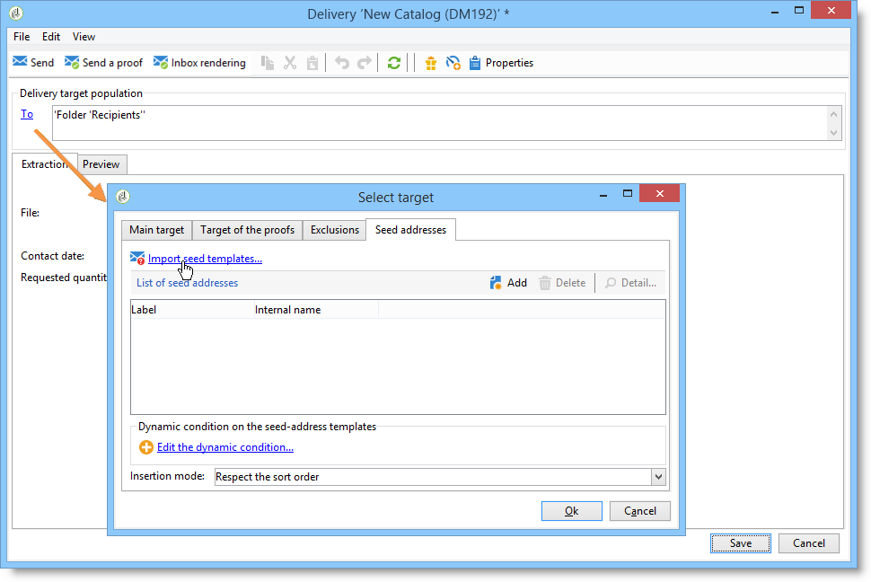
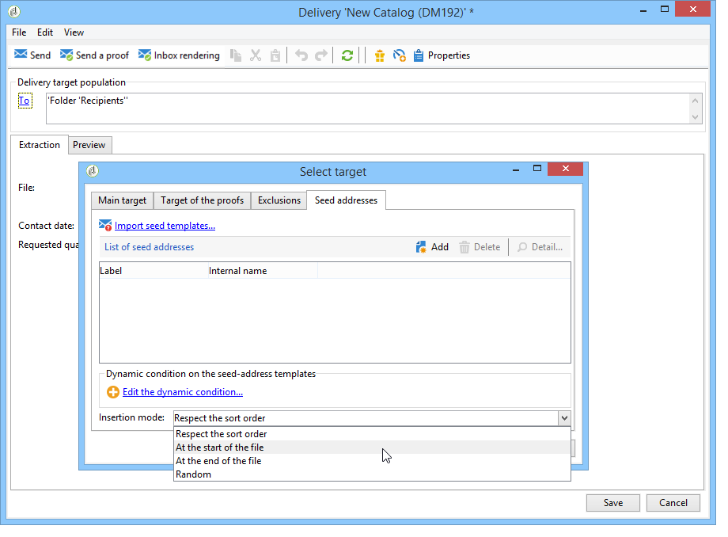

# Adicionar seed addresses{#adding-seed-addresses}

## Seed addresses em uma entrega {#seed-addresses-in-a-delivery}

Para adicionar seed addresses específicos em uma entrega, clique no link **[!UICONTROL To]** e selecione a guia **[!UICONTROL Seed addresses]** Seed addresses.

Há três modos de inserção possíveis:

1. Inserir seed addresses individuais.

   Para fazer isso, clique no botão **[!UICONTROL Add]** e defina o conteúdo dos campos de endereço. Repita para cada endereço.

1. Importe modelos de endereços e adapte-os de acordo com suas necessidades.

   Para fazer isso, clique no link **[!UICONTROL Import seed templates...]** e selecione a pasta que contém os modelos de endereço. Para obter mais informações, consulte [esta seção](creating-seed-addresses.md#creating-seed-address-templates).

   Se necessário, depois da execução, clique duas vezes neles ou no botão **[!UICONTROL Detail...]** para adaptar o conteúdo de cada endereço.

1. Criação de uma condição para selecionar dinamicamente os endereços de controle a serem inseridos.

   Para fazer isso, clique no link **[!UICONTROL Edit the dynamic condition...]** e insira os parâmetros de seleção do seed address. Por exemplo, você pode incluir todos os seed addresses contidos em uma pasta específica ou seed addresses que pertencem a um departamento específico da sua organização.

   Um exemplo é apresentado nesta seção: [Caso de uso: seleção de seed addresses por critérios](use-case-selecting-seed-addresses-on-criteria.md).

>[!NOTE]
>
>Essa opção é usada quando a tabela do recipient usada não é a tabela padrão **nms:recipient** e você está usando a funcionalidade de Renderização da Caixa de Entrada fornecida com o módulo **[!UICONTROL Deliverability]** do Adobe Campaign.
>
>Para obter mais informações, consulte [Usar uma tabela de destinatário externa](using-an-external-recipient-table.md) e a documentação sobre [Renderização de caixa de entrada](inbox-rendering.md).

Para entregas, você também pode personalizar a maneira como os endereços são inseridos no arquivo de extração. Por padrão, eles são inseridos na ordem de classificação do arquivo de saída, mas você pode optar por inseri-los no final ou no início do arquivo, ou aleatoriamente entre os destinatários do target principal.

## Seed addresses em uma campanha {#seed-addresses-in-a-campaign}

Para adicionar seed addresses a um target para uma campanha, selecione a operação e clique na guia **[!UICONTROL Edit]**.

Clique no link **[!UICONTROL Advanced campaign settings...]** e, em seguida, na guia **[!UICONTROL Seed addresses]**, conforme mostrado abaixo:

Os seed addresses inseridos a partir da campanha serão adicionados ao target de cada entrega na campanha.
