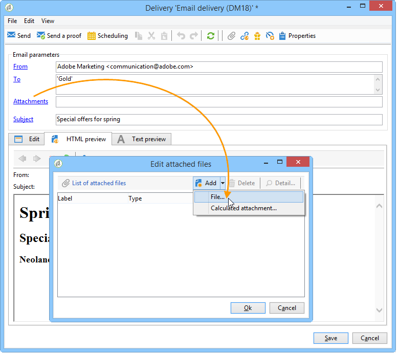

# Anexo de arquivos{#attaching-files}

## Sobre anexos de email {#about-email-attachments}

Você pode anexar um ou mais arquivos a um delivery de email. Há dois casos possíveis:

* Selecione um arquivo para anexar ao delivery como está.
* Personalize o conteúdo do anexo para cada recipient. Nesse caso, você precisa criar um **anexo calculado**: o nome do anexo é computado no momento do delivery de cada mensagem, dependendo do recipient. O conteúdo também pode ser personalizado e convertido em formato PDF no momento do delivery, se você tiver a opção **Impressão digital de variáveis**.

>[!NOTE]
>
>Esse tipo de configuração é geralmente executada nos templates do delivery. Para obter mais informações, consulte [Sobre templates](../../delivery/using/about-templates.md).

## Anexo de arquivo local {#attaching-a-local-file}

Para anexar um arquivo local a um delivery, siga as etapas abaixo.

>[!NOTE]
>
>Você pode anexar vários arquivos a um delivery. Os anexos podem estar em qualquer formato, inclusive no formato zipado.

1. Clique no link **[!UICONTROL Attachments]**.
1. Clique no botão **[!UICONTROL Add]**.
1. Clique **[!UICONTROL File...]** para selecionar o arquivo a ser anexado ao delivery.

   

Você também pode arrastar e soltar diretamente o arquivo no campo **[!UICONTROL Attachments]** do delivery, ou usar o ícone **[!UICONTROL Attach]** na barra de ferramentas do assistente do delivery,

Após selecionar o documento, ele será carregado imediatamente no servidor para estar disponível no momento do delivery. Está listado no campo **[!UICONTROL Attachments]**.

## Criação de anexos calculados {#creating-a-calculated-attachment}

Quando você cria um anexo calculado, o nome do anexo pode ser computado durante a análise ou a delivery de cada mensagem e pode depender do recipient. Ele também pode ser personalizado e convertido em PDF.

Para criar um anexo personalizado, siga estas etapas:

1. Clique no link **[!UICONTROL Attachments]**.
1. Clique no **[!UICONTROL Add]** botão e selecione **[!UICONTROL Calculated attachment]**.
1. Selecione o tipo de cálculo na lista suspensa **[!UICONTROL Type]**:

As seguintes opções estão disponíveis:

* **O nome do arquivo é especificado ao criar o template do delivery**
* **O conteúdo do arquivo é personalizado e convertido em PDF durante o delivery de cada mensagem**
* **O nome do arquivo é computado durante a análise de delivery (não pode depender do perfil do recipient)**
* **O nome do arquivo é computado no momento do delivery para cada recipient (pode depender do recipient)**

### Anexo de arquivo local {#attach-a-local-file}

If the attachment is a local file, select the option: **[!UICONTROL File name is specified when creating the delivery template]**. O arquivo é selecionado no local e carregado no servidor. Siga as etapas abaixo:

1. Select the file to upload in the **[!UICONTROL Local file]** field.
1. Especifique o rótulo se necessário. O rótulo substitui o nome do arquivo quando visualizado em sistemas de mensagens. Se nada for especificado, o nome do arquivo será usado por padrão.

   

1. If necessary, select **[!UICONTROL Upload file on the server]**, and then click **[!UICONTROL Update on server]** to start the transfer.

   

   O arquivo está então disponível no servidor para ser anexado aos diferentes deliveries criados a partir desse template.

### Anexar uma mensagem personalizada {#attach-a-personalized-message}

A opção **[!UICONTROL The file content is personalized and converted into PDF format at the time of delivery for each message]** permite selecionar um arquivo com campos de personalização, como o sobrenome e o nome do recipient desejado.

Para este tipo de anexo, sigas as seguintes etapas de configuração:

1. Selecione o arquivo a ser carregado.

   >[!NOTE]
   >
   >O arquivo de origem deve ser criado no LibreOffice. A instância deve ser configurada com os pré-requisitos detalhados [nesta seção](../../installation/using/before-starting.md).

1. Especifique o rótulo se necessário.
1. Selecione **[!UICONTROL Upload file on the server]** e clique em **[!UICONTROL Update on server]** para start da transferência.
1. Você pode exibir uma pré-visualização. Para fazer isso, selecione um recipient.

   

1. Analise seu delivery e, em seguida, inicie-o.

   Cada recipient recebe um PDF personalizado anexado ao delivery.

   

### Anexo de arquivo calculado {#attach-a-calculated-file}

Você pode calcular o nome do anexo durante a preparação do delivery. To do this, select the option **[!UICONTROL The file name is calculated during delivery analysis (it cannot depend on the recipient)]**.

>[!NOTE]
>
>Essa opção é usada somente quando o delivery é enviado por um processo externo ou um workflow.

1. Especifique o rótulo que deseja aplicar ao anexo.
1. Especifique o caminho de acesso do arquivo e seu nome exato na janela de definição.

   >[!CAUTION]
   >
   >O arquivo deve estar presente no servidor.

   

1. Analise e inicie seu delivery.

   A computação do nome de arquivo pode ser vista no log de análise.

   

### Anexo de arquivo personalizado {#attach-a-personalized-file}

Ao selecionar o anexo, você pode escolher a opção **[!UICONTROL The file name is calculated during delivery for each recipient (it can depend on the recipient)]**. Em seguida, você pode mapear os dados de personalização do recipient com o nome do arquivo a ser enviado.

>[!NOTE]
>
>Essa opção é usada somente quando o delivery é enviado por um processo externo ou um workflow.

1. Especifique o rótulo que deseja aplicar ao anexo.
1. Especifique o caminho de acesso do arquivo e seu nome exato na janela de definição. Se o nome do arquivo for personalizado, você poderá usar os Campos de personalização para os valores relevantes.

   

   >[!CAUTION]
   >
   >O arquivo deve estar presente no servidor.

1. Analise e inicie seu delivery.

   No exemplo abaixo, o arquivo anexado foi escolhido de acordo com seu nome definido nos campos de mesclagem.

   

### Configurações do anexo {#attachment-settings}

For the first two options, you can choose **[!UICONTROL Upload file on the server]** by selecting the appropriate option. The **[!UICONTROL Update the file on the server]** link lets you start uploading.

Uma mensagem informa que o arquivo foi carregado no servidor:

Para uma alteração de arquivo, uma mensagem de aviso é exibida:

A guia **[!UICONTROL Advanced]** permite definir opções avançadas em arquivos anexados:

* Você pode definir opções de filtro para evitar o envio do arquivo anexado a todos os recipients. The option **[!UICONTROL Enable filtering of recipients who will receive the attachment]** activates an input field used to define a recipient selection script, which must be entered in JavaScript.
* Você pode criar um script do nome do arquivo para personalizá-lo.

   Insira seu texto na janela e use os campos de personalização disponíveis na lista suspensa. No exemplo a seguir, o nome do arquivo é personalizado para conter a data de hoje e o nome do recipient.

   
