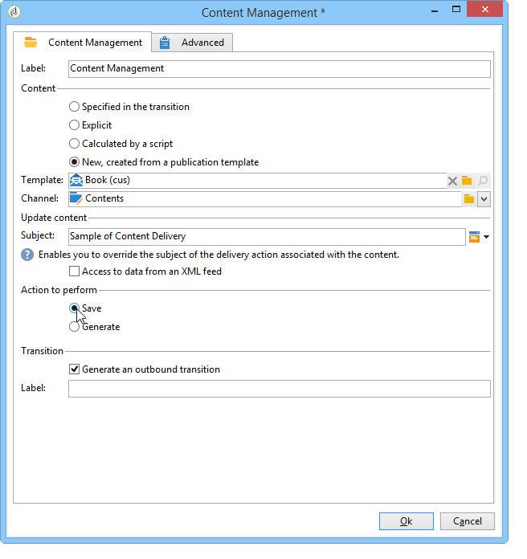

# Automatizar com workflows{#automating-via-workflows}


## Atividade de gestão de conteúdo {#content-management-activity}

A criação, edição e publicação de conteúdo pode ser automatizada usando um workflow configurado por meio da interface do cliente do Adobe Campaign.

A atividade **Content management** é acessada pela barra de ferramentas **[!UICONTROL Tools]** do diagrama de workflow.

As propriedades da atividade são divididas em quatro etapas:

* **[!UICONTROL Content]**: permite inserir conteúdo existente ou criar conteúdo,
* **[!UICONTROL Update content]**: permite modificar o assunto do conteúdo ou atualizar o conteúdo por meio de um fluxo de dados XML,
* **[!UICONTROL Action to execute]**: permite salvar ou gerar conteúdo,
* **[!UICONTROL Transition]**: permite escolher se gera ou não uma transição de saída e a nomeia.


### Conteúdo {#content}

* **Especificado pela transição**

   O conteúdo a ser usado foi criado anteriormente. Os processos se referem à instância de conteúdo propagada pelo evento de entrada. O identificador de conteúdo é acessado por meio da variável &quot;contentId&quot; do evento.

* **Explícito**

   Permite escolher o conteúdo criado anteriormente.

* **Calculado por um script**

   Seleciona uma instância de conteúdo com base em um template JavaScript. O código a ser avaliado permite recuperar o identificador de conteúdo.

* **Novo, criado por meio de um template de publicação**

   Cria um novo conteúdo por meio de um template de publicação. A instância de conteúdo será salva na pasta &quot;cadeia de caracteres&quot; preenchida.

### Atualizar o conteúdo {#update-the-content}

* **Assunto**

   Permite modificar o assunto da ação de delivery ao publicar.

* **Acesso aos dados de um feed XML**

   O conteúdo é atualizado de um feed XML de uma fonte externa. Um URL deve ser inserido para que o download de dados ocorra.

   Uma folha de estilos XSL pode ser usada para transformar os dados XML de entrada.

### Ação a ser executada {#action-to-execute}

* **Salvar**

   Salva o conteúdo criado ou modificado. O identificador do conteúdo salvo é propagado na variável &quot;contentId&quot; do evento de saída.

* **Gerar**

   Gera os arquivos de saída para cada um dos modelos de transformação com uma publicação do tipo &quot;Arquivo&quot;. A transição de saída é ativada para cada arquivo gerado, com os seguintes parâmetros: o identificador do conteúdo salvo na variável &quot;contentId&quot; e o nome do arquivo na variável &quot;filename&quot;.

### Transição {#transition}

A opção **Generate an output transition** permite adicionar uma transição de saída à atividade **[!UICONTROL Content management]** para vincular uma nova atividade à execução do workflow. Após verificar essa opção, insira um rótulo para a transição.

## Exemplos {#examples}

### Automatizar a criação e o delivery de conteúdo {#automating-content-creation-and-delivery}

O exemplo a seguir automatiza a criação e o delivery de um bloco de conteúdo.


O conteúdo é configurado através da atividade &quot;Gestão de conteúdo&quot;:


Uma nova instância de conteúdo é criada por meio do modelo de publicação e da pasta de cadeia de caracteres de conteúdo.

No nosso exemplo, sobrecarregamos o assunto do delivery. Ele será considerado em vez do inserido no template **[!UICONTROL Delivery]**.

O conteúdo é preenchido automaticamente por um feed XML vindo do URL inserido:

```
<?xml version='1.0' encoding='ISO-8859-1'?>
<book name="Content automation test" date="2008/06/08" language="eng" computeString="Content automation test">
  <section id="1" name="Introduction">
    <page>Introduction to input forms.</page>
  </section>
</book>
```

O formato de dados não corresponde ao schema de dados inserido no template de publicação (**cus:book** no nosso exemplo); o elemento **`<section>`** deve ser substituído pelo elemento **`<chapter>`**. É necessário aplicar a folha de estilos &quot;cus:book-workflow.xsl&quot; para fazer as alterações necessárias.

Código de origem da folha de estilos XSLT usada:

```
<?xml version="1.0" encoding="utf-8"?>
<xsl:stylesheet version="1.0" xmlns:xsl="http://www.w3.org/1999/XSL/Transform">
 <xsl:output indent="yes" method="xml"  encoding="ISO-8859-1"/>

 <xsl:template match="text()|@*"/>

  <xsl:template match="*">
    <xsl:variable name="element.name" select="name(.)"/>
    <xsl:element name="{$element.name}">
      <xsl:copy-of select="text()|@*"/>
      <xsl:apply-templates/>
    </xsl:element>
  </xsl:template>

  <xsl:template match="book">
  <book name="test">
     <xsl:apply-templates/>
    <book>
 </xsl:template>

  <xsl:template match="section">
    <chapter>
      <xsl:for-each select="@*">
        <xsl:copy-of select="."/>
      </xsl:for-each>
       <xsl:apply-templates/>
    </chapter>
  </xsl:template>
  
</xsl:stylesheet>
```

A ação final da atividade é salvar a instância de conteúdo e prosseguir para a próxima tarefa.

O target é realizado por meio da atividade **Query**.

Uma atividade **AND-join** é adicionada para garantir que o delivery só iniciará quando a consulta do target e as atualizações de conteúdo forem concluídas.

A ação do delivery é configurada por meio da atividade **Delivery**:


Uma nova ação do delivery é criada com base em um template.

O template do delivery da atividade é usado para selecionar os modelos de transformação do template de publicação. A geração de conteúdo leva em consideração todos os templates HTML e Texto sem os templates do delivery ou aqueles referenciados com o mesmo que a atividade.

O target a ser enviado é digitado por meio do evento de entrada.

O conteúdo de delivery é preenchido por meio do evento de entrada.

A última etapa para concluir a atividade é preparar e depois iniciar o delivery.

### Criar conteúdo para publicação posterior {#creating-content-and-publishing-it-later}

Este exemplo cria um bloco de conteúdo e uma publicação de arquivo de lançamento após um atraso específico.


A primeira tarefa de **Gestão de conteúdo** cria uma instância de conteúdo.



>[!NOTE]
>
>A guia **[!UICONTROL Publication]** da janela dos templates de transformação deve ser preenchida com o local do target a ser gerado.

Uma atividade de espera é adicionada para pausar a próxima transição por uma semana.


O conteúdo é inserido manualmente durante esse período de tempo.

A próxima tarefa inicia a geração de conteúdo.


O conteúdo a ser publicado é inserido por meio da transição de entrada.

A ação final é gerar esse conteúdo forçando o diretório de publicação.

A atividade **Código JavaScript** recupera o nome completo de cada arquivo gerado.


### Criar a entrega e seu conteúdo {#creating-the-delivery-and-its-content}

Esse exemplo usa o mesmo conceito do primeiro exemplo, mas cria a ação de delivery na primeira etapa.


A primeira tarefa **Create delivery** cria a ação de delivery.

A atividade fork permite o início do cálculo do alvo e a criação da instância de conteúdo ao mesmo tempo.

Depois que as tarefas são executadas, a caixa AND-join ativa a tarefa **Delivery** para iniciar o delivery criado anteriormente no conteúdo e definição de targeting.


A ação do delivery a ser iniciada é preenchida pela transição.

O target a ser enviado é digitado por meio do evento de entrada.

O conteúdo de delivery é preenchido por meio do evento de entrada.

A ação final da atividade é preparar e iniciar o delivery.

### Importar conteúdo do FTP {#importing-content-from-ftp}

Se o seu conteúdo do delivery estiver disponível em um arquivo HTML localizado em servidores FTP ou SFTP, é possível carregá-los facilmente nos deliveries do Adobe Campaign. Consulte [esse exemplo](../../workflow/using/loading-delivery-content.md).

### Importar conteúdo do conector do Amazon Simple Storage Service (S3)  {#importing-content-from-amazon-simple-storage-service--s3--connector}

Se o conteúdo do delivery estiver localizado nos buckets do Amazon Simple Storage Service (S3), é possível carregá-los facilmente nos deliveries do Adobe Campaign. Consulte [esse exemplo](../../workflow/using/loading-delivery-content.md).

## Atualização semiautomática {#semi-automatic-update}

Os dados de conteúdo podem ser atualizados no modo &quot;semiautomático&quot;. Os dados são recuperados de um feed XML via URL.

A ativação da recuperação de dados é realizada manualmente por meio do formulário de entrada.

O objetivo é declarar um campo de tipo **`<input>`** **editBtn** no formulário. Esse controle inclui uma zona de edição e um botão para iniciar o processamento.

A zona de edição permite que você preencha dados variáveis usados para construir o URL do feed XML de dados a serem recuperados.

O botão executa o método SOAP **GetAndTransform** preenchido na tag **`<input>`**.

A declaração de controle no formulário é a seguinte:

```
<input type="editbtn" xpath="<path>">
  <enter>
    <soapCall name="GetAndTransform" service="ncm:content">
      <param exprIn="<url>" type="string"/>
      <param exprIn="'xtk:xslt|<style sheet>'" type="string"/>
      <param type="DOMElement" xpathOut="<output path>"/>
    </soapCall>
  </enter>
</input>
```

O método **GetAndTransform** deve ser declarado no elemento **`<enter>`** da tag **`<input>`**. Essa tag assume como parâmetros p URL de recuperação de dados XML de uma expressão construída dinamicamente. O segundo parâmetro da função é opcional e faz referência a uma folha de estilos usada para uma transformação intermediária quando os dados XML de entrada não estão no mesmo formato do conteúdo.

A saída atualiza o conteúdo com base no caminho inserido no último parâmetro.

**Exemplo**: Para ilustrar este exemplo, começamos do schema &quot;cus:book&quot;.

Um formulário de entrada de controle de edição de atualização semiautomático é adicionado:


```
<input label="File name" type="editbtn" xpath="/tmp/@name">
  <enter>
    <soapCall name="GetAndTransform" service="ncm:content">
      <param exprIn="'https://myserver.adobe.com/incoming/' + [/tmp/@name] + '.xml'" type="string"/>
      <param exprIn="'xtk:xslt|cus:book-workflow.xsl'" type="string"/>
      <param type="DOMElement" xpathOut="."/>
    </soapCall>
  </enter>
</input>
```

A zona de edição permite a inserção do nome do arquivo a ser recuperado. O URL é construído com base neste nome, por exemplo: https://myserver.adobe.com/incomin/data.xml

O formato dos dados a serem recuperados é o mesmo do exemplo 1 da automação do workflow. Usaremos a folha de estilos &quot;cus:book-workflow.xsl&quot; vista neste exemplo.

O resultado da execução do trabalho atualiza a instância do conteúdo do caminho &#39;.&#39;.
