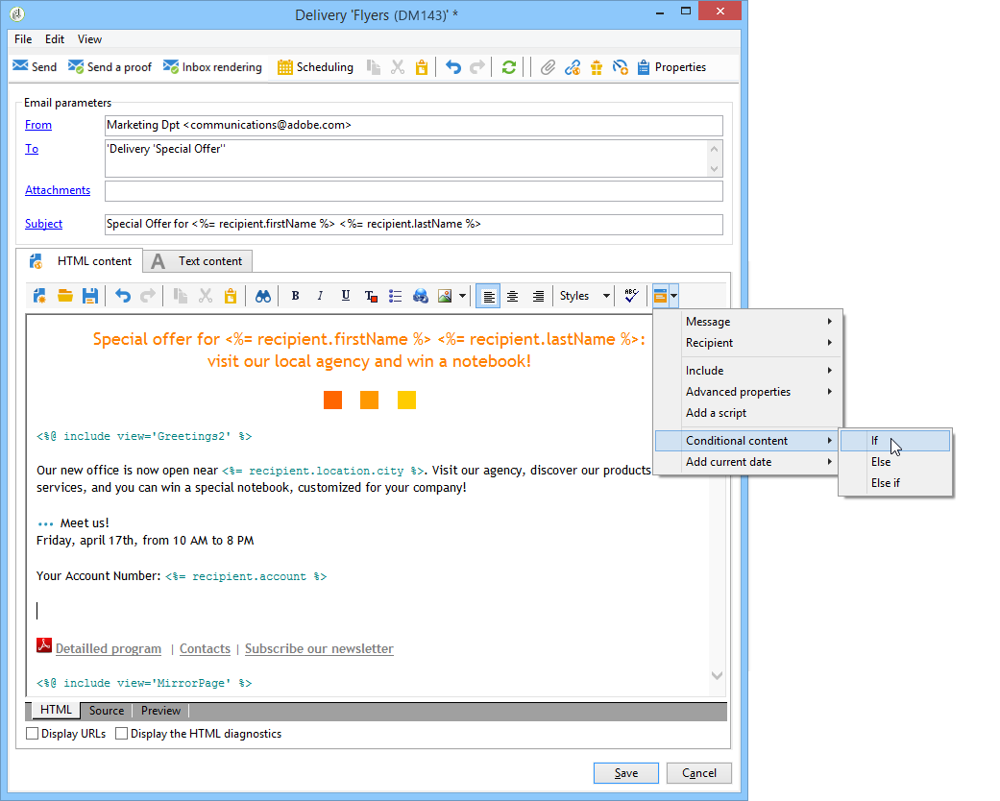
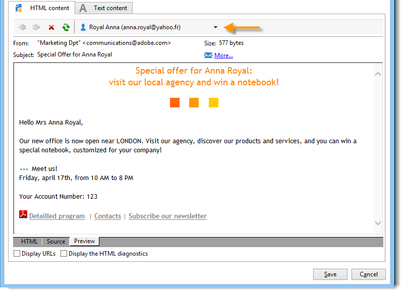

# Conteúdo condicional{#conditional-content}


Ao configurar campos de conteúdo condicional, você pode criar personalização dinâmica com base no perfil do recipient, por exemplo. Blocos de texto e/ou imagens são substituídos quando uma determinada condição é atendida.

 [Descubra este recurso no vídeo](#conditionnal-content-video)


## Condições de uso em um email {#using-conditions-in-an-email}

No exemplo abaixo, você aprenderá a criar uma mensagem, personalizada dinamicamente no sexo e interesses do recipient.

* Exibição mostrando &quot;Mr.&quot; ou &quot;Ms.&quot; de acordo com o valor do campo **[!UICONTROL Gender]** (M ou F) na fonte de dados,
* Assembly personalizado de um boletim informativo ou ofertas promocionais de acordo com os interesses indicados ou detectados:

   * Interesse 1 -- > Bloco 1
   * Interesse 2 -- > Bloco 2
   * Interesse 3 -- > Bloco 3
   * Interesse 4 -- > Bloco 4

Para criar conteúdo condicional de acordo com o valor de um campo, siga as seguintes etapas:

1. Clique no ícone de personalização e selecione **[!UICONTROL Conditional content > If]**.

   

   Os elementos de personalização são inseridos no corpo da mensagem. Devem ser configurados agora.

1. Em seguida, preencha os parâmetros da expressão **Se**.

   Para fazer isso:

   * Selecione o primeiro elemento da expressão, **`<field>`**, (por padrão, esse elemento é realçado durante a inserção da expressão **if** ) e clique no ícone de personalização para substitui-lo pelo campo de teste.

      

   * Substitua **`<value>`** pelo valor do campo para o qual a condição será atendida. Esse valor deve estar entre aspas.
   * Especifique o conteúdo a ser inserido quando a condição for atendida. Isso pode consistir em um texto, uma imagem, um formulário, um link de hipertexto etc.

      

1. Clique na guia **[!UICONTROL Preview]** para exibir o conteúdo da mensagem de acordo com o recipient do delivery:

   * Selecionando um recipient para o qual a condição é verdadeira:

      

   * Selecionando um recipient para o qual a condição não é verdadeira:

      

Você pode adicionar outros casos e definir outro conteúdo de acordo com os valores de um ou mais campos. Para fazer isso, use **[!UICONTROL Conditional content > Else]** e **[!UICONTROL Conditional content > Else if]**. Essas expressões são configuradas da mesma maneira que a expressão **se**.


>[!CAUTION]
>
>Para respeitar a sintaxe do JavaScript, os caracteres **%> &lt;%** devem ser excluídos após adicionar as condições **Senão** e **Senão se**.

Clique em **[!UICONTROL Preview]** e selecione um recipient para exibir o conteúdo condicional.


## Criar email multilíngue {#creating-multilingual-email}

Você verá no exemplo abaixo como criar um email multilíngue. O conteúdo será exibido em um idioma ou em outro, dependendo da preferência de idioma do recipient.

1. Crie um email e selecione o público alvo. Neste exemplo, a condição para exibir uma versão ou outra será baseada no valor **Idioma** do perfil do recipient. Neste exemplo, esses valores são definidos como **EN**, **FR**, **ES**.
1. No conteúdo HTML de email, clique na guia **[!UICONTROL Source]** e cole o seguinte código:

   ```
   <% if (language == "EN" ) { %>
   <DIV id=en-version>Hello <%= recipient.firstName %>,</DIV>
   <DIV>Discover your new offers!</DIV>
   <DIV><a href="https://www.adobe.com/products/en">www.adobe.com/products/en</A></FONT></DIV><%
    } %>
   <% if (language == "FR" ) { %>
   <DIV id=fr-version>Bonjour <%= recipient.firstName %>,</DIV>
   <DIV>Découvrez nos nouvelles offres !</DIV>
   <DIV><a href="https://www.adobe.com/products/fr">www.adobe.com/products/fr</A></DIV><%
    } %>
    <% if (language == "ES" ) { %>
   <DIV id=es-version><FONT face=Arial>
   <DIV>Olà <%= recipient.firstName %>,</DIV>
   <DIV>Descubra nuestros nuevas ofertas !</DIV>
   <DIV><a href="https://www.adobe.com/products/es">www.adobe.com/products/es</A></DIV>
   <% } %>
   ```

1. Teste o conteúdo do email na guia **[!UICONTROL Preview]** selecionando os recipients com as diferentes preferências de idioma.

   >[!NOTE]
   >
   >Como nenhuma versão alternativa foi definida no conteúdo do email, filtre o público-alvo antes de enviar o email.

## Tutorial em vídeo {#conditionnal-content-video}

Saiba como adicionar conteúdo condicional a um delivery no exemplo de um informativo multilíngue.

>[!VIDEO](https://video.tv.adobe.com/v/24926?quality=12)

Vídeos extras sobre procedimentos do Campaign Classic estão disponíveis [aqui](https://experienceleague.adobe.com/docs/campaign-classic-learn/tutorials/overview.html?lang=pt-BR).
