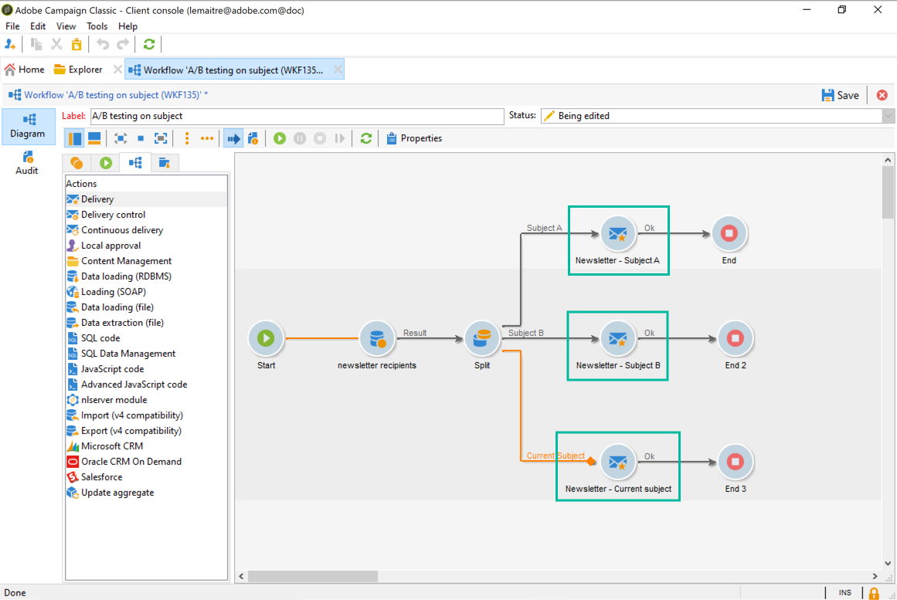

# Configurar teste A/B {#configuring-a-b-testing}

Esta seção detalha como criar um fluxo de trabalho para executar um teste A/B.

1. Crie um novo workflow e configure uma atividade Query para direcionar a população desejada. Consulte a [documentação do Campaign v8](https://experienceleague.adobe.com/docs/campaign/automation/workflows/wf-activities/targeting-activities/query.html?lang=pt-BR){target="_blank"}.

1. Adicione uma atividade Split para dividir a população direcionada em vários subconjuntos. Consulte a [documentação do Campaign v8](https://experienceleague.adobe.com/docs/campaign/automation/workflows/wf-activities/targeting-activities/split.html?lang=pt-BR){target="_blank"}.

1. Abra a atividade e configure cada subconjunto de acordo com suas necessidades. Para obter mais informações sobre como configurar uma atividade **[!UICONTROL Split]**, consulte [esta seção](../../workflow/using/split.md).

   Neste exemplo, queremos testar dois novos assuntos para um informativo, apresentando cada um deles a 10% da população direcionada.

   

1. Adicione uma transição para enviar ao restante da população o informativo com o assunto atual. Para fazer isso, ative a opção **[!UICONTROL Generate complement]** na guia **[!UICONTROL General]**.

   

1. Para cada subconjunto, adicione a versão da entrega a ser testada.

   

Agora, você pode iniciar o fluxo de trabalho. Depois que as entregas forem enviadas, você poderá rastrear o comportamento dos três subconjuntos nos logs da entrega para ver qual assunto foi o mais bem-sucedido.

Os fluxos de trabalho também permitem que você automatize seus processos identificando automaticamente a variante da entrega que teve melhor desempenho e, em seguida, enviando-a à população restante. Para saber mais, consulte este [caso de uso](a-b-testing-use-case.md) dedicado.
