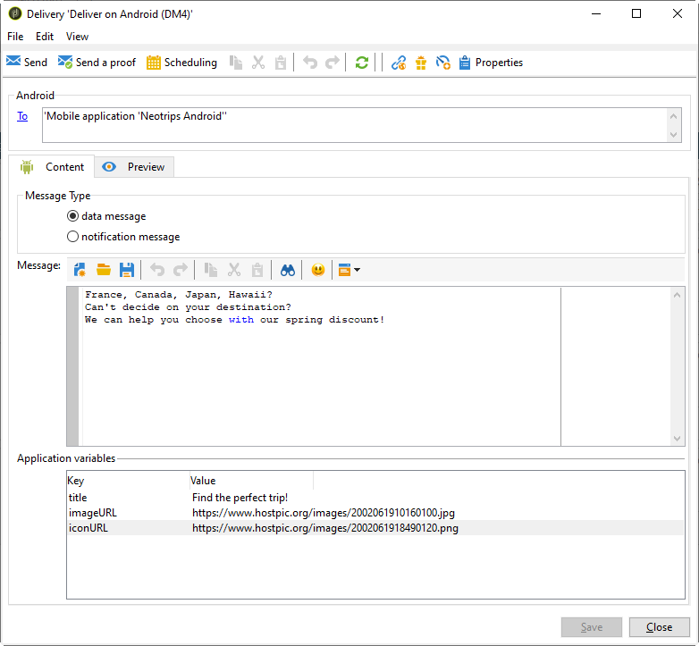

# Etapas de configuração para Android

Depois que o pacote for instalado, você poderá definir as configurações do aplicativo Android no Adobe Campaign Classic.

>[!NOTE]
>
>Para saber como configurar seu aplicativo para iOS e como criar um delivery para iOS, consulte esta [seção](../../delivery/using/configuring-the-mobile-application.md).

## Configuring Android external account {#configuring-external-account-android}

Para Android, dois conectores estão disponíveis:

* O conector V1 que permite uma conexão por MTA filho.
* O conector V2 que permite conexões simultâneas com o servidor FCM para melhorar o throughput.

Para escolher qual conector deseja usar, siga estas etapas:

1. Vá para **[!UICONTROL Administration > Platform > External accounts]**.
1. Selecione a conta externa **[!UICONTROL Android routing]**.
1. Na guia **[!UICONTROL Connector]**, preencha o campo **[!UICONTROL JavaScript used in the connector]**:

   Para Android V2: https://localhost:8080/nms/jsp/androidPushConnectorV2.js

   >[!NOTE]
   >
   > Você também pode configurá-lo assim: https://localhost:8080/nms/jsp/androidPushConnector.js, mas recomendamos que você use a versão 2 do conector.

   

1. Para Android V2, um parâmetro adicional está disponível no arquivo de configuração do Adobe Server (serverConf.xml):

   * **maxGCMConnectPerChild**: Limite máximo de solicitações HTTP paralelas para o FCM iniciado por cada servidor filho (8 por padrão).

## Configuração do serviço Android {#configuring-android-service}

1. Acesse o nó **[!UICONTROL Profiles and Targets > Services and subscriptions]** e clique em **[!UICONTROL New]**.

   

1. Defina um **[!UICONTROL Label]** e um **[!UICONTROL Internal name]**.
1. Acesse o campo **[!UICONTROL Type]** e selecione **[!UICONTROL Mobile application]**.

   >[!NOTE]
   >
   >O target mapping **[!UICONTROL Subscriber applications (nms:appSubscriptionRcp)]** padrão é vinculado à tabela de destinatários. Para utilizar um mapeamento de alvo diferente, é necessário criar um novo e inseri-lo no campo **[!UICONTROL Target mapping]** do serviço. Para obter mais informações sobre como criar o target mapping, consulte o [Guia de configuração](../../configuration/using/about-custom-recipient-table.md).

   

1. Em seguida, clique no botão **[!UICONTROL Add]** para selecionar o tipo de aplicativo.

   

1. Crie seu aplicativo Android. Para obter mais informações, consulte esta [seção](../../delivery/using/configuring-the-mobile-application-android.md#creating-android-app).

## Criar aplicativo Android para dispositivos móveis {#creating-android-app}

Depois de criar o serviço, agora é necessário criar o aplicativo Android:

1. Em seu serviço recém-criado, clique no **[!UICONTROL Add]** botão para selecionar o tipo de aplicativo.

   

1. Selecione **[!UICONTROL Create an Android application]** e insira um **[!UICONTROL Label]**.

   

1. Verifique se a mesma **[!UICONTROL Integration key]** está definida no Adobe Campaign e no código do aplicativo por meio do SDK. Para obter mais informações, consulte: [Integração do SDK do Campaign ao aplicativo móvel](../../delivery/using/integrating-campaign-sdk-into-the-mobile-application.md).

   >[!NOTE]
   >
   > O **[!UICONTROL Integration key]** é totalmente personalizável com o valor da string, mas precisa ser exatamente o mesmo especificado no SDK.

1. Selecione uma das **[!UICONTROL API version]**:
   * HTTP. For more information refer to this [section](../../delivery/using/configuring-the-mobile-application-android.md#android-service-http).
   * HTTPV1. For more information refer to this [section](../../delivery/using/configuring-the-mobile-application-android.md#android-service-httpv1).

1. Fill in the **[!UICONTROL Firebase Cloud Messaging settings for the Android connection]** fields.

1. Clique em **[!UICONTROL Finish]** e em **[!UICONTROL Save]**. Seu aplicativo Android agora está pronto para ser usado no Campaign Classic.

Por padrão, o Adobe Campaign salva uma chave no campo **[!UICONTROL User identifier]** (@userKey) da tabela **[!UICONTROL Subscriber applications (nms:appSubscriptionRcp)]**. Essa chave permite vincular uma subscrição a um recipient. Para coletar dados adicionais (como uma chave de reconciliação complexa), é necessário aplicar a seguinte configuração:

1. Crie uma extensão do schema **[!UICONTROL Subscriber applications (nms:appsubscriptionRcp)]** e defina os novos campos.

1. Defina o mapeamento na guia **[!UICONTROL Subscription parameters]**.

   >[!CAUTION]
   >
   >Verifique se os nomes da configuração da guia **[!UICONTROL Subscription parameters]** são iguais aos do código do aplicativo móvel. Consulte a seção [Integrating Campaign SDK into the mobile application](../../delivery/using/integrating-campaign-sdk-into-the-mobile-application.md).

### Selecione a versão da API{#select-api-version}

Depois de criar um serviço e um novo aplicativo móvel, é necessário configurar seu aplicativo móvel dependendo da versão da API escolhida.

Para obter mais informações sobre criação de serviços e aplicativos móveis, consulte esta [seção](../../delivery/using/configuring-the-mobile-application-android.md#configuring-android-service)

#### Usar a versão da API HTTP v1{#android-service-httpv1}

Para configurar a versão da API HTTP v1, siga as etapas abaixo:

1. Na sua **[!UICONTROL Mobile application creation wizard]** janela, selecione **[!UICONTROL HTTPV1]** o menu **[!UICONTROL API version]** suspenso.

1. Clique **[!UICONTROL Load project json file to extract projet details...]** para carregar diretamente seu arquivo de chave JSON. For more information on how to extract your JSON file, refer to this [page](https://firebase.google.com/docs/admin/setup#initialize-sdk).

1. Você também pode inserir manualmente os seguintes detalhes:
   * **[!UICONTROL Project Id]**
   * **[!UICONTROL Private Key]**
   * **[!UICONTROL Client Email]**

   

1. Clique **[!UICONTROL Test the connection]** para verificar se a sua configuração está correta e se o servidor de marketing tem acesso ao FCM.

   >[!CAUTION]
   >
   >Para Implantação de Mid-sourcing, o **[!UICONTROL Test connection]** botão não verificará se o servidor MID tem acesso ao servidor FCM.

   

1. Como opção, você pode enriquecer um conteúdo de mensagem de push com alguns **[!UICONTROL Application variables]** se necessário. Eles são totalmente personalizáveis e uma parte da carga da mensagem é enviada para o dispositivo móvel.

1. Clique em **[!UICONTROL Finish]** e em **[!UICONTROL Save]**. Seu aplicativo Android agora está pronto para ser usado no Campaign Classic.

Abaixo estão os nomes de carga do FCM para personalizar ainda mais sua notificação por push:

| Tipo de mensagem | Elemento de mensagem configurável (nome da carga FCM) | Opções configuráveis (nome da carga do FCM) |
|:-:|:-:|:-:|
| mensagem de dados | N/D | validate_only |
| mensagem de notificação | título, corpo, android_canal_id, ícone, som, tag, cor, click_action, imagem, ticker, adesivo, visibilidade, notification_priority, notification_count   | validate_only |

 
 

#### Versão da API HTTP{#android-service-http}

Para configurar a versão da API HTTP (herdada), siga as etapas abaixo:

1. Na sua **[!UICONTROL Mobile application creation wizard]** janela, selecione **[!UICONTROL HTTP (legacy)]** o menu **[!UICONTROL API version]** suspenso.

1. Digite o **[!UICONTROL Project key]** que foi fornecido pelo desenvolvedor do aplicativo móvel.

1. Como opção, você pode enriquecer um conteúdo de mensagem de push com alguns **[!UICONTROL Application variables]** se necessário. Eles são totalmente personalizáveis e uma parte da carga da mensagem é enviada para o dispositivo móvel.

   No exemplo a seguir, adicionamos **title**, **imageURL** e **iconURL** para criar notificações por push avançadas e, em seguida, fornecemos ao aplicativo a imagem, o título e o ícone que serão exibidos na notificação.

   

1. Clique em **[!UICONTROL Finish]** e em **[!UICONTROL Save]**. Seu aplicativo Android agora está pronto para ser usado no Campaign Classic.

Abaixo estão os nomes de carga do FCM para personalizar ainda mais sua notificação por push:

| Tipo de mensagem | Elemento de mensagem configurável (nome da carga FCM) | Opções configuráveis (nome da carga do FCM) |
|:-:|:-:|:-:|
| mensagem de dados | N/D | dryRun |
| mensagem de notificação | título, corpo, android_canal_id, ícone, som, tag, cor, click_action   | dryRun |

 

## Creating an Android rich notification {#creating-android-delivery}

Com o Firebase Cloud Messaging, você pode escolher entre dois tipos de mensagens:

* **[!UICONTROL Data message]**, manipulado pelo aplicativo cliente.
    As mensagens são enviadas diretamente para o aplicativo móvel que gerará e exibirá a notificação do Android para o dispositivo. As mensagens de dados contêm somente as variáveis personalizadas do aplicativo.

* **[!UICONTROL Notification message]**, manipulado automaticamente pelo SDK do FCM.
     O FCM exibe automaticamente a mensagem nos dispositivos dos usuários em nome do aplicativo cliente. As mensagens de notificação contêm um conjunto predefinido de parâmetros e opções, mas ainda podem ser personalizadas com variáveis de aplicativo personalizadas.

Para obter mais informações sobre os tipos de mensagens da Firebase Cloud Messaging, consulte a documentação [do](https://firebase.google.com/docs/cloud-messaging/concept-options#notifications_and_data_messages)FCM.

### Criação de uma mensagem de dados {#creating-data-message}

1. Vá até **[!UICONTROL Campaign management]** > **[!UICONTROL Deliveries]**.

1. Clique em **[!UICONTROL New]**.

   

1. Selecione **[!UICONTROL Deliver on Android (android)]** na lista suspensa **[!UICONTROL Delivery template]**. Adicione um **[!UICONTROL Label]** ao delivery.

1. Clique em **[!UICONTROL To]** para definir a população como target. Por padrão, o target mapping **[!UICONTROL Subscriber application]** é aplicado. Clique **[!UICONTROL Add]** para selecionar seu serviço.

   

1. Na janela **[!UICONTROL Target type]**, selecione **[!UICONTROL Subscribers of an Android mobile application]** e clique em **[!UICONTROL Next]**.

1. Na lista suspensa **[!UICONTROL Service]**, selecione o serviço criado anteriormente, depois o aplicativo e clique em **[!UICONTROL Finish]**.
Os **[!UICONTROL Application variables]** são adicionados automaticamente, dependendo do que foi adicionado durante as etapas de configuração.

   

1. Selecione **[!UICONTROL data message]** como **[!UICONTROL Message Type]**.

1. Edite a notificação avançada.

   

1. Você pode adicionar informações em sua configuração anterior, **[!UICONTROL Application variables]** se necessário. **[!UICONTROL Application variables]** precisa ser configurado no serviço Android e faz parte da carga da mensagem enviada para o dispositivo móvel.

1. Clique em **[!UICONTROL Save]** e envie o delivery.

A imagem e a página da web devem ser exibidas na notificação por push quando recebida nos dispositivos Android móveis dos subscritos.

### Criando uma mensagem de notificação {#creating-notification-message}

>[!NOTE]
>
>Opções adicionais para mensagem de notificação estão disponíveis somente com a configuração da API HTTP v1. Para obter mais informações, consulte esta [seção](../../delivery/using/configuring-the-mobile-application-android.md#android-service-httpv1).

1. Vá até **[!UICONTROL Campaign management]** > **[!UICONTROL Deliveries]**.

1. Clique em **[!UICONTROL New]**.

   

1. Selecione **[!UICONTROL Deliver on Android (android)]** na lista suspensa **[!UICONTROL Delivery template]**. Adicione um **[!UICONTROL Label]** ao delivery.

1. Clique em **[!UICONTROL To]** para definir a população como target. Por padrão, o target mapping **[!UICONTROL Subscriber application]** é aplicado. Clique **[!UICONTROL Add]** para selecionar seu serviço.

   

1. Na janela **[!UICONTROL Target type]**, selecione **[!UICONTROL Subscribers of an Android mobile application]** e clique em **[!UICONTROL Next]**.

1. Na lista suspensa **[!UICONTROL Service]**, selecione o serviço criado anteriormente, depois o aplicativo e clique em **[!UICONTROL Finish]**.

   

1. Selecione **[!UICONTROL notification message]** como **[!UICONTROL Message Type]**.

1. Adicione um título e edite sua mensagem. Personalize sua notificação por push com o **[!UICONTROL Notification options]**:

   * **[!UICONTROL Channel ID]**: Defina a ID do canal da sua notificação. O aplicativo deve criar um canal com essa ID de canal antes que qualquer notificação com essa ID de canal seja recebida.
   * **[!UICONTROL Sound]**: Defina o som para reproduzir quando o dispositivo receber sua notificação.
   * **[!UICONTROL Color]**: Defina a cor do ícone da sua notificação.
   * **[!UICONTROL Icon]**: Defina o ícone da notificação para ser exibido em seus dispositivos perfis.
   * **[!UICONTROL Tag]**: Defina o identificador usado para substituir notificações existentes na gaveta de notificações.
   * **[!UICONTROL Click action]**: Defina a ação associada a um clique do usuário em sua notificação.

   Para obter mais informações sobre **[!UICONTROL Notification options]** e como preencher esses campos, consulte a documentação [do](https://firebase.google.com/docs/reference/fcm/rest/v1/projects.messages#androidnotification)FCM.

   

1. Se seu aplicativo estiver configurado com protocolo HTTP v1 API, você poderá personalizar ainda mais sua notificação por push com o seguinte **[!UICONTROL HTTPV1 additional options]**:

   * **[!UICONTROL Ticker]**: Defina o texto do ticker da sua notificação. Disponível somente para dispositivos definidos como Android 5.0 Lollipop.
   * **[!UICONTROL Image]**: Defina o URL da imagem a ser exibido na sua notificação.
   * **[!UICONTROL Notification Count]**: Defina o número de novas informações não lidas para serem exibidas diretamente no ícone do aplicativo.
   * **[!UICONTROL Sticky]**: Definido como verdadeiro ou falso. Se definida como false, a notificação será automaticamente fechada quando o usuário clicar nela. Se definida como true, a notificação ainda será exibida mesmo quando o usuário clicar nela.
   * **[!UICONTROL Notification Priority]**: Defina os níveis de prioridade da sua notificação como padrão, mínimo, baixo ou alto. For more on this, refer to [FCM documentation](https://firebase.google.com/docs/reference/fcm/rest/v1/projects.messages#NotificationPriority).
   * **[!UICONTROL Visibility]**: Defina os níveis de visibilidade de sua notificação como público, privado ou secreto. For more on this, refer to [FCM documentation](https://firebase.google.com/docs/reference/fcm/rest/v1/projects.messages#visibility).

   Para obter mais informações sobre **[!UICONTROL HTTP v1 additional options]** e como preencher esses campos, consulte a documentação [do](https://firebase.google.com/docs/reference/fcm/rest/v1/projects.messages#androidnotification)FCM.

   

1. Você pode adicionar informações em sua configuração anterior, **[!UICONTROL Application variables]** se necessário. **[!UICONTROL Application variables]** precisa ser configurado no serviço Android e faz parte da carga da mensagem enviada para o dispositivo móvel.

1. Clique em **[!UICONTROL Save]** e envie o delivery.

A imagem e a página da web devem ser exibidas na notificação por push quando recebida nos dispositivos Android móveis dos subscritos.
