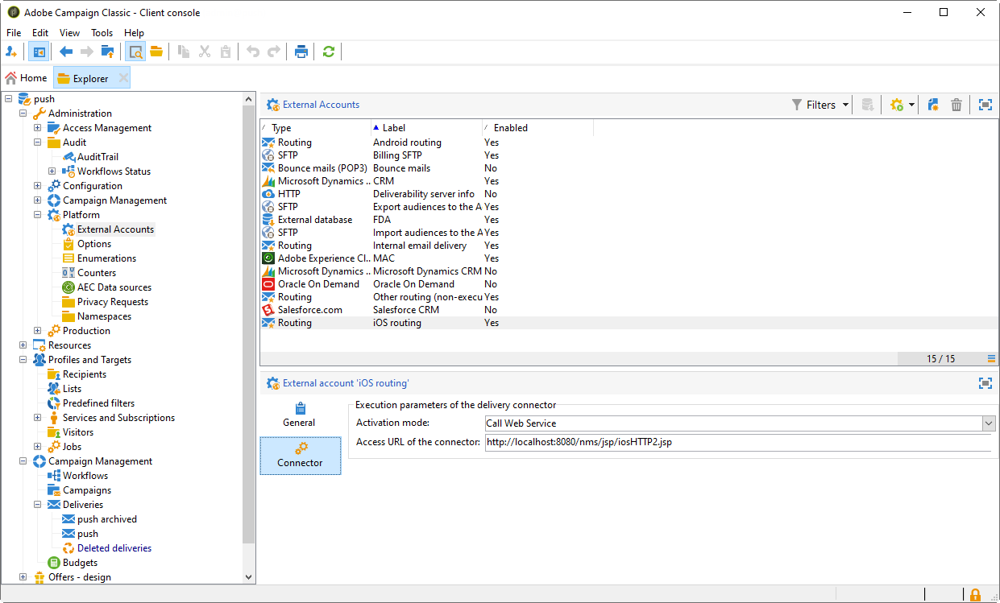

# Etapas de configuração para iOS {#configuring-the-mobile-application-in-adobe-campaign-ios}

Depois que o pacote for instalado, você poderá definir as configurações do aplicativo iOS no Adobe Campaign Classic.

As principais etapas são:

1. [Configurar a conta externa do iOS](#configuring-external-account-ios)
1. [Configurar o serviço iOS](#configuring-ios-service)
1. [Integrar o aplicativo móvel iOS no Campaign](#creating-ios-app)

Você poderá [criar uma notificação por push para dispositivos iOS](create-notifications-ios.md).

## Configurar a conta externa do iOS {#configuring-external-account-ios}

Para iOS, o conector HTTP/2 do iOS envia notificações para o HTTP/2 APNS.

Para configurar esse conector, siga estas etapas:

1. Vá para **[!UICONTROL Administration > Platform > External accounts]**.
1. Selecione a conta externa **[!UICONTROL iOS routing]**.
1. Na guia **[!UICONTROL Connector]**, preencha o campo **[!UICONTROL Access URL of the connector]** com o seguinte URL: ```http://localhost:8080/nms/jsp/iosHTTP2.jsp```

   

1. Clique em **[!UICONTROL Save]**.

O conector iOS está configurado. Você pode começar a criar seu serviço.

## Configurar o serviço iOS {#configuring-ios-service}

>[!CAUTION]
>
>O aplicativo deve ter sido configurado para ações de push ANTES de qualquer integração ao SDK da Adobe.
>
>Se esse não for o caso, consulte [esta página](https://developer.apple.com/documentation/usernotifications).

1. Acesse o nó **[!UICONTROL Profiles and Targets > Services and subscriptions]** e clique em **[!UICONTROL New]**.

   

1. Defina um **[!UICONTROL Label]** e um **[!UICONTROL Internal name]**.
1. Acesse o campo **[!UICONTROL Type]** e selecione **[!UICONTROL Mobile application]**.

   >[!NOTE]
   >
   >O target mapping **[!UICONTROL Subscriber applications (nms:appSubscriptionRcp)]** padrão é vinculado à tabela de destinatários. Para utilizar um mapeamento de alvo diferente, é necessário criar um novo e inseri-lo no campo **[!UICONTROL Target mapping]** do serviço. Para obter mais informações sobre como criar o target mapping, consulte o [Guia de configuração](../../configuration/using/about-custom-recipient-table.md).

   

1. Em seguida, clique no botão **[!UICONTROL Add]** para selecionar o tipo de aplicativo.

   

1. Crie seus aplicativos iOS de desenvolvimento e produção. Para obter mais informações, consulte esta [seção](configuring-the-mobile-application.md#creating-ios-app).

## Criar um aplicativo móvel iOS {#creating-ios-app}

Depois de criar o serviço, crie o aplicativo iOS no Campaign. Siga as etapas abaixo:

1. Em seu serviço recém-criado, clique no botão **[!UICONTROL Add]** para selecionar o tipo de aplicativo.

   

1. A janela a seguir é exibida. Selecione **[!UICONTROL Create an iOS application]** e comece inserindo o **[!UICONTROL Label]**.

   

1. Como opção, você pode enriquecer um conteúdo de mensagem de push com alguns **[!UICONTROL Application variables]** se necessário. Eles são totalmente personalizáveis e uma parte do conteúdo da mensagem é enviada para o dispositivo móvel.
No exemplo a seguir, adicionamos **mediaURl** e **mediaExt** para criar notificações por push avançadas e, em seguida, fornecemos ao aplicativo a imagem que será exibida na notificação.

   

1. A guia **[!UICONTROL Subscription parameters]** permite definir o mapeamento com uma extensão do schema **[!UICONTROL Subscriber applications (nms:appsubscriptionRcp)]**.

   >[!NOTE]
   >
   >Certifique-se de não usar o mesmo certificado para a versão de desenvolvimento (sandbox) e a versão de produção do aplicativo.

1. A guia **[!UICONTROL Sounds]** permite que você especifique um som para reproduzir. Clique em **[!UICONTROL Add]** e preencha o campo **[!UICONTROL Internal name]** que deve conter o nome do arquivo incorporado no aplicativo ou o nome do som do sistema.

1. Clique em **[!UICONTROL Next]** para configurar o aplicativo de desenvolvimento.

1. Verifique se a mesma **[!UICONTROL Integration key]** está definida no Adobe Campaign e no código do aplicativo por meio do SDK. <!--For more on this, refer to [this page](integrating-campaign-sdk-into-the-mobile-application.md).--> Essa chave de integração, que é específica para cada aplicativo, permite vincular o aplicativo móvel à plataforma do Adobe Campaign.

   >[!NOTE]
   >
   > A **[!UICONTROL Integration key]** é totalmente personalizável com o valor da string, mas precisa ser exatamente a mesma especificada no SDK.

1. Selecione um dos ícones prontos do campo **[!UICONTROL Application icon]** para personalizar o aplicativo para dispositivos móveis em seu serviço.

1. Selecione o **[!UICONTROL Authentication mode]**.

   

   Dois modos estão disponíveis:

   * (Recomendado) **[!UICONTROL Token-based authentication]**: preencha as configurações de conexão de APNs **[!UICONTROL Key Id]**, **[!UICONTROL Team Id]** e **[!UICONTROL Bundle Id]** e selecione seu certificado p8 clicando em **[!UICONTROL Enter the private key...]**. Para saber mais sobre **[!UICONTROL Token-based authentication]**, consulte a [documentação da Apple](https://developer.apple.com/documentation/usernotifications/setting_up_a_remote_notification_server/establishing_a_token-based_connection_to_apns){target="_blank"}.

   * **[!UICONTROL Certificate-based authentication]**: Clique em **[!UICONTROL Enter the certificate...]** e selecione em seguida a chave p12, inserindo a senha fornecida pelo desenvolvedor de aplicativos móveis.

   >[!NOTE]
   >
   > A Adobe recomenda usar **[!UICONTROL Token-based authentication]** para a configuração do iOS, já que as chaves de autenticação P8 são mais recentes e seguras.

1. Use o botão **[!UICONTROL Test the connection]** para validar a configuração.

1. Clique em **[!UICONTROL Next]** para configurar o aplicativo de produção e siga as mesmas etapas descritas acima.


1. Clique em **[!UICONTROL Finish]**.

Seu aplicativo iOS está pronto para ser usado no Campaign Classic.
