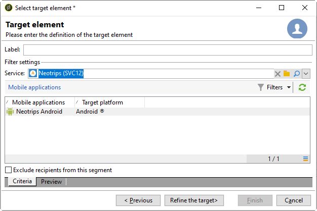

# Criar notificações para Android{#create-notificaations-android}

Use o Adobe Campaign para enviar notificações por push em dispositivos Android. Os conceitos globais sobre a criação de entregas são apresentados [nesta seção](steps-about-delivery-creation-steps.md).

Comece criando uma nova entrega.

Com o Firebase Cloud Messaging, você pode escolher entre dois tipos de mensagens:

* **[!UICONTROL Data message]**, manipulada pelo aplicativo do cliente.
    As mensagens são enviadas diretamente para o aplicativo móvel que gerará e exibirá a notificação do Android para o dispositivo. As mensagens de dados contêm somente as variáveis personalizadas do aplicativo.

* **[!UICONTROL Notification message]**, manipulada automaticamente pelo SDK do FCM.
     O FCM exibe automaticamente a mensagem nos dispositivos dos usuários em nome do aplicativo do cliente. As mensagens de notificação contêm um conjunto predefinido de parâmetros e opções, mas ainda podem ser personalizadas com variáveis de aplicativo personalizadas.

Para obter mais informações sobre os tipos de mensagens da Firebase Cloud Messaging, consulte a [documentação do FCM](https://firebase.google.com/docs/cloud-messaging/concept-options#notifications_and_data_messages).

## Criar uma mensagem de dados {#creating-data-message}

1. Vá até **[!UICONTROL Campaign management]** > **[!UICONTROL Deliveries]**.

1. Clique em **[!UICONTROL New]**.

   

1. Selecione **[!UICONTROL Deliver on Android (android)]** na lista suspensa **[!UICONTROL Delivery template]**. Adicione um **[!UICONTROL Label]** à entrega.

1. Clique em **[!UICONTROL To]** para definir a população como target. Por padrão, o target mapping **[!UICONTROL Subscriber application]** é aplicado. Clique em **[!UICONTROL Add]** para selecionar seu serviço.

   

1. Na janela **[!UICONTROL Target type]**, selecione **[!UICONTROL Subscribers of an Android mobile application]** e clique em **[!UICONTROL Next]**.

1. Na lista suspensa **[!UICONTROL Service]**, selecione o serviço criado anteriormente, depois o aplicativo e clique em **[!UICONTROL Finish]**.
Os **[!UICONTROL Application variables]** são adicionados automaticamente, dependendo do que foi adicionado durante as etapas de configuração.

   

1. Selecione **[!UICONTROL data message]** como **[!UICONTROL Message Type]**.

1. Edite a notificação avançada.

   

1. Você pode adicionar informações em sua **[!UICONTROL Application variables]** configurada anteriormente, caso necessário. **[!UICONTROL Application variables]** precisa ser configurado no serviço Android e faz parte do payload da mensagem enviada para o dispositivo móvel.

1. Clique em **[!UICONTROL Save]** e envie a entrega.

A imagem e a página da web devem ser exibidas na notificação por push quando recebida nos dispositivos Android móveis dos subscritos.

## Criar uma mensagem de notificação {#creating-notification-message}

>[!NOTE]
>
>Opções adicionais para mensagem de notificação estão disponíveis somente com a configuração da API HTTP v1. Para obter mais informações, consulte esta [seção](configuring-the-mobile-application-android.md#android-service-httpv1).

 [Saiba como criar uma notificação por push para Android em vídeo](https://experienceleague.adobe.com/docs/campaign-classic-learn/getting-started-with-push-notifications-for-android/configuring-and-sending-push-notifications.html#additional-resources)

1. Vá até **[!UICONTROL Campaign management]** > **[!UICONTROL Deliveries]**.

1. Clique em **[!UICONTROL New]**.

   

1. Selecione **[!UICONTROL Deliver on Android (android)]** na lista suspensa **[!UICONTROL Delivery template]**. Adicione um **[!UICONTROL Label]** à entrega.

1. Clique em **[!UICONTROL To]** para definir a população como target. Por padrão, o target mapping **[!UICONTROL Subscriber application]** é aplicado. Clique em **[!UICONTROL Add]** para selecionar seu serviço.

   

1. Na janela **[!UICONTROL Target type]**, selecione **[!UICONTROL Subscribers of an Android mobile application]** e clique em **[!UICONTROL Next]**.

1. Na lista suspensa **[!UICONTROL Service]**, selecione o serviço criado anteriormente, depois o aplicativo e clique em **[!UICONTROL Finish]**.

   

1. Selecione **[!UICONTROL notification message]** como **[!UICONTROL Message Type]**.

1. Adicione um título e edite sua mensagem. Personalize sua notificação por push com o **[!UICONTROL Notification options]**:

   * **[!UICONTROL Channel ID]**: Defina a ID do canal da sua notificação. O aplicativo deve criar um canal com essa ID de canal antes que qualquer notificação com essa ID de canal seja recebida.
   * **[!UICONTROL Sound]**: Defina o som que será reproduzido quando o dispositivo receber sua notificação.
   * **[!UICONTROL Color]**: Defina a cor do ícone da sua notificação.
   * **[!UICONTROL Icon]**: Defina o ícone da notificação que será exibido em seus dispositivos de perfis.
   * **[!UICONTROL Tag]**: Defina o identificador usado para substituir notificações existentes na gaveta de notificações.
   * **[!UICONTROL Click action]**: Defina a ação associada a um clique do usuário em sua notificação.

   Para obter mais informações sobre **[!UICONTROL Notification options]** e como preencher esses campos, consulte a [documentação do FCM](https://firebase.google.com/docs/reference/fcm/rest/v1/projects.messages#androidnotification).

   

1. Se seu aplicativo estiver configurado com protocolo HTTP v1 API, você poderá personalizar ainda mais sua notificação por push com o seguinte **[!UICONTROL HTTPV1 additional options]**:

   * **[!UICONTROL Ticker]**: Defina o texto do ticker da sua notificação. Disponível somente para dispositivos definidos como Android 5.0 Lollipop.
   * **[!UICONTROL Image]**: Defina o URL da imagem que será exibido na sua notificação.
   * **[!UICONTROL Notification Count]**: Defina o número de novas informações não lidas para serem exibidas diretamente no ícone do aplicativo.
   * **[!UICONTROL Sticky]**: Defina como verdadeiro ou falso. Se definido como falso, a notificação será automaticamente fechada quando o usuário clicar nela. Se definida como verdadeiro, a notificação ainda será exibida mesmo quando o usuário clicar nela.
   * **[!UICONTROL Notification Priority]**: Defina os níveis de prioridade da sua notificação como padrão, mínimo, baixo ou alto. Para obter mais informações, consulte a [documentação do FCM](https://firebase.google.com/docs/reference/fcm/rest/v1/projects.messages#NotificationPriority).
   * **[!UICONTROL Visibility]**: Defina os níveis de visibilidade de sua notificação como público, privado ou secreto. Para obter mais informações, consulte a [documentação do FCM](https://firebase.google.com/docs/reference/fcm/rest/v1/projects.messages#visibility).

   Para obter mais informações sobre **[!UICONTROL HTTP v1 additional options]** e como preencher esses campos, consulte a [documentação do FCM](https://firebase.google.com/docs/reference/fcm/rest/v1/projects.messages#androidnotification).

   

1. Você pode adicionar informações em sua **[!UICONTROL Application variables]** configurada anteriormente, caso necessário. **[!UICONTROL Application variables]** precisa ser configurado no serviço Android e faz parte do payload da mensagem enviada para o dispositivo móvel.

1. Clique em **[!UICONTROL Save]** e envie a entrega.

A imagem e a página da web devem ser exibidas na notificação por push quando recebida nos dispositivos Android móveis dos subscritos.
