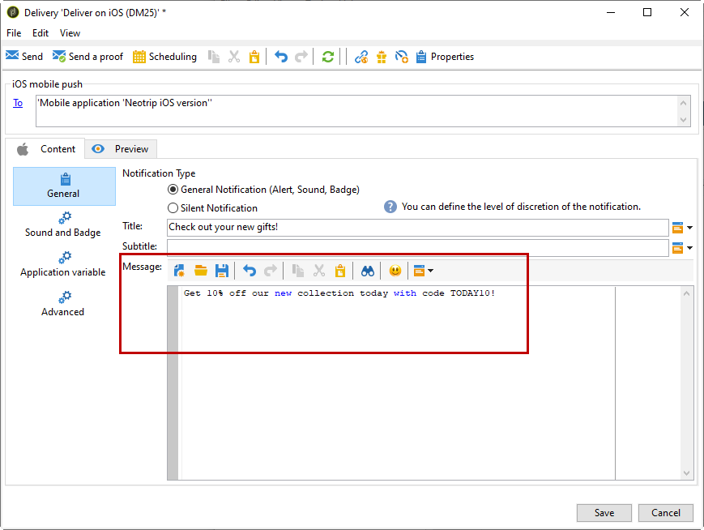

# Criar notificações para iOS{#create-notifications-ios}

Esta seção detalha os elementos específicos para a entrega de notificações do iOS. Os conceitos globais sobre a criação de delivery são apresentados [nesta seção](steps-about-delivery-creation-steps.md).

Comece criando um novo delivery.

Para criar uma notificação por push para dispositivos iOS, siga as etapas abaixo:

1. Selecione o modelo de delivery **[!UICONTROL Deliver on iOS]**.

   

1. Para definir o target da notificação, clique no link **[!UICONTROL To]** e, em seguida, clique em **[!UICONTROL Add]**.

   

   >[!NOTE]
   >
   >O processo detalhado ao selecionar a população do target de um delivery é apresentado [nesta seção](steps-defining-the-target-population.md).
   >
   >Para obter mais informações sobre o uso de campos de personalização, consulte [esta seção](about-personalization.md).
   >
   >Para obter mais informações sobre a inclusão de uma lista de seeds, consulte [Sobre seed addresses](about-seed-addresses.md).

1. Selecione **[!UICONTROL Subscribers of an iOS mobile application (iPhone, iPad)]**, depois o serviço relevante para o aplicativo móvel (Neotrips, neste caso) e clique na versão iOS do aplicativo.

   

1. Selecione o tipo de notificação: **[!UICONTROL Alert]**, **[!UICONTROL Badge]**, ou **[!UICONTROL Alert and badge]** ou **[!UICONTROL Silent Push]**.

   

   >[!NOTE]
   >
   >O modo **Push silencioso** permite que uma notificação &quot;silenciosa&quot; seja enviada a um aplicativo móvel. O usuário não está ciente da chegada da notificação. Ele é transferido diretamente para o aplicativo.

1. No campo **[!UICONTROL Title]**, insira o rótulo do título que deve aparecer na notificação. Isso só aparecerá na lista disponível no centro de notificações. Este campo permite a definição do valor do parâmetro **title** da carga de notificação iOS.

1. Se o conector HTTP/2 é usado, é possível adicionar um subtítulo (valor do parâmetro de **subtitle** da carga de notificação do iOS). Consulte [esta seção](configuring-the-mobile-application.md).

1. Em seguida, insira o **[!UICONTROL Message]** e o **[!UICONTROL Value of the badge]** com base no tipo de notificação escolhido.

   

   >[!NOTE]
   >
   >Os tipos de notificação **[!UICONTROL Badge]** e **[!UICONTROL Alert and badge]** permitem modificar o valor da notificação (o número acima do logotipo do aplicativo móvel). Para atualizar a notificação, basta inserir 0 como valor. Se o campo estiver vazio, o valor da notificação não será alterado.

1. Clique no ícone **[!UICONTROL Insert emoticon]** para inserir emoticons à notificação via push. Para personalizar a lista de emoticons, consulte [esta seção](customizing-emoticon-list.md)

1. O **[!UICONTROL Action button]** permite definir um rótulo para o botão de ação que aparece nas notificações de alerta (campo **action_loc_key** da carga). Se o aplicativo iOS gerencia cadeias de caracteres localizáveis (**Localizable.strings**), digite a chave correspondente nesse campo. Se o aplicativo não gerencia o texto localizável, insira o rótulo que você deseja visualizar no botão de ação. Para mais informações sobre strings localizáveis, consulte a [Apple documentation](https://developer.apple.com/library/archive/documentation/NetworkingInternet/Conceptual/RemoteNotificationsPG/CreatingtheNotificationPayload.html#//apple_ref/doc/uid/TP40008194-CH10-SW1) .
1. No campo **[!UICONTROL Play a sound]**, selecione o som a ser reproduzido pelo terminal móvel quando a notificação for recebida.

   >[!NOTE]
   >
   >Os sons devem ser incluídos no aplicativo e definidos quando o serviço for criado. Consulte [esta seção](configuring-the-mobile-application.md#configuring-external-account-ios).

1. No campo **[!UICONTROL Application variables]**, insira o valor de cada variável. As variáveis do aplicativo permitem definir o comportamento de notificação: por exemplo, é possível configurar uma tela de aplicativo específica para ser exibida quando o usuário ativar a notificação.

   >[!NOTE]
   >
   >As variáveis do aplicativo devem ser definidas no código do aplicativo móvel e inseridas durante a criação do serviço. Para obter mais informações, consulte [esta seção](configuring-the-mobile-application.md).

1. Quando a notificação estiver configurada, clique na guia **[!UICONTROL Preview]** para visualizar a notificação.

   

   >[!NOTE]
   >
   >O estilo de notificação (banner ou alerta) não é definido no Adobe Campaign. Isso depende da configuração selecionada pelo usuário nas configurações do iOS. No entanto, o Adobe Campaign permite a visualização de cada tipo de estilo de notificação. Clique na seta na parte inferior direita para alternar entre os estilos.
   >
   >A pré-visualização utiliza a aparência e comportamento do iOS 10.

Para enviar uma prova e o delivery final, use o mesmo processo que os deliveries de email.

Após enviar as mensagens, você pode monitorar e rastrear seus deliveries. Para obter mais informações, consulte essas seções.

* [Quarentenas de notificação por push](understanding-quarantine-management.md#push-notification-quarantines)
* [Monitoramento de uma entrega](about-delivery-monitoring.md)
* [Compreensão de falhas de entrega](understanding-delivery-failures.md)

## Criação de uma notificação avançada do iOS {#creating-ios-delivery}

Com o iOS 10 ou superior, é possível gerar notificações ricas. O Adobe Campaign pode enviar notificações usando variáveis que permitirão ao dispositivo exibir uma notificação rica.

Em seguida, é necessário criar um novo delivery e vinculá-lo ao aplicativo para dispositivos móveis criado.

1. Vá até **[!UICONTROL Campaign management]** > **[!UICONTROL Deliveries]**.

1. Clique em **[!UICONTROL New]**.

   

1. Selecione **[!UICONTROL Deliver on iOS (ios)]** na lista suspensa **[!UICONTROL Delivery template]**. Adicione um **[!UICONTROL Label]** ao delivery.

1. Clique em **[!UICONTROL To]** para definir a população como target. Por padrão, o target mapping **[!UICONTROL Subscriber application]** é aplicado. Clique em **[!UICONTROL Add]** para selecionar o serviço criado anteriormente.

   

1. Na janela **[!UICONTROL Target type]**, selecione **[!UICONTROL Subscribers of an iOS mobile application (iPhone, iPad)]** e clique em **[!UICONTROL Next]**.

1. Na lista suspensa **[!UICONTROL Service]**, selecione o serviço criado anteriormente e, em seguida, o aplicativo que deseja direcionar e clique em **[!UICONTROL Finish]**.
Os **[!UICONTROL Application variables]** são adicionados automaticamente, dependendo do que foi adicionado durante as etapas de configuração.

   

1. Edite a notificação avançada.

   

1. Marque a caixa **[!UICONTROL Mutable content]** na janela de notificação de edição para permitir que o aplicativo para dispositivos móveis baixe o conteúdo de mídia.

1. Clique em **[!UICONTROL Save]** e envie o delivery.

A imagem e a página da Web devem ser exibidas na notificação por push quando recebida nos dispositivos iOS móveis dos inscritos.

