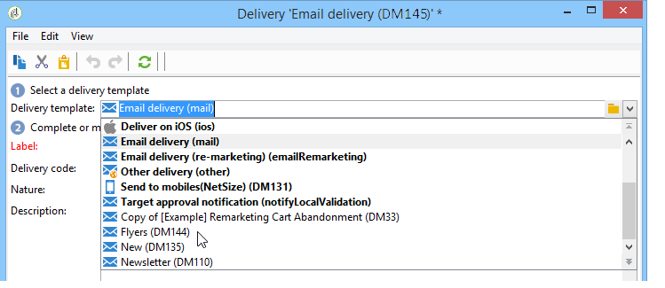

# Criar uma entrega a partir de um modelo{#creating-a-delivery-from-a-template}

## Vincular o modelo a uma entrega {#linking-the-template-to-a-delivery}

Para criar uma entrega com base em um modelo existente, selecione um modelo disponível na lista..

Caso contrário, clique na pasta **[!UICONTROL Select link]** à direita do campo para navegar pela árvore.

Selecione o diretório desejado no campo **[!UICONTROL Folder]** ou clique no ícone **[!UICONTROL Display sub-levels]** para exibir o conteúdo dos diretórios nas subárvores do diretório atual.

Selecione o modelo de entrega a ser usado e clique em **[!UICONTROL Ok]**.

## Executar o modelo {#executing-the-template}

Você pode iniciar a execução de um modelo diretamente da lista de modelos sem criar uma entrega primeiro. Para fazer isso, selecione o modelo a ser executado e clique com o botão direito do mouse. Selecione **[!UICONTROL Actions>Execute the delivery template...]**.

Você também pode usar **[!UICONTROL File>Actions>Execute the delivery template...]**.

Insira os parâmetros de entrega e clique em **[!UICONTROL Send]**.

Essa ação gera uma entrega na pasta anexada ao modelo. O nome dessa entrega é o nome do modelo de entrega do qual foi criado.

>[!NOTE]
>
>Para obter mais informações sobre como configurar uma entrega, consulte [Definir o conteúdo do email](defining-the-email-content.md).
