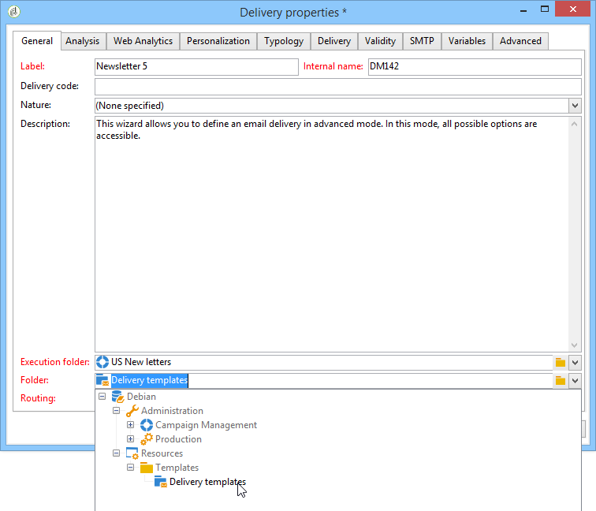

# Criação de um modelo da entrega{#creating-a-delivery-template}

 [Conheça este recurso no vídeo](#delivery-template-video)

## Conversão de uma entrega existente em um modelo {#converting-an-existing-delivery-to-a-template}

Uma entrega pode ser convertida em um modelo para novas ações de entrega repetidas. Para converter uma entrega em um modelo, selecione-a na lista de entrega, acessível por meio do nó **[!UICONTROL Campaign management]** da árvore.

Clique com o botão direito do mouse e selecione **[!UICONTROL Actions > Save as template...]**.

Essa ação cria um modelo de entrega a partir da entrega selecionada. Você deve inserir a pasta onde ele é salvo (no campo **[!UICONTROL Folder]**), bem como a pasta onde as entregas criadas com base neste modelo são criadas (no campo **[!UICONTROL Execution folder]**).

Para obter mais informações sobre o modo de configuração, consulte [Vincular o modelo a uma entrega](creating-a-delivery-from-a-template.md#linking-the-template-to-a-delivery).

## Criação de um novo modelo {#creating-a-new-template}

>[!NOTE]
>
>Para evitar erros de configuração, a Adobe recomenda que você duplique um modelo nativo e personalize suas configurações ao invés de criar um novo modelo.

Para configurar um modelo de entrega, siga as seguintes etapas:

1. Abra o Campaign Explorer.
1. Na pasta **Resources**, selecione **Templates** e depois **Templates de entrega**.

   

1. Clique em **Novo** na barra de ferramentas para criar um novo modelo de entrega, ou **Duplique** um modelo existente.

   

1. Modifique o **Label** e o **Internal name** da pasta.
1. Salve seu modelo e abra-o novamente.
1. Clique no botão **Properties** e modifique os valores de acordo com suas necessidades.

   

1. Na guia **General**, confirme ou altere os locais selecionados nos menus suspensos **Execution folder**, **Folder**, e **Routing.**

   

1. Complete a categoria **Email parameters** com o assunto do email e a população de destino.
1. Adicione seu **HTML** content para personalizar seu modelo, você pode exibir um link de mirror page e um link de unsubscription.
1. Selecione a guia **Preview.** No menu suspenso **Test personalization**, selecione **Destinatário** para visualizar seu modelo como o perfil escolhido.

   

1. Clique em **Save**. Seu modelo está pronto para ser usado em uma entrega.

## Tutoriais em vídeo {#delivery-template-video}

### Como configurar um modelo de entrega

O vídeo a seguir mostra como configurar um modelo para uma entrega ad hoc.

>[!VIDEO](https://video.tv.adobe.com/v/24066?quality=12)

### Como configurar propriedades de modelos de entrega

O vídeo a seguir mostra como definir as propriedades do modelo de entrega e explica em detalhes cada propriedade.

>[!VIDEO](https://video.tv.adobe.com/v/24067?quality=12)

### Como implantar um modelo de entrega ad-hoc

Este vídeo explica como implantar um modelo de entrega de email ad-hoc, bem como a diferença entre uma entrega de email e um fluxo de trabalho de entrega.

>[!VIDEO](https://video.tv.adobe.com/v/24065?quality=12)

Vídeos extras sobre procedimentos do Campaign Classic estão disponíveis [aqui](https://experienceleague.adobe.com/docs/campaign-classic-learn/tutorials/overview.html?lang=pt-BR).
