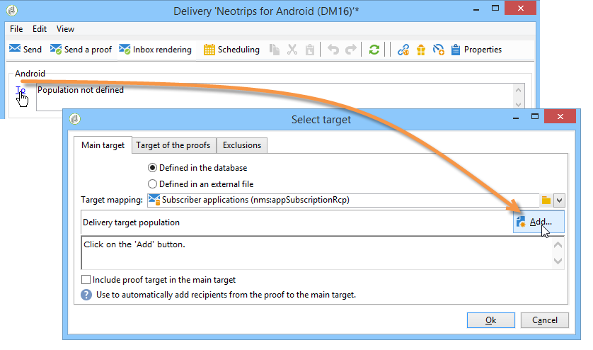

# Criar notificações{#creating-notifications}

Esta seção detalha os elementos específicos para o delivery de notificações iOS e Android. Os conceitos globais sobre a criação de delivery são apresentados [nesta seção](../../delivery/using/steps-about-delivery-creation-steps.md).

Comece criando um novo delivery.

## Envio de notificações no iOS {#sending-notifications-on-ios}

1. Selecione o modelo de **[!UICONTROL Deliver on iOS]** entrega.

   

1. To define the target of the notification, click the **[!UICONTROL To]** link, then click **[!UICONTROL Add]**.

   

   >[!NOTE]
   >
   >O processo detalhado ao selecionar a população do target de um delivery é apresentado [nesta seção](../../delivery/using/steps-defining-the-target-population.md).
   >
   >For more on the use of personalization fields, refer to [About personalization](../../delivery/using/about-personalization.md).
   >
   >For more on the inclusion of a seed list, refer to [About seed addresses](../../delivery/using/about-seed-addresses.md).

1. Select **[!UICONTROL Subscribers of an iOS mobile application (iPhone, iPad)]**, select the service relevant to your mobile application (Neotrips, in this case), then select the iOS version of the application.

   

1. Selecione o tipo de notificação: **[!UICONTROL Alert]**, **[!UICONTROL Badge]**, ou **[!UICONTROL Alert and badge]** ou **[!UICONTROL Silent Push]**.

   

   >[!NOTE]
   >
   >O modo de **Silent Push** está disponível no iOS 7. Isso permite que uma notificação &quot;silenciosa&quot; seja enviada a um aplicativo móvel. O usuário não está ciente da chegada da notificação. Ele é transferido diretamente para o aplicativo.

1. In the **[!UICONTROL Title]** field, enter the label of the title that you want to appear on the notification. Isso só aparecerá na lista disponível no centro de notificações. Este campo permite a definição do valor do parâmetro **title** da carga de notificação iOS.
1. Se o conector HTTP/2 é usado, é possível adicionar um subtítulo (valor do parâmetro de **subtitle** da carga de notificação do iOS). Refer to the [Connectors](../../delivery/using/setting-up-mobile-app-channel.md#connectors) section.
1. Em seguida, insira o **[!UICONTROL Message]** e o **[!UICONTROL Value of the badge]** com base no tipo de notificação escolhido.

   

   >[!NOTE]
   >
   >Você pode adicionar emojis no conteúdo da notificação. Para fazer isso, vá para um site da lista emoji ([exemplo](https://www.utf8-chartable.de/unicode-utf8-table.pl?start=9728)), copie um emoji e cole-o diretamente no editor de conteúdo. No Windows 7, alguns emojis podem não ser exibidos corretamente no editor (símbolo quadrado), mas devem ser enviados corretamente na notificação final. A capacidade de exibir emojis depende do sistema operacional usado no dispositivo. Recomendamos enviar provas para verificar se o delivery é exibido corretamente antes de enviá-lo.

   >[!NOTE]
   >
   >**[!UICONTROL Badge]** e as notificações de **[!UICONTROL Alert and badge]** tipo permitem modificar o valor do crachá (o número acima do logotipo do aplicativo móvel). Para atualizar a notificação, basta inserir 0 como valor. Se o campo estiver vazio, o valor da notificação não será alterado.

1. The **[!UICONTROL Action button]** allows you to define a label for the action button appearing on the alert notifications (**action_loc_key** field of the payload). Se o aplicativo iOS gerencia cadeias de caracteres localizáveis (**Localizable.strings**), digite a chave correspondente nesse campo. Se o aplicativo não gerencia o texto localizável, insira o rótulo que você deseja visualizar no botão de ação. Para mais informações sobre strings localizáveis, consulte a [Apple documentation](https://developer.apple.com/library/content/documentation/NetworkingInternet/Conceptual/RemoteNotificationsPG/CreatingtheNotificationPayload.md#//apple_ref/doc/uid/TP40008194-CH10-SW1) .
1. In the **[!UICONTROL Play a sound]** field, select the sound to be played by the mobile terminal when the notification is received.

   >[!NOTE]
   >
   >Os sons devem ser incluídos no aplicativo e definidos quando o serviço é criado. Consulte os sons [do](../../delivery/using/setting-up-mobile-app-channel.md#application-sounds)aplicativo.

1. In the **[!UICONTROL Application variables]** field, enter the value of each variable. As variáveis do aplicativo permitem definir o comportamento de notificação: por exemplo, é possível configurar uma tela de aplicativo específica para ser exibida quando o usuário ativar a notificação.

   >[!NOTE]
   >
   >As variáveis do aplicativo devem ser definidas no código do aplicativo móvel e inseridas durante a criação do serviço. For more on this, refer to: [General information](../../delivery/using/setting-up-mobile-app-channel.md#general-information).

1. Once the notification is configured, click the **[!UICONTROL Preview]** tab to preview the notification.

   

   >[!NOTE]
   >
   >O estilo de notificação (banner ou alerta) não é definido no Adobe Campaign. Isso depende da configuração selecionada pelo usuário nas configurações do iOS. No entanto, o Adobe Campaign permite a visualização de cada tipo de estilo de notificação. Clique na seta na parte inferior direita para alternar entre os estilos.
   >
   >A pré-visualização utiliza a aparência e comportamento do iOS 10.

Para enviar uma prova e o delivery final, use o mesmo processo que os deliveries de email.

Após enviar as mensagens, você pode monitorar e rastrear seus deliveries. Para obter mais informações, consulte essas seções.

* [Notificação por push em quarentena](../../delivery/using/understanding-quarantine-management.md#push-notification-quarantines)
* [Monitoramento de uma entrega](../../delivery/using/monitoring-a-delivery.md)
* [Noções básicas sobre falhas de entrega](../../delivery/using/understanding-delivery-failures.md)

## Enviar notificações no Android {#sending-notifications-on-android}

1. Comece selecionando o modelo de **[!UICONTROL Deliver on Android (android)]** entrega.

   

1. To define the target of the notification, click the **[!UICONTROL To]** link, then click **[!UICONTROL Add]**.

   

1. Select **[!UICONTROL Subscribers of an Android mobile application]**, choose the service relevant to your mobile application (Neotrips, in this case), then select the Android version of the application.

   

1. Em seguida, insira o conteúdo da notificação.

   

   >[!NOTE]
   >
   >Você pode adicionar emojis no conteúdo da notificação. Para fazer isso, vá para um site da lista emoji ([exemplo](https://www.utf8-chartable.de/unicode-utf8-table.pl?start=9728)), copie um emoji e cole-o diretamente no editor de conteúdo. No Windows 7, alguns emojis podem não ser exibidos corretamente no editor (símbolo quadrado), mas devem ser enviados corretamente no email final. A capacidade de exibir emojis depende do sistema operacional usado no dispositivo. Recomendamos enviar provas para verificar se o delivery é exibido corretamente antes de enviá-lo.

1. In the **[!UICONTROL Application variables]** field, enter the value of each variable. As variáveis do aplicativo permitem definir o comportamento de notificação: por exemplo, é possível configurar uma tela de aplicativo específica para ser exibida quando o usuário ativar a notificação.

   >[!NOTE]
   >
   >As variáveis do aplicativo devem ser definidas no código do aplicativo móvel e inseridas durante a criação do serviço. For more on this, refer to: [General information](../../delivery/using/setting-up-mobile-app-channel.md#general-information).

1. Once the notification is configured, click the **[!UICONTROL Preview]** tab to preview the notification.

   

Para enviar uma prova e o delivery final, use o mesmo processo que os deliveries de email.

O processo detalhado da validação e envio de um delivery é apresentado nas seções abaixo:

* [Validando o dleivery](../../delivery/using/steps-validating-the-delivery.md)
* [Enviando o delivery](../../delivery/using/steps-sending-the-delivery.md)

Após enviar as mensagens, você pode monitorar e rastrear seus deliveries. Para obter mais informações, consulte essas seções.

* [Notificação por push em quarentena](../../delivery/using/understanding-quarantine-management.md#push-notification-quarantines)
* [Monitoramento de uma entrega](../../delivery/using/monitoring-a-delivery.md)
* [Noções básicas sobre falhas de entrega](../../delivery/using/understanding-delivery-failures.md)
