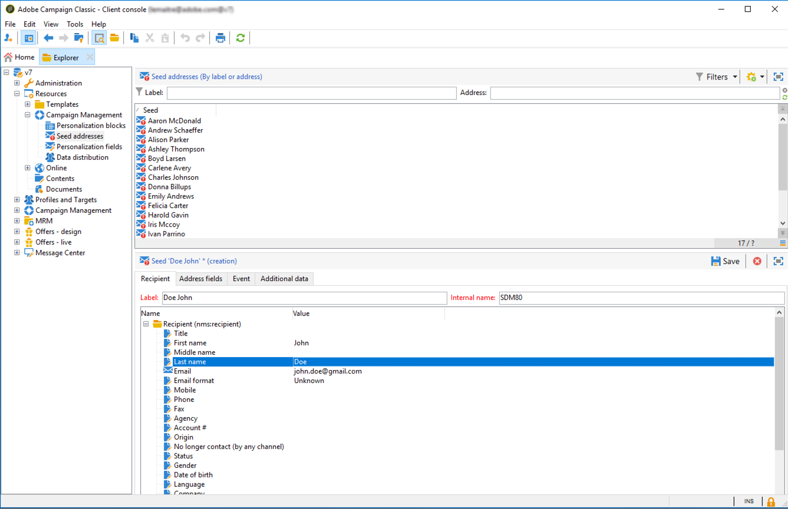

# Criar seed addresses{#creating-seed-addresses}

Os seed addresses não são gerenciados por meio de perfis e públicos-alvo padrão, mas em um nó dedicado da hierarquia do Adobe Campaign **[!UICONTROL Resources > Campaign management > Seed addresses]**.

Você pode criar subpastas para organizar os seed addresses. Para fazer isso, clique com o botão direito do mouse no nó **[!UICONTROL Seed addresses]** e selecione **[!UICONTROL Create a new 'Seed addresses' folder]**. Nomeie a subpasta e pressione **[!UICONTROL Enter]** para validar. Agora você pode criar ou copiar seed addresses para esta subpasta. Para obter mais informações, consulte [Definir endereços](#defining-addresses).

O Adobe Campaign também permite criar modelos de seed addresses que são importados para entregas ou campanhas e adaptados com base nas necessidades específicas das entregas e campanhas relacionadas. Consulte [Criar modelos de seed address](#creating-seed-address-templates).

## Definir endereços {#defining-addresses}

Para criar seed addresses, siga as etapas abaixo:

1. Clique no botão **[!UICONTROL New]** acima da lista de seed addresses.
1. Insira os dados vinculados ao endereço nos campos correspondentes da guia **[!UICONTROL Recipient]**. Os campos disponíveis correspondem aos campos padrão nos perfis dos recipients da entrega (tabela nms:recipient): sobrenome, nome, email, etc.

   >[!NOTE]
   >
   >O rótulo do endereço é preenchido automaticamente com o sobrenome e o nome que você definiu.
   >
   >Não é necessário inserir todos os campos de cada guia ao criar um seed address. Os elementos de personalização ausentes são inseridos aleatoriamente durante a análise de entrega.

   

1. Na guia **[!UICONTROL Address fields]**, insira os valores que serão inseridos nos logs de entrega durante a fase de análise (na tabela **[!UICONTROL nms:broadLog]**).

1. Na guia **[!UICONTROL Additional data]**, insira os dados de personalização usados para as entregas criadas nos workflows de gestão de dados, aos quais você deseja atribuir um valor específico.

   >[!NOTE]
   >
   >Verifique se os dados adicionais do público-alvo foram definidos com um pseudônimo iniciado por &#39;@&#39; na atividade **[!UICONTROL Enrichment]**. Caso contrário, você não poderá usá-los corretamente com seus seeds addresses na atividade de entrega.

## Criação de modelos de seed address {#creating-seed-address-templates}

Para criar templates de endereço que serão importados e podem ser modificados para cada entrega, o processo é o mesmo que definir um novo seed address. A única diferença é que os templates de seed address devem ser armazenados em uma pasta do tipo &#39;template&#39;.

Para definir uma pasta de template, siga o seguinte processo:

1. Crie uma nova pasta do tipo **[!UICONTROL Seed addresses]**, clique com o botão direito do mouse na pasta e selecione **[!UICONTROL Properties...]**.

   

1. Clique na guia **[!UICONTROL Restriction]** e adicione a seguinte condição de filtragem: **@isModel = true**.

   

   Os endereços armazenados nesta pasta agora podem ser usados como modelos de endereço. Você pode importá-los para entregas ou campanhas e adaptá-los com base nas necessidades específicas de entregas e campanhas relacionadas (consulte[Adicionar seed addresses](adding-seed-addresses.md)).
