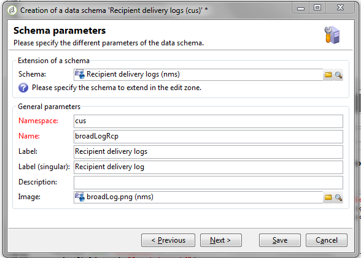
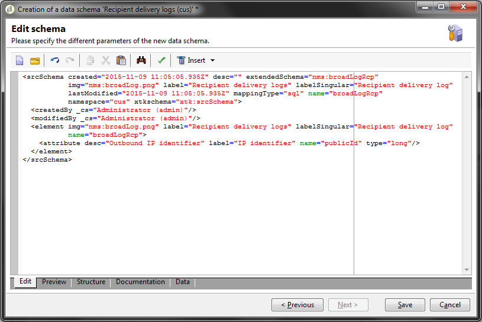
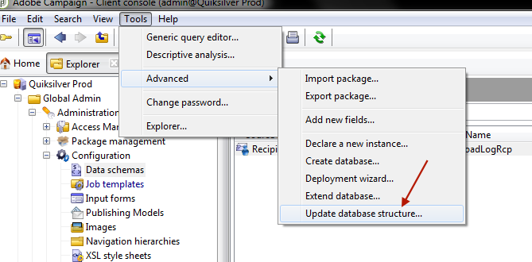
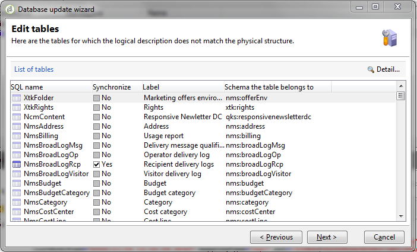
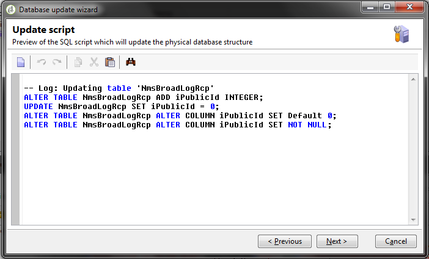
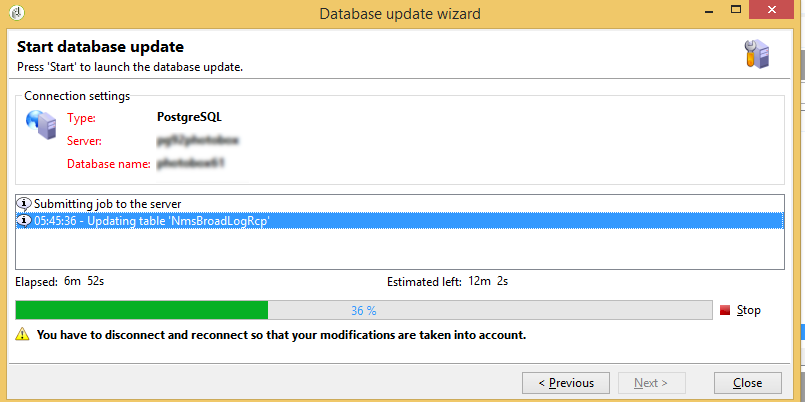
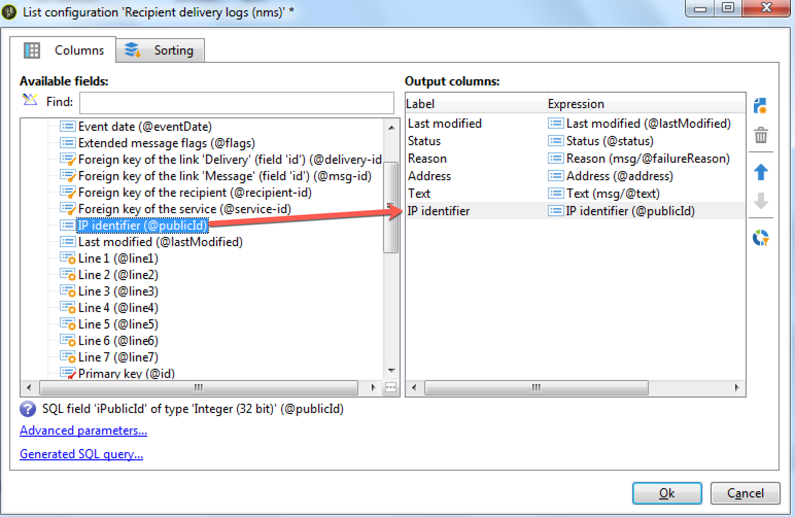
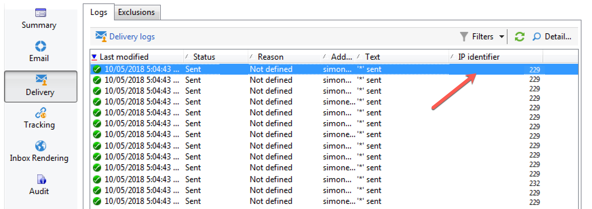

# Avançado: logs de entrega personalizados {#customize-delivery-logs}

>[!NOTE]
>
>Orientações abrangentes sobre como acessar a lista de entrega e usar o painel de entrega estão documentadas na [documentação do Campaign v8](https://experienceleague.adobe.com/pt-br/docs/campaign/campaign-v8/send/monitor/delivery-dashboard). Esse conteúdo se aplica aos usuários do Campaign Classic v7 e do Campaign v8.
>
>Esta página documenta as **personalizações avançadas específicas do Campaign Classic v7** para implantações híbridas e locais.

Para monitorar entregas na interface do Campaign, consulte a [documentação do Campaign v8 sobre como monitorar entregas na interface do Campaign](https://experienceleague.adobe.com/pt-br/docs/campaign/campaign-v8/send/monitor/delivery-dashboard){target="_blank"}.

## Personalizar logs do delivery {#use-case}

Para **implantações híbridas/no local do Campaign Classic v7**, você pode personalizar logs do delivery estendendo esquemas. Esta seção mostra como adicionar endereços IP dos remetentes aos logs do delivery.

>[!NOTE]
>
>Essa personalização requer recursos de extensão de esquema disponíveis em implantações locais. Os usuários do Campaign v8 Managed Cloud Services devem entrar em contato com o Atendimento ao cliente da Adobe para obter campos de log de entrega personalizados.
>
>Essa modificação é diferente se você estiver usando uma única instância ou instância mid-sourcing. Antes de fazer a modificação, verifique se você está conectado à instância de envio de email.

### Etapa 1: Estender o esquema

Para adicionar **publicID** em seus logs da entrega, primeiro é necessário estender o esquema. Você pode continuar conforme os passos a seguir.

1. Crie uma extensão de esquema, em **[!UICONTROL Administration]** > **[!UICONTROL Configuration]** > **[!UICONTROL Data Schemas]** > **[!UICONTROL New]**.

   Para obter mais informações sobre extensões de esquema, consulte [esta página](../../configuration/using/extending-a-schema.md).

1. Selecione **[!UICONTROL broadLogRcp]** para estender os logs da entrega do destinatário (nms) e definir um namespace personalizado. Neste caso, será &quot;cus&quot;:

   

   >[!NOTE]
   >
   >Se sua instância estiver no Mid-sourcing, você precisará trabalhar com o esquema broadLogMid.

1. Adicione o novo campo na sua extensão. Nessa amostra, é necessário substituir:

   ```
   <element img="nms:broadLog.png" label="Recipient delivery logs" labelSingular="Recipient delivery log" name="broadLogRcp"/>
   ```

   por:

   ```
   <element img="nms:broadLog.png" label="Recipient delivery logs" labelSingular="Recipient delivery log" name="broadLogRcp">
   <attribute desc="Outbound IP identifier" label="IP identifier"
   name="publicId" type="long"/>
   </element>
   ```

   

### Etapa 2: atualizar estrutura do banco de dados

Quando as modificações forem feitas, será necessário atualizar a estrutura do banco de dados para que ela esteja alinhada à descrição lógica.

Para fazer isso, siga as etapas abaixo:

1. Clique no menu **[!UICONTROL Tools]** > **[!UICONTROL Advanced]** > **[!UICONTROL Update database structure...]**.

   

1. Na janela **[!UICONTROL Edit tables]**, a tabela **[!UICONTROL NmsBroadLogRcp]** está marcada (ou a tabela **[!UICONTROL broadLogMid]** se estiver em um ambiente Mid-sourcing), como abaixo:

   

   >[!IMPORTANT]
   >
   >Verifique sempre se não há outra modificação, exceto a tabela **[!UICONTROL NmsBroadLoGRcp]** (ou a tabela **[!UICONTROL broadLogMid]** se estiver em um ambiente Mid-sourcing). Em caso afirmativo, desmarque as outras tabelas.

1. Clique em **[!UICONTROL Next]** para validar. A seguinte tela é exibida:

   

1. Clique em **[!UICONTROL Next]** e em **[!UICONTROL Start]** para iniciar a atualização da estrutura do banco de dados. A construção de índice está iniciando. Essa etapa pode ser longa, dependendo do número de linhas na tabela **[!UICONTROL NmsBroadLogRcp]**.

   

>[!NOTE]
>
>Depois que a atualização da estrutura física do banco de dados for concluída com êxito, você precisará desconectar e reconectar para que suas modificações sejam consideradas.

### Etapa 3: validar a modificação

Para confirmar se tudo funcionou corretamente, é necessário atualizar a tela de logs da entrega.

Para fazer isso, acesse os logs da entrega e adicione a coluna &quot;Identificador IP&quot;.



>[!NOTE]
>
>Para saber como configurar listas na interface do Campaign Classic, consulte [esta página](../../platform/using/adobe-campaign-workspace.md).

Abaixo está o que você deve ver na guia **[!UICONTROL Delivery]** após as modificações:



## Tópicos relacionados

* [Monitorar entregas na interface do Campaign](https://experienceleague.adobe.com/pt-br/docs/campaign/campaign-v8/send/monitor/delivery-dashboard){target="_blank"} (documentação do Campaign v8)
* [Status de entrega](https://experienceleague.adobe.com/pt-br/docs/campaign/campaign-v8/send/monitor/delivery-statuses){target="_blank"} (documentação do Campaign v8)
* [Noções básicas sobre falhas de entrega](https://experienceleague.adobe.com/pt-br/docs/campaign/campaign-v8/send/monitor/delivery-failures){target="_blank"} (documentação do Campaign v8)
* [Gerenciamento de quarentena](https://experienceleague.adobe.com/pt-br/docs/campaign/campaign-v8/send/monitor/quarantines){target="_blank"} (documentação do Campaign v8)
* [Extensão de um esquema](../../configuration/using/extending-a-schema.md) (v7 híbrido/no local)

