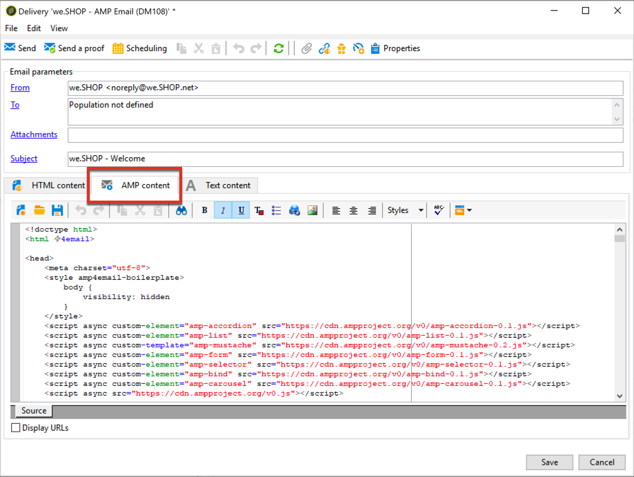

# Definição de conteúdo interativo{#defining-interactive-content}

O Adobe Campaign permite que você experimente o novo [AMP interativo para o formato de email](https://amp.dev/about/email/) , que permite o envio de emails dinâmicos, sob determinadas condições.

>[!CAUTION]
>
>* Esse recurso é beta no Adobe Campaign.
>* AMP for Email é um novo formato de código aberto que permite aos desenvolvedores criar emails dinâmicos e interativos. Atualmente, ele é suportado por dois provedores de email: Gmail e Outlook.
>
>
Consequentemente, você só pode:
>* Teste a entrega de emails AMP para endereços Gmail ou Outlook específicos configurados adequadamente.
>* Entregue emails AMP para qualquer endereço de Gmail depois de se registrar no Google e em qualquer endereço do Outlook depois de se registrar na Microsoft.
>
>
Consulte [Direcionando um email](#targeting-amp-email)AMP.

Esse recurso está disponível por meio de um pacote dedicado no Adobe Campaign. Para usá-lo, este pacote deve ser instalado. Depois de concluído, reinicie o servidor para que o pacote seja considerado.

Para arquiteturas híbridas e hospedadas, o pacote precisa ser instalado em todos os servidores, incluindo o servidor [de](../../installation/using/mid-sourcing-server.md) mid-sourcing e a instância [de](../../message-center/using/creating-a-shared-connection.md#execution-instance)execução. Entre em contato com o executivo da sua conta.

Assista a este [vídeo](https://docs.adobe.com/content/help/en/campaign-learn/campaign-classic-tutorials/sending-messages/email-channel/defining-interactive-email-content-with-amp.html) para ver como ativar a AMP no Adobe Campaign e saber mais sobre o uso.

## Sobre o AMP para email {#about-amp-for-email}

O novo formato **AMP for Email** permite incluir componentes AMP em mensagens para aprimorar a experiência de email com conteúdo rico e acionável. Com a funcionalidade moderna do aplicativo disponível diretamente nos e-mails, os destinatários podem interagir dinamicamente com o conteúdo na própria mensagem.

Por exemplo:
* Os emails escritos com AMP podem conter elementos interativos, como carrosséis de imagens.
* O conteúdo permanece atualizado na mensagem.
* Os destinatários podem executar ações como responder a um formulário sem sair da caixa de entrada.

O AMP for Email é compatível com e-mails existentes. A versão AMP da mensagem é incorporada ao email como uma nova parte MIME, além do HTML e/ou texto simples, garantindo compatibilidade entre todos os clientes de email.

Para obter mais informações sobre o formato, a especificação e os requisitos do AMP para email, consulte a documentação [do desenvolvedor da](https://amp.dev/documentation/guides-and-tutorials/learn/email-spec/amp-email-format/?format=email)AMP.

## Etapas principais para usar o AMP para email com o Adobe Campaign {#key-steps-to-use-amp}

Para testar e enviar um email AMP com o Adobe Campaign, siga as etapas abaixo:
1. Instale o **[!UICONTROL AMP support (Beta)]** pacote. Consulte [Instalação de pacotes](../../installation/using/installing-campaign-standard-packages.md)padrão do Campaign.
1. Crie um email e crie seu conteúdo AMP no Adobe Campaign. Consulte [Criar conteúdo de email AMP com o Adobe Campaign](#build-amp-email-content).
1. Siga todos os requisitos de entrega dos provedores de e-mail que suportam o formato AMP.

   >[!NOTE]
   >
   >O AMP for Email está disponível como um recurso beta para fins de teste. Atualmente, apenas dois provedores de e-mail suportam o teste deste formato (Gmail e Outlook).

   Consulte [AMP para obter os requisitos](#amp-for-email-delivery-requirements)de entrega por email.

1. Ao definir sua meta, selecione os destinatários que poderão exibir o formato AMP.

   >[!NOTE]
   >
   >Atualmente, você só pode testar a entrega de emails AMP para endereços de email específicos configurados adequadamente ou após o registro nos provedores de email que participam do programa beta AMP.

   Consulte [Direcionando um email](#targeting-amp-email)AMP.

1. Envie seu e-mail como normalmente faria. Consulte [Envio de um email](#sending-amp-email)AMP.

## Criação de conteúdo de email AMP no Adobe Campaign {#build-amp-email-content}

Para criar um email usando o formato AMP, siga as etapas abaixo.

>[!CAUTION]
>
>Certifique-se de seguir a AMP para obter os requisitos e especificações de e-mail detalhados na documentação [do desenvolvedor da](https://amp.dev/documentation/guides-and-tutorials/learn/email_fundamentals/?format=email)AMP. Você também pode consultar a [AMP para obter as práticas](https://amp.dev/documentation/guides-and-tutorials/develop/amp_email_best_practices/?format=email)recomendadas por email.

1. Ao criar sua entrega de email, selecione qualquer modelo.

   >[!NOTE]
   >
   >Um modelo AMP específico contém um exemplo das principais capacidades que você pode usar: lista de produtos, carrossel, aceitação dupla, pesquisa e solicitação de servidor avançada.

1.  Clique na **[!UICONTROL AMP content]** guia.

   

1. Edite o conteúdo AMP de acordo com suas necessidades.

   >[!NOTE]
   >
   >Para obter mais informações sobre como criar seu primeiro email AMP, consulte a documentação [do desenvolvedor da](https://amp.dev/documentation/guides-and-tutorials/start/create_email/?format=email)AMP.

   Por exemplo, você pode usar o componente de lista de produtos do modelo AMP e manter uma lista de produtos de um sistema de terceiros ou mesmo dentro do Adobe Campaign. Sempre que você ajustar um preço ou outro elemento, ele será refletido automaticamente quando o destinatário abrir novamente o email de sua caixa de correio.

1. Personalize seu conteúdo AMP conforme necessário, como faria com o formato HTML no Adobe Campaign, com campos de personalização e blocos de personalização.

   

1. Depois de concluído com a edição, selecione todo o conteúdo AMP e copie-o no validador [baseado na Web da](https://validator.ampproject.org) AMP ou em um site semelhante.

   >[!NOTE]
   >
   >Selecione **AMP4 EMAIL** na lista suspensa na parte superior da tela.

   

   Quaisquer erros serão sinalizados em linha.

   >[!NOTE]
   >
   >O editor do Adobe Campaign AMP não foi projetado para validação de conteúdo. Use um site externo, como o validador [baseado na Web da](https://validator.ampproject.org) AMP, para verificar se o conteúdo está correto.

1. Faça as alterações necessárias até que o conteúdo AMP passe na validação.

   

1. Copie e cole o conteúdo validado no [AMP Playground](https://playground.amp.dev) ou em um site semelhante para visualizar o conteúdo.

   >[!NOTE]
   >
   >Selecione **AMP para email** na lista suspensa na parte superior da tela.

   

   >[!NOTE]
   >
   >Não é possível visualizar o conteúdo AMP diretamente no Adobe Campaign. Use um site externo, como o [AMP Playground](https://playground.amp.dev).

1. Retorne ao Adobe Campaign e copie e cole seu conteúdo validado na **[!UICONTROL AMP content]** guia.

1. Alterne para a guia **[!UICONTROL HTML content]** ou **[!UICONTROL Text content]** e defina o conteúdo para pelo menos um desses dois formatos.

   >[!CAUTION]
   >
   >Se o seu email não contiver um HTML ou uma versão de texto sem formatação além do conteúdo AMP, ele não poderá ser enviado.

## AMP para requisitos de entrega de email {#amp-for-email-delivery-requirements}

Ao criar seu conteúdo AMP no Adobe Campaign, você deve atender às condições para que um email dinâmico seja entregue, que são específicas aos provedores de email dos destinatários.

Atualmente, dois provedores de e-mail suportam o teste deste formato: Gmail e Outlook.

Todas as etapas e especificações necessárias para testar a entrega com o formato AMP em contas Gmail estão detalhadas na documentação [do desenvolvedor do](https://developers.google.com/gmail/ampemail?) Gmail e na documentação [do desenvolvedor do](https://docs.microsoft.com/en-gb/outlook/amphtml/)Outlook.

Devem, nomeadamente, ser cumpridos os seguintes requisitos:
* Siga os requisitos de segurança da AMP específicos ao [Gmail](https://developers.google.com/gmail/ampemail/security-requirements) e ao [Outlook](https://docs.microsoft.com/en-gb/outlook/amphtml/security-requirements).
* A peça AMP MIME deve conter um documento [AMP](https://amp.dev/documentation/guides-and-tutorials/learn/validation-workflow/validate_emails/?format=email)válido.
* A peça AMP MIME deve ser menor que 100KB.

Você também pode consultar as [Dicas e as limitações conhecidas do Gmail](https://developers.google.com/gmail/ampemail/tips) e as práticas recomendadas da [AMP para o Outlook](https://docs.microsoft.com/en-gb/outlook/amphtml/best-practices).

## Direcionando um email AMP {#targeting-amp-email}

O AMP for Email está disponível como um recurso beta, no momento você pode experimentar o envio de um email AMP em duas etapas:

1. O Adobe Campaign permite que você teste a entrega de um email dinâmico alimentado pela AMP para endereços de email selecionados adequadamente configurados, a fim de verificar seu conteúdo e comportamento. Consulte [Testar entrega de email AMP para endereços](#testing-amp-delivery-for-selected-addresses)selecionados.
1. Depois de testado, você pode enviar uma entrega ou uma campanha como parte do programa AMP for Email beta registrando-se com os provedores de e-mail relevantes para que o domínio do remetente seja incluído na lista de permissões. Consulte [Entrega de emails AMP através de registro em um provedor](#delivering-amp-emails-by-registering)de email.

### Teste da entrega de email AMP para endereços selecionados {#testing-amp-delivery-for-selected-addresses}

Você pode testar o envio de mensagens dinâmicas do Adobe Campaign para endereços de email selecionados.

>[!NOTE]
>
>Atualmente, apenas o Gmail e o Outlook suportam testes no formato AMP.

Antes de fazer isso, você deve adicionar os endereços do remetente à lista de permissão que está usando para entregar do Adobe Campaign para as contas do Gmail e do Outlook que está direcionando.

Para fazer isso:
1. Verifique se a opção que permite o email dinâmico está marcada para os provedores de email relevantes.
1. Copie o endereço do remetente exibido no campo da entrega **[!UICONTROL From]** e cole-o na seção apropriada das configurações da conta do provedor de email.

Para obter mais detalhes, consulte a documentação [do desenvolvedor do](https://developers.google.com/gmail/ampemail/testing-dynamic-email) Gmail e a documentação [do desenvolvedor do](https://docs.microsoft.com/en-gb/outlook/amphtml/register-outlook#individual-mailbox-registration)Outlook.

### Entregar emails AMP através de registro em um provedor de email {#delivering-amp-emails-by-registering}

Você pode experimentar a entrega de emails dinâmicos se registrando com os provedores de email que participam do programa beta AMP para que o domínio do remetente seja incluído na lista de permissões.

>[!NOTE]
>
>Atualmente, apenas o Gmail e o Outlook oferecem suporte ao formato AMP.

Depois de testado com alguns endereços, você pode enviar emails AMP para qualquer endereço do Gmail ou Outlook. Para fazer isso, você deve se registrar respeitosamente no Google ou na Microsoft e aguardar a resposta deles.

Siga as etapas apresentadas na documentação [do desenvolvedor do](https://developers.google.com/gmail/ampemail/register) Gmail e na documentação [do desenvolvedor do](https://docs.microsoft.com/en-gb/outlook/amphtml/register-outlook#global-registration)Outlook. Após o registro bem-sucedido, você se torna um remetente autorizado.

## Envio de um email AMP {#sending-amp-email}

Quando o conteúdo e o fallback da AMP estiverem prontos e você definir um destino compatível, poderá enviar o email como faria normalmente.

Atualmente, somente o Gmail e o Outlook oferecem suporte ao formato AMP, sob determinadas condições. Você pode direcionar endereços de outros provedores de e-mail, mas eles receberão a versão HTML ou texto simples do seu e-mail.

>[!NOTE]
>
>Se o seu email não contiver um HTML ou uma versão de texto sem formatação além do conteúdo AMP, ele não poderá ser enviado.

Os destinatários correspondentes terão a versão AMP do email exibida em sua caixa de correio.

Por exemplo, se você incluiu uma lista de produtos em seu email, ao editar os preços em um sistema de terceiros, os preços serão automaticamente ajustados sempre que seus destinatários abrirem o email novamente em sua caixa de correio.

>[!NOTE]
>
>Você pode criar uma regra de processamento de email para impedir que domínios específicos recebam emails AMP. Consulte [Gerenciamento de formatos](../../installation/using/email-deliverability.md#managing-email-formats)de email.
>
>Por padrão, a **[!UICONTROL AMP inclusion]** opção está definida como **[!UICONTROL No]**.
