<?xml version="1.0" encoding="UTF-8"?>
<xliff xmlns="urn:oasis:names:tc:xliff:document:1.2" xmlns:okp="okapi-framework:xliff-extensions" xmlns:its="http://www.w3.org/2005/11/its" xmlns:itsxlf="http://www.w3.org/ns/its-xliff/" version="1.2" its:version="2.0">
<file original="help/delivery/using/defining-the-email-content.md.mdnouisc" source-language="en-US" target-language="en-XX" datatype="x-text/markdown">
<body>
<trans-unit id="tu33" xml:space="preserve">
<source xml:lang="en-US">https://experienceleague.adobe.com/en/docs/control-panel/using/instances-settings/url-permissions</source>
<target xml:lang="en-XX">https://experienceleague.adobe.com/pt-br/docs/control-panel/using/instances-settings/url-permissions</target>
</trans-unit>
<trans-unit id="tu59" xml:space="preserve">
<source xml:lang="en-US">https://amp.dev/about/email/</source>
<target xml:lang="en-XX">https://amp.dev/pt_br/about/email/</target>
</trans-unit>
<trans-unit id="tu61" xml:space="preserve">
<source xml:lang="en-US">https://experienceleague.adobe.com/docs/campaign/campaign-v8/send/emails/defining-interactive-content.html</source>
<target xml:lang="en-XX">https://experienceleague.adobe.com/docs/campaign/campaign-v8/send/emails/defining-interactive-content.html?lang=pt-BR</target>
</trans-unit>
<trans-unit id="tu1" restype="x-YAML_METADATA_HEADER_VALUE" xml:space="preserve">
<source xml:lang="en-US">Define the email content in Adobe Campaign Classic</source>
<target xml:lang="en-XX">Definir o conteúdo de email no Adobe Campaign Classic</target>
</trans-unit>
<trans-unit id="tu2" restype="x-YAML_METADATA_HEADER_VALUE" xml:space="preserve">
<source xml:lang="en-US">Learn how to define the email content when using Adobe Campaign</source>
<target xml:lang="en-XX">Saiba como definir o conteúdo de email ao usar o Adobe Campaign</target>
</trans-unit>
<trans-unit id="tu3" xml:space="preserve">
<source xml:lang="en-US">Also applies to v8</source>
<target xml:lang="en-XX">Também se aplica ao v8</target>
</trans-unit>
<trans-unit id="tu4" xml:space="preserve">
<source xml:lang="en-US">Also applies to Campaign v8</source>
<target xml:lang="en-XX">Também se aplica ao Campaign v8</target>
</trans-unit>
<trans-unit id="tu5" xml:space="preserve">
<source xml:lang="en-US">Define the email content</source>
<target xml:lang="en-XX">Definir o conteúdo do email</target>
</trans-unit>
<trans-unit id="tu6" xml:space="preserve">
<source xml:lang="en-US">Sender</source>
<target xml:lang="en-XX">Remetente</target>
</trans-unit>
<trans-unit id="tu7" xml:space="preserve">
<source xml:lang="en-US">To define the name and address of the sender which will appear in the header of messages sent, click the <ph id="1" ctype="x-STRONG_EMPHASIS">**[!UICONTROL From]**</ph> link.</source>
<target xml:lang="en-XX">Para definir o nome e o endereço do remetente que aparecerá no cabeçalho das mensagens enviadas, clique no link <ph id="1" ctype="x-STRONG_EMPHASIS">**[!UICONTROL From]**</ph>.</target>
</trans-unit>
<trans-unit id="tu8" xml:space="preserve">
<source xml:lang="en-US"><ph id="1" ctype="x-IMAGE"></ph></source>
<target xml:lang="en-XX"><ph id="1" ctype="x-IMAGE"></ph></target>
</trans-unit>
<trans-unit id="tu9" xml:space="preserve">
<source xml:lang="en-US">This window lets you enter all the information required to create the email message headers. This information can be personalized. To do this, use the buttons to the right of the input fields to insert personalization fields.</source>
<target xml:lang="en-XX">Todas as informações necessárias para criação dos cabeçalhos de mensagens de email devem ser inseridas nessa janela. Essas informações podem ser personalizadas. Para fazer isso, use os botões à direita dos campos de entrada para inserir campos de personalização.</target>
</trans-unit>
<trans-unit id="tu10" xml:space="preserve">
<source xml:lang="en-US">To find out how to insert and use personalization fields, refer to <ph id="1" ctype="x-LINK">[</ph>About personalization<ph id="2" ctype="x-LINK">](about-personalization.md)</ph> section.</source>
<target xml:lang="en-XX">Para saber como inserir e usar campos de personalização, consulte a seção <ph id="1" ctype="x-LINK">[</ph>Sobre personalização<ph id="2" ctype="x-LINK">](about-personalization.md)</ph>.</target>
</trans-unit>
<trans-unit id="tu11" xml:space="preserve">
<source xml:lang="en-US"><ph id="1" ctype="x-regxph" equiv-text="&lbrack;!NOTE">[!NOTE]</ph></source>
<target xml:lang="en-XX"><ph id="1" ctype="x-regxph" equiv-text="&lbrack;!NOTE">[!NOTE]</ph></target>
</trans-unit>
<trans-unit id="tu12" xml:space="preserve">
<source xml:lang="en-US">The sender's address is used for replies by default.</source>
<target xml:lang="en-XX">O endereço do remetente é usado para respostas por padrão.</target>
</trans-unit>
<trans-unit id="tu13" xml:space="preserve">
<source xml:lang="en-US">The header parameters must not be empty. By default, they contain the values input when configuring the deployment wizard. Learn more in <ph id="1" ctype="x-LINK">[</ph>this section<ph id="2" ctype="x-LINK">](../../installation/using/deploying-an-instance.md)</ph>.</source>
<target xml:lang="en-XX">Os parâmetros do cabeçalho não devem ficar vazios. Por padrão, eles contêm a entrada de valores ao configurar o assistente de implantação. Saiba mais <ph id="1" ctype="x-LINK">[</ph>nesta seção<ph id="2" ctype="x-LINK">](../../installation/using/deploying-an-instance.md)</ph>.</target>
</trans-unit>
<trans-unit id="tu14" xml:space="preserve">
<source xml:lang="en-US">The sender's address is mandatory to allow an email to be sent (RFC standard).</source>
<target xml:lang="en-XX">O endereço do remetente é obrigatório para possibilitar o envio de um email (padrão RFC).</target>
</trans-unit>
<trans-unit id="tu15" xml:space="preserve">
<source xml:lang="en-US">Adobe Campaign checks the syntax of email addresses entered.</source>
<target xml:lang="en-XX">O Adobe Campaign verifica a sintaxe dos endereços de email inseridos.</target>
</trans-unit>
<trans-unit id="tu16" xml:space="preserve">
<source xml:lang="en-US"><ph id="1" ctype="x-regxph" equiv-text="&lbrack;!CAUTION">[!CAUTION]</ph></source>
<target xml:lang="en-XX"><ph id="1" ctype="x-regxph" equiv-text="&lbrack;!CAUTION">[!CAUTION]</ph></target>
</trans-unit>
<trans-unit id="tu17" xml:space="preserve">
<source xml:lang="en-US">To avoid deliverability issues, the email accounts that correspond to the addresses specified for deliveries and replies must exist and must be monitored. Check with your system administrator.</source>
<target xml:lang="en-XX">Para evitar problemas da capacidade de entrega, as contas de email que correspondem aos endereços especificados para entregas e respostas devem existir e precisam ser monitoradas. Verifique com o administrador do sistema.</target>
</trans-unit>
<trans-unit id="tu18" xml:space="preserve">
<source xml:lang="en-US">Message subject</source>
<target xml:lang="en-XX">Assunto da mensagem</target>
</trans-unit>
<trans-unit id="tu19" xml:space="preserve">
<source xml:lang="en-US">The subject of the message is configured in the corresponding field. You can enter it directly in the field or click the <ph id="1" ctype="x-STRONG_EMPHASIS">**[!UICONTROL Subject]**</ph> link to enter a script. The personalization link lets you insert database fields in the subject.</source>
<target xml:lang="en-XX">O assunto da mensagem é configurado no campo correspondente. Você pode inseri-lo diretamente no campo ou clicar no link <ph id="1" ctype="x-STRONG_EMPHASIS">**[!UICONTROL Subject]**</ph> para inserir um script. O link de personalização permite inserir campos de banco de dados no assunto.</target>
</trans-unit>
<trans-unit id="tu20" xml:space="preserve">
<source xml:lang="en-US"><ph id="1" ctype="x-regxph" equiv-text="&lbrack;!IMPORTANT">[!IMPORTANT]</ph></source>
<target xml:lang="en-XX"><ph id="1" ctype="x-regxph" equiv-text="&lbrack;!IMPORTANT">[!IMPORTANT]</ph></target>
</trans-unit>
<trans-unit id="tu21" xml:space="preserve">
<source xml:lang="en-US">The message subject is mandatory.</source>
<target xml:lang="en-XX">O assunto da mensagem é obrigatório.</target>
</trans-unit>
<trans-unit id="tu22" xml:space="preserve">
<source xml:lang="en-US"><ph id="1" ctype="x-IMAGE">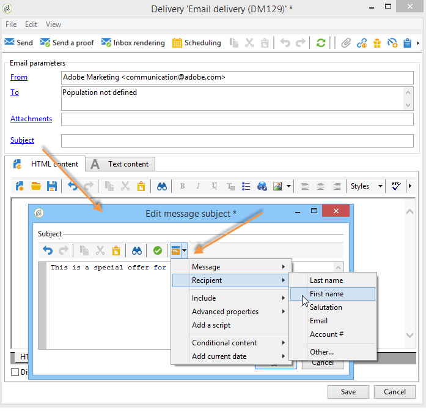</ph></source>
<target xml:lang="en-XX"><ph id="1" ctype="x-IMAGE"></ph></target>
</trans-unit>
<trans-unit id="tu23" xml:space="preserve">
<source xml:lang="en-US">The field content will be replaced by the value in the recipient profile when the message is sent.</source>
<target xml:lang="en-XX">O conteúdo do campo será substituído pelo valor no perfil do destinatário quando a mensagem for enviada.</target>
</trans-unit>
<trans-unit id="tu24" xml:space="preserve">
<source xml:lang="en-US">For example, in the message above, the subject of the message is personalized for each recipient with data from their profile.</source>
<target xml:lang="en-XX">Por exemplo, na mensagem acima, o assunto da mensagem é personalizado para cada destinatário com dados do seu perfil.</target>
</trans-unit>
<trans-unit id="tu25" xml:space="preserve">
<source xml:lang="en-US"><ph id="1" ctype="x-regxph" equiv-text="&lbrack;!NOTE">[!NOTE]</ph></source>
<target xml:lang="en-XX"><ph id="1" ctype="x-regxph" equiv-text="&lbrack;!NOTE">[!NOTE]</ph></target>
</trans-unit>
<trans-unit id="tu26" xml:space="preserve">
<source xml:lang="en-US">The use of personalization fields is presented in <ph id="1" ctype="x-LINK">[</ph>About personalization<ph id="2" ctype="x-LINK">](about-personalization.md)</ph>.</source>
<target xml:lang="en-XX">O uso de campos de personalização é apresentado em <ph id="1" ctype="x-LINK">[</ph>Sobre personalização<ph id="2" ctype="x-LINK">](about-personalization.md)</ph>.</target>
</trans-unit>
<trans-unit id="tu27" xml:space="preserve">
<source xml:lang="en-US">You can also insert emoticons to your subject line with the <ph id="1" ctype="x-STRONG_EMPHASIS">**[!UICONTROL Insert emoticon]**</ph> pop-up window.</source>
<target xml:lang="en-XX">Também é possível inserir emoticons na linha do assunto com a janela pop-up <ph id="1" ctype="x-STRONG_EMPHASIS">**[!UICONTROL Insert emoticon]**</ph>.</target>
</trans-unit>
<trans-unit id="tu28" xml:space="preserve">
<source xml:lang="en-US">Message content</source>
<target xml:lang="en-XX">Conteúdo da mensagem</target>
</trans-unit>
<trans-unit id="tu29" xml:space="preserve">
<source xml:lang="en-US"><ph id="1" ctype="x-regxph" equiv-text="&lbrack;!IMPORTANT">[!IMPORTANT]</ph></source>
<target xml:lang="en-XX"><ph id="1" ctype="x-regxph" equiv-text="&lbrack;!IMPORTANT">[!IMPORTANT]</ph></target>
</trans-unit>
<trans-unit id="tu30" xml:space="preserve">
<source xml:lang="en-US">For privacy reasons, we recommend using HTTPS for all external resources.</source>
<target xml:lang="en-XX">Por motivos de privacidade, recomendamos usar HTTPS para todos os recursos externos.</target>
</trans-unit>
<trans-unit id="tu31" xml:space="preserve">
<source xml:lang="en-US"><ph id="1" ctype="x-regxph" equiv-text="&lbrack;!IMPORTANT">[!IMPORTANT]</ph></source>
<target xml:lang="en-XX"><ph id="1" ctype="x-regxph" equiv-text="&lbrack;!IMPORTANT">[!IMPORTANT]</ph></target>
</trans-unit>
<trans-unit id="tu32" xml:space="preserve">
<source xml:lang="en-US">Release 7.4.4 (build 9401) includes an update to the external URL allow list. Make sure the domains used in your message content are added to your instance's approved allow list so that resources continue to load without interruption. As a Campaign Administrator, use the Control Panel to add and manage allow-listed URLs. See <ph id="1" ctype="x-LINK">&lbrack;</ph>Add URL permissions<ph id="2" ctype="x-LINK">[#$tu33]{target="_blank"}</ph> for steps.</source>
<target xml:lang="en-XX">A versão 7.4.4 (build 9401) inclui uma atualização da lista de permissões de URL externo. Verifique se os domínios usados no conteúdo da mensagem foram adicionados à lista de permissões aprovada da instância para que os recursos continuem sendo carregados sem interrupção. Como administrador do Campaign, use o Painel de controle para adicionar e gerenciar URLs incluídos na lista de permissões. Consulte <ph id="1" ctype="x-LINK">&lbrack;</ph>Adicionar permissões de URL<ph id="2" ctype="x-LINK">[#$tu33]{target="_blank"}</ph> para ver as etapas.</target>
</trans-unit>
<trans-unit id="tu34" xml:space="preserve">
<source xml:lang="en-US">The content of the message is defined in the lower section of the delivery configuration window.</source>
<target xml:lang="en-XX">O conteúdo da mensagem é definido na seção inferior da janela de configuração de entrega.</target>
</trans-unit>
<trans-unit id="tu35" xml:space="preserve">
<source xml:lang="en-US">Messages are sent in HTML or text format by default, according to recipient preference. We recommend creating content in both formats to ensure that messages can be correctly displayed in any mail system. For more on this, refer to <ph id="1" ctype="x-LINK">[</ph>Selecting message formats<ph id="2" ctype="x-LINK">](email-parameters.md#selecting-message-formats)</ph>.</source>
<target xml:lang="en-XX">As mensagens são enviadas em formato de texto ou HTML por padrão, de acordo com a preferência do destinatário. Recomendamos a criação de conteúdo nos dois formatos para garantir que as mensagens possam ser exibidas corretamente em qualquer sistema de email. Para obter mais informações, consulte <ph id="1" ctype="x-LINK">[</ph>Seleção de formatos de mensagem<ph id="2" ctype="x-LINK">](email-parameters.md#selecting-message-formats)</ph>.</target>
</trans-unit>
<trans-unit id="tu36" xml:space="preserve">
<source xml:lang="en-US">To import an HTML content, use the <ph id="1" ctype="x-STRONG_EMPHASIS">**[!UICONTROL Open]**</ph> button. You can also paste the source code directly into the <ph id="4" ctype="x-STRONG_EMPHASIS">**[!UICONTROL Source]**</ph> sub-tab.</source>
<target xml:lang="en-XX">Para importar um conteúdo HTML, clique no botão <ph id="1" ctype="x-STRONG_EMPHASIS">**[!UICONTROL Open]**</ph>. Também é possível colar o código-fonte diretamente na subguia <ph id="4" ctype="x-STRONG_EMPHASIS">**[!UICONTROL Source]**</ph>.</target>
</trans-unit>
<trans-unit id="tu37" xml:space="preserve">
<source xml:lang="en-US">If you are using the <ph id="1" ctype="x-LINK">[</ph>Digital Content Editor<ph id="2" ctype="x-LINK">](../../web/using/about-campaign-html-editor.md)</ph> (DCE), refer to <ph id="3" ctype="x-LINK">[</ph>Selecting a content template<ph id="4" ctype="x-LINK">](../../web/using/use-case-creating-an-email-delivery.md#step-3---selecting-a-content)</ph>.</source>
<target xml:lang="en-XX">Se estiver usando o <ph id="1" ctype="x-LINK">[</ph>Editor de Conteúdo Digital<ph id="2" ctype="x-LINK">](../../web/using/about-campaign-html-editor.md)</ph> (DCE), consulte <ph id="3" ctype="x-LINK">[</ph>Seleção de um modelo de conteúdo<ph id="4" ctype="x-LINK">](../../web/using/use-case-creating-an-email-delivery.md#step-3---selecting-a-content)</ph>.</target>
</trans-unit>
<trans-unit id="tu38" xml:space="preserve">
<source xml:lang="en-US"><ph id="1" ctype="x-regxph" equiv-text="&lbrack;!IMPORTANT">[!IMPORTANT]</ph></source>
<target xml:lang="en-XX"><ph id="1" ctype="x-regxph" equiv-text="&lbrack;!IMPORTANT">[!IMPORTANT]</ph></target>
</trans-unit>
<trans-unit id="tu39" xml:space="preserve">
<source xml:lang="en-US">The HTML content must be created beforehand, then imported into Adobe Campaign. The HTML editor is not designed for content creation.</source>
<target xml:lang="en-XX">O conteúdo HTML deve ser criado antes, e depois importado para o Adobe Campaign. O editor de HTML não foi desenvolvido para criação de conteúdo.</target>
</trans-unit>
<trans-unit id="tu40" xml:space="preserve">
<source xml:lang="en-US">The <ph id="1" ctype="x-STRONG_EMPHASIS">**[!UICONTROL Preview]**</ph> sub-tab lets you view the rendering of each content for a recipient. The personalization fields and the conditional elements of content are replaced with the corresponding information for the selected profile.</source>
<target xml:lang="en-XX">A subguia <ph id="1" ctype="x-STRONG_EMPHASIS">**[!UICONTROL Preview]**</ph> permite visualizar a renderização de cada conteúdo para um destinatário. Os campos de personalização e os elementos condicionais do conteúdo são substituídos pelas informações correspondentes para o perfil selecionado.</target>
</trans-unit>
<trans-unit id="tu41" xml:space="preserve">
<source xml:lang="en-US">The toolbar buttons provide access to the standard actions and formatting parameters for the HTML page.</source>
<target xml:lang="en-XX">Os botões da barra de ferramentas fornecem acesso aos parâmetros padrão de ações e formatação da página HTML.</target>
</trans-unit>
<trans-unit id="tu42" xml:space="preserve">
<source xml:lang="en-US"><ph id="1" ctype="x-IMAGE"></ph></source>
<target xml:lang="en-XX"><ph id="1" ctype="x-IMAGE"></ph></target>
</trans-unit>
<trans-unit id="tu43" xml:space="preserve">
<source xml:lang="en-US">You can insert images in messages from a local file or from an image library in Adobe Campaign. To do this, click the <ph id="1" ctype="x-STRONG_EMPHASIS">**[!UICONTROL Image]**</ph> icon and select the appropriate option.</source>
<target xml:lang="en-XX">Você pode inserir imagens em mensagens de um arquivo local ou de uma biblioteca de imagens no Adobe Campaign. Para fazer isso, clique no ícone <ph id="1" ctype="x-STRONG_EMPHASIS">**[!UICONTROL Image]**</ph> e selecione a opção apropriada.</target>
</trans-unit>
<trans-unit id="tu44" xml:space="preserve">
<source xml:lang="en-US"><ph id="1" ctype="x-IMAGE">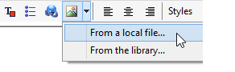</ph></source>
<target xml:lang="en-XX"><ph id="1" ctype="x-IMAGE"></ph></target>
</trans-unit>
<trans-unit id="tu45" xml:space="preserve">
<source xml:lang="en-US">Library images can be accessed via the <ph id="1" ctype="x-STRONG_EMPHASIS">**[!UICONTROL Resources>Online>Public resources]**</ph> folder in the folder tree. Also refer to <ph id="4" ctype="x-LINK">[</ph>Adding images<ph id="5" ctype="x-LINK">](#adding-images)</ph>.</source>
<target xml:lang="en-XX">As imagens da biblioteca podem ser acessadas através da pasta <ph id="1" ctype="x-STRONG_EMPHASIS">**[!UICONTROL Resources>Online>Public resources]**</ph> na árvore de pastas. Consulte também <ph id="4" ctype="x-LINK">[</ph>Adicionar imagens<ph id="5" ctype="x-LINK">](#adding-images)</ph>.</target>
</trans-unit>
<trans-unit id="tu46" xml:space="preserve">
<source xml:lang="en-US">The last button in the toolbar lets you insert personalization fields.</source>
<target xml:lang="en-XX">O último botão na barra de ferramentas permite inserir campos de personalização.</target>
</trans-unit>
<trans-unit id="tu47" xml:space="preserve">
<source xml:lang="en-US"><ph id="1" ctype="x-regxph" equiv-text="&lbrack;!NOTE">[!NOTE]</ph></source>
<target xml:lang="en-XX"><ph id="1" ctype="x-regxph" equiv-text="&lbrack;!NOTE">[!NOTE]</ph></target>
</trans-unit>
<trans-unit id="tu48" xml:space="preserve">
<source xml:lang="en-US">The use of personalization fields is presented in <ph id="1" ctype="x-LINK">[</ph>About personalization<ph id="2" ctype="x-LINK">](about-personalization.md)</ph>.</source>
<target xml:lang="en-XX">O uso de campos de personalização é apresentado em <ph id="1" ctype="x-LINK">[</ph>Sobre personalização<ph id="2" ctype="x-LINK">](about-personalization.md)</ph>.</target>
</trans-unit>
<trans-unit id="tu49" xml:space="preserve">
<source xml:lang="en-US">The tabs at the bottom of the page let you display the HTML code of the page being created and view the rendering of the message with its personalization. To launch this display, click <ph id="1" ctype="x-STRONG_EMPHASIS">**[!UICONTROL Preview]**</ph> and select a recipient using the <ph id="4" ctype="x-STRONG_EMPHASIS">**[!UICONTROL Test personalization]**</ph> button in the toolbar. You can select a recipient from the defined target(s) or choose another recipient.</source>
<target xml:lang="en-XX">As guias na parte inferior da página permitem exibir o código HTML da página que está sendo criada e exibir a renderização da mensagem com sua personalização. Para iniciar essa exibição, clique em <ph id="1" ctype="x-STRONG_EMPHASIS">**[!UICONTROL Preview]**</ph> e selecione um destinatário usando o botão <ph id="4" ctype="x-STRONG_EMPHASIS">**[!UICONTROL Test personalization]**</ph> na barra de ferramentas. Você pode selecionar um destinatário no(s) target(s) definido(s) ou escolher outro.</target>
</trans-unit>
<trans-unit id="tu50" xml:space="preserve">
<source xml:lang="en-US"><ph id="1" ctype="x-IMAGE">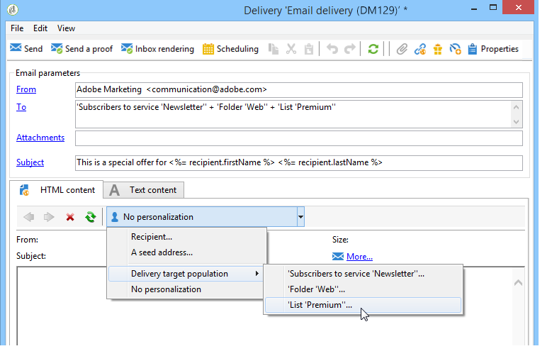</ph></source>
<target xml:lang="en-XX"><ph id="1" ctype="x-IMAGE"></ph></target>
</trans-unit>
<trans-unit id="tu51" xml:space="preserve">
<source xml:lang="en-US">You can validate the HTML message. You can also view the content of the email header.</source>
<target xml:lang="en-XX">Você pode validar a mensagem HTML. Também é possível visualizar o conteúdo do cabeçalho do email.</target>
</trans-unit>
<trans-unit id="tu52" xml:space="preserve">
<source xml:lang="en-US"><ph id="1" ctype="x-IMAGE">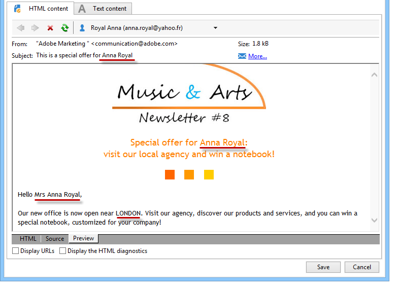</ph></source>
<target xml:lang="en-XX"><ph id="1" ctype="x-IMAGE"></ph></target>
</trans-unit>
<trans-unit id="tu53" xml:space="preserve">
<source xml:lang="en-US">To import a text content, use the <ph id="1" ctype="x-STRONG_EMPHASIS">**[!UICONTROL Open]**</ph> button, or the <ph id="4" ctype="x-STRONG_EMPHASIS">**[!UICONTROL Text Content]**</ph> tab to enter the content of the message when displayed in text format. Use the toolbar buttons to access actions on the contents. The last button lets you insert personalization fields.</source>
<target xml:lang="en-XX">Para importar um conteúdo de texto, clique no botão <ph id="1" ctype="x-STRONG_EMPHASIS">**[!UICONTROL Open]**</ph> ou na guia <ph id="4" ctype="x-STRONG_EMPHASIS">**[!UICONTROL Text Content]**</ph> para inserir o conteúdo da mensagem quando exibido no formato de texto. Use os botões da barra de ferramentas para acessar ações no conteúdo. O último botão permite inserir campos de personalização.</target>
</trans-unit>
<trans-unit id="tu54" xml:space="preserve">
<source xml:lang="en-US"><ph id="1" ctype="x-IMAGE"></ph></source>
<target xml:lang="en-XX"><ph id="1" ctype="x-IMAGE"></ph></target>
</trans-unit>
<trans-unit id="tu55" xml:space="preserve">
<source xml:lang="en-US">As for the HTML format click the <ph id="1" ctype="x-STRONG_EMPHASIS">**[!UICONTROL Preview]**</ph> tab at the bottom of the page to view the rendering of the message with its personalization.</source>
<target xml:lang="en-XX">Já para o formato HTML, clique na guia <ph id="1" ctype="x-STRONG_EMPHASIS">**[!UICONTROL Preview]**</ph> na parte inferior da página para exibir a renderização da mensagem com sua personalização.</target>
</trans-unit>
<trans-unit id="tu56" xml:space="preserve">
<source xml:lang="en-US"><ph id="1" ctype="x-IMAGE"></ph></source>
<target xml:lang="en-XX"><ph id="1" ctype="x-IMAGE"></ph></target>
</trans-unit>
<trans-unit id="tu57" xml:space="preserve">
<source xml:lang="en-US">Define interactive content</source>
<target xml:lang="en-XX">Definir o conteúdo interativo</target>
</trans-unit>
<trans-unit id="tu58" xml:space="preserve">
<source xml:lang="en-US">Adobe Campaign enables you to try the new interactive <ph id="1" ctype="x-LINK">&lbrack;</ph>AMP for Email<ph id="2" ctype="x-LINK">[#$tu59]</ph> format, which enables to send dynamic emails, under certain conditions.</source>
<target xml:lang="en-XX">O Adobe Campaign possibilita experimentar o novo formato interativo <ph id="1" ctype="x-LINK">&lbrack;</ph>AMP for Email<ph id="2" ctype="x-LINK">[#$tu59]</ph>, que permite o envio de emails dinâmicos, sob determinadas condições.</target>
</trans-unit>
<trans-unit id="tu60" xml:space="preserve">
<source xml:lang="en-US">For more on this, see the <ph id="1" ctype="x-LINK">&lbrack;</ph>Campaign v8 documentation<ph id="2" ctype="x-LINK">[#$tu61]{target="_blank"}</ph>.</source>
<target xml:lang="en-XX">Para obter mais informações, consulte a <ph id="1" ctype="x-LINK">&lbrack;</ph>documentação do Campaign v8<ph id="2" ctype="x-LINK">[#$tu61]{target="_blank"}</ph>.</target>
</trans-unit>
<trans-unit id="tu62" xml:space="preserve">
<source xml:lang="en-US">Use content management</source>
<target xml:lang="en-XX">Usar gerenciamento de conteúdo</target>
</trans-unit>
<trans-unit id="tu63" xml:space="preserve">
<source xml:lang="en-US">You can define the content of the delivery using the content management forms, directly in the delivery assistant. To do this, you must reference the publication template of the content management to be used, in the <ph id="1" ctype="x-STRONG_EMPHASIS">**[!UICONTROL Advanced]**</ph> tab of the delivery properties.</source>
<target xml:lang="en-XX">O conteúdo da entrega pode ser definido nos formulários de gerenciamento de conteúdo, diretamente no assistente de entrega. Para fazer isso, você deve consultar o modelo de publicação do gerenciamento de conteúdo que será usado na guia <ph id="1" ctype="x-STRONG_EMPHASIS">**[!UICONTROL Advanced]**</ph> das propriedades de entrega.</target>
</trans-unit>
<trans-unit id="tu64" xml:space="preserve">
<source xml:lang="en-US"><ph id="1" ctype="x-IMAGE">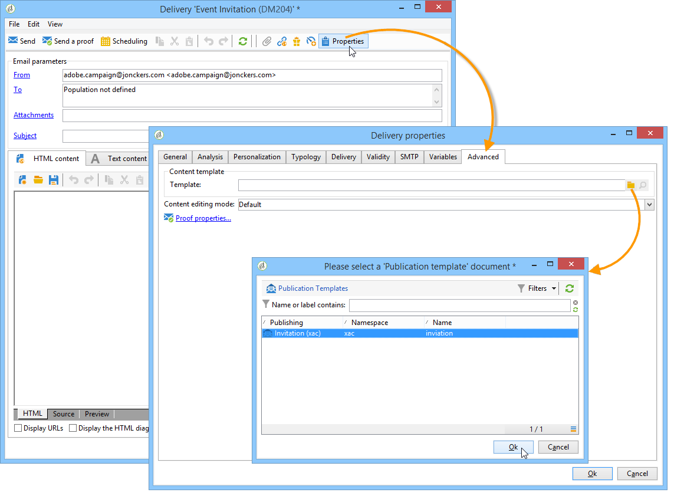</ph></source>
<target xml:lang="en-XX"><ph id="1" ctype="x-IMAGE"></ph></target>
</trans-unit>
<trans-unit id="tu65" xml:space="preserve">
<source xml:lang="en-US">An additional tab lets you enter content that will automatically be integrated and formatted according to the content management rules.</source>
<target xml:lang="en-XX">Uma guia adicional permite inserir conteúdo que será integrado e formatado automaticamente de acordo com as regras de gerenciamento de conteúdo.</target>
</trans-unit>
<trans-unit id="tu66" xml:space="preserve">
<source xml:lang="en-US"><ph id="1" ctype="x-IMAGE"></ph></source>
<target xml:lang="en-XX"><ph id="1" ctype="x-IMAGE"></ph></target>
</trans-unit>
<trans-unit id="tu67" xml:space="preserve">
<source xml:lang="en-US"><ph id="1" ctype="x-regxph" equiv-text="&lbrack;!NOTE">[!NOTE]</ph></source>
<target xml:lang="en-XX"><ph id="1" ctype="x-regxph" equiv-text="&lbrack;!NOTE">[!NOTE]</ph></target>
</trans-unit>
<trans-unit id="tu68" xml:space="preserve">
<source xml:lang="en-US">For further information about content management in Adobe Campaign, refer to <ph id="1" ctype="x-LINK">[</ph>this section<ph id="2" ctype="x-LINK">](about-content-management.md)</ph>.</source>
<target xml:lang="en-XX">Para obter mais informações sobre o gerenciamento de conteúdo no Adobe Campaign, consulte <ph id="1" ctype="x-LINK">[</ph>esta seção<ph id="2" ctype="x-LINK">](about-content-management.md)</ph>.</target>
</trans-unit>
<trans-unit id="tu69" xml:space="preserve">
<source xml:lang="en-US">Insert emoticons</source>
<target xml:lang="en-XX">Inserir emoticons</target>
</trans-unit>
<trans-unit id="tu70" xml:space="preserve">
<source xml:lang="en-US">You can insert emoticons to your email content.</source>
<target xml:lang="en-XX">É possível inserir emoticons no conteúdo de e-mail.</target>
</trans-unit>
<trans-unit id="tu71" xml:space="preserve">
<source xml:lang="en-US">Click the <ph id="1" ctype="x-STRONG_EMPHASIS">**[!UICONTROL Insert emoticon]**</ph> icon.</source>
<target xml:lang="en-XX">Clique no ícone <ph id="1" ctype="x-STRONG_EMPHASIS">**[!UICONTROL Insert emoticon]**</ph>.</target>
</trans-unit>
<trans-unit id="tu72" xml:space="preserve">
<source xml:lang="en-US">Select an emoticon from the pop-up window.</source>
<target xml:lang="en-XX">Selecione um emoticon na janela pop-up.</target>
</trans-unit>
<trans-unit id="tu73" xml:space="preserve">
<source xml:lang="en-US"><ph id="1" ctype="x-IMAGE">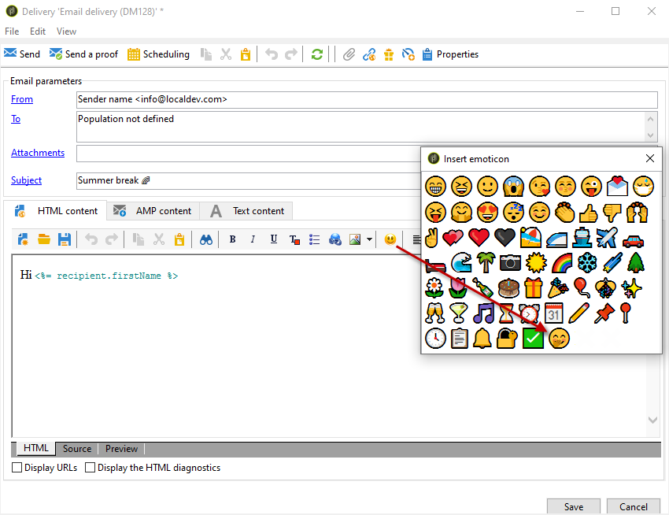</ph></source>
<target xml:lang="en-XX"><ph id="1" ctype="x-IMAGE"></ph></target>
</trans-unit>
<trans-unit id="tu74" xml:space="preserve">
<source xml:lang="en-US">Click the <ph id="1" ctype="x-STRONG_EMPHASIS">**[!UICONTROL Close]**</ph> button when done.</source>
<target xml:lang="en-XX">Clique no botão <ph id="1" ctype="x-STRONG_EMPHASIS">**[!UICONTROL Close]**</ph> quando terminar.</target>
</trans-unit>
<trans-unit id="tu75" xml:space="preserve">
<source xml:lang="en-US">To customize the emoticon list, refer to this <ph id="1" ctype="x-LINK">[</ph>page<ph id="2" ctype="x-LINK">](customizing-emoticon-list.md)</ph>.</source>
<target xml:lang="en-XX">Para personalizar a lista de emoticons, consulte esta <ph id="1" ctype="x-LINK">[</ph>página<ph id="2" ctype="x-LINK">](customizing-emoticon-list.md)</ph>.</target>
</trans-unit>
<trans-unit id="tu76" xml:space="preserve">
<source xml:lang="en-US">Add images</source>
<target xml:lang="en-XX">Adicionar imagens</target>
</trans-unit>
<trans-unit id="tu77" xml:space="preserve">
<source xml:lang="en-US">HTML format email deliveries can contain images. From the delivery assistant, you can import an HTML page containing images or insert images directly using the HTML editor via the <ph id="1" ctype="x-STRONG_EMPHASIS">**[!UICONTROL Image]**</ph> icon.</source>
<target xml:lang="en-XX">As entregas de email em formato HTML podem conter imagens. No assistente de entrega, você pode importar uma página HTML que contenha imagens ou inserir imagens diretamente usando o editor de HTML por meio do ícone <ph id="1" ctype="x-STRONG_EMPHASIS">**[!UICONTROL Image]**</ph>.</target>
</trans-unit>
<trans-unit id="tu78" xml:space="preserve">
<source xml:lang="en-US">Guardrails</source>
<target xml:lang="en-XX">Medidas de proteção</target>
</trans-unit>
<trans-unit id="tu79" xml:space="preserve">
<source xml:lang="en-US">To avoid performance issues, images included in emails cannot exceed 100 KB. This limit, set by default, can be changed from the <ph id="1" ctype="x-CODE">`NmsDelivery_MaxDownloadedImageSize`</ph> option. However, Adobe strongly recommends to avoid large images in your email deliveries.</source>
<target xml:lang="en-XX">Para evitar problemas de desempenho, as imagens incluídas nos emails não podem exceder 100 KB. Esse limite, definido por padrão, pode ser alterado na opção <ph id="1" ctype="x-CODE">`NmsDelivery_MaxDownloadedImageSize`</ph>. No entanto, a Adobe recomenda fortemente evitar imagens grandes em entregas por email.</target>
</trans-unit>
<trans-unit id="tu80" xml:space="preserve">
<source xml:lang="en-US">Learn more in <ph id="1" ctype="x-LINK">[</ph>the list of Campaign Classic options<ph id="2" ctype="x-LINK">](../../installation/using/configuring-campaign-options.md#delivery)</ph>.</source>
<target xml:lang="en-XX">Saiba mais na <ph id="1" ctype="x-LINK">[</ph>lista de opções do Campaign Classic<ph id="2" ctype="x-LINK">](../../installation/using/configuring-campaign-options.md#delivery)</ph>.</target>
</trans-unit>
<trans-unit id="tu81" xml:space="preserve">
<source xml:lang="en-US">Types of images</source>
<target xml:lang="en-XX">Tipos de imagens</target>
</trans-unit>
<trans-unit id="tu82" xml:space="preserve">
<source xml:lang="en-US">Images can be:</source>
<target xml:lang="en-XX">As imagens podem ser:</target>
</trans-unit>
<trans-unit id="tu83" xml:space="preserve">
<source xml:lang="en-US">A local image, or an image called from a server</source>
<target xml:lang="en-XX">Uma imagem local ou de um servidor</target>
</trans-unit>
<trans-unit id="tu84" xml:space="preserve">
<source xml:lang="en-US">An image stored in the Adobe Campaign public resources library</source>
<target xml:lang="en-XX">Uma imagem armazenada na biblioteca de recursos públicos do Adobe Campaign</target>
</trans-unit>
<trans-unit id="tu85" xml:space="preserve">
<source xml:lang="en-US">Public resources are accessible via the <ph id="1" ctype="x-STRONG_EMPHASIS">**[!UICONTROL Resources > Online]**</ph> node of the Adobe Campaign hierarchy. They are grouped in a library and can be included in email messages, but can also be used for campaigns or tasks, or for content management.</source>
<target xml:lang="en-XX">Os recursos públicos podem ser acessados por meio do nó <ph id="1" ctype="x-STRONG_EMPHASIS">**[!UICONTROL Resources > Online]**</ph> da hierarquia do Adobe Campaign. Elas são agrupadas em uma biblioteca e podem ser incluídas em mensagens de email, mas também podem ser usadas para campanhas ou tarefas, ou para gerenciamento de conteúdo.</target>
</trans-unit>
<trans-unit id="tu86" xml:space="preserve">
<source xml:lang="en-US">An asset shared with Adobe Experience Cloud. Refer to <ph id="1" ctype="x-LINK">[</ph>this section<ph id="2" ctype="x-LINK">](../../integrations/using/sharing-assets-with-adobe-experience-cloud.md)</ph>.</source>
<target xml:lang="en-XX">Um ativo compartilhado com a Adobe Experience Cloud. Consulte <ph id="1" ctype="x-LINK">[</ph>esta seção<ph id="2" ctype="x-LINK">](../../integrations/using/sharing-assets-with-adobe-experience-cloud.md)</ph>.</target>
</trans-unit>
<trans-unit id="tu87" xml:space="preserve">
<source xml:lang="en-US">Insert and manage images</source>
<target xml:lang="en-XX">Inserir e gerenciar imagens</target>
</trans-unit>
<trans-unit id="tu88" xml:space="preserve">
<source xml:lang="en-US">The delivery assistant lets you add local images, or images stored in the library, to the content of messages. To do this, click the <ph id="1" ctype="x-STRONG_EMPHASIS">**[!UICONTROL Image]**</ph> button in the HTML content toolbar.</source>
<target xml:lang="en-XX">O assistente de entrega permite adicionar imagens locais ou armazenadas na biblioteca ao conteúdo das mensagens. Para fazer isso, clique no botão <ph id="1" ctype="x-STRONG_EMPHASIS">**[!UICONTROL Image]**</ph> na barra de ferramentas do conteúdo HTML.</target>
</trans-unit>
<trans-unit id="tu89" xml:space="preserve">
<source xml:lang="en-US"><ph id="1" ctype="x-IMAGE">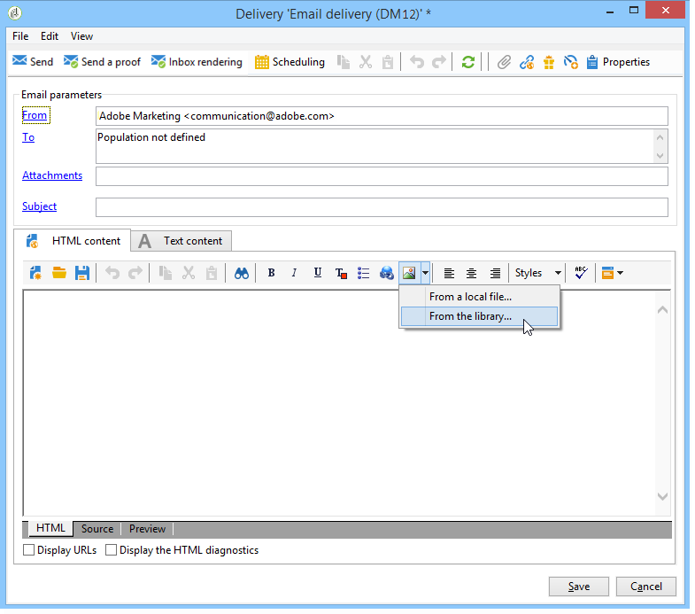</ph></source>
<target xml:lang="en-XX"><ph id="1" ctype="x-IMAGE"></ph></target>
</trans-unit>
<trans-unit id="tu90" xml:space="preserve">
<source xml:lang="en-US"><ph id="1" ctype="x-regxph" equiv-text="&lbrack;!IMPORTANT">[!IMPORTANT]</ph></source>
<target xml:lang="en-XX"><ph id="1" ctype="x-regxph" equiv-text="&lbrack;!IMPORTANT">[!IMPORTANT]</ph></target>
</trans-unit>
<trans-unit id="tu91" xml:space="preserve">
<source xml:lang="en-US">In order for the recipients to be able to view the images included in the messages that they receive, these messages must be available on a server accessible from the outside.</source>
<target xml:lang="en-XX">Para que os destinatários possam exibir as imagens incluídas nas mensagens recebidas, essas mensagens devem estar disponíveis em um servidor acessível externamente.</target>
</trans-unit>
<trans-unit id="tu92" xml:space="preserve">
<source xml:lang="en-US">To manage images via the delivery assistant:</source>
<target xml:lang="en-XX">Para gerenciar imagens por meio do assistente de entrega:</target>
</trans-unit>
<trans-unit id="tu93" xml:space="preserve">
<source xml:lang="en-US">Click the <ph id="1" ctype="x-STRONG_EMPHASIS">**[!UICONTROL Tracking &amp; Images]**</ph> icon in the toolbar.
</source>
<target xml:lang="en-XX">Clique no ícone <ph id="1" ctype="x-STRONG_EMPHASIS">**[!UICONTROL Tracking &amp; Images]**</ph> na barra de ferramentas.
</target>
</trans-unit>
<trans-unit id="tu94" xml:space="preserve">
<source xml:lang="en-US"><ph id="1" ctype="x-IMAGE">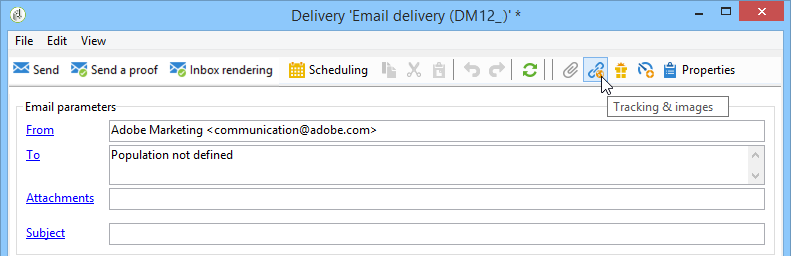</ph></source>
<target xml:lang="en-XX"><ph id="1" ctype="x-IMAGE"></ph></target>
</trans-unit>
<trans-unit id="tu95" xml:space="preserve">
<source xml:lang="en-US">Select <ph id="1" ctype="x-STRONG_EMPHASIS">**[!UICONTROL Upload images]**</ph> in the <ph id="4" ctype="x-STRONG_EMPHASIS">**[!UICONTROL Images]**</ph> tab.</source>
<target xml:lang="en-XX">Selecione <ph id="1" ctype="x-STRONG_EMPHASIS">**[!UICONTROL Upload images]**</ph> na guia <ph id="4" ctype="x-STRONG_EMPHASIS">**[!UICONTROL Images]**</ph>.</target>
</trans-unit>
<trans-unit id="tu96" xml:space="preserve">
<source xml:lang="en-US">You can then choose whether you wish to include the images in the email message.
</source>
<target xml:lang="en-XX">Você pode escolher se deseja incluir as imagens na mensagem de email.
</target>
</trans-unit>
<trans-unit id="tu97" xml:space="preserve">
<source xml:lang="en-US"><ph id="1" ctype="x-IMAGE"></ph></source>
<target xml:lang="en-XX"><ph id="1" ctype="x-IMAGE"></ph></target>
</trans-unit>
<trans-unit id="tu98" xml:space="preserve">
<source xml:lang="en-US">You can upload images manually without waiting for the delivery analysis phase. To do this, click the <ph id="1" ctype="x-STRONG_EMPHASIS">**[!UICONTROL Upload the images straightaway...]**</ph> link.</source>
<target xml:lang="en-XX">Você pode carregar imagens manualmente sem esperar a fase de análise de entrega. Para fazer isso, clique em <ph id="1" ctype="x-STRONG_EMPHASIS">**[!UICONTROL Upload the images straightaway...]**</ph>.</target>
</trans-unit>
<trans-unit id="tu99" xml:space="preserve">
<source xml:lang="en-US">You can specify another path for access to the images on the tracking server. To do this, enter it in the <ph id="1" ctype="x-STRONG_EMPHASIS">**[!UICONTROL Images URL]**</ph> field. This value overrides the value defined in the parameters of the installation assistant.</source>
<target xml:lang="en-XX">Você pode especificar outro caminho para acessar as imagens no servidor de rastreamento. Para fazer isso, insira-o no campo <ph id="1" ctype="x-STRONG_EMPHASIS">**[!UICONTROL Images URL]**</ph>. Este valor substitui o valor definido nos parâmetros do assistente de instalação.</target>
</trans-unit>
<trans-unit id="tu100" xml:space="preserve">
<source xml:lang="en-US">When you open HTML content with included images in the delivery assistant, a message gives you the option of uploading the images immediately, according to the delivery parameters.</source>
<target xml:lang="en-XX">Quando você abre um conteúdo HTML com imagens inclusas no assistente de entrega, aparece uma mensagem com a opção de fazer upload das imagens imediatamente, de acordo com os parâmetros da entrega.</target>
</trans-unit>
<trans-unit id="tu101" xml:space="preserve">
<source xml:lang="en-US"><ph id="1" ctype="x-IMAGE"></ph></source>
<target xml:lang="en-XX"><ph id="1" ctype="x-IMAGE"></ph></target>
</trans-unit>
<trans-unit id="tu102" xml:space="preserve">
<source xml:lang="en-US"><ph id="1" ctype="x-regxph" equiv-text="&lbrack;!IMPORTANT">[!IMPORTANT]</ph></source>
<target xml:lang="en-XX"><ph id="1" ctype="x-regxph" equiv-text="&lbrack;!IMPORTANT">[!IMPORTANT]</ph></target>
</trans-unit>
<trans-unit id="tu103" xml:space="preserve">
<source xml:lang="en-US">The image URLs are modified during manual uploading or when sending messages.</source>
<target xml:lang="en-XX">Os URLs das imagens são modificados durante o upload manual ou ao enviar as mensagens.</target>
</trans-unit>
<trans-unit id="tu104" xml:space="preserve">
<source xml:lang="en-US">Use case: send a message with images</source>
<target xml:lang="en-XX">Caso de uso: envio de uma mensagem com imagens</target>
</trans-unit>
<trans-unit id="tu105" xml:space="preserve">
<source xml:lang="en-US">Below is a sample of a delivery with four images:</source>
<target xml:lang="en-XX">Veja a seguir um exemplo de entrega com quatro imagens:</target>
</trans-unit>
<trans-unit id="tu106" xml:space="preserve">
<source xml:lang="en-US"><ph id="1" ctype="x-IMAGE">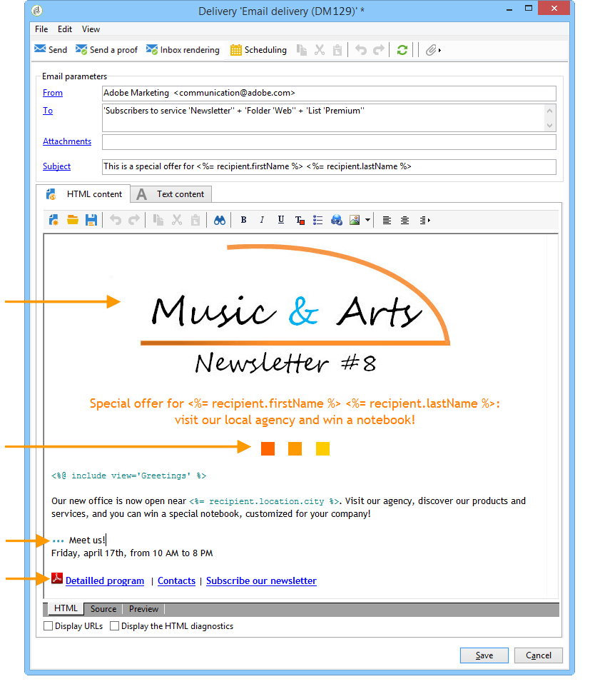</ph></source>
<target xml:lang="en-XX"><ph id="1" ctype="x-IMAGE"></ph></target>
</trans-unit>
<trans-unit id="tu107" xml:space="preserve">
<source xml:lang="en-US">These images come from a local directory or Web site as you can verify from the <ph id="1" ctype="x-STRONG_EMPHASIS">**[!UICONTROL Source]**</ph> tab.</source>
<target xml:lang="en-XX">Essas imagens vêm de um diretório ou site local, como pode ser verificado na guia <ph id="1" ctype="x-STRONG_EMPHASIS">**[!UICONTROL Source]**</ph>.</target>
</trans-unit>
<trans-unit id="tu108" xml:space="preserve">
<source xml:lang="en-US"><ph id="1" ctype="x-IMAGE"></ph></source>
<target xml:lang="en-XX"><ph id="1" ctype="x-IMAGE"></ph></target>
</trans-unit>
<trans-unit id="tu109" xml:space="preserve">
<source xml:lang="en-US">Click the <ph id="1" ctype="x-STRONG_EMPHASIS">**[!UICONTROL Tracking &amp; Images]**</ph> icon and then the <ph id="4" ctype="x-STRONG_EMPHASIS">**[!UICONTROL Images]**</ph> tab to start detecting images in the message.</source>
<target xml:lang="en-XX">Clique no ícone <ph id="1" ctype="x-STRONG_EMPHASIS">**[!UICONTROL Tracking &amp; Images]**</ph> e, em seguida, na guia <ph id="4" ctype="x-STRONG_EMPHASIS">**[!UICONTROL Images]**</ph> para iniciar a detecção de imagens na mensagem.</target>
</trans-unit>
<trans-unit id="tu110" xml:space="preserve">
<source xml:lang="en-US">For each image detected, you can view its status:</source>
<target xml:lang="en-XX">Para cada imagem detectada, você pode ver seu status:</target>
</trans-unit>
<trans-unit id="tu111" xml:space="preserve">
<source xml:lang="en-US">If an image is stored locally or located on another server, even if this server is visible from the outside (on an internet site, for example), it will be detected as <ph id="1" ctype="x-STRONG_EMPHASIS">**[!UICONTROL Not yet online]**</ph>.</source>
<target xml:lang="en-XX">Se uma imagem for armazenada no local ou localizada em outro servidor, mesmo que esse servidor seja visível externamente (em um site da Internet, por exemplo), ela será detectada como <ph id="1" ctype="x-STRONG_EMPHASIS">**[!UICONTROL Not yet online]**</ph>.</target>
</trans-unit>
<trans-unit id="tu112" xml:space="preserve">
<source xml:lang="en-US">The images are detected as <ph id="1" ctype="x-STRONG_EMPHASIS">**[!UICONTROL Already online]**</ph> if they were uploaded earlier while creating another delivery.</source>
<target xml:lang="en-XX">As imagens são detectadas como <ph id="1" ctype="x-STRONG_EMPHASIS">**[!UICONTROL Already online]**</ph> se tiverem sido carregadas anteriormente durante a criação de outra entrega.</target>
</trans-unit>
<trans-unit id="tu113" xml:space="preserve">
<source xml:lang="en-US">In the deployment wizard, you can define URLs for which image detection is not enabled: uploading these images will be <ph id="1" ctype="x-STRONG_EMPHASIS">**[!UICONTROL Skipped]**</ph>.</source>
<target xml:lang="en-XX">No assistente de implantação, é possível definir as URLs nas quais a detecção de imagem não está habilitada: o upload dessas imagens será <ph id="1" ctype="x-STRONG_EMPHASIS">**[!UICONTROL Skipped]**</ph>.</target>
</trans-unit>
<trans-unit id="tu114" xml:space="preserve">
<source xml:lang="en-US"><ph id="1" ctype="x-regxph" equiv-text="&lbrack;!NOTE">[!NOTE]</ph></source>
<target xml:lang="en-XX"><ph id="1" ctype="x-regxph" equiv-text="&lbrack;!NOTE">[!NOTE]</ph></target>
</trans-unit>
<trans-unit id="tu115" xml:space="preserve">
<source xml:lang="en-US">Images are identified by their content and not by their access paths. This means that an image uploaded previously under a different name or in a different directory will be detected as <ph id="1" ctype="x-STRONG_EMPHASIS">**[!UICONTROL Already online]**</ph>.</source>
<target xml:lang="en-XX">As imagens são identificadas pelo seu conteúdo e não pelos caminhos de acesso. Isto significa que uma imagem carregada anteriormente com um nome diferente ou em um diretório diferente será detectada como <ph id="1" ctype="x-STRONG_EMPHASIS">**[!UICONTROL Already online]**</ph>.</target>
</trans-unit>
<trans-unit id="tu116" xml:space="preserve">
<source xml:lang="en-US">During the analysis phase, the images are automatically uploaded to the server so that they are accessible from the exterior, except for the local images which must be uploaded beforehand.</source>
<target xml:lang="en-XX">Durante a fase de análise, as imagens são carregadas automaticamente no servidor para que sejam acessíveis externamente, exceto para as imagens locais que devem ser carregadas anteriormente.</target>
</trans-unit>
<trans-unit id="tu117" xml:space="preserve">
<source xml:lang="en-US">You can work ahead and upload images so that they can be viewed by other Adobe Campaign operators. You may find this useful if working collaboratively. To do this, click <ph id="1" ctype="x-STRONG_EMPHASIS">**[!UICONTROL Upload the images straightaway...]**</ph> to upload the images onto the server.</source>
<target xml:lang="en-XX">Você pode trabalhar com antecedência e carregar imagens para que elas possam ser visualizadas por outros operadores do Adobe Campaign. Isso pode ser útil se você trabalhar de forma colaborativa. Para fazer isso, clique em <ph id="1" ctype="x-STRONG_EMPHASIS">**[!UICONTROL Upload the images straightaway...]**</ph> para fazer upload das imagens no servidor.</target>
</trans-unit>
<trans-unit id="tu118" xml:space="preserve">
<source xml:lang="en-US"><ph id="1" ctype="x-IMAGE">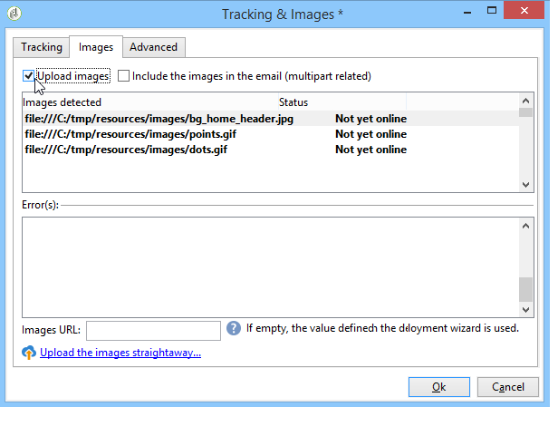</ph></source>
<target xml:lang="en-XX"><ph id="1" ctype="x-IMAGE"></ph></target>
</trans-unit>
<trans-unit id="tu119" xml:space="preserve">
<source xml:lang="en-US"><ph id="1" ctype="x-regxph" equiv-text="&lbrack;!NOTE">[!NOTE]</ph></source>
<target xml:lang="en-XX"><ph id="1" ctype="x-regxph" equiv-text="&lbrack;!NOTE">[!NOTE]</ph></target>
</trans-unit>
<trans-unit id="tu120" xml:space="preserve">
<source xml:lang="en-US">The URLs of the images in the email, and their names in particular, are then modified.</source>
<target xml:lang="en-XX">As URLs das imagens no email, e seus nomes em particular, são então modificadas.</target>
</trans-unit>
<trans-unit id="tu121" xml:space="preserve">
<source xml:lang="en-US">Once the images are online, you can view changes to their names and paths from the <ph id="1" ctype="x-STRONG_EMPHASIS">**[!UICONTROL Source]**</ph> tab of the message.</source>
<target xml:lang="en-XX">Quando as imagens estiverem online, você poderá exibir as alterações nos nomes e nos caminhos na guia <ph id="1" ctype="x-STRONG_EMPHASIS">**[!UICONTROL Source]**</ph> da mensagem.</target>
</trans-unit>
<trans-unit id="tu122" xml:space="preserve">
<source xml:lang="en-US"><ph id="1" ctype="x-IMAGE"></ph></source>
<target xml:lang="en-XX"><ph id="1" ctype="x-IMAGE"></ph></target>
</trans-unit>
<trans-unit id="tu123" xml:space="preserve">
<source xml:lang="en-US">If you select <ph id="1" ctype="x-STRONG_EMPHASIS">**[!UICONTROL Include the images in the email]**</ph>, you can choose which images to include in the corresponding column.</source>
<target xml:lang="en-XX">Se você selecionar <ph id="1" ctype="x-STRONG_EMPHASIS">**[!UICONTROL Include the images in the email]**</ph>, será possível escolher imagens para incluir na coluna correspondente.</target>
</trans-unit>
<trans-unit id="tu124" xml:space="preserve">
<source xml:lang="en-US"><ph id="1" ctype="x-IMAGE"></ph></source>
<target xml:lang="en-XX"><ph id="1" ctype="x-IMAGE"></ph></target>
</trans-unit>
<trans-unit id="tu125" xml:space="preserve">
<source xml:lang="en-US"><ph id="1" ctype="x-regxph" equiv-text="&lbrack;!NOTE">[!NOTE]</ph></source>
<target xml:lang="en-XX"><ph id="1" ctype="x-regxph" equiv-text="&lbrack;!NOTE">[!NOTE]</ph></target>
</trans-unit>
<trans-unit id="tu126" xml:space="preserve">
<source xml:lang="en-US">If local images are included in the message, you must confirm changes to the message source code.</source>
<target xml:lang="en-XX">Se imagens locais forem incluídas na mensagem, você deverá confirmar as alterações no código-fonte dela.</target>
</trans-unit>
<trans-unit id="tu127" xml:space="preserve">
<source xml:lang="en-US">Insert a personalized barcode</source>
<target xml:lang="en-XX">Inserir um código de barras personalizado</target>
</trans-unit>
<trans-unit id="tu128" xml:space="preserve">
<source xml:lang="en-US">The barcode generation module lets you create several types of barcodes that comply with many common standards, including 2D barcodes.</source>
<target xml:lang="en-XX">O módulo de geração de código de barras permite criar vários tipos de códigos de barras que estão em conformidade com muitos padrões comuns, incluindo códigos de barras 2D.</target>
</trans-unit>
<trans-unit id="tu129" xml:space="preserve">
<source xml:lang="en-US">It is possible to dynamically generate a barcode as a bitmap using a value defined using customer criteria. Personalized barcodes can be included in email campaigns. The recipient can print the message and show it to the issuing company for scanning (when checking out for example).</source>
<target xml:lang="en-XX">É possível gerar um código de barras de forma dinâmica como um bitmap usando um valor definido por meio de critérios do cliente. Os códigos de barra personalizados podem ser incluídos em campanhas de email. O destinatário pode imprimir a mensagem e mostrá-la à empresa emissora para exame (ao verificar, por exemplo).</target>
</trans-unit>
<trans-unit id="tu130" xml:space="preserve">
<source xml:lang="en-US">To insert a barcode into an email, place the cursor in the content where you want to display it, then click the personalization button. Select <ph id="1" ctype="x-STRONG_EMPHASIS">**[!UICONTROL Include > Barcode...]**</ph>.</source>
<target xml:lang="en-XX">Para inserir um código de barras em um email, coloque o cursor no conteúdo onde deseja exibi-lo e clique no botão de personalização. Selecione <ph id="1" ctype="x-STRONG_EMPHASIS">**[!UICONTROL Include > Barcode...]**</ph>.</target>
</trans-unit>
<trans-unit id="tu131" xml:space="preserve">
<source xml:lang="en-US"><ph id="1" ctype="x-IMAGE">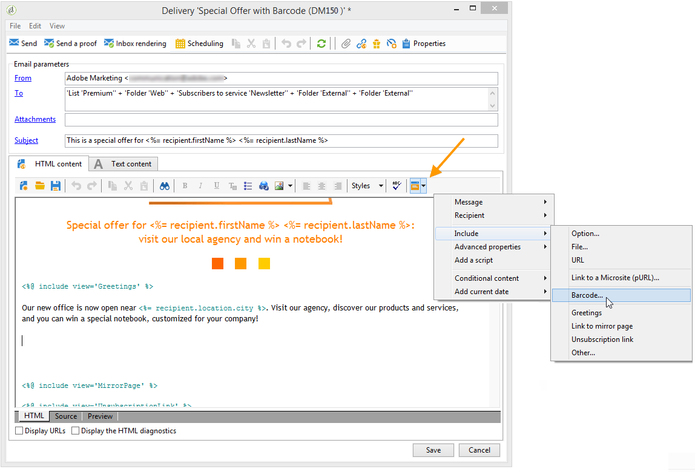</ph></source>
<target xml:lang="en-XX"><ph id="1" ctype="x-IMAGE"></ph></target>
</trans-unit>
<trans-unit id="tu132" xml:space="preserve">
<source xml:lang="en-US">Then configure the following elements to suit your needs:</source>
<target xml:lang="en-XX">Em seguida, configure os seguintes elementos para atender às suas necessidades:</target>
</trans-unit>
<trans-unit id="tu133" xml:space="preserve">
<source xml:lang="en-US">Select the type of barcode.</source>
<target xml:lang="en-XX">Selecione o tipo de código de barras.</target>
</trans-unit>
<trans-unit id="tu134" xml:space="preserve">
<source xml:lang="en-US">For 1D format, the following types are available in Adobe Campaign: Codabar, Code 128, GS1-128 (formerly EAN-128), UPC-A, UPC-E, ISBN, EAN-8, Code39, Interleaved 2 of 5, POSTNET and Royal Mail (RM4SCC).</source>
<target xml:lang="en-XX">Para o formato 1D, os seguintes tipos estão disponíveis no Adobe Campaign: Codabar, Code 128, GS1-128 (antigo EAN-128), UPC-A, UPC-E, ISBN, EAN-8, Code39, Interleaved 2 de 5, POSTNET e Royal Mail (RM4SCC).</target>
</trans-unit>
<trans-unit id="tu135" xml:space="preserve">
<source xml:lang="en-US">Example of a 1D barcode:</source>
<target xml:lang="en-XX">Exemplo de um código de barras 1D:</target>
</trans-unit>
<trans-unit id="tu136" xml:space="preserve">
<source xml:lang="en-US"><ph id="1" ctype="x-IMAGE"></ph></source>
<target xml:lang="en-XX"><ph id="1" ctype="x-IMAGE"></ph></target>
</trans-unit>
<trans-unit id="tu137" xml:space="preserve">
<source xml:lang="en-US">The DataMatrix and PDF417 types concern the 2D format.</source>
<target xml:lang="en-XX">Os tipos DataMatrix e PDF417 correspondem ao formato 2D.</target>
</trans-unit>
<trans-unit id="tu138" xml:space="preserve">
<source xml:lang="en-US">Example of a 2D barcode:</source>
<target xml:lang="en-XX">Exemplo de um código de barras 2D:</target>
</trans-unit>
<trans-unit id="tu139" xml:space="preserve">
<source xml:lang="en-US"><ph id="1" ctype="x-IMAGE">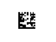</ph></source>
<target xml:lang="en-XX"><ph id="1" ctype="x-IMAGE"></ph></target>
</trans-unit>
<trans-unit id="tu140" xml:space="preserve">
<source xml:lang="en-US">To insert a QR code, select this type and enter the error correction rate to apply. This rate defines the quantity of information repeated and the tolerance to deterioration.</source>
<target xml:lang="en-XX">Para inserir um código QR, selecione esse tipo e digite a taxa de correção de erro a ser aplicada. Essa taxa define a quantidade de informações repetidas e a tolerância à deterioração.</target>
</trans-unit>
<trans-unit id="tu141" xml:space="preserve">
<source xml:lang="en-US"><ph id="1" ctype="x-IMAGE"></ph></source>
<target xml:lang="en-XX"><ph id="1" ctype="x-IMAGE"></ph></target>
</trans-unit>
<trans-unit id="tu142" xml:space="preserve">
<source xml:lang="en-US">Example of a QR code:</source>
<target xml:lang="en-XX">Exemplo de código QR:</target>
</trans-unit>
<trans-unit id="tu143" xml:space="preserve">
<source xml:lang="en-US"><ph id="1" ctype="x-IMAGE"></ph></source>
<target xml:lang="en-XX"><ph id="1" ctype="x-IMAGE"></ph></target>
</trans-unit>
<trans-unit id="tu144" xml:space="preserve">
<source xml:lang="en-US">Enter the size of the barcode that you want to insert into the email: configuring the scale lets you increase or reduce the size of the barcode, from x1 to x10.</source>
<target xml:lang="en-XX">Insira o tamanho do código de barras que deseja inserir no email: a configuração da escala permite aumentar ou reduzir o tamanho do código de barras, de x1 a x10.</target>
</trans-unit>
<trans-unit id="tu145" xml:space="preserve">
<source xml:lang="en-US">The <ph id="1" ctype="x-STRONG_EMPHASIS">**[!UICONTROL Value]**</ph> field enables you to define the value of the barcode. A value can match a special offer and can be the function of a criteria, it can be the value of a database field linked to the customers.</source>
<target xml:lang="en-XX">O campo <ph id="1" ctype="x-STRONG_EMPHASIS">**[!UICONTROL Value]**</ph> permite definir o valor do código de barras. Um valor pode corresponder a uma oferta especial e pode ser a função de um critério, ele pode ser o valor de um campo de banco de dados vinculado aos clientes.</target>
</trans-unit>
<trans-unit id="tu146" xml:space="preserve">
<source xml:lang="en-US">This example shows an EAN-8 type barcode, to which was added the account number of a recipient. To add this account number, click the personalization button to the right of the <ph id="1" ctype="x-STRONG_EMPHASIS">**[!UICONTROL Value]**</ph> field and select <ph id="4" ctype="x-STRONG_EMPHASIS">**[!UICONTROL Recipient > Account number]**</ph>.</source>
<target xml:lang="en-XX">Este exemplo mostra um código de barras do tipo EAN-8, ao qual foi adicionado o número da conta de um destinatário. Para adicionar esse número de conta, clique no botão de personalização à direita do campo <ph id="1" ctype="x-STRONG_EMPHASIS">**[!UICONTROL Value]**</ph> e selecione <ph id="4" ctype="x-STRONG_EMPHASIS">**[!UICONTROL Recipient > Account number]**</ph>.</target>
</trans-unit>
<trans-unit id="tu147" xml:space="preserve">
<source xml:lang="en-US"><ph id="1" ctype="x-IMAGE"></ph></source>
<target xml:lang="en-XX"><ph id="1" ctype="x-IMAGE"></ph></target>
</trans-unit>
<trans-unit id="tu148" xml:space="preserve">
<source xml:lang="en-US">The <ph id="1" ctype="x-STRONG_EMPHASIS">**[!UICONTROL Height]**</ph> field lets you configure the height of the barcode without changing its width, by altering the amount of space between each bar.</source>
<target xml:lang="en-XX">O campo <ph id="1" ctype="x-STRONG_EMPHASIS">**[!UICONTROL Height]**</ph> permite configurar a altura do código de barras sem alterar sua largura, alterando a quantidade do espaço entre cada barra.</target>
</trans-unit>
<trans-unit id="tu149" xml:space="preserve">
<source xml:lang="en-US">There is no restrictive entry control depending on the type of barcode. If a barcode value is incorrect, it will only be visible in <ph id="1" ctype="x-STRONG_EMPHASIS">**</ph>Preview<ph id="2" ctype="x-STRONG_EMPHASIS">**</ph> mode where the barcode will be crossed out in red.</source>
<target xml:lang="en-XX">Não há controle de entrada restritivo dependendo do tipo de código de barras. Se um valor de código de barras estiver incorreto, ele só será visível no modo de <ph id="1" ctype="x-STRONG_EMPHASIS">**</ph>Pré-visualização<ph id="2" ctype="x-STRONG_EMPHASIS">**</ph>, onde o código de barras estará riscado em vermelho.</target>
</trans-unit>
<trans-unit id="tu150" xml:space="preserve">
<source xml:lang="en-US"><ph id="1" ctype="x-regxph" equiv-text="&lbrack;!NOTE">[!NOTE]</ph></source>
<target xml:lang="en-XX"><ph id="1" ctype="x-regxph" equiv-text="&lbrack;!NOTE">[!NOTE]</ph></target>
</trans-unit>
<trans-unit id="tu151" xml:space="preserve">
<source xml:lang="en-US">The value assigned to a barcode depends on its type. For example, an EAN-8 type shall have exactly 8 numbers.</source>
<target xml:lang="en-XX">O valor atribuído a um código de barras depende do seu tipo. Por exemplo, um tipo EAN-8 deve ter exatamente 8 números.</target>
</trans-unit>
<trans-unit id="tu152" xml:space="preserve">
<source xml:lang="en-US">The personalization button to the right of the <ph id="1" ctype="x-STRONG_EMPHASIS">**[!UICONTROL Value]**</ph> field lets you add data in addition to the value itself. This enriches the barcode, provided that the barcode standard accepts it.</source>
<target xml:lang="en-XX">O botão de personalização à direita do campo <ph id="1" ctype="x-STRONG_EMPHASIS">**[!UICONTROL Value]**</ph> também permite adicionar dados, além do valor. Isso enriquece o código de barras, desde que o padrão do código de barras o aceite.</target>
</trans-unit>
<trans-unit id="tu153" xml:space="preserve">
<source xml:lang="en-US">For example, if you are using a GS1-128 type barcode and want to enter the account number of a recipient in addition to the value, click the personalization button and select <ph id="1" ctype="x-STRONG_EMPHASIS">**[!UICONTROL Recipient > Account number]**</ph>. If the account number of the selected recipient is entered correctly, the barcode takes it into account.</source>
<target xml:lang="en-XX">Por exemplo, se estiver usando um código de barras do tipo GS1-128 e quiser inserir o número da conta de um destinatário, além do valor, clique no botão de personalização e selecione <ph id="1" ctype="x-STRONG_EMPHASIS">**[!UICONTROL Recipient > Account number]**</ph>. Se o número da conta do destinatário selecionado for inserido corretamente, ele será considerado pelo código de barras.</target>
</trans-unit>
<trans-unit id="tu154" xml:space="preserve">
<source xml:lang="en-US">Once these elements have been configured, you can finalize your email and send it. To avoid errors, always make sure your content is displayed correctly before performing a delivery by clicking the <ph id="1" ctype="x-STRONG_EMPHASIS">**[!UICONTROL Preview]**</ph> tab.</source>
<target xml:lang="en-XX">Após configurar estes elementos, você pode finalizar seu email e enviá-lo. Para evitar erros, sempre verifique se o conteúdo é exibido corretamente antes de executar uma entrega clicando na guia <ph id="1" ctype="x-STRONG_EMPHASIS">**[!UICONTROL Preview]**</ph>.</target>
</trans-unit>
<trans-unit id="tu155" xml:space="preserve">
<source xml:lang="en-US"><ph id="1" ctype="x-IMAGE">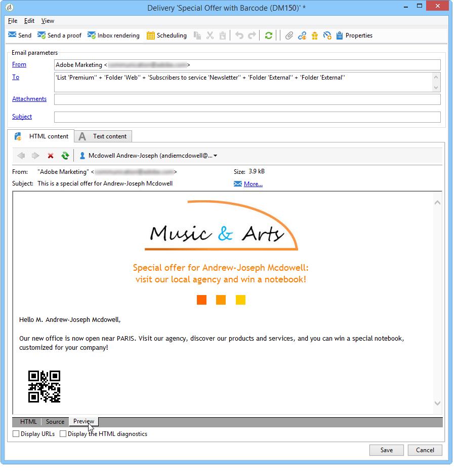</ph></source>
<target xml:lang="en-XX"><ph id="1" ctype="x-IMAGE"></ph></target>
</trans-unit>
<trans-unit id="tu156" xml:space="preserve">
<source xml:lang="en-US"><ph id="1" ctype="x-regxph" equiv-text="&lbrack;!NOTE">[!NOTE]</ph></source>
<target xml:lang="en-XX"><ph id="1" ctype="x-regxph" equiv-text="&lbrack;!NOTE">[!NOTE]</ph></target>
</trans-unit>
<trans-unit id="tu157" xml:space="preserve">
<source xml:lang="en-US">If the value of a barcode is incorrect, its bitmap is shown crossed out in red.</source>
<target xml:lang="en-XX">Se o valor de um código de barras estiver incorreto, seu bitmap é exibido riscado em vermelho.</target>
</trans-unit>
<trans-unit id="tu158" xml:space="preserve">
<source xml:lang="en-US"><ph id="1" ctype="x-IMAGE">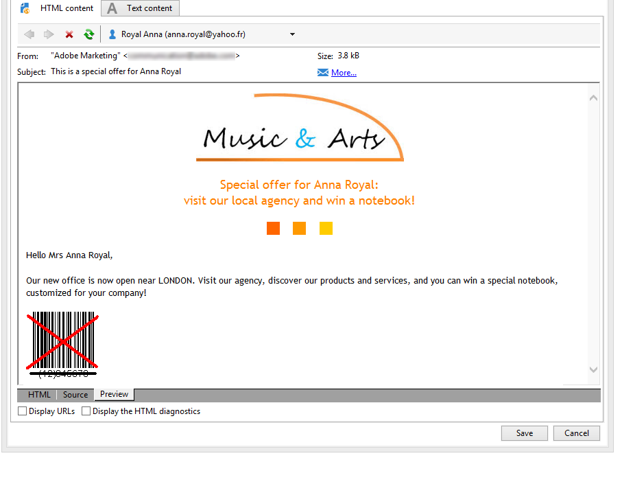</ph></source>
<target xml:lang="en-XX"><ph id="1" ctype="x-IMAGE"></ph></target>
</trans-unit>
</body>
</file>
</xliff>