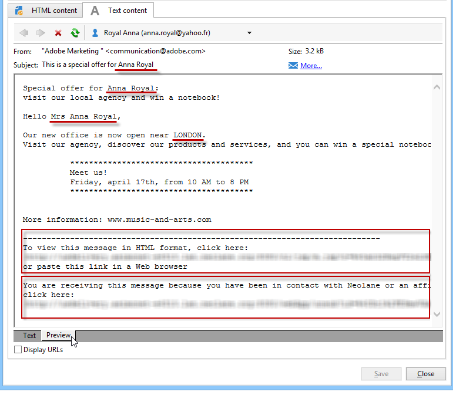

# Definição do conteúdo do email {#defining-the-email-content}

## Remetente {#sender}

Para definir o nome e o endereço do remetente que aparecerá no cabeçalho das mensagens enviadas, clique no link **[!UICONTROL From]**.

Todas as informações necessárias para criação dos cabeçalhos de mensagens de email devem ser inseridas nessa janela. Essas informações podem ser personalizadas. Para fazer isso, use os botões à direita dos campos de entrada para inserir campos de personalização.

Para saber como inserir e usar campos de personalização, consulte a seção [Sobre personalização](about-personalization.md).

>[!NOTE]
>
>* O endereço do remetente será usado para respostas por padrão.
>* Os parâmetros do cabeçalho não devem ficar vazios. Por padrão, eles contêm a entrada de valores ao configurar o assistente de implantação. Para obter mais informações, consulte o [Guia de Instalação](../../installation/using/deploying-an-instance.md).
>* O endereço do remetente é obrigatório para possibilitar o envio de um email (padrão RFC).
>* O Adobe Campaign verifica a sintaxe dos endereços de email inseridos.

>[!IMPORTANT]
>
>No contexto das verificações implementadas pelos Provedores de Serviços de Internet (ISPs) para combater emails não solicitados (spam), a Adobe recomenda criar contas de email que correspondam aos endereços especificados para deliveries e respostas. Verifique com o administrador do sistema de mensagens.

## Assunto da mensagem {#message-subject}

O assunto da mensagem é configurado no campo correspondente. Você pode inseri-lo diretamente no campo ou clicar no link **[!UICONTROL Subject]** para inserir um script. O link de personalização permite inserir campos de banco de dados no assunto.

>[!IMPORTANT]
>
>O assunto da mensagem é obrigatório.

O conteúdo do campo será substituído pelo valor no perfil do recipient quando a mensagem for enviada.

Por exemplo, na mensagem acima, o assunto da mensagem é personalizado para cada recipient com dados do seu perfil.

>[!NOTE]
>
>O uso de campos de personalização é apresentado em [Sobre personalização](about-personalization.md).

Também é possível inserir emoticons na linha do assunto com a janela pop-up **[!UICONTROL Insert emoticon]**.

## Conteúdo da mensagem {#message-content}

>[!IMPORTANT]
>
>Por motivos de privacidade, recomendamos usar HTTPS para todos os recursos externos.

O conteúdo da mensagem é definido na seção inferior da janela de configuração de delivery.

As mensagens são enviadas em formato de texto ou HTML por padrão, de acordo com a preferência do recipient. Recomendamos a criação de conteúdo nos dois formatos para garantir que as mensagens possam ser exibidas corretamente em qualquer sistema de email. Para obter mais informações, consulte [Seleção de formatos de mensagem](#selecting-message-formats).

* Para importar um conteúdo HTML, clique no botão **[!UICONTROL Open]**. Também é possível colar o código-fonte diretamente na subguia **[!UICONTROL Source]**.

   Se estiver usando o [Editor de Conteúdo Digital](../../web/using/about-campaign-html-editor.md) (DCE), consulte [Seleção de um template de conteúdo](../../web/using/use-case--creating-an-email-delivery.md#step-3---selecting-a-content).

   >[!IMPORTANT]
   >
   >O conteúdo HTML deve ser criado antes, e depois importado para o Adobe Campaign. O editor de HTML não foi desenvolvido para criação de conteúdo.

   A subguia **[!UICONTROL Preview]** permite visualizar a renderização de cada conteúdo para um recipient. Os campos de personalização e os elementos condicionais do conteúdo são substituídos pelas informações correspondentes para o perfil selecionado.

   Os botões da barra de ferramentas fornecem acesso aos parâmetros padrão de ações e formatação da página HTML.

   

   Você pode inserir imagens em mensagens de um arquivo local ou de uma biblioteca de imagens no Adobe Campaign. Para fazer isso, clique no ícone **[!UICONTROL Image]** e selecione a opção apropriada.

   

   As imagens da biblioteca podem ser acessadas através da pasta **[!UICONTROL Resources>Online>Public resources]** na árvore de pastas. Consulte também [Adicionar imagens](#adding-images).

   O último botão na barra de ferramentas permite inserir campos de personalização.

   >[!NOTE]
   >
   >O uso de campos de personalização é apresentado em [Sobre personalização](about-personalization.md).

   As guias na parte inferior da página permitem exibir o código HTML da página que está sendo criada e exibir a renderização da mensagem com sua personalização. Para iniciar essa exibição, clique em **[!UICONTROL Preview]** e selecione um recipient usando o botão **[!UICONTROL Test personalization]** na barra de ferramentas. Você pode selecionar um recipient no(s) target(s) definido(s) ou escolher outro.

   

   Você pode validar a mensagem HTML. Também é possível visualizar o conteúdo do cabeçalho do email.

   

* Para importar um conteúdo de texto, clique no botão **[!UICONTROL Open]** ou na guia **[!UICONTROL Text Content]** para inserir o conteúdo da mensagem quando exibido no formato de texto. Use os botões da barra de ferramentas para acessar ações no conteúdo. O último botão permite inserir campos de personalização.

   

   Já para o formato HTML, clique na guia **[!UICONTROL Preview]** na parte inferior da página para exibir a renderização da mensagem com sua personalização.

   

<!--## Selecting message formats {#selecting-message-formats}

You can change the format of email messages sent. To do this, edit the delivery properties and click the **[!UICONTROL Delivery]** tab.

Select the format of the email in the lower section of the window:

* **[!UICONTROL Use recipient preferences]** (default mode)

  The message format is defined according to the data stored in the recipient profile and stored by default in the **[!UICONTROL email format]** field (@emailFormat). If a recipient wishes to receive messages in a certain format, this is the format sent. If the field is not filled in, a multipart-alternative message is sent (see below).

* **[!UICONTROL Let recipient mail client choose the most appropriate format]**

  The message contains both formats: text and HTML. The format displayed on reception depends on the configuration of the recipient's mail software (multipart-alternative).

  >[!IMPORTANT]
  >
  >This option includes both versions of the document. It therefore impacts the delivery rate, because the message size is greater.

* **[!UICONTROL Send all messages in text format]**

  The message is sent in text format. HTML format will not be sent, but used for the mirror page only when the recipient clicks on the message.-->

## Definição do conteúdo interativo  {#amp-for-email-format}

O Adobe Campaign possibilita experimentar o novo formato interativo [AMP for email](https://amp.dev/about/email/), que permite o envio de emails dinâmicos, sob determinadas condições.

Para obter mais informações, consulte [esta seção](defining-interactive-content.md).

## Uso da gestão de conteúdo {#using-content-management}

O conteúdo do delivery pode ser definido nos formulários de gestão de conteúdo, diretamente no assistente do delivery. Para fazer isso, você deve consultar o template de publicação do gerenciamento de conteúdo que será usado na guia **[!UICONTROL Advanced]** das propriedades de delivery.

Uma guia adicional permite inserir conteúdo que será integrado e formatado automaticamente de acordo com as regras de gestão de conteúdo.

>[!NOTE]
>
>Para obter mais informações sobre o gerenciamento de conteúdo no Adobe Campaign, consulte [esta seção](about-content-management.md).

## Inserir emoticons {#inserting-emoticons}

É possível inserir emoticons no conteúdo de e-mail.

1. Clique no ícone **[!UICONTROL Insert emoticon]**.
1. Selecione um emoticon na janela pop-up.

   

1. Clique no botão **[!UICONTROL Close]** quando terminar.

Para personalizar a lista de emoticons, consulte esta [página](customizing-emoticon-list.md).

## Adição de imagens {#adding-images}

Os deliveries de email do formato HTML podem conter imagens. No assistente do delivery, você pode importar uma página HTML contendo imagens ou inserir imagens diretamente usando o editor de HTML pelo ícone **[!UICONTROL Image]**.

As imagens podem ser:

* Uma imagem local ou de um servidor
* Uma imagem armazenada na biblioteca de recursos públicos do Adobe Campaign

   Os recursos públicos podem ser acessados por meio do nó **[!UICONTROL Resources > Online]** da hierarquia do Adobe Campaign. Elas são agrupadas em uma biblioteca e podem ser incluídas em mensagens de email, mas também podem ser usadas para campanhas ou tarefas, ou para gestão de conteúdo.

* Um ativo compartilhado com a Adobe Experience Cloud. Consulte [esta seção](../../integrations/using/sharing-assets-with-adobe-experience-cloud.md).

>[!IMPORTANT]
>
>Para incluir imagens nas mensagens de email usando o assistente do delivery, a instância do Adobe Campaign deve ser configurada para habilitar a gestão de recursos públicos. Esse procedimento pode ser executado no assistente de implantação. Consulte [esta seção](../../installation/using/deploying-an-instance.md) para obter mais informações sobre a configuração.

O assistente do delivery permite adicionar imagens locais ou armazenadas na biblioteca ao conteúdo de mensagens. Para fazer isso, clique no botão **[!UICONTROL Image]** na barra de ferramentas do conteúdo HTML.

>[!IMPORTANT]
>
>Para que os recipients possam exibir as imagens incluídas nas mensagens recebidas, essas mensagens devem estar disponíveis em um servidor acessível externamente.

Para gerenciar as imagens por meio do assistente do delivery:

1. Clique no ícone **[!UICONTROL Tracking & Images]** na barra de ferramentas.
   

1. Selecione **[!UICONTROL Upload images]** na guia **[!UICONTROL Images]**.
1. Você pode escolher se deseja incluir as imagens na mensagem de email.
   

* Você pode carregar imagens manualmente sem esperar a fase de análise de delivery. Para fazer isso, clique em **[!UICONTROL Upload the images straightaway...]**.
* Você pode especificar outro caminho para acessar as imagens no servidor de rastreamento. Para fazer isso, insira-o no campo **[!UICONTROL Images URL]**. Esse valor substitui o valor definido nos parâmetros do assistente de instalação.

Quando você abre conteúdo HTML com imagens incluídas no assistente do delivery, aparece uma mensagem com a opção de carregar as imagens imediatamente, de acordo com os parâmetros do delivery.

>[!IMPORTANT]
>
>Os caminhos de acesso à imagem são modificados durante o carregamento manual ou ao enviar as mensagens.

### Envio de uma mensagem com imagens {#sending-a-message-with-images}

>[!NOTE]
>
>Para evitar problemas de desempenho, ao incluir imagens baixadas de um URL personalizado como [anexo](attaching-files.md), cada tamanho de imagem não deve exceder 100.000 bytes por padrão. Esse limite recomendado pode ser configurado na [lista de opções do Campaign Classic](../../installation/using/configuring-campaign-options.md#delivery).

Veja a seguir um exemplo de delivery com quatro imagens:

Essas imagens vêm de um diretório ou site local, como pode ser verificado na guia **[!UICONTROL Source]**.

Clique no ícone **[!UICONTROL Tracking & Images]** e, em seguida, na guia **[!UICONTROL Images]** para iniciar a detecção de imagens na mensagem.

Para cada imagem detectada, você pode ver seu status:

* Se uma imagem for armazenada no local ou localizada em outro servidor, mesmo que esse servidor seja visível externamente (em um site da Internet, por exemplo), ela será detectada como **[!UICONTROL Not yet online]**.
* As imagens são detectadas como **[!UICONTROL Already online]** se tiverem sido carregadas anteriormente durante a criação de outro delivery.
* No assistente de implantação, é possível definir as URLs nas quais a detecção de imagem não está habilitada: o carregamento dessas imagens será **[!UICONTROL Skipped]**.

>[!NOTE]
>
>As imagens são identificadas pelo seu conteúdo e não pelos caminhos de acesso. Isto significa que uma imagem carregada anteriormente com um nome diferente ou em um diretório diferente será detectada como **[!UICONTROL Already online]**.

Durante a fase de análise, as imagens são carregadas automaticamente no servidor para que sejam acessíveis externamente, exceto para as imagens locais que devem ser carregadas anteriormente.

Você pode trabalhar com antecedência e carregar imagens para que elas possam ser visualizadas por outros operadores do Adobe Campaign. Isso pode ser útil se você trabalhar de forma colaborativa. Para fazer isso, clique em **[!UICONTROL Upload the images straightaway...]** para fazer upload das imagens no servidor.

>[!NOTE]
>
>As URLs das imagens no email, e seus nomes em particular, são então modificadas.

Quando as imagens estiverem online, você poderá exibir as alterações nos nomes e nos caminhos na guia **[!UICONTROL Source]** da mensagem.

Se você selecionar **[!UICONTROL Include the images in the email]**, será possível escolher imagens para incluir na coluna correspondente.

>[!NOTE]
>
>Se as imagens locais estiverem incluídas na mensagem, você deve confirmar as alterações no código-fonte da mensagem.

## Inserir código de barras em um email{#inserting-a-barcode-in-an-email}

O módulo de geração de código de barras permite criar vários tipos de códigos de barras que estão em conformidade com muitos padrões comuns, incluindo códigos de barras 2D.

É possível gerar um código de barras de forma dinâmica como um bitmap usando um valor definido por meio de critérios do cliente. Os códigos de barra personalizados podem ser incluídos em campanhas de email. O recipient pode imprimir a mensagem e mostrá-la à empresa emissora para exame (ao verificar, por exemplo).

Para inserir um código de barras em um email, coloque o cursor no conteúdo onde deseja exibi-lo e clique no botão de personalização. Selecione **[!UICONTROL Include > Barcode...]**.

Em seguida, configure os seguintes elementos para atender às suas necessidades:

1. Selecione o tipo de código de barras.

   * Para o formato 1D, os seguintes tipos estão disponíveis no Adobe Campaign: Codabar, Code 128, GS1-128 (antigo EAN-128), UPC-A, UPC-E, ISBN, EAN-8, Code39, Interleaved 2 de 5, POSTNET e Royal Mail (RM4SCC).

      Exemplo de um código de barras 1D:

      

   * Os tipos DataMatrix e PDF417 correspondem ao formato 2D.

      Exemplo de um código de barras 2D:

      

   * Para inserir um código QR, selecione esse tipo e digite a taxa de correção de erro a ser aplicada. Essa taxa define a quantidade de informações repetidas e a tolerância à deterioração.

      

      Exemplo de código QR:

      

1. Insira o tamanho do código de barras que deseja inserir no email: a configuração da escala permite aumentar ou reduzir o tamanho do código de barras, de x1 a x10.
1. O campo **[!UICONTROL Value]** permite definir o valor do código de barras. Um valor pode corresponder a uma oferta especial e pode ser a função de um critério, ele pode ser o valor de um campo de banco de dados vinculado aos clientes.

   Este exemplo mostra um código de barras do tipo EAN-8, ao qual foi adicionado o número da conta de um recipient. Para adicionar esse número de conta, clique no botão de personalização à direita do campo **[!UICONTROL Value]** e selecione **[!UICONTROL Recipient > Account number]**.

   

1. O campo **[!UICONTROL Height]** permite configurar a altura do código de barras sem alterar sua largura, alterando a quantidade do espaço entre cada barra.

   Não há controle de entrada restritivo dependendo do tipo de código de barras. Se um valor de código de barras estiver incorreto, ele só será visível no modo de **Pré-visualização**, onde o código de barras estará riscado em vermelho.

   >[!NOTE]
   >
   >O valor atribuído a um código de barras depende do seu tipo. Por exemplo, um tipo EAN-8 deve ter exatamente 8 números.
   >
   >O botão de personalização à direita do campo **[!UICONTROL Value]** também permite adicionar dados, além do valor. Isso enriquece o código de barras, desde que o padrão do código de barras o aceite.
   >
   >Por exemplo, se estiver usando um código de barras do tipo GS1-128 e quiser inserir o número da conta de um recipient, além do valor, clique no botão de personalização e selecione **[!UICONTROL Recipient > Account number]**. Se o número da conta do recipient selecionado for inserido corretamente, ele será considerado pelo código de barras.

Após configurar estes elementos, você pode finalizar seu email e enviá-lo. Para evitar erros, sempre verifique se o conteúdo é exibido corretamente antes de executar um delivery clicando na guia **[!UICONTROL Preview]**.

>[!NOTE]
>
>Se o valor de um código de barras estiver incorreto, seu bitmap é exibido riscado em vermelho.

<!--## Sending emails on Japanese mobiles {#sending-emails-on-japanese-mobiles}

### Email formats for Japanese mobiles {#email-formats-for-japanese-mobiles}

Adobe Campaign manages three specific Japanese formats for email on mobiles: **Deco-mail** (DoCoMo mobiles), **Decore Mail** (Softbank mobiles) and **Decoration Mail** (KDDI AU mobiles). These formats impose particular coding, structure, and size constraints. Learn more about limitations and recommendations in [this section](#limitations-and-recommendations).

In order for the recipient to correctly receive messages in one of these formats, we recommend selecting **[!UICONTROL Deco-mail (DoCoMo)]**, **[!UICONTROL Decore Mail (Softbank)]** or **[!UICONTROL Decoration Mail (KDDI AU)]** in the corresponding profile:

However, if you leave the **[!UICONTROL Email format]** option as **[!UICONTROL Unknown]**, **[!UICONTROL HTML]** or **[!UICONTROL Text]**, Adobe Campaign will automatically detect (when sending the email) the Japanese format to use so that the message is correctly displayed.

This automatic detection system is based on the list of predefined domains defined in the **[!UICONTROL Management of Email Formats]** mail rule set. For more on managing email formats, refer to [this page](../../installation/using/email-deliverability.md#managing-email-formats).

### Limitations and recommendations {#limitations-and-recommendations}

A certain number of constraints apply for sending emails that will be read on a mobile operated by a Japanese provider (Softbank, DoCoMo, KDDI AU).

Therefore, you must:

* Only use images in JPEG or GIF format
* Create a delivery with text and HTML sections that are strictly lower than 10 000 bytes (for KDDI AU and DoCoMo)
* Use images with a total size (before encoding) that is lower than 100 KB
* Do not use more than 20 images per message
* Use a reduced size HTML format (a limited number of tags are available for each operator)

>[!NOTE]
>
>Limitations specific to each operator are to be taken into account when creating your message. Refer to:  
>
>* For DoCoMo, refer to [this page](https://www.nttdocomo.co.jp/service/developer/make/content/deco_mail/index.html)
>* For KDDI AU, refer to [this page](https://www.au.com/ezfactory/tec/spec/decorations/template.html)
>* For Softbank, refer to [this page](https://www.support.softbankmobile.co.jp/partner/home_tech3/index.cfm)

### Testing the email content {#testing-the-email-content}

#### Previewing the message {#previewing-the-message}

Adobe Campaign allows you to check that your message format is adapted to be sent to a Japanese mobile.

Once you have defined your content and entered the email subject, you can check the display and formatting when the message is created.

In the **[!UICONTROL Preview]** tab of the content editing window, clicking **[!UICONTROL More... > Deco-mail diagnostic]** allows you to:

* Check that the HTML content tags conform to the Japanese format restrictions
* Check that the number of images in the message does not exceed the limit imposed by the format (20 images)
* Check the total message size (less than 100kB)

  

#### Running typology rule {#running-typology-rule}

In addition to the previewing diagnosis, a second check is carried out when sending a proof or a delivery: a specific typology rule, **[!UICONTROL Deco-mail check]**, is started during the analysis.

>[!IMPORTANT]
>
>This typology rule is only executed if at least one of the recipients is configured to receive emails in **[!UICONTROL Deco-mail (DoCoMo)]**, **[!UICONTROL Decore Mail (Softbank)]** or **[!UICONTROL Decoration Mail (KDDI AU)]** format.

This typology rule allows you to make sure that the delivery respects the [format constraints](#limitations-and-recommendations) defined by the Japanese operators, particularly in relation to the total size of the email, the size of the HTML and text sections, the number of images in the messages, and the tags in the HTML content.

#### Sending proofs {#sending-proofs}

You can send proofs to test your delivery. When you send the proof, if you are using substitution addresses, please enter addresses that correspond to the email format of the profile used.

For example, you can replace a profile's address by test@softbank.ne.jp if the email format for this profile was defined beforehand on **[!UICONTROL Decore Mail (Softbank)]**.

### Sending messages {#sending-messages}

To send an email to recipients with Japanese email formats with Campaign, two options are possible:

* Create two deliveries: one only for Japanese recipients and another for other recipients - refer to [this section](#designing-a-specific-delivery-for-japanese-formats).
* Create a single delivery and Adobe Campaign will automatically detect the format to use - refer to [this section](#designing-a-delivery-for-all-formats).

#### Designing a specific delivery for Japanese formats {#designing-a-specific-delivery-for-japanese-formats}

You can create a workflow that contains two deliveries: one to be read on a Japanese mobile and another for recipients with a standard email format.

To do this, use the **[!UICONTROL Split]** activity in your workflow and define the Japanese email formats (Deco-mail, Decoration Mail and Decore Mail) as filtering conditions.

#### Designing a delivery for all formats {#designing-a-delivery-for-all-formats}

When Adobe Campaign dynamically manages the formats according to the domain (profiles with email formats defined as **[!UICONTROL Unknown]**, **[!UICONTROL HTML]** or **[!UICONTROL Text]** ), you can send the same delivery to all of your recipients.

The message contact will display correctly for the users on Japanese mobiles, just as for the standard recipients.

>[!IMPORTANT]
>
>Make sure to respect the special features associated with each Japanese email format (Deco-mail, Decoration Mail, and Decore Mail). For more information on limitations, refer to [this section](#limitations-and-recommendations).-->
