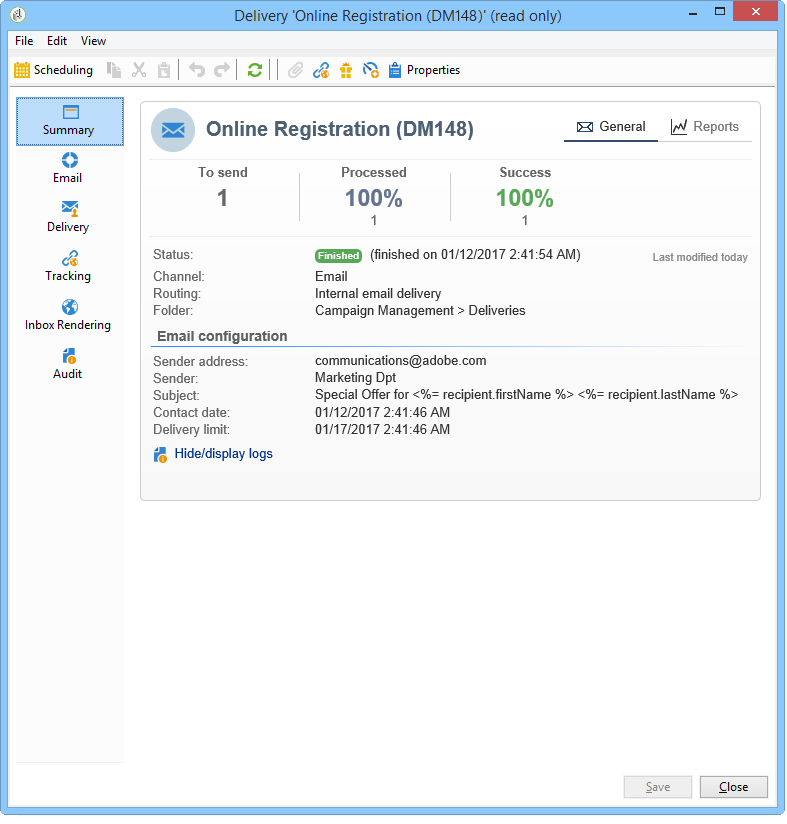
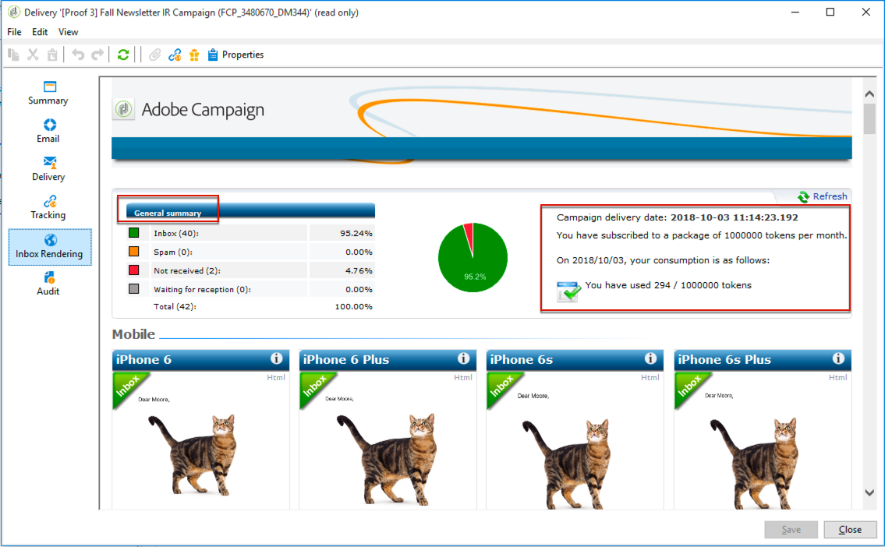
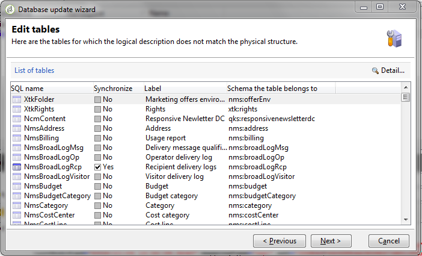

# Painel de entrega {#delivery-dashboard}


O **painel de delivery** é fundamental para monitorar seus deliveries e eventuais problemas encontrados durante o envio de mensagens.

Ele permite recuperar informações sobre um delivery e editá-las, se necessário. Lembre-se de que o conteúdo da guia não pode mais ser alterado após o envio do delivery.

Estas são as informações que você pode monitorar usando as várias guias disponíveis no painel:

* [Resumo da entrega](#delivery-summary)
* [Relatórios de entrega](#delivery-reports)
* [Logs do delivery, mirror pages, exclusões](#delivery-logs-and-history)
* [Histórico e logs de rastreamento da entrega](#tracking-logs)
* [Renderização de delivery](#delivery-rendering)
* [Auditoria de delivery](#delivery-audit-)



**Tópicos relacionados:**

* [Noções básicas sobre falhas de delivery](understanding-delivery-failures.md)
* [Noções básicas sobre gestão de quarentena](understanding-quarantine-management.md)
* [Práticas recomendadas de delivery](delivery-best-practices.md)
* [Gerenciamento da capacidade de delivery](about-deliverability.md)

## Resumo da entrega {#delivery-summary}

A guia **[!UICONTROL Summary]** contém as características da entrega: status da entrega, canal usado, informações sobre o remetente, assunto, informações relacionadas à execução.

## Relatórios de entrega {#delivery-reports}

O link **[!UICONTROL Reports]**, acessível na guia **[!UICONTROL Summary]**, permite que você veja um conjunto de relatórios referentes à ação do delivery: relatório geral do delivery, relatório detalhado, relatório do delivery, distribuição de mensagens com falha, taxa de abertura, cliques e transações, etc.

O conteúdo dessa guia pode ser configurado de acordo com os requisitos. Para obter mais informações sobre relatórios de delivery, consulte [esta seção](../../reporting/using/delivery-reports.md).


## Logs da entrega, histórico e exclusões {#delivery-logs-and-history}

A guia **[!UICONTROL Delivery]** fornece um histórico das ocorrências neste delivery. Ela contém os logs de delivery, ou seja, a lista de mensagens enviadas e seus status, e as mensagens associadas.

Para um delivery, você pode exibir (por exemplo) apenas os recipients com um delivery com falha ou um endereço em quarentena. Para fazer isso, clique no botão **[!UICONTROL Filters]** e selecione **[!UICONTROL By state]**. Em seguida, selecione o estado na lista suspensa. Vários status são listados [nesta página](delivery-statuses.md).

>[!NOTE]
>
>A lista que exibe os logs do delivery pode ser personalizada, como qualquer lista no Campaign Classic. Por exemplo, você pode adicionar uma coluna para saber qual endereço IP enviou cada email em um delivery. Para obter mais informações, consulte o caso de uso detalhado [nesta seção](#use-case).


O link **[!UICONTROL Display the mirror page for this message...]** permite exibir a mirror page do conteúdo do delivery selecionado na lista em uma nova janela.

A mirror page só está disponível para os deliveries para as quais o conteúdo HTML foi definido. Para obter mais informações, consulte [Geração da mirror page](sending-messages.md#generating-the-mirror-page).


## Histórico e logs de rastreamento da entrega {#tracking-logs}

A guia **[!UICONTROL Tracking]** lista o histórico de rastreamento desse delivery. Esta guia exibe os dados de rastreamento das mensagens enviadas, ou seja, todas as URLs sujeitas ao rastreamento por meio do Adobe Campaign. Os dados de rastreamento são atualizados de hora em hora.

>[!NOTE]
>
>Se o rastreamento não estiver ativado para um delivery, essa guia não será exibida.

A configuração de rastreamento é realizada no estágio apropriado do assistente do delivery. Consulte [Como configurar links rastreados](how-to-configure-tracked-links.md).

Os dados de **[!UICONTROL Tracking]** são interpretados nos relatórios de delivery. Consulte [esta seção](../../reporting/using/delivery-reports.md).


## Renderização da caixa de entrada {#delivery-rendering}

A guia **[!UICONTROL Inbox rendering]** permite que você visualize a mensagem enviada nos diferentes contextos em que ela pode ser recebida e verificar a compatibilidade nos principais desktops e aplicativos.

Assim você pode ter certeza de que a sua mensagem será exibida aos recipients de forma eficaz em uma variedade de clientes da web, webmails e dispositivos.

Para obter mais informações sobre renderização da Caixa de entrada, consulte [esta página](inbox-rendering.md)



## Auditoria de entrega {#delivery-audit-}

A guia **[!UICONTROL Audit]** contém o log de delivery e todas as mensagens relacionadas às provas.

O botão **[!UICONTROL Refresh]** permite atualizar os dados. Use o botão **[!UICONTROL Filters]** para definir um filtro nos dados.

Ícones especiais permitem identificar erros ou avisos. Consulte [Análise de delivery](steps-validating-the-delivery.md#analyzing-the-delivery).

A subguia **[!UICONTROL Proofs]** permite visualizar a lista de provas que foram enviadas.


Você pode modificar as informações exibidas nessa janela (e das guias **[!UICONTROL Delivery]** e **[!UICONTROL Tracking]**) selecionando as colunas a serem exibidas. Para fazer isso, clique no ícone **[!UICONTROL Configure list]** localizado no canto inferior direito. Para obter mais informações sobre a configuração de exibição de listas, consulte [esta seção](../../platform/using/adobe-campaign-workspace.md#configuring-lists).

## Sincronização do painel de entrega {#delivery-dashboard-synchronization}

No painel de delivery, convêm verificar as mensagens processadas e os logs de deliveries para garantir que seu delivery foi enviado com êxito.

Alguns indicadores ou status podem estar incorretos ou não atualizados, isso pode ser resolvido com as seguintes soluções:

* Se o status do delivery estiver incorreto, verifique se todas as aprovações necessárias foram feitas para esse delivery ou se os workflows **[!UICONTROL operationMgt]** e **[!UICONTROL deliveryMgt]** estão sendo executados sem erros. Isso também pode ser porque o delivery está usando uma afinidade não configurada na instância de envio.

* Se os indicadores de delivery ainda forem zero e se você estiver em uma configuração mid-sourcing, verifique o workflow técnico **[!UICONTROL Mid-sourcing (delivery counters)]**. Inicie-o se o status não for **[!UICONTROL Started]**. Você pode tentar recalcular os indicadores clicando com o botão direito do mouse no delivery relevante no gerenciador do Adobe Campaign e selecionando **[!UICONTROL Actions]** > **[!UICONTROL Recompute delivery and tracking indicators]**. Para obter mais informações sobre indicadores de rastreamento, consulte esta [seção](../../reporting/using/delivery-reports.md#tracking-indicators).

* Se o contador de delivery não corresponder ao seu delivery, tente recalcular os indicadores clicando com o botão direito do mouse no delivery relevante no explorador do Adobe Campaign e selecionando **[!UICONTROL Recompute delivery and tracking indicators]** > **[!UICONTROL Actions]** para sincronizar novamente. Para obter mais informações sobre indicadores de rastreamento, consulte esta [seção](../../reporting/using/delivery-reports.md#tracking-indicators).

* Se o seu contador de delivery não estiver atualizado para implantações de mid-sourcing, verifique se o workflow técnico **[!UICONTROL Mid-Sourcing (Delivery counters)]** está em execução. Para obter mais informações, consulte esta [página](../../installation/using/mid-sourcing-deployment.md).

Você também pode rastrear seus deliveries com relatórios diferentes através do painel de delivery. Para obter mais informações, consulte esta [seção](../../reporting/using/delivery-reports.md).

## Caso de uso: adição de endereços IP dos remetentes aos logs {#use-case}

Nesta seção, você verá como adicionar aos logs do delivery informações relacionadas ao endereço IP que enviou cada email em um delivery.

>[!NOTE]
>
>Essa modificação é diferente se você estiver usando uma única instância ou instância mid-sourcing. Antes de fazer a modificação, verifique se você está conectado à instância de envio de email.

### Etapa 1: Estender o esquema

Para adicionar **publicID** em seus logs do delivery, primeiro é necessário estender o esquema. Você pode continuar conforme os passos a seguir.

1. Crie uma extensão de esquema, em **[!UICONTROL Administration]** > **[!UICONTROL Configuration]** > **[!UICONTROL Data Schemas]** > **[!UICONTROL New]**.

   Para obter mais informações sobre extensões de esquema, consulte [esta página](../../configuration/using/extending-a-schema.md).

1. Selecione **[!UICONTROL broadLogRcp]** para estender os logs do delivery do recipient (nms) e definir um namespace personalizado. Neste caso, será &quot;cus&quot;:

   

   >[!NOTE]
   >
   >Se sua instância estiver no Mid-sourcing, você precisará trabalhar com o esquema broadLogMid.

1. Adicione o novo campo na sua extensão. Nessa amostra, é necessário substituir:

   ```
   <element img="nms:broadLog.png" label="Recipient delivery logs" labelSingular="Recipient delivery log" name="broadLogRcp"/>
   ```

   por:

   ```
   <element img="nms:broadLog.png" label="Recipient delivery logs" labelSingular="Recipient delivery log" name="broadLogRcp">
   <attribute desc="Outbound IP identifier" label="IP identifier"
   name="publicId" type="long"/>
   </element>
   ```

   

### Etapa 2: atualizar estrutura do banco de dados

Quando as modificações forem feitas, será necessário atualizar a estrutura do banco de dados para que ela esteja alinhada à descrição lógica.

Para fazer isso, siga as etapas abaixo:

1. Clique no menu **[!UICONTROL Tools]** > **[!UICONTROL Advanced]** > **[!UICONTROL Update database structure...]**.

   

1. Na janela **[!UICONTROL Edit tables]**, a tabela **[!UICONTROL NmsBroadLogRcp]** está marcada (ou a tabela **[!UICONTROL broadLogMid]** se estiver em um ambiente Mid-sourcing), como abaixo:

   

   >[!IMPORTANT]
   >
   >Verifique sempre se não há outra modificação, exceto a tabela **[!UICONTROL NmsBroadLoGRcp]** (ou a tabela **[!UICONTROL broadLogMid]** se estiver em um ambiente Mid-sourcing). Em caso afirmativo, desmarque as outras tabelas.

1. Clique em **[!UICONTROL Next]** para validar. A seguinte tela é exibida:

   

1. Clique em **[!UICONTROL Next]** e em **[!UICONTROL Start]** para iniciar a atualização da estrutura do banco de dados. A construção de índice está iniciando. Essa etapa pode ser longa, dependendo do número de linhas na tabela **[!UICONTROL NmsBroadLogRcp]**.

   

>[!NOTE]
>
>Depois que a atualização da estrutura física do banco de dados for concluída com êxito, você precisará desconectar e reconectar para que suas modificações sejam consideradas.

### Etapa 3: validar a modificação

Para confirmar se tudo funcionou corretamente, é necessário atualizar a tela de logs do delivery.

Para fazer isso, acesse os logs do delivery e adicione a coluna &quot;Identificador IP&quot;.


>[!NOTE]
>
>Para saber como configurar listas na interface do Campaign Classic, consulte [esta página](../../platform/using/adobe-campaign-workspace.md).

Abaixo está o que você deve ver na guia **[!UICONTROL Delivery]** após as modificações:


