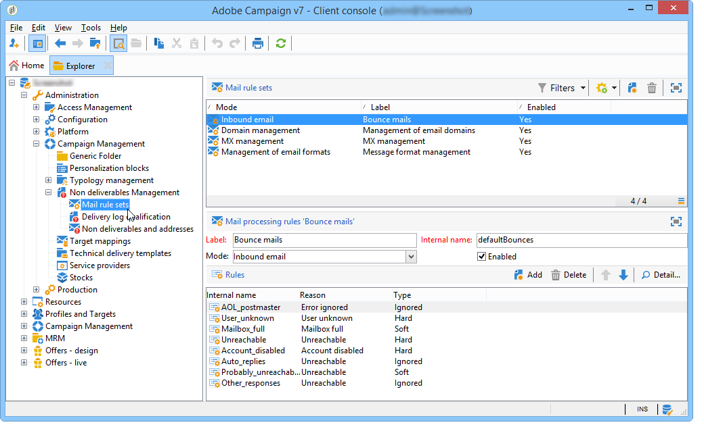

# Falhas de entrega e gerenciamento de quarentena {#delivery-failures-quarantine}

>[!NOTE]
>
>Orientações abrangentes sobre falhas de delivery e gerenciamento de quarentena estão documentadas na documentação do Campaign v8. Esse conteúdo se aplica aos usuários do Campaign Classic v7 e do Campaign v8:
>
>* [Noções básicas sobre falhas de entrega](https://experienceleague.adobe.com/en/docs/campaign/campaign-v8/send/monitor/delivery-failures){target="_blank"} - Abrange tipos de falha, motivos de erro, erros síncronos/assíncronos, gerenciamento de tentativas e solução de problemas
>* [Gerenciamento de quarentena](https://experienceleague.adobe.com/en/docs/campaign/campaign-v8/send/monitor/quarantines){target="_blank"} - Abrange quarentena versus inclui na lista de bloqueios, limites de erro suaves, relatórios de quarentena e remoção de endereço
>
>Esta página documenta a **configuração específica do Campaign Classic v7** para email de devolução e gerenciamento de quarentena em implantações híbridas e locais.

## Compreensão de falhas de entrega

Para obter conceitos comuns de falha de entrega, tipos de erro e orientação para solução de problemas, consulte a [documentação de Noções básicas sobre falhas de entrega do Campaign v8](https://experienceleague.adobe.com/en/docs/campaign/campaign-v8/send/monitor/delivery-failures){target="_blank"}.

## Configuração de email de devolução {#bounce-mail-config}

As seguintes opções de configuração estão disponíveis para **implantações híbridas/no local do Campaign Classic v7** para gerenciar o processamento de emails de devolução.

### Configuração de caixa de correio de devolução {#bounce-mailbox-configuration}

Para instalações locais, a configuração da caixa de correio de devolução está detalhada em [esta seção](../../installation/using/deploying-an-instance.md#managing-bounced-emails).

As mensagens de erro assíncronas são coletadas pela plataforma Adobe Campaign por meio da caixa de entrada de devolução e qualificadas pelo processo inMail para enriquecer a lista de regras de gestão de email.

>[!NOTE]
>
>Para usuários do Campaign v8 Managed Cloud Services, a configuração da caixa de entrada de devolução é executada e gerenciada pela Adobe. Nenhuma configuração é necessária.

### Gerenciamento de qualificação de email de devolução {#bounce-mail-qualification-management}

Para instalações no local e instalações hospedadas/híbridas usando o MTA herdado do Campaign, quando a entrega de um email falha, o servidor de entrega do Adobe Campaign recebe uma mensagem de erro do servidor de mensagens ou do servidor DNS remoto. A lista de erros é formada por strings contidas na mensagem retornada pelo servidor remoto. Tipos de falhas e motivos são atribuídos a cada mensagem de erro.

Essa lista está disponível por meio do nó **[!UICONTROL Administration > Campaign Management > Non deliverables Management > Delivery log qualification]**. Ela contém todas as regras usadas pelo Adobe Campaign para qualificar as falhas de entrega. Ele é infinita e é regularmente atualizada pelo Adobe Campaign e também pode ser gerenciada pelo usuário.

A mensagem retornada pelo servidor remoto na primeira ocorrência desse tipo de erro é exibida na coluna **[!UICONTROL First text]** da tabela **[!UICONTROL Delivery log qualification]**. Se essa coluna não for exibida, clique no botão **[!UICONTROL Configure list]** na parte inferior direita da lista para selecioná-la.

O Adobe Campaign filtra essa mensagem para excluir o conteúdo variável (como IDs, datas, endereços de email, números de telefone, etc.) e exibe o resultado filtrado na coluna **[!UICONTROL Text]**. As variáveis são substituídas por **`#xxx#`**, exceto os endereços que são substituídos por **`*`**.

Esse processo permite reunir todas as falhas do mesmo tipo e evitar várias entradas para erros semelhantes na tabela de qualificação do log de entrega.

>[!NOTE]
>
>O campo **[!UICONTROL Number of occurrences]** exibe o número de ocorrências da mensagem na lista. É limitado a 100 mil ocorrências. Você pode editar o campo, se desejar como, por exemplo, redefini-lo.

Os emails de devolução podem ter o seguinte status de qualificação:

* **[!UICONTROL To qualify]**: o email de devolução não pôde ser qualificado. A qualificação deve ser atribuída à equipe de capacidade de entrega para garantir uma plataforma eficiente de deliverability. Contanto que não seja qualificado, o email de devolução não é usado para enriquecer a lista de regras de gestão de email.
* **[!UICONTROL Keep]**: o email de devolução foi qualificado e será usado pelo fluxo de trabalho **Atualizar para entrega** para ser comparado às regras de gerenciamento de email existentes e enriquecer a lista.
* **[!UICONTROL Ignore]**: o email de rejeição é ignorado pelo MTA do Campaign, o que significa que essa rejeição nunca fará com que o endereço do destinatário seja colocado em quarentena. Ele não será usado pelo fluxo de trabalho **Atualizar para entrega** e não será enviado para instâncias do cliente.

>[!NOTE]
>
>No caso de uma interrupção de um ISP, os emails enviados pelo Campaign serão marcados incorretamente como rejeições. Para corrigir isso, você precisa atualizar a qualificação de rejeição. Para obter mais informações, consulte [esta seção](update-bounce-qualification.md).

### Configuração das regras de gerenciamento de email {#email-management-rules}

As regras de email são acessadas pelo nó **[!UICONTROL Administration > Campaign Management > Non deliverables Management > Mail rule sets]**. As regras de gestão de email são exibidas na parte inferior da janela.

>[!NOTE]
>
>Os parâmetros padrão da plataforma são configurados no assistente de implantação. Para obter mais informações, consulte [esta seção](../../installation/using/deploying-an-instance.md).

As regras padrão são as seguintes:

>[!IMPORTANT]
>
>* O servidor de delivery (MTA) deverá ser reiniciado se os parâmetros forem alterados.
>* A modificação ou a criação de regras de gestão é somente para usuários avançados.

#### Email de entrada {#inbound-email}

Essas regras contêm as cadeias de caracteres que podem ser retornadas por servidores remotos e que permitem qualificar o erro (**Grave**, **Leve** ou **Ignorado**).

Quando um email falha, o servidor remoto retorna uma mensagem de devolução ao endereço especificado nos parâmetros da plataforma. O Adobe Campaign compara o conteúdo de cada mensagem de rejeição nas cadeias de caracteres da lista de regras e o atribui a um dos três tipos de erro.

>[!NOTE]
>
>O usuário pode criar as próprias regras. Ao importar um pacote e ao atualizar dados por meio do fluxo de trabalho **Atualizar para deliverability**, as regras criadas pelo usuário são substituídas.

Para obter mais informações sobre qualificação de emails rejeitados, consulte [esta seção](#bounce-mail-qualification-management).

#### Gerenciamento de domínio {#domain-management}

Para instalações locais, o MTA aplica uma única regra de **Gerenciamento de domínio** a todos os domínios.

<!---->

* Você pode escolher se ativa ou não determinados padrões de identificação e chaves de criptografia para verificar o nome do domínio, como **ID do remetente**, **DomainKeys**, **DKIM**, e **S/MIME**.
* Os parâmetros de **retransmissão SMTP** permitem configurar o endereço IP e a porta de um servidor de retransmissão para um determinado domínio. Para obter mais informações, consulte [esta seção](../../installation/using/configuring-campaign-server.md#smtp-relay).

Se suas mensagens exibirem **[!UICONTROL on behalf of]** no endereço do remetente, não assine emails com a **ID do Remetente**, que é o padrão de autenticação de email proprietário obsoleto da Microsoft. Se a opção **[!UICONTROL Sender ID]** estiver habilitada, desmarque a caixa correspondente e entre em contato com o [Atendimento ao cliente da Adobe](https://helpx.adobe.com/br/enterprise/admin-guide.html/enterprise/using/support-for-experience-cloud.ug.html). Sua capacidade de entrega não será afetada.

#### Gerenciamento de MX {#mx-management}

Para instalações no local, as regras de gestão MX são usadas para regular o fluxo de emails de saída para um domínio específico.

<!---->

Essas regras estão disponíveis no assistente de implantação e podem ser personalizadas:

* **[!UICONTROL MX Management]**: esta regra é usada para controlar o fluxo de emails de saída para um domínio. Ele faz amostras de mensagens rejeitadas e bloqueia o envio quando apropriado.

* **[!UICONTROL Period]**: o período durante o qual as mensagens são limitadas ou bloqueadas.

* **[!UICONTROL Limit]**: o número máximo de mensagens permitidas por período.

* **[!UICONTROL Type]**: o tipo de erro (grave, suave ou ignorado) usado para determinar o comportamento de envio. Consulte a [documentação do Campaign v8](https://experienceleague.adobe.com/en/docs/campaign/campaign-v8/send/monitor/delivery-failures){target="_blank"} para obter as definições de tipo de erro.

Para obter mais informações sobre gestão MX, consulte [esta seção](../../installation/using/email-deliverability.md#about-mx-rules).

>[!NOTE]
>
>Para usuários do Campaign v8 Managed Cloud Services, as regras MX e o gerenciamento do fluxo de email são gerenciados pela Adobe como parte da infraestrutura gerenciada. Entre em contato com o Atendimento ao cliente da Adobe se precisar ajustar as configurações MX para casos de uso específicos.

## Gerenciamento de quarentena {#quarantine-management}

Para obter orientação abrangente sobre gerenciamento de quarentena, consulte a [documentação sobre o gerenciamento de quarentena do Campaign v8](https://experienceleague.adobe.com/en/docs/campaign/campaign-v8/send/monitor/quarantines){target="_blank"}.

## Configuração de quarentena {#quarantine-config}

As seguintes opções de configuração estão disponíveis para **implantações híbridas/no local do Campaign Classic v7** para personalizar o comportamento da quarentena.

### Configuração de limite de erro leve {#soft-error-threshold}

Para instalações locais que usam o MTA herdado do Campaign, você pode modificar o número de erros e o período entre dois erros antes que um endereço seja colocado em quarentena.

Para definir essas configurações:

1. Acessar o assistente de implantação de **[!UICONTROL Tools]** > **[!UICONTROL Advanced]** > **[!UICONTROL Deployment wizard]**
2. Navegue até **[!UICONTROL Email channel]** > **[!UICONTROL Advanced parameters]**
3. Configurar:
   * **Número de erros**: o número máximo de erros leves antes que um endereço seja colocado em quarentena (padrão: 5)
   * **Período entre dois erros significativos**: a janela de tempo (em segundos) para contagem de erros (padrão: 86.400 segundos = 1 dia)

Quando o contador de erros atinge o limite, o endereço é colocado em quarentena. Se o último erro significativo ocorreu há mais de 10 dias, o contador de erros é reinicializado.

Para obter mais detalhes, consulte [esta página](communication-channels.md) em **Envio de entrega** > **Configurar novas tentativas**.

>[!NOTE]
>
>Para usuários do Campaign v8 Managed Cloud Services, as configurações de repetição e os limites de erro são gerenciados pela Adobe com base no desempenho de IP e na reputação do domínio. Nenhuma configuração é necessária.

### Fluxo de trabalho de limpeza do banco de dados {#database-cleanup-workflow}

Para instalações locais, o fluxo de trabalho técnico do **[!UICONTROL Database cleanup]** remove automaticamente os endereços em quarentena que correspondem a condições específicas.

Acesse este fluxo de trabalho de **[!UICONTROL Administration]** > **[!UICONTROL Production]** > **[!UICONTROL Technical workflows]** > **[!UICONTROL Database cleanup]**.

O workflow remove endereços da quarentena nos seguintes casos:

* Endereços no status **[!UICONTROL With errors]** após uma entrega bem-sucedida
* Endereços no status **[!UICONTROL With errors]** se a última rejeição temporária tiver ocorrido há mais de 10 dias
* Endereços no status **[!UICONTROL With errors]** com erro **[!UICONTROL Mailbox full]** após 30 dias

Verifique se esse workflow é executado regularmente (recomendado: diariamente) para manter a higiene das listas de quarentena.

Para obter mais informações sobre limpeza de banco de dados, consulte [esta seção](../../production/using/database-cleanup-workflow.md).

>[!NOTE]
>
>Para usuários do Campaign v8 Managed Cloud Services, o fluxo de trabalho de limpeza do banco de dados é monitorado e gerenciado pela Adobe.

### Especificações da quarentena de notificação por push {#push-quarantine-specifics}

Para o Campaign Classic v7, as quarentenas de notificação por push seguem o mecanismo geral de quarentena com alguns comportamentos específicos de canal.

Para notificações por push do **iOS** e do **Android**, o mecanismo de quarentena usa tokens de dispositivo em vez de endereços de email. Quando um aplicativo móvel é desinstalado ou reinstalado, o token associado é colocado em quarentena.

Para obter informações detalhadas sobre cenários de quarentena de notificação por push (tipos de erro do iOS e do Android, comportamento de repetição etc.), consulte a [Documentação de noções básicas sobre falhas de entrega](https://experienceleague.adobe.com/en/docs/campaign/campaign-v8/send/monitor/delivery-failures){target="_blank"}, que inclui tabelas de tipo de erro de notificação por push abrangentes.

### Especificações da quarentena de SMS {#sms-quarantine-specifics}

Para o Campaign Classic v7, as quarentenas de SMS seguem o mecanismo de quarentena geral com alguns comportamentos específicos de canal relacionados a números de telefone em vez de endereços de email.

O mecanismo de quarentena de SMS varia dependendo do conector usado:

* **Conectores SMPP padrão**: as regras de qualificação de erro definidas em **[!UICONTROL Administration > Campaign Management > Non deliverables Management > Delivery log qualification]** se aplicam às entregas de SMS.

* **Conector SMPP genérico estendido**: o gerenciamento de erros é tratado de forma diferente usando expressões regulares (regexes) para analisar mensagens de Relatório de Status (SR) retornadas pelo provedor SMSC.

Para obter informações detalhadas sobre cenários de quarentena de SMS e tipos de erro, consulte a documentação [Noções básicas sobre falhas de entrega](https://experienceleague.adobe.com/en/docs/campaign/campaign-v8/send/monitor/delivery-failures){target="_blank"}, que inclui tabelas abrangentes de tipos de erro de SMS.

## Tópicos relacionados

* [Noções básicas sobre falhas de entrega](https://experienceleague.adobe.com/en/docs/campaign/campaign-v8/send/monitor/delivery-failures){target="_blank"} (documentação do Campaign v8)
* [Gerenciamento de quarentena](https://experienceleague.adobe.com/en/docs/campaign/campaign-v8/send/monitor/quarantines){target="_blank"} (documentação do Campaign v8)
* [Práticas recomendadas de entrega](https://experienceleague.adobe.com/en/docs/campaign/campaign-v8/start/delivery-best-practices){target="_blank"} (documentação do Campaign v8)
* [Status de entrega](https://experienceleague.adobe.com/en/docs/campaign/campaign-v8/send/monitor/delivery-statuses){target="_blank"} (documentação do Campaign v8)
* [Fluxo de trabalho de limpeza do banco de dados](../../production/using/database-cleanup-workflow.md) (v7 híbrido/no local)
* [Configurar novas tentativas de entrega](communication-channels.md) (v7 híbrido/no local)
* [Atualizar qualificação de rejeição](update-bounce-qualification.md) (v7 híbrido/no local)
* [Configuração da capacidade de entrega de email](../../installation/using/email-deliverability.md) (v7 híbrido/no local)
* [Implantando uma instância](../../installation/using/deploying-an-instance.md#managing-bounced-emails) (v7 híbrido/no local)

