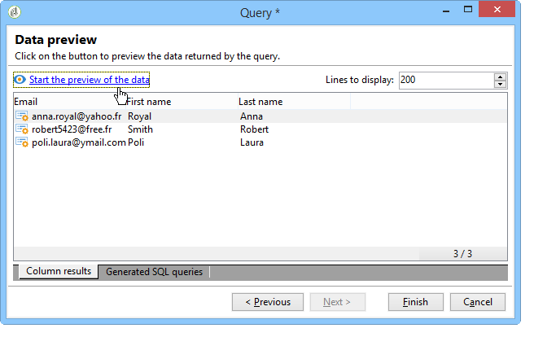

# Enriquecimento de conteúdo{#enriching-content}


Agregadores permitem enriquecer o conteúdo com dados externos. Esses dados vêm de queries genéricos ou tabelas vinculadas.

## Consultas genéricas {#generic-queries}

Os queries são configurados por meio do template de publicação na guia **[!UICONTROL Aggregator]**.

Os dados recuperados enriquecem o documento de saída XML por meio de seu elemento principal.

Exemplo de retorno de um query no schema do recipient (**nms:recipient**):

```
<book name="Content Management">
  ...
  <collection-recipient>
    <recipient lastName="Doe" firstName="John" email="john.doe@aolf.com">
    ...
  </collection-recipient>
</book>
```

O elemento **`<collection-recipient>`** representa o elemento de entrada do documento resultante de um query. Os dados recuperados são retornados sob este elemento; em nosso exemplo, uma lista de recipients.

### Adição de uma consulta {#adding-a-query}

Os parâmetros de query são editados por um assistente.

1. Na primeira página, especifique o rótulo e o schema que contém os dados a serem recuperados.

   

   >[!NOTE]
   >
   >O campo de edição **Caminho** é usado para renomear o elemento de saída do query.

1. A próxima página permite que você selecione os dados a serem recuperados.

   

1. A próxima página define a condição do filtro.

   

1. A última página inicia uma pré-visualização dos dados retornados pelo query.

   

## Tabelas vinculadas {#linked-tables}

Os links permitem recuperar dados externos vinculados ao conteúdo.

Existem dois tipos de dados vinculados:

* Links de conteúdo: esse é o modo de gestão de conteúdo nativo. O conteúdo do link é automaticamente integrado no documento de saída XML.
* Links para tabelas externas dão acesso a todas as outras tabelas do banco de dados com a restrição de recuperar os dados do link selecionado com um agregador.

### Link para um esquema de conteúdo {#link-to-a-content-schema}

Um link de conteúdo é declarado no schema de dados da seguinte maneira:

```
<element expandSchemaTarget="cus:chapter" label="Main chapter" name="mainChapter" type="string"/>
```

A definição do link é preenchida em uma **string** tipo **`<element>`**, e o atributo **expandSchemaTarget** faz referência ao schema target (&quot;cus:chapter&quot; em nosso exemplo). O schema referenciado deve ser um schema de conteúdo.

O conteúdo do elemento target enriquece o elemento link, ou seja, o elemento **`<chapter>`** em nosso schema de exemplo:

```
<mainChapter computeString="Introduction" id="7011" title="Introduction" xtkschema="cus:chapter">    
  <page>Introduction to input <STRONG>forms</STRONG>.</page>
</mainChapter>
```

>[!NOTE]
>
>A **Cálculo de cadeia de caracteres** do link é apresentada a partir do atributo **computeString**.

No formulário de entrada, o controle de edição do link é declarado da seguinte maneira:

```
<input type="articleEdit" xpath="mainChapter"/>
```


O ícone **[!UICONTROL Magnifier]** permite a abertura do formulário de edição do elemento vinculado.

#### Coleção de links {#link-collection}

Para preencher uma coleção de links, adicione o atributo **unbound=&quot;true&quot;** à definição do elemento do link no schema de dados:

```
<element expandSchemaTarget="cus:chapter" label="List of chapters" name="chapter"  ordered="true" unbound="true"/>
```

O conteúdo do elemento direcionado enriquece cada elemento de coleta:

```
<chapter computeString="Introduction" id="7011" title="Introduction" xtkschema="cus:chapter">    
  <page>Introduction to input <STRONG>forms</STRONG>.</page>
</chapter>
```

No formulário de entrada, o controle de lista é declarado da seguinte maneira:

```
<input editable="false" nolabel="true" toolbarCaption="List of chapters" type="articleList" xpath="chapter" zoom="true"/>
```


Uma coluna padrão é exibida para mostrar a **Cálculo de string** dos elementos pretendidos.

### Links para tabelas externas {#links-to-external-tables}

Um link para uma tabela externa é declarado no schema de dados da seguinte maneira:

```
<element label="Main contact" name="mainContact" target="nms:recipient" type="link"/>
```

A definição do link é preenchida em um **link** tipo **`<element>`**, e o atributo **target** faz referência ao schema target (&quot;nms:recipient&quot; em nosso exemplo).

Por convenção, os links devem ser declarados do elemento principal do schema de dados.

O **Compute string** e a chave do elemento target enriquecem os atributos **`<name>-id`** e **`<name>-cs`** no elemento principal.

No nosso exemplo, o link é preenchido no schema &quot;cus:book&quot;, o conteúdo dos dados do link está contido nos atributos &quot;mainContact-id&quot; e &quot;mainContact-cs&quot;:

```
<book computeString="Content management" date="2006/06/08" id="6106" language="en" mainContact-cs="John Doe (john.doe@adobe.com)" mainContact-id="3012" name="Content management" xtkschema="cus:book">
```

O controle de edição de link é declarado da seguinte maneira:

```
<input xpath="mainContact"/>
```


Você pode restringir a opção de elementos target adicionando o elemento **`<sysfilter>`** pela definição do link no formulário de entrada:

```
<input xpath="mainContact">
  <!-- Filter the selection of the link on the Adobe domain -->
  <sysFilter>
    <condition expr="@domain =  'adobe.com '"/>
  </sysFilter>
</input>
```

>[!NOTE]
>
>Essa restrição também se aplica aos links de conteúdo.

#### Coleção de links {#link-collection-1}

A definição da coleção é idêntica à definição de uma lista em elementos de coleção:

```
<element label="List of contacts" name="contact" unbound="true">
  <element label="Recipient" name="recipient" target="nms:recipient" type="link"/>
</element>
```

No formulário de entrada, o controle de lista é declarado da seguinte maneira:

```
<input nolabel="true" toolbarCaption="List of contacts" type="list" xpath="contact">
  <input xpath="recipient"/>
</input>
```


>[!NOTE]
>
>A lista é editável e permite selecionar o link de um controle de tipo &quot;link&quot; apresentado acima.

O conteúdo do elemento target enriquece cada elemento de coleção no documento de saída:

```
<contact id="11504978621" recipient-cs="Doe John (john.doe@adobe.com)" recipient-id="3012"/>
<contact id="11504982510" recipient-cs="Martinez Peter (peter.martinez@adobe.com)" recipient-id="3013"/>
```

#### Agregação de links {#link-aggregation}

O conteúdo de cada link referenciado é limitado à chave interna e ao elemento pretendido do **Cálculo de string**.

Um script JavaScript é usado para enriquecer o conteúdo dos links por queries SOAP.

**Exemplo**: Adicionar o nome do recipient ao link &quot;mainContact&quot; e aos links de coleção &quot;contact&quot;:

```
// Update <mainContact> link
var mainContactId = content.@['mainContact-id']
var query = xtk.queryDef.create(
    <queryDef schema="nms:recipient" operation="get">
      <select>
        <node expr="@lastName"/>
      </select>
      <where>
        <condition expr={"@id="+mainContactId}/>
      </where>
    </queryDef>)

var recipient = query.ExecuteQuery()
content.mainContact.@lastName = recipient.@lastName

// Update <contact> link collection
for each(var contact in content.contact)
{
  var contactId = contact.@['recipient-id']
  var query = xtk.queryDef.create(
    <queryDef schema="nms:recipient" operation="get">
      <select>
        <node expr="@lastName"/>
      </select>
      <where>
        <condition expr={"@id="+contactId}/>
      </where>
    </queryDef>
  )
  
  var recipient = query.ExecuteQuery()
  contact.@lastName = recipient.@lastName
}
```

O resultado obtido após a execução do script:

```
<mainContact lastName="Doe"/>

<contact id="11504978621" lastName="Doe" recipient-cs="Doe John (john.doe@adobe.com)" recipient-id="3012"/>  
<contact id="11504982510" lastName="Martinez" recipient-cs="Martinez Peter (peter.martinez@adobe.com)" recipient-id="3013"/> 
```

O conteúdo do código JavaScript é adicionado por meio da pasta **[!UICONTROL Administration > Configuration > Content management > JavaScript Codes]** e deve ser preenchido no template de publicação para cada transformação.


