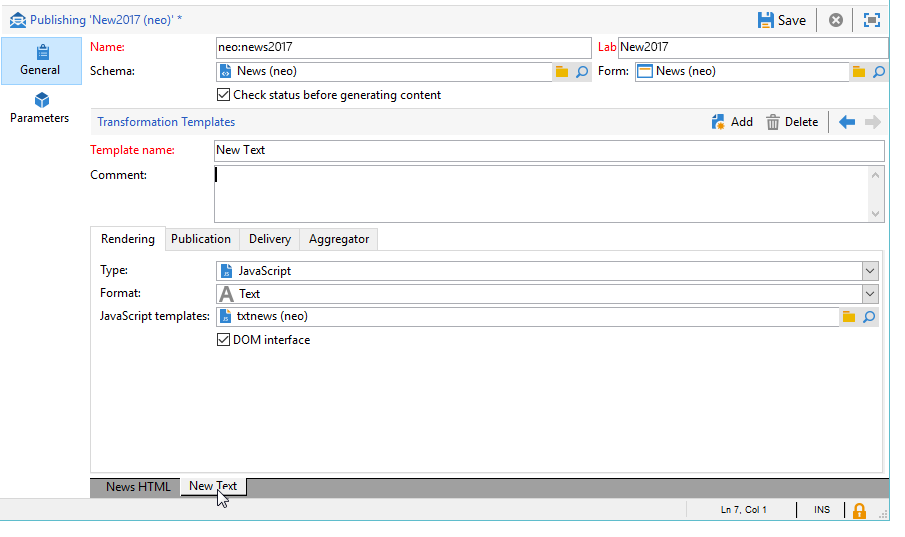
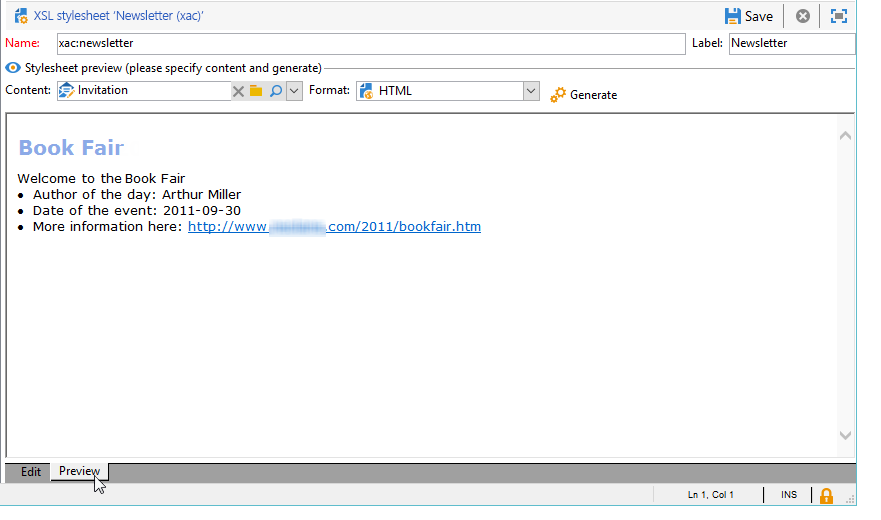

# Formatação{#formatting}


## Modelos JavaScript {#javascript-templates}

Um template JavaScript é um documento HTML ou texto que inclui código JavaScript. Ele é criado da mesma forma que um conteúdo de email em uma ação de delivery.

### Identificação de um modelo JavaScript {#identification-of-a-javascript-template}

Um template JavaScript é identificado por seu nome e namespace como schemas e formulários. No entanto, é recomendável adicionar a opção **.js** ao nome do template.

### Estrutura de um modelo JavaScript {#structure-of-a-javascript-template}

Exemplo de um template de formatação HTML de JavaScript baseado no schema &quot;cus:book&quot;:

```
<html>
  <body>
    <!-- Title of book -->
    <h1><%= content.@name %></h1>
    <ul>
      <% for each(var chapter in content.chapter) { %>
        <li><%= chapter.@name %></li>
      <% }%>
    </ul>
  </body>
</html>
```

As várias diretivas JavaScript aparecem no seguinte formulário:

* Campos de mesclagem: exibe o conteúdo dos dados com a **`<%= <source> %>`** sintaxe onde `<source>`é o campo de origem dos dados a serem exibidos.
* Blocos de instrução: executa uma série de instruções JavaScript incluídas entre as tags &lt;% e %>.

O objeto de **conteúdo** representa o elemento principal do documento XML de entrada.

Em nosso exemplo, a linha a seguir exibe o conteúdo do nome do livro de nomes:

```
<h1><%= content.@name %></h1>
```

O código a seguir itera no `<chapter>` elemento de coleção:

```
<% for each(var chapter in content.chapter) { %>
  <li><%= chapter.@name %></li>
<% }%>
```

Os atributos e elementos do conteúdo são representados como objetos JavaScript e respeitam a estrutura do documento de origem.

**Exemplo**:

* **conteúdo.@name**: recupera o valor do atributo &quot;name&quot; do elemento principal
* **conteúdo.@`['name']`**: idêntico ao **conteúdo.sintaxe @name**
* **content.chapter.length**: retorna o número de elementos no `<chapter` elemento de coleção
* **content.chapter`[0]`.@name**: recupera o nome do primeiro `<chapter>` elemento
* **chapter.name()**: retorna o nome do `<chapter>` elemento
* **chapter.parent().name()**: retorna o nome do elemento primário de `<chapter>`

>[!CAUTION]
>
>Como o caractere &#39;-&#39; é reservado na linguagem JavaScript, a recuperação do valor de qualquer atributo ou elemento que contém esse caractere deve ser executada por meio da sintaxe `['<field>']`.
>
>Por exemplo: `content.@['offer-id']`.

Todos os recursos de uma linguagem de programação (variáveis, loops, testes condicionais, funções e etc.) estão disponíveis para criar o documento de saída. As APIs SOAP são acessíveis para enriquecer o documento de saída.

Exemplos:

* Teste condicional:

   ```
   <% if (content.@number == 1 || content.@language == 'en') { %>
   <!-- Content to be displayed if test is true--> 
   <% } %>
   ```

* Chamada de função:

   ```
   <!-- Displays a horizontal bar -->
   ;<% function DisplayHorizontalBar() { %>
     <hr/>
   <% } %> 
   
   <!-- The same function in a block  -->
   <% 
   function DisplayHorizontalBar2()
   {
     document.write('<hr/>');
   }
   %> 
   
   <!-- Returns the value in uppercase -->
   <% 
   function formatName(value)
   { 
     return value.toUpperCase(); 
   }
   %>
   
   <!-- Call functions -->
   <%= DisplayHorizontalBar1() %>
   <%= DisplayHorizontalBar2() %>
   <%= formatName(content.@name) %>
   ```

* Declarações e chamada variável:

   ```
   <%  var counter = 0; %>
   
   <%= counter += 10 %>
   ```

* Recuperação e exibição de um nome de recipient com métodos estáticos:

   ```
   <% var recipient = nms.recipient.get(1246); %>
   <%= recipient.lastName %>
   ```

* Recuperação e exibição de um nome de recipient com métodos não estáticos:

   ```
   <% var query = xtk.queryDef.create(
     <queryDef schema="nms:recipient" operation="get">
       <select>
         <node expr="@lastName"/>
       </select>
       <where>
         <condition expr="@id=1246"/>
       </where>
     </queryDef>);
   
     var recipient = query.ExecuteQuery();
   %>
   
   <%= recipient.@lastName %>
   ```

### Inclusão de um modelo JavaScript {#including-a-javascript-template}

É possível constituir uma biblioteca de funções ou variáveis para uso posterior. Para fazer isso, importe o template JavaScript com a função **eval.** Isso permite enriquecer contextos com funções adicionais declaradas em outros templates JavaScript.

**Exemplo**: importação do template **common.jsp**.

```
<% eval(xtk.javascript.get("cus:common.js").data);  %>
```

### Edição de um modelo JavaScript {#editing-a-javascript-template}

A zona de edição permite que você preencha o conteúdo do template JavaScript:


>[!NOTE]
>
>O schema do modelo de dados associados deve ser preenchido para a inicialização de objetos JavaScript.

Para gerar a pré-visualização do documento de saída a qualquer momento, selecione um conteúdo e um formato de saída (HTML, Texto, XML) e clique em **[!UICONTROL Generate]**:


>[!NOTE]
>
>Não é necessário salvar as alterações para visualizar o documento de saída.

### Exemplo de como criar e usar um modelo JavaScript {#example-of-how-to-create-and-use-a-javascript-template}

Abaixo você encontrará a configuração necessária para implementar a seguinte gestão de conteúdo usando um template JavaScript:


Este exemplo envolve as seguintes etapas:

1. Crie o seguinte schema (neste caso: **neo:news**):

   ```
   <srcSchema _cs="Invitation (neo)"   entitySchema="xtk:srcSchema" img="xtk:schema.png" label="Invitation" mappingType="sql" name="news" namespace="neo" xtkschema="xtk:srcSchema">
   
     <enumeration basetype="string" default="en" name="language">
       <value label="Français" name="fr" value="fr"/>
       <value label="English" name="gb" value="gb"/>
     </enumeration>
   
     <enumeration basetype="string" name="css">
       <value label="Blue" name="bl" value="blue"/>
       <value label="Orange" name="or" value="orange"/>
     </enumeration>
   
     <element label="Intervenants" name="attendee">
       <key internal="true" name="id">
         <keyfield xpath="@id"/>
       </key>
       <attribute label="Name" name="name" type="string"/>
       <element label="Image" name="image" target="xtk:fileRes" type="link"/>
       <attribute label="Description" name="description" type="string"/>
       <attribute default="Gid()" label="Id" name="id" type="long"/>
     </element>
   
     <element label="Invitation" name="news" template="ncm:content" xmlChildren="true">
   
       <compute-string expr="@name"/>
       <attribute enum="language" label="Language" name="language" type="string"/>
       <attribute enum="css" label="Stylesheet" name="css" type="string"/>
       <attribute label="Title" name="title" type="string"/>
       <element label="Presentation" name="presentation" type="html"/>
       <attribute label="Date" name="date" type="date"/>
       <element label="Attendees list" name="attendeesList" ordered="true" ref="attendee" unbound="true"/>
   
     </element>
   </srcSchema>
   ```

1. Crie o formulário de do tipo **[!UICONTROL Content management]** vinculado (**neo:news**)

   ```
   <form _cs="News (neo)" entitySchema="xtk:form"  img="xtk:form.png" label="News"  name="news" namespace="neo" type="contentForm" xtkschema="xtk:form">
   
     <container type="iconbox">
       <container label="Invitation">
         <input xpath="@langue"/>
         <input xpath="@css"/>
         <input xpath="@title"/>
         <input xpath="@date"/>
         <input xpath="presentation"/>
       </container>
   
       <container label="Intervenants">
         <container toolbarCaption="Liste des intervenants" type="notebooklist" xpath="attendeesList" xpath-label="@nom">
           <container>
             <input xpath="@nom"/>
             <input img="nl:sryimage.png" newEntityFormChoice="true" xpath="image">
               <sysFilter>
                 <condition expr="@isImage = true"/>
               </sysFilter>
             </input>
             <input xpath="@description"/>
           </container>
         </container>
       </container>
     </container>
   
   </form>
   ```

1. Crie os templates JavaScript com o conteúdo de mensagem para formatos HTML e Texto.

   * No nosso exemplo, para HTML:

      ```
      <html>     
        <head>         
          <title>Newsletter</title>
           <style type="text/css">
            .body {font-family:Verdana, Arial, Helvetica, sans-serif; font-size:10px; color:#514c48; margin-left: auto; margin-right: auto;}
            .body table {width:748; border: solid 1px; cellpadding:0; cellspacing:0"}
           </style>
        </head>     
        <body>
          <p><center><%= mirrorPage %></center></p>
          <center>
            <table>      
             <tr>
              <td>                                                         
                                                   
              </td>
              <td>
                <h1><%= content.@title %></h1>
              </td>
             </tr>
             <tr>
      
             <td>
              <div >                                    
                <h0><%= hello,</h0>                              
                <p><%= content.presentation %></p>                                          
      
                <h0>Useful information</h0>                              
                <p>                                  
                  When? <br/><%= formatDate(content.@date, "%2D %Bl %4Y") %> From 10 AM in your bookshop.</p><br/>                                       
                <p>                                  
                  Who? <br>Meet our favorite authors and illustrators and get a signed copy of their book.</p><br/>                                                         
                <p>                                  
                  Attendance is free but there is a limited number of seats: sign up now!</p>
            </div>
            </td>
      
              <td>                                                    
               <div style="text-align:left; width:210; height:400px; background:url([IMAGE DE FOND])">
      
                  <h0><%= participant %></h0>
                  <%
                  var i
                  var iLength = content.attendeesList.length()
                  for (i=0; i<iLength; i++)
                  { %>
                  <p>
                    <%= generateImgTag(content.attendeesList[i].@["image-id"]) %>  <%= content.attendeesList[i].@description %>
                  </p>  
                  <% }  
                  %>                              
               </div2>
              </td>
          </tr>
        </table>
      </center>
      </body>    
      </html>
      ```

   * Para o texto:

      ```
      <%= content.@title %>
      <%= content.presentation %>
      
      *** When? On <%= formatDate(content.@date, "%2D %Bl %4Y") %> From 10 AM in your bookshop.
      
      *** Who? Come and meet our favorite authors and illustrators and get a signed copy of their books. 
      
      *** Attendance is free but there is a limited number of seats: sign up now!
      
      Guests:
      ******************
      <%
      var i
      var iLength = content.attendeesList.length()
      //for (i=(iLength-1); i>-1; i--)
      for( i=0 ; i<iLength ; i++ )
        { %>
        Description <%= i %> : <%= content.attendeesList[i].@description %>
        <% }  
      %>
      ```

1. Agora crie o template de publicação usado para ambos os formatos:

   * Para HTML:

      

   * Para Texto:

      

1. Você pode então usar esse template de conteúdo em seus deliveries.

   Para obter mais informações, consulte [Uso de um template de conteúdo](using-a-content-template.md).

## Folha de estilos XSL {#xsl-stylesheets}

A linguagem XSLT permite alterar um documento XML para um documento de saída. Dependendo do método de saída da folha de estilos, o documento resultante pode ser gerado em HTML, texto sem formatação ou outra árvore XML.

Essa transformação é detalhada em XML em um documento conhecido como folha de estilos.

### Identificação de uma folha de estilos {#identifying-a-stylesheet}

Uma folha de estilos é identificada por seu nome e namespace, como schemas e formulários. No entanto, é recomendável adicionar a extensão **.xsl** ao nome da folha de estilos.

A chave de identificação de uma folha de estilos é uma cadeia de caracteres formada pelo namespace e pelo nome separados por dois pontos, por exemplo: **cus:book.xls**.

### Estrutura de uma folha de estilos {#structure-of-a-stylesheet}

Exemplo de uma folha de estilos de formatação HTML com base no schema de exemplo &quot;cus:book&quot;:

```
<?xml version="1.0" encoding="ISO-8859-1" ?>
<xsl:stylesheet xmlns:xsl="http://www.w3.org/1999/XSL/Transform" version="1.0">
  <xsl:output encoding="ISO-8859-1" method="html"/>
  <!-- Point of entry of the stylesheet -->
  <xsl:template match="/book">
    <html>
      <body>
        <!-- Book title -->
        <h1><xsl:value-of select="@name"/></h1>
        <lu>
          <!-- List of chapters -->
          <xsl:for-each select="child::chapter">
            <li><xsl:value-of select="@name"/></li>
          </xsl:for-each>
       </lu>
      </body>
    </html>
   </xsl:template>
</xsl:stylesheet>
```

Uma folha de estilos é um documento XML que obedece às seguintes regras:

* os valores dos atributos entre aspas,
* um elemento deve ter um marcador de abertura e um marcador de fechamento,
* substitua &#39;&lt;&#39; or &#39;&amp;&#39; characters with the **&#39;&lt;&#39;** ou **&#39;&amp;&#39;** entities,
* todo elemento XSL deve usar o namespace **xsl**.

Uma folha de estilos deve começar com o marcador de elemento raiz XSL **`<xsl:stylesheet>`** e terminar com o marcador **`</xsl:stylesheet>`**. O namespace XSL deve ser definido no marcador de abertura da seguinte forma:

```
<xsl:stylesheet xmlns:xsl="http://www.w3.org/1999/XSL/Transform" version="1.0">
```

O elemento **`<xsl:output>`** especifica o formato do documento gerado. Especifique o conjunto desejado de caracteres e o formato de saída.

```
<xsl:output encoding="ISO-8859-1" method="html"/>
```

As instruções a seguir descrevem a configuração da folha de estilos para a formatação do documento de saída.

```
<xsl:template match="/book">
  <html>
    <body>
      <!-- Book title -->
      <h1><xsl:value-of select="@name"/></h1>
      <lu>
        <!-- List of chapters -->
        <xsl:for-each select="child::chapter">
          <li><xsl:value-of select="@name"/></li>
        </xsl:for-each>
      </lu>
    </body>
  </html>
</xsl:template>
```

Por padrão, o processador XSLT busca o **template** que se aplica ao nó raiz ou principal do documento XML de entrada. A construção do documento de saída começa com este **template**.

Em nosso exemplo, uma página HTML é gerada no schema &quot;cus:book&quot; exibindo o nome do livro e a lista de capítulos.

>[!NOTE]
>
>Para obter mais informações sobre a linguagem XSLT, consulte um documento de referência XSLT.

### Exibição de HTML/XML {#displaying-html-xml}

Para exibir um campo **html**, use a opção **disable-output-escaping=&quot;yes&quot;** da diretiva **`<xsl:value-of>`**. Isso permite evitar a substituição de caracteres por sua entidade XML (por exemplo &lt; com &lt;).

A diretiva **`<xsl:text>`** com a opção **disable-output-escaping=&quot;yes&quot;** permite inserir tags JavaScript para campos de personalização ou testes condicionais.

Exemplos:

* Exibir o conteúdo de um campo de tipo &quot;html&quot;:

   ```
   <xsl:value-of select="summary" disable-output-escaping="yes"/>
   ```

* Inserir o campo de personalização **&lt;%= recipient.email %>**:

   ```
   <xsl:text disable-output-escaping="yes"><%= recipient.email %></xsl:text>
   ```

* Adicionar o teste condicional **&lt;% if (recipient.language == &#39;en&#39;) `{` %>**:

   ```
   <xsl:text disable-output-escaping="yes"><% if (recipient.language == 'en') { %></xsl:text>
   ```

### Inclusão de folha de estilos {#including-stylesheets}

É possível construir uma biblioteca de templates ou variáveis a serem compartilhadas entre várias folhas de estilos. O **template** &quot;longMonth&quot;, apresentado acima, é um exemplo típico da vantagem de localizar um template remotamente em uma folha de estilos para que ele possa ser reutilizado posteriormente.

A diretiva **`<xsl:include>`** indica o nome da folha de estilos a ser incluída no documento.

**Exemplo**: incluindo a folha de estilos &quot;common.xsl&quot;.

```
<? xml version="1.0" encoding="ISO-8859-1" ?>
<xsl:stylesheet xmlns:xsl="http://www.w3.org/1999/XSL/Transform" version="1.0">
  <xsl:include href="common.xsl"/> 
  <xsl:output encoding="ISO-8859-1" method="jsp" indent="yes"/>
  ...
</xsl:stylesheet>
```

>[!NOTE]
>
>O nome do namespace não deve ser inserido na referência da folha de estilos para incluir. Como padrão, essa folha de estilos é criada com o namespace do usuário.

### Edição de uma folha de estilos {#editing-a-stylesheet}

A zona de edição permite preencher o conteúdo da folha de estilos:


Para gerar uma pré-visualização do documento de saída a qualquer momento, selecione uma instância de conteúdo e o formato (HTML, Texto, XML) e clique em **[!UICONTROL Generate]**:



>[!NOTE]
>
>Não há necessidade de salvar as alterações na folha de estilos para exibir a pré-visualização do documento de saída.

## Gerenciamento de imagens {#image-management}

### Referência de imagem {#image-referencing}

As imagens inseridas no documento de saída HTML podem ser indicadas com referências absolutas ou relativas.

A referência relativa permite que você insira o URL do servidor contendo as imagens nas opções **NcmRessourcesDir** e **NcmRessourcesDirPreview.** Essas opções contêm o local das imagens para publicação e pré-visualização no console do cliente do Adobe Campaign.

Essas duas opções são acessíveis pela tela de gestão de opções na pasta **[!UICONTROL Administration > Platform > Options]**.

**Exemplo**:

* NcmResourcesDir = &quot;https://server/images/&quot;
* NcmResourcesDirPreview = &quot;x:/images/&quot;

Durante o processamento da folha de estilos, o atributo **_resPath** no elemento principal do documento XML de entrada é preenchido automaticamente com uma ou mais das opções, dependendo do contexto (pré-visualização ou publicação).

Exemplo de como usar a opção de colocação de imagem e seu uso com uma imagem:

```
/newsletter/image.png"/>
```

>[!NOTE]
>
>Recomendamos declarar uma variável contendo a referência do servidor onde as imagens são armazenadas (&quot;resPath&quot; em nosso exemplo).

### Utilização de recursos públicos {#using-public-resources}

Também é possível usar **[!UICONTROL Public resources]** para declarar imagens e carregá-las no servidor, dependendo das configurações de instância inseridas no assistente de implantação.

Você poderá então acionar essas imagens em conteúdos. Para fazer isso, use a seguinte sintaxe no schema de gestão de conteúdo:

```
<element label="Image" name="image" target="xtk:fileRes" type="link"/>
```

No formulário, o campo para selecionar a imagem será adicionado através da seguinte sintaxe:

```
<input img="nl:sryimage.png" newEntityFormChoice="true" xpath="image">
    <sysFilter>
      <condition expr="@isImage = true"/>
    </sysFilter>
  </input>
```

>[!NOTE]
>
>Para obter mais informações sobre **[!UICONTROL Public resources]** e como configurar e usá-los, consulte [esta seção](../../installation/using/deploying-an-instance.md#managing-public-resources).

## Exibição de data {#date-display}

No documento de entrada XML, as datas são armazenadas no formato XML interno: **YYYY/MM/DD HH:MM:SS** (exemplo: 2018/10/01 12:23:30).

O Adobe Campaign fornece funções de formatação de data para os modelos JavaScript e folhas de estilos XSL detalhadas abaixo.

### Formatação de data JavaScript {#javascript-date-formatting}

Para exibir uma data no formato desejado, o Adobe Campaign fornece a função **formatDate** que tem como entrada o conteúdo da data e uma cadeia de caracteres especificando o formato de saída com a seguinte sintaxe: **%4Y/%2M/%2D %2H%2N%2S**

Exemplos:

* Exibir a data no formato **31/10/2018** :

   ```
    <%= formatDate(content.@date, "%2D/%2M/%4Y") %>
   ```

* Exibir a data no formato **julho de 2018**:

   ```
   <%
    function displayDate(date)
     {
       var aMonth = 
       [ 'January', 'February', 'March', 'April', 'May', 'June', 'July', 'August', 'September', 'October', 'November', 'December' ];
   
       var month = formatDate(content.@date, "%2M")
       var year = formatDate(content.@date, "%4Y")
   
       return aMonth[month-1]+" "+year;
     }
   %>
   
   <%= displayDate(content.@date) %>
   ```

### Formatação de data XSL {#xsl-date-formatting}

Não há função de gerenciamento de data padrão na sintaxe XSLT. Para exibir uma data no formato desejado, o Adobe Campaign fornece a função externa **date-format**. Essa função assume como entrada o conteúdo da data e uma cadeia de caracteres especificando o formato de saída com a seguinte sintaxe: **%4Y/%2M/%2D %2H%2N%2S**

Exemplos:

* Para exibir a data no formato **01/10/2018**:

   ```
   <xsl:value-of select="external:date-format(@date, '%2D/%2M/%4Y')"/>
   ```

* Para exibir a data no formato **julho de 2018**:

   ```
   <!-- Returns the month in the form of a string with the month number as input -->
   <xsl:template name="longMonth">
     <xsl:param name="monthNumber"/>
   
     <xsl:choose>
       <xsl:when test="$monthNumber = 1">January</xsl:when>
       <xsl:when test="$monthNumber = 2">February</xsl:when>
       <xsl:when test="$monthNumber = 3">March</xsl:when>
       <xsl:when test="$monthNumber = 4">April</xsl:when>
       <xsl:when test="$monthNumber = 5">May</xsl:when>
       <xsl:when test="$monthNumber = 6">June</xsl:when>
       <xsl:when test="$monthNumber = 7">July</xsl:when>
       <xsl:when test="$monthNumber = 8">August</xsl:when>
       <xsl:when test="$monthNumber = 9">September</xsl:when>
       <xsl:when test="$monthNumber = 10">October</xsl:when>
       <xsl:when test="$monthNumber = 11">November</xsl:when>
       <xsl:when test="$monthNumber = 12">December</xsl:when>
     </xsl:choose>
   </xsl:template> 
   
   <!-- Display date -->
   <xsl:call-template name="longMonth">
     <xsl:with-param name="monthNumber">
       <xsl:value-of select="external:date-format(@date, '%2M')"/>
     </xsl:with-param>
   </xsl:call-template>
    <xsl:value-of select="external:date-format(@date, '%4y')"/>
   ```
