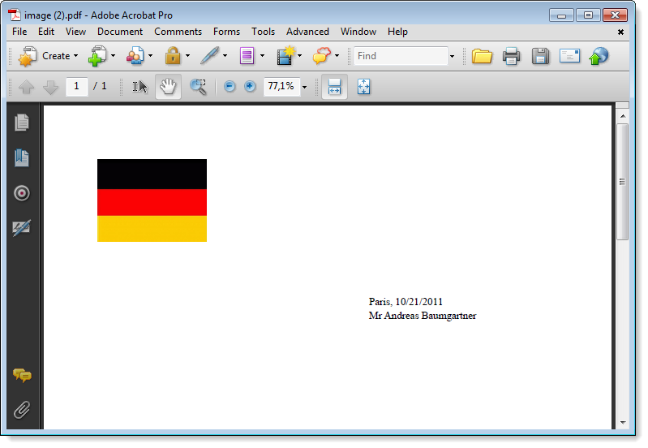

# Gerar documentos personalizados em PDF{#generating-personalized-pdf-documents}


## Sobre documentos em PDF variáveis {#about-variable-pdf-documents}

O Adobe Campaign permite gerar documentos variáveis em PDF para anexos de email de documentos do LibreOffice ou do Microsoft Word.

As seguintes extensões são suportadas: &quot;.docx&quot;, &quot;.doc&quot; e &quot;.odt&quot;.

Para personalizar seus documentos, as mesmas funcionalidades JavaScript de personalização de email estão disponíveis.

É necessário ativar a opção **[!UICONTROL "The content of the file is personalized and converted to PDF during the delivery of each message"]**. Essa opção é acessível quando você anexa o arquivo ao email de delivery. Para obter mais informações sobre como anexar um arquivo calculado, consulte a seção [Anexar arquivos](attaching-files.md).

Exemplo de personalização de cabeçalho de fatura:


Para gerar tabelas dinâmicas ou incluir imagens via URL, você precisa seguir um processo específico.

## Gerar tabelas dinâmicas {#generating-dynamic-tables}

O procedimento para gerar tabelas dinâmicas é da seguinte maneira:

* Crie uma tabela com três linhas e quantas colunas forem necessárias, então configure seu layout (bordas, etc.).
* Coloque o cursor na tabela e clique no menu **[!UICONTROL Table > Table properties]**. Vá para a guia **[!UICONTROL Table]** e insira um nome começando com **NlJsTable**.
* Na primeira célula da primeira linha, defina um loop (&quot;para&quot;, por exemplo) que permite a iteração nos valores que você deseja exibir na tabela.
* Em cada célula da segunda linha da tabela, insira os scripts que retornam os valores para exibição.
* Feche o loop na terceira e última linha da tabela.

   Exemplo de definição de tabela dinâmica:

   

## Inserir imagens externas {#inserting-external-images}

A inserção de imagens externas é útil se, por exemplo, você deseja personalizar um documento com uma imagem cujo URL é inserido em um campo do recipient.

Para fazer isso, você precisa configurar um bloco de personalização e, em seguida, incluir uma chamada para o bloco de personalização no anexo.

**Exemplo: inserir um logotipo personalizado de acordo com o país do recipient**

**Etapa 1: criar o anexo:**

* Insira a chamada para o bloco de personalização: **&lt;%@ include view=&quot;blockname&quot; %>**.
* Insira seu conteúdo (personalizado ou não) no corpo do arquivo.


**Etapa 2: criar o bloco de personalização:**

* Vá para o menu **[!UICONTROL Resources > Campaign management > Personalization blocks]** do console do Adobe Campaign.
* Crie um novo bloco de personalização &quot;Meu logotipo&quot; com &quot;Meu_Logotipo&quot; como um nome interno.
* Clique no link **[!UICONTROL Advanced parameters...]** e marque a opção **[!UICONTROL "The content of the block is included in an attachment"]**. Isso permite copiar a definição do bloco de personalização diretamente para o conteúdo do arquivo OpenOffice.

   

   Você precisa diferenciar dois tipos de declarações no bloco de personalização:

   * O código do Adobe Campaign dos campos de personalização para os quais as divisas &quot;aberto&quot; e &quot;fechado&quot; devem ser substituídas por caracteres de escape (respectivamente `&lt;` e `&gt;`).
   * O código OpenOffice XML inteiro será copiado para o documento OpenOffice.

No exemplo, o bloco de personalização tem esta aparência:

```
<% if (recipient.country.label == "Germany") { %>
<draw:frame svg:width="4cm" svg:height="3cm">
<draw:image xlink:href=https://..../logo_germany.png />
</draw:frame>
<% } else
if (recipient.country.label == "USA")
{ %>
<draw:frame svg:width="4cm" svg:height="3cm">
<draw:image xlink:href=https://..../logo_USA.png />
</draw:frame>
<% } %>
```

Dependendo do país do recipient, a personalização fica visível no documento vinculado ao delivery:


