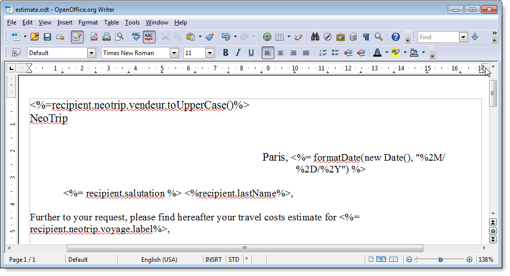
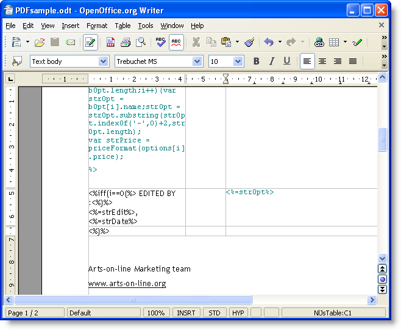
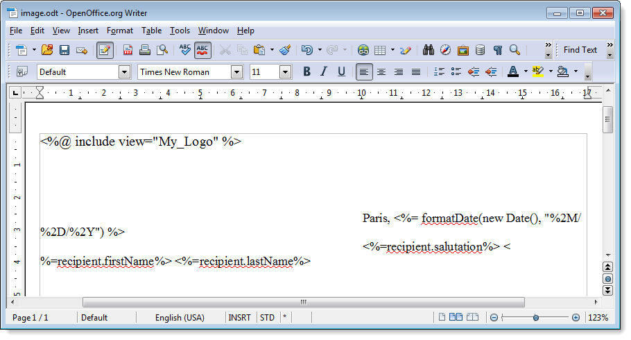

<?xml version="1.0" encoding="UTF-8"?>
<xliff xmlns="urn:oasis:names:tc:xliff:document:1.2" xmlns:okp="okapi-framework:xliff-extensions" xmlns:its="http://www.w3.org/2005/11/its" xmlns:itsxlf="http://www.w3.org/ns/its-xliff/" version="1.2" its:version="2.0">
<file original="help/delivery/using/generating-personalized-pdf-documents.md.mdnouisc" source-language="en-US" target-language="en-XX" datatype="x-text/markdown">
<body>
<trans-unit id="tu11" xml:space="preserve">
<source xml:lang="en-US">https://experienceleague.adobe.com/docs/campaign/campaign-v8/send/emails/attaching-files.html?lang=pt-BR</source>
<target xml:lang="en-XX">https://experienceleague.adobe.com/docs/campaign/campaign-v8/send/emails/attaching-files.html?lang=pt-BR</target>
</trans-unit>
<trans-unit id="tu27" xml:space="preserve">
<source xml:lang="en-US">https://experienceleague.adobe.com/pt-br/docs/control-panel/using/instances-settings/url-permissions</source>
<target xml:lang="en-XX">https://experienceleague.adobe.com/pt-br/docs/control-panel/using/instances-settings/url-permissions</target>
</trans-unit>
<trans-unit id="tu1" restype="x-YAML_METADATA_HEADER_VALUE" xml:space="preserve">
<source xml:lang="en-US">Generate personalized PDF documents</source>
<target xml:lang="en-XX">Gerar documentos personalizados em PDF</target>
</trans-unit>
<trans-unit id="tu2" restype="x-YAML_METADATA_HEADER_VALUE" xml:space="preserve">
<source xml:lang="en-US">Learn how to generate personalized PDF documents</source>
<target xml:lang="en-XX">Saiba como gerar documentos personalizados em PDF</target>
</trans-unit>
<trans-unit id="tu3" xml:space="preserve">
<source xml:lang="en-US">Also applies to v8</source>
<target xml:lang="en-XX">Também se aplica ao v8</target>
</trans-unit>
<trans-unit id="tu4" xml:space="preserve">
<source xml:lang="en-US">Also applies to Campaign v8</source>
<target xml:lang="en-XX">Também se aplica ao Campaign v8</target>
</trans-unit>
<trans-unit id="tu5" xml:space="preserve">
<source xml:lang="en-US">Generate personalized PDF documents</source>
<target xml:lang="en-XX">Gerar documentos personalizados em PDF</target>
</trans-unit>
<trans-unit id="tu6" xml:space="preserve">
<source xml:lang="en-US">About variable PDF documents</source>
<target xml:lang="en-XX">Sobre documentos em PDF variáveis</target>
</trans-unit>
<trans-unit id="tu7" xml:space="preserve">
<source xml:lang="en-US">Adobe Campaign lets you generate variable PDF documents for email attachments from LibreOffice or Microsoft Word documents.</source>
<target xml:lang="en-XX">O Adobe Campaign permite gerar documentos variáveis em PDF para anexos de email de documentos do LibreOffice ou do Microsoft Word.</target>
</trans-unit>
<trans-unit id="tu8" xml:space="preserve">
<source xml:lang="en-US">The following extensions are supported: ".docx", ".doc", and ".odt".</source>
<target xml:lang="en-XX">As seguintes extensões são suportadas: ".docx", ".doc" e ".odt".</target>
</trans-unit>
<trans-unit id="tu9" xml:space="preserve">
<source xml:lang="en-US">To personalize your documents, the same JavaScript functionalities as for email personalization are available.</source>
<target xml:lang="en-XX">Para personalizar seus documentos, as mesmas funcionalidades JavaScript de personalização de email estão disponíveis.</target>
</trans-unit>
<trans-unit id="tu10" xml:space="preserve">
<source xml:lang="en-US">You need to activate the <ph id="1" ctype="x-STRONG_EMPHASIS">**[!UICONTROL "The content of the file is personalized and converted to PDF during the delivery of each message"]**</ph> option. This option is accessible when you attach the file to the delivery email. For more on attaching a calculated file, refer the <ph id="4" ctype="x-LINK">&lbrack;</ph>Campaign v8 documentation<ph id="5" ctype="x-LINK">[#$tu11]{target="_blank"}</ph>.</source>
<target xml:lang="en-XX">É necessário ativar a opção <ph id="1" ctype="x-STRONG_EMPHASIS">**[!UICONTROL "The content of the file is personalized and converted to PDF during the delivery of each message"]**</ph>. Essa opção é acessível quando você anexa o arquivo ao email de entrega. Para obter mais informações sobre como anexar um arquivo calculado, consulte a <ph id="4" ctype="x-LINK">&lbrack;</ph>documentação do Campaign v8<ph id="5" ctype="x-LINK">[#$tu11]{target="_blank"}</ph>.</target>
</trans-unit>
<trans-unit id="tu12" xml:space="preserve">
<source xml:lang="en-US">Example of an invoice header personalization:</source>
<target xml:lang="en-XX">Exemplo de personalização de cabeçalho de fatura:</target>
</trans-unit>
<trans-unit id="tu13" xml:space="preserve">
<source xml:lang="en-US"><ph id="1" ctype="x-IMAGE"></ph></source>
<target xml:lang="en-XX"><ph id="1" ctype="x-IMAGE"></ph></target>
</trans-unit>
<trans-unit id="tu14" xml:space="preserve">
<source xml:lang="en-US">To generate dynamic tables or include images via a URL, you need to follow a specific process.</source>
<target xml:lang="en-XX">Para gerar tabelas dinâmicas ou incluir imagens via URL, você precisa seguir um processo específico.</target>
</trans-unit>
<trans-unit id="tu15" xml:space="preserve">
<source xml:lang="en-US">Generate dynamic tables</source>
<target xml:lang="en-XX">Gerar tabelas dinâmicas</target>
</trans-unit>
<trans-unit id="tu16" xml:space="preserve">
<source xml:lang="en-US">The procedure for generating dynamic tables is as follows:</source>
<target xml:lang="en-XX">O procedimento para gerar tabelas dinâmicas é da seguinte maneira:</target>
</trans-unit>
<trans-unit id="tu17" xml:space="preserve">
<source xml:lang="en-US">Create a table with three lines and as many columns as necessary, then configure its layout (borders, etc.).</source>
<target xml:lang="en-XX">Crie uma tabela com três linhas e quantas colunas forem necessárias, então configure seu layout (bordas, etc.).</target>
</trans-unit>
<trans-unit id="tu18" xml:space="preserve">
<source xml:lang="en-US">Place your cursor on the table and click the <ph id="1" ctype="x-STRONG_EMPHASIS">**[!UICONTROL Table > Table properties]**</ph> menu. Go to the <ph id="4" ctype="x-STRONG_EMPHASIS">**[!UICONTROL Table]**</ph> tab and enter a name beginning with <ph id="7" ctype="x-STRONG_EMPHASIS">**</ph>NlJsTable<ph id="8" ctype="x-STRONG_EMPHASIS">**</ph>.</source>
<target xml:lang="en-XX">Coloque o cursor na tabela e clique no menu <ph id="1" ctype="x-STRONG_EMPHASIS">**[!UICONTROL Table > Table properties]**</ph>. Vá para a guia <ph id="4" ctype="x-STRONG_EMPHASIS">**[!UICONTROL Table]**</ph> e insira um nome começando com <ph id="7" ctype="x-STRONG_EMPHASIS">**</ph>NlJsTable<ph id="8" ctype="x-STRONG_EMPHASIS">**</ph>.</target>
</trans-unit>
<trans-unit id="tu19" xml:space="preserve">
<source xml:lang="en-US">In the first cell of the first line, define a loop ("for", for example) that enables iteration on the values you want to display in the table.</source>
<target xml:lang="en-XX">Na primeira célula da primeira linha, defina um loop ("para", por exemplo) que permite a iteração nos valores que você deseja exibir na tabela.</target>
</trans-unit>
<trans-unit id="tu20" xml:space="preserve">
<source xml:lang="en-US">In each cell of the second line of the table, insert scripts that return the values to display.</source>
<target xml:lang="en-XX">Em cada célula da segunda linha da tabela, insira os scripts que retornam os valores para exibição.</target>
</trans-unit>
<trans-unit id="tu21" xml:space="preserve">
<source xml:lang="en-US">Close the loop in the third and last line of the table.</source>
<target xml:lang="en-XX">Feche o loop na terceira e última linha da tabela.</target>
</trans-unit>
<trans-unit id="tu22" xml:space="preserve">
<source xml:lang="en-US">Example of a dynamic table definition:</source>
<target xml:lang="en-XX">Exemplo de definição de tabela dinâmica:</target>
</trans-unit>
<trans-unit id="tu23" xml:space="preserve">
<source xml:lang="en-US"><ph id="1" ctype="x-IMAGE"></ph></source>
<target xml:lang="en-XX"><ph id="1" ctype="x-IMAGE"></ph></target>
</trans-unit>
<trans-unit id="tu24" xml:space="preserve">
<source xml:lang="en-US">Insert external images</source>
<target xml:lang="en-XX">Inserir imagens externas</target>
</trans-unit>
<trans-unit id="tu25" xml:space="preserve">
<source xml:lang="en-US"><ph id="1" ctype="x-regxph" equiv-text="&lbrack;!IMPORTANT">[!IMPORTANT]</ph></source>
<target xml:lang="en-XX"><ph id="1" ctype="x-regxph" equiv-text="&lbrack;!IMPORTANT">[!IMPORTANT]</ph></target>
</trans-unit>
<trans-unit id="tu26" xml:space="preserve">
<source xml:lang="en-US">Release 7.4.4 (build 9401) includes an update to the external URL allow list. Make sure the domains used for external images in your attachments are added to your instance's approved allow list so that resources continue to load without interruption. As a Campaign Administrator, use the Control Panel to add and manage allow-listed URLs. See <ph id="1" ctype="x-LINK">&lbrack;</ph>Add URL permissions<ph id="2" ctype="x-LINK">[#$tu27]{target="_blank"}</ph> for steps.</source>
<target xml:lang="en-XX">A versão 7.4.4 (build 9401) inclui uma atualização da lista de permissões de URL externo. Verifique se os domínios usados para imagens externas em seus anexos foram adicionados à lista de permissões aprovada da instância para que os recursos continuem sendo carregados sem interrupção. Como administrador do Campaign, use o Painel de controle para adicionar e gerenciar URLs incluídos na lista de permissões. Consulte <ph id="1" ctype="x-LINK">&lbrack;</ph>Adicionar permissões de URL<ph id="2" ctype="x-LINK">[#$tu27]{target="_blank"}</ph> para ver as etapas.</target>
</trans-unit>
<trans-unit id="tu28" xml:space="preserve">
<source xml:lang="en-US">The insertion of external images is useful if, for instance, you want to personalize a document with an image whose URL is entered in a field of the recipient.</source>
<target xml:lang="en-XX">A inserção de imagens externas é útil se, por exemplo, você deseja personalizar um documento com uma imagem cujo URL é inserido em um campo do destinatário.</target>
</trans-unit>
<trans-unit id="tu29" xml:space="preserve">
<source xml:lang="en-US">To do this, you need to configure a personalization block, then include a call to the personalization block in the attachment.</source>
<target xml:lang="en-XX">Para fazer isso, você precisa configurar um bloco de personalização e, em seguida, incluir uma chamada para o bloco de personalização no anexo.</target>
</trans-unit>
<trans-unit id="tu30" xml:space="preserve">
<source xml:lang="en-US"><ph id="1" ctype="x-STRONG_EMPHASIS">**</ph>Example: insert a personalized logo depending on the recipient's country<ph id="2" ctype="x-STRONG_EMPHASIS">**</ph></source>
<target xml:lang="en-XX"><ph id="1" ctype="x-STRONG_EMPHASIS">**</ph>Exemplo: inserir um logotipo personalizado de acordo com o país do destinatário<ph id="2" ctype="x-STRONG_EMPHASIS">**</ph></target>
</trans-unit>
<trans-unit id="tu31" xml:space="preserve">
<source xml:lang="en-US"><ph id="1" ctype="x-STRONG_EMPHASIS">**</ph>Step 1: create the attachment:<ph id="2" ctype="x-STRONG_EMPHASIS">**</ph></source>
<target xml:lang="en-XX"><ph id="1" ctype="x-STRONG_EMPHASIS">**</ph>Etapa 1: criar o anexo:<ph id="2" ctype="x-STRONG_EMPHASIS">**</ph></target>
</trans-unit>
<trans-unit id="tu32" xml:space="preserve">
<source xml:lang="en-US">Insert the call to the personalization block: <ph id="1" ctype="x-STRONG_EMPHASIS">**</ph>&lt;%@ include view="blockname" %><ph id="2" ctype="x-STRONG_EMPHASIS">**</ph>.</source>
<target xml:lang="en-XX">Insira a chamada para o bloco de personalização: <ph id="1" ctype="x-STRONG_EMPHASIS">**</ph>&lt;%@ include view="blockname" %><ph id="2" ctype="x-STRONG_EMPHASIS">**</ph>.</target>
</trans-unit>
<trans-unit id="tu33" xml:space="preserve">
<source xml:lang="en-US">Insert your content (personalized or not) into the body of the file.</source>
<target xml:lang="en-XX">Insira seu conteúdo (personalizado ou não) no corpo do arquivo.</target>
</trans-unit>
<trans-unit id="tu34" xml:space="preserve">
<source xml:lang="en-US"><ph id="1" ctype="x-IMAGE"></ph></source>
<target xml:lang="en-XX"><ph id="1" ctype="x-IMAGE"></ph></target>
</trans-unit>
<trans-unit id="tu35" xml:space="preserve">
<source xml:lang="en-US"><ph id="1" ctype="x-STRONG_EMPHASIS">**</ph>Step 2: create the personalization block:<ph id="2" ctype="x-STRONG_EMPHASIS">**</ph></source>
<target xml:lang="en-XX"><ph id="1" ctype="x-STRONG_EMPHASIS">**</ph>Etapa 2: criar o bloco de personalização:<ph id="2" ctype="x-STRONG_EMPHASIS">**</ph></target>
</trans-unit>
<trans-unit id="tu36" xml:space="preserve">
<source xml:lang="en-US">Go to the <ph id="1" ctype="x-STRONG_EMPHASIS">**[!UICONTROL Resources > Campaign management > Personalization blocks]**</ph> menu of the Adobe Campaign console.</source>
<target xml:lang="en-XX">Vá para o menu <ph id="1" ctype="x-STRONG_EMPHASIS">**[!UICONTROL Resources > Campaign management > Personalization blocks]**</ph> do console do Adobe Campaign.</target>
</trans-unit>
<trans-unit id="tu37" xml:space="preserve">
<source xml:lang="en-US">Create a new "My Logo" personalization block with "My_Logo" as an internal name.</source>
<target xml:lang="en-XX">Crie um novo bloco de personalização "Meu logotipo" com "Meu_Logotipo" como um nome interno.</target>
</trans-unit>
<trans-unit id="tu38" xml:space="preserve">
<source xml:lang="en-US">Click on the <ph id="1" ctype="x-STRONG_EMPHASIS">**[!UICONTROL Advanced parameters...]**</ph> link then check the <ph id="4" ctype="x-STRONG_EMPHASIS">**[!UICONTROL "The content of the block is included in an attachment"]**</ph> option. This lets you copy the definition of the personalization block directly into the content of the OpenOffice file.</source>
<target xml:lang="en-XX">Clique no link <ph id="1" ctype="x-STRONG_EMPHASIS">**[!UICONTROL Advanced parameters...]**</ph> e marque a opção <ph id="4" ctype="x-STRONG_EMPHASIS">**[!UICONTROL "The content of the block is included in an attachment"]**</ph>. Isso permite copiar a definição do bloco de personalização diretamente para o conteúdo do arquivo OpenOffice.</target>
</trans-unit>
<trans-unit id="tu39" xml:space="preserve">
<source xml:lang="en-US"><ph id="1" ctype="x-IMAGE"></ph></source>
<target xml:lang="en-XX"><ph id="1" ctype="x-IMAGE"></ph></target>
</trans-unit>
<trans-unit id="tu40" xml:space="preserve">
<source xml:lang="en-US">You need to differentiate two types of declarations within the personalization block:</source>
<target xml:lang="en-XX">Você precisa diferenciar dois tipos de declarações no bloco de personalização:</target>
</trans-unit>
<trans-unit id="tu41" xml:space="preserve">
<source xml:lang="en-US">The Adobe Campaign code of the personalization fields for which the "open" and "closed" chevrons must be replaced with escape characters (respectively <ph id="1" ctype="x-CODE">`&amp;lt;`</ph> and <ph id="2" ctype="x-CODE">`&amp;gt;`</ph>).</source>
<target xml:lang="en-XX">O código do Adobe Campaign dos campos de personalização para os quais as divisas "aberto" e "fechado" devem ser substituídas por caracteres de escape (respectivamente <ph id="1" ctype="x-CODE">`&amp;lt;`</ph> e <ph id="2" ctype="x-CODE">`&amp;gt;`</ph>).</target>
</trans-unit>
<trans-unit id="tu42" xml:space="preserve">
<source xml:lang="en-US">The entire OpenOffice XML code will be copied into the OpenOffice document.</source>
<target xml:lang="en-XX">O código OpenOffice XML inteiro será copiado para o documento OpenOffice.</target>
</trans-unit>
<trans-unit id="tu43" xml:space="preserve">
<source xml:lang="en-US">In the example, the personalization block looks like this:</source>
<target xml:lang="en-XX">No exemplo, o bloco de personalização tem esta aparência:</target>
</trans-unit>
<trans-unit id="tu44" xml:space="preserve">
<source xml:lang="en-US">Depending on the recipient's country, personalization is visible in the document linked to the delivery:</source>
<target xml:lang="en-XX">Dependendo do país do destinatário, a personalização fica visível no documento vinculado à entrega:</target>
</trans-unit>
<trans-unit id="tu45" xml:space="preserve">
<source xml:lang="en-US"><ph id="1" ctype="x-IMAGE"></ph></source>
<target xml:lang="en-XX"><ph id="1" ctype="x-IMAGE"></ph></target>
</trans-unit>
</body>
</file>
</xliff>