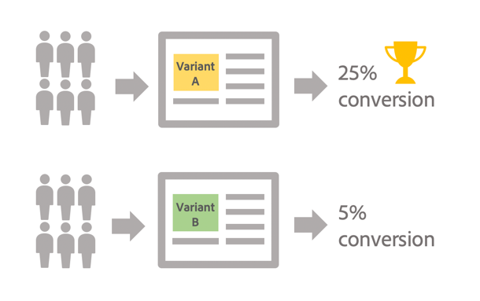

# Introdução ao teste A/B {#get-started-a-b-testing}

O teste A/B permite que você compare várias versões de um delivery entre si, a fim de identificar qual terá o maior impacto na população direcionada.

Para fazer isso, primeiro é necessário definir diversas variantes do delivery. Cada variante é então enviada para amostras de população a fim de determinar qual delas tem melhor desempenho, dependendo dos critérios de sua escolha (aberturas, reclamações de spam, cliques em um link específico etc.).

No exemplo abaixo, o target do delivery foi dividido em dois grupos, cada um representando 50% da população direcionada. Cada grupo recebe duas versões do delivery com duas ofertas promocionais diferentes. Após o envio do delivery, conclui-se que a variante A teve melhor desempenho, com base no número de cliques nas ofertas promocionais.

Com o Campaign Classic, o teste A/B é implementado por meio de workflows, em que você especifica a população a ser direcionada, bem como os grupos que receberão cada variante (consulte [Configurar um teste A/B](configuring-a-b-testing.md)).

As principais etapas são:

1. **Direcionar** a população desejada.
1. **Dividir a população** em subconjuntos nos quais você testará as variantes do delivery.

   Por exemplo, você pode enviar uma versão de um delivery a uma pequena parte da população direcionada e outra versão à a população restante. Isso permite testar uma nova versão de um delivery em vez do delivery que geralmente é enviado a seus clientes. Você também pode dividir a população direcionada em três grupos para enviar a eles três versões diferentes de um delivery.

1. **Crie várias versões** do delivery correspondentes a cada subconjunto. A variante a ser testada pode ser o assunto, o conteúdo da mensagem, o nome do remetente etc.
1. Inicie o fluxo de trabalho e, em seguida, use os **logs do delivery** para analisar o comportamento dos subconjuntos com cada variante.

>[!NOTE]
>
>Os workflows também permitem que você automatize seus processos identificando automaticamente a variante do delivery que teve melhor desempenho e, em seguida, enviando-a à população restante. Para saber mais, consulte este [caso de uso](a-b-testing-use-case.md) dedicado.
