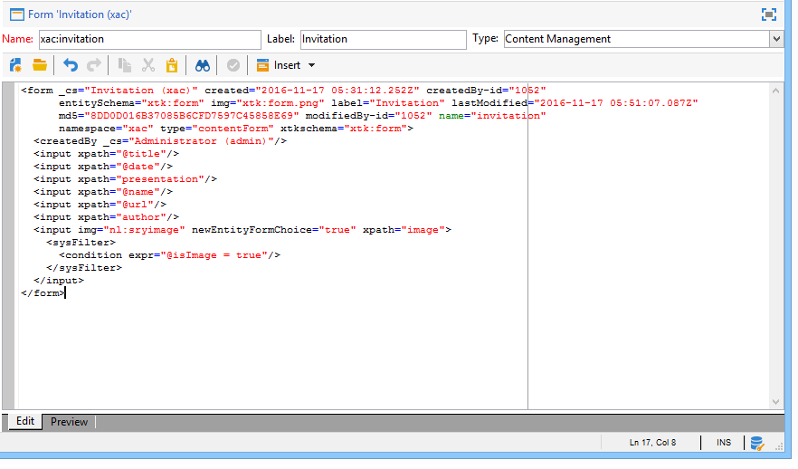

# Formulários de entrada{#input-forms}

Abaixo estão alguns princípios gerais sobre o uso de formulários de entrada no Adobe Campaign.

Os formulários estão detalhados [nesta seção](../../configuration/using/identifying-a-form.md).

## Estrutura do formulário {#form-structure}

O documento XML de um formulário de entrada deve conter o elemento raiz **`<form>`** com os atributos **name** e **namespace** para preencher o nome e o namespace do formulário, respectivamente.

```
<form name="form_name" namespace="name_space">
...
</form>
```

Por padrão, um formulário é associado ao schema de dados que tem o mesmo nome e namespace. Para associar um formulário a um nome diferente, insira a chave do schema no atributo **entity-schema** do elemento **`<form>`**.

Para ilustrar a estrutura de um formulário de entrada, descrevemos uma interface com base em nosso exemplo de schema &quot;cus:book&quot;:


Este é o formulário de entrada correspondente:

```
<form name="book" namespace="cus" type="contentForm">
  <input xpath="@name"/>
  <input xpath="@date"/>
  <input xpath="@language"/>
</form>
```

A descrição dos elementos de edição começa com o elemento raiz **`<form>`**.

Um controle de edição é inserido em um elemento **`<input>`** com o atributo **xpath** contendo o caminho do campo do schema.

**Lembrete sobre sintaxe XPath:**

A linguagem XPath é usada no Adobe Campaign para referenciar um elemento ou atributo que pertence a um schema de dados.

XPath é uma sintaxe que permite localizar um nó na árvore de um documento XML.

Os elementos são designados pelo nome e os atributos são designados pelo nome precedido pelo caractere &quot;@&quot;.

Exemplos:

* **@date**: seleciona o atributo com o nome &quot;date&quot;
* **chapter/@title**: seleciona o atributo &quot;title&quot; no elemento `<chapter>`.
* **../@date**: seleciona a data do elemento primário do elemento atual.

O controle de edição se adapta automaticamente ao tipo de dados correspondente e usa o rótulo definido no schema.

Por padrão, cada campo é exibido em uma linha e ocupa todo o espaço disponível, dependendo do tipo de dados.

>[!CAUTION]
>
>O formulário de entrada deve referenciar um atributo **type=&quot;contentForm&quot;** no elemento **`<form>`** para adicionar automaticamente o quadro necessário para o conteúdo ser inserido.

## Formatação {#formatting}

A disposição dos controles em relação uns aos outros parece com a organização usada em tabelas HTML, com a possibilidade de dividir um controle em várias colunas, entrelaçar elementos ou especificar a ocupação do espaço disponível. Entretanto, lembre-se de que a formatação somente autoriza a distribuição de proporções; não é possível especificar dimensões fixas para um objeto.

Para obter mais informações, consulte [esta seção](../../configuration/using/form-structure.md#formatting).

## Controles de tipo de lista {#list-type-controls}

Para editar um elemento de coleção, é necessário usar um controle de tipo de lista.

### Lista de colunas {#column-list}

Este controle exibe uma lista de colunas editável com uma barra de ferramentas contendo os botões Adicionar e Excluir.


```
<input xpath="chapter" type="list">
  <input xpath="@name"/>
  <input xpath="@number"/>
</input>
```

O controle de lista deve ser preenchido com o atributo **type=&quot;list&quot;** e o caminho da lista deve se referir ao elemento de coleção.

As colunas são declaradas pelos elementos secundários **`<input>`** da lista.

>[!NOTE]
>
>As setas de ordenação para cima e para baixo são adicionadas automaticamente quando o atributo **ordered=&quot;true&quot;** é preenchido para o elemento de coleção no schema de dados.

Por padrão, os botões da barra de ferramentas estão alinhados verticalmente. Os botões também podem ser alinhados horizontalmente:


```
<input nolabel="true" toolbarCaption="List of chapters" type="list" xpath="chapter">
  <input xpath="@name"/>
  <input xpath="@number"/>
</input>
```

O atributo **toolbarCaption** força o alinhamento horizontal da barra de ferramentas e preenche o título acima da lista.

>[!NOTE]
>
>Para que o rótulo do elemento de coleção não seja exibido à esquerda do controle, adicione o atributo **nolabel=&quot;true&quot;**.

#### Ampliação de uma lista {#zoom-in-a-list}

A inserção e a edição de dados de uma lista podem ser realizadas em um formulário de edição separado.

Os formulários de edição em listas são usados nos seguintes casos:

* Para facilitar a entrada das informações,
* Presença de um controle de várias linhas,
* As colunas na lista contêm apenas os campos principais e o formulário exibe todos os campos do elemento de coleção.


```
<input nolabel="true" toolbarCaption="List of chapters" type="list" xpath="chapter" zoom="true" zoomOnAdd="true">
  <input xpath="@name"/>
  <input xpath="@number"/>

  <form colcount="2" label="Editing a chapter">
    <input xpath="@name"/>
    <input xpath="@number"/>
    <input colspan="2" xpath="page"/>
  </form>
</input>
```

A definição do formulário de edição é especificada por meio do elemento **`<form>`** sob o element list Sua estrutura é idêntica à estrutura de um formulário de entrada.

Um botão **[!UICONTROL Detail]** é adicionado automaticamente quando o atributo **zoom=&quot;true&quot;** é inserido na definição da lista. Isso permite abrir o formulário de edição na linha selecionada.

>[!NOTE]
>
>A adição do atributo **zoomOnAdd=&quot;true&quot;** força o formulário de edição a ser chamado na inserção de um elemento da lista.

### Lista de guias {#tab-list}

Esta lista apresenta a edição de elementos de coleção no formulário de guias.


```
<container toolbarCaption="List of chapters" type="notebooklist" xpath="chapter" xpath-label="@name">
  <container colcount="2">
    <input xpath="@name"/>
    <input xpath="@number"/>
    <input colspan="2" xpath="page"/>
  </container>
</container>
```

O controle de lista deve ser preenchido com o atributo **type=&quot;notebooklist&quot;** e o caminho da lista deve fazer referência ao elemento de coleção.

O título da guia contém o valor dos dados inseridos pelo atributo **xpath-label**.

Os controles de edição devem ser declarados em um elemento **`<container>`** que se origina do controle de lista.

Use os botões da barra de ferramentas para adicionar ou excluir elementos da lista.

>[!NOTE]
>
>As setas de ordenação esquerda e direita são adicionadas automaticamente quando o atributo **ordered=&quot;true&quot;** é preenchido para o elemento de coleção no schema de dados.

## Containeres {#containers}

Os containeres permitem agrupar um conjunto de controles. Eles existem por meio do elemento **`<container>`**. Eles já foram usados para formatar controles em várias colunas e para o controle da lista de guias.

Para obter mais informações sobre containeres e como usá-los em formulários de entrada, consulte [esta seção](../../configuration/using/form-structure.md#containers).

## Edição de formulários {#editing-forms}

A zona de edição permite inserir o conteúdo XML do formulário de entrada:



A guia **[!UICONTROL Preview]** permite exibir o formulário de entrada:


