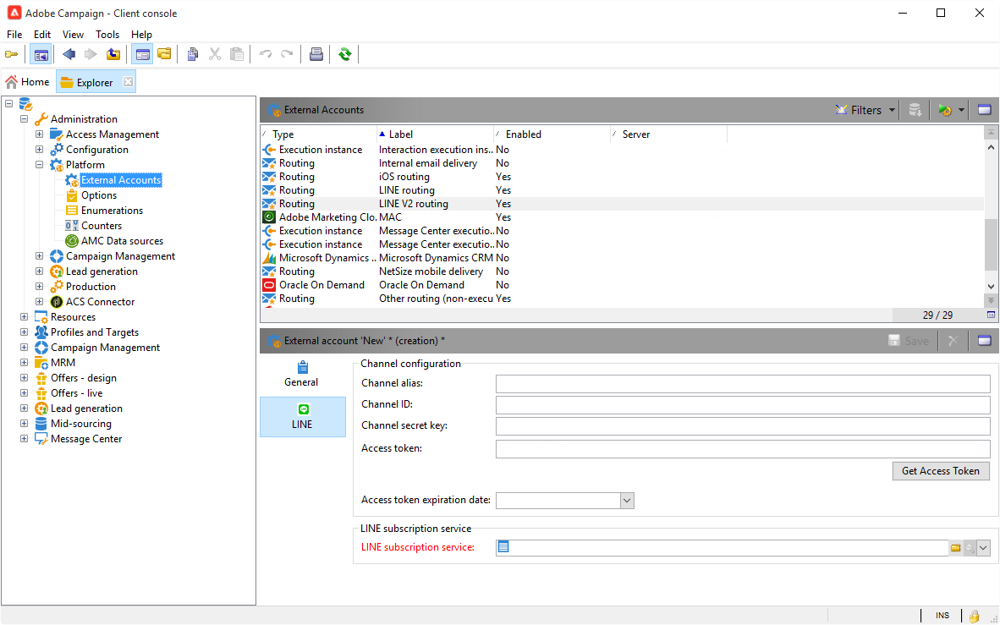
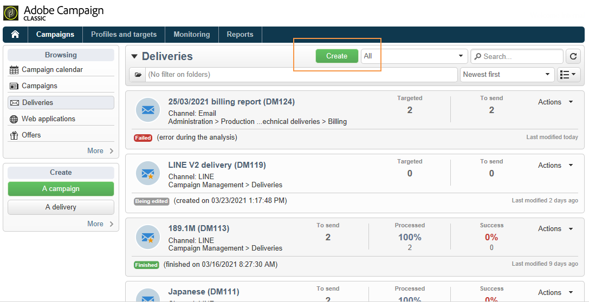
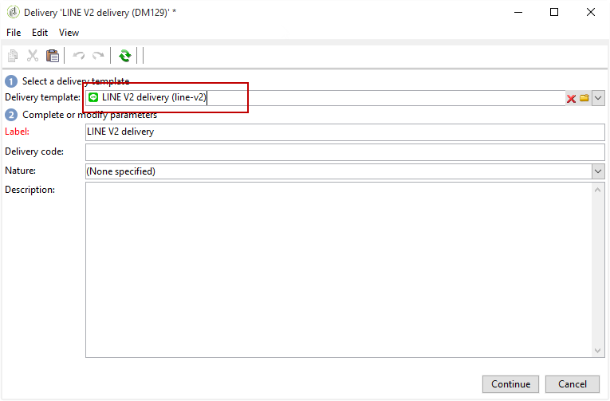
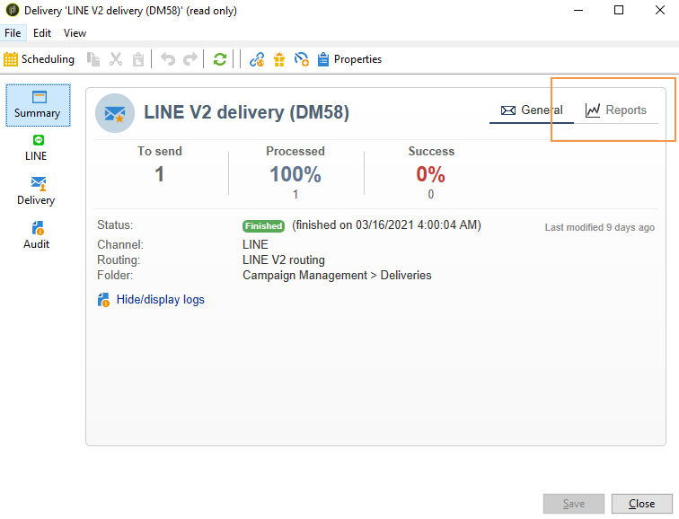

# Criar entregas LINE{#line-channel}

>[!NOTE]
>
>O [!DNL LINE] só está disponível para instalações de serviços no local ou gerenciados.

O [!DNL LINE] é um aplicativo para mensagens instantâneas, chamadas de voz e vídeo gratuitos, disponível em todos os SOs móveis e no PC.

O [!DNL LINE] também pode ser combinado com o módulo de mensagem transacional para enviar mensagens em tempo real no aplicativo [!DNL LINE] instalado nos dispositivos móveis do consumidor. Para obter mais informações, consulte esta [página](../../message-center/using/transactional-messaging-architecture.md#transactional-messaging-and-line).

As etapas para usar o canal [!DNL LINE] são:

1. [Configurar o canal LINE](#setting-up-line-channel)
1. [Criar uma entrega](#creating-the-delivery)
1. [Configurar o tipo de conteúdo](#defining-the-content)
1. [Monitoramento da entrega (rastreamento, quarentena, relatórios etc.)](#accessing-reports)

## Configurar o canal LINE {#setting-up-line-channel}

Antes de criar uma conta [!DNL LINE] e uma conta externa, primeiro é preciso instalar o pacote LINE na sua instância. Para obter mais informações, consulte [esta seção](../../installation/using/installing-campaign-standard-packages.md#line-package).

Primeiro, é necessário criar uma conta [!DNL LINE] para depois vinculá-la ao Adobe Campaign. Em seguida, é possível enviar mensagens [!DNL LINE] aos usuários que adicionaram a conta [!DNL LINE] em seus aplicativos para dispositivos móveis. As contas externas e a conta do [!DNL LINE] podem ser gerenciadas somente pelo administrador funcional da plataforma.

Para criar e configurar uma conta [!DNL LINE], consulte a [documentação de desenvolvedores do LINE](https://developers.line.me/).

### Criar e configurar o serviço LINE {#configure-line-service}

Para criar o serviço [!DNL LINE]:

1. Na página inicial do Adobe Campaign Classic, selecione a guia **[!UICONTROL Profiles and Targets]**.

1. No menu à esquerda, selecione **[!UICONTROL Services and Subscriptions]** e clique em **[!UICONTROL Create]**.

   

1. Adicione um **[!UICONTROL Label]** e **[!UICONTROL Internal name]** ao novo serviço.

1. Selecione **[!UICONTROL LINE]** na lista suspensa **[!UICONTROL Type]**.

   

1. Clique em **[!UICONTROL Save]**.

Para obter mais informações sobre assinaturas e serviços, consulte [Gerenciamento de assinaturas](managing-subscriptions.md).

### Configurar conta externa LINE {#configure-line-external}

Depois de criar o serviço [!DNL LINE], é necessário configurar a conta externa [!DNL LINE] no Adobe Campaign:

1. Na estrutura da árvore **[!UICONTROL Administration]** > **[!UICONTROL Platform]**, clique na guia **[!UICONTROL External Accounts]**.

1. Selecione a conta externa do **[!UICONTROL LINE V2 routing]** incorporada.

   

1. Clique na guia **[!UICONTROL LINE]** da conta externa para começar a configurá-la. Preencha os seguintes campos:

   

   * **[!UICONTROL Channel Alias]**: é fornecido por meio da conta [!DNL LINE] na guia **[!UICONTROL Channels]** > **[!UICONTROL Technical configuration]**.
   * **[!UICONTROL Channel ID]**: é fornecida por meio da conta [!DNL LINE] na guia **[!UICONTROL Channels]** > **[!UICONTROL Basic Information panel]**.
   * **[!UICONTROL Channel secret key]**: é fornecida por meio da conta [!DNL LINE] na guia **[!UICONTROL Channels]** > **[!UICONTROL Basic Information panel]**.
   * **[!UICONTROL Access token]**: é fornecido por meio da conta [!DNL LINE] no portal do desenvolvedor ou clicando no botão **[!UICONTROL Get access token]**.
   * **[!UICONTROL Access token expiration date]**: permite especificar a data de expiração do token de acesso.
   * **[!UICONTROL LINE subscription service]**: permite especificar os serviços aos quais os usuários serão inscritos.

1. Quando a configuração estiver concluída, clique em **[!UICONTROL Save]**.

1. No **[!UICONTROL Explorer]**, selecione **[!UICONTROL Administration]** > **[!UICONTROL Production]** > **[!UICONTROL Technical workflows]** > **[!UICONTROL LINE workflows]** para verificar se os workflows **[!UICONTROL LINE V2 access token update (updateLineAccessToken)]** e **[!UICONTROL Delete blocked LINE users (deleteBlockedLineUsers)]** foram iniciados.

O [!DNL LINE] agora está configurado no Adobe Campaign. Você pode começar a criar e enviar entregas LINE aos assinantes.

## Criar entrega LINE {#creating-the-delivery}

>[!NOTE]
>
>Ao enviar uma entrega [!DNL LINE] a um novo recipient pela primeira vez, você deve adicionar a mensagem oficial do LINE sobre os termos de uso e consentimento em relação a entregas. A mensagem oficial está disponível no [link a seguir](https://terms.line.me/OA_privacy/).

Para criar uma entrega [!DNL LINE], é necessário seguir estas etapas:

1. Na guia **[!UICONTROL Campaigns]** selecione **[!UICONTROL Deliveries]** e clique no botão **[!UICONTROL Create]**.

   

1. Selecione o modelo de entrega **[!UICONTROL LINE V2 delivery]**.

   

1. Identifique a entrega com um **[!UICONTROL Label]**, **[!UICONTROL Delivery code]** e **[!UICONTROL Description]**. Para obter mais informações, consulte [esta seção](steps-create-and-identify-the-delivery.md#identifying-the-delivery).

1. Clique em **[!UICONTROL Continue]** para criar o delivery de 

1. No editor de entrega, selecione **[!UICONTROL To]** para direcionar os recipients da entrega [!DNL LINE]. O direcionamento é realizado em **[!UICONTROL Visitor subscriptions (nms:visitorSub)]**.

   Para obter mais informações, consulte [Identificação das populações do target](steps-defining-the-target-population.md).

   

1. Clique em **[!UICONTROL Add]** para selecionar **[!UICONTROL Delivery target population]**.

   

1. Escolha se deseja direcionar assinantes [!DNL LINE] diretamente ou se deseja direcionar usuários dependendo da subscrição [!DNL LINE] e clique em **[!UICONTROL Next]**. Neste exemplo, selecionamos **[!UICONTROL By LINE V2 subscription]**.

1. Selecione **[!UICONTROL Line-V2]** no menu suspenso **[!UICONTROL Folder]** e depois escolha o serviço [!DNL LINE]. Clique em **[!UICONTROL Finish]** e em **[!UICONTROL Ok]** para começar a personalizar a entrega.

   

1. No editor de entrega, clique em **[!UICONTROL Add]** para adicionar uma ou várias mensagens e selecione o **[!UICONTROL Content type]**.

   Para obter mais informações sobre os diferentes **[!UICONTROL Content type]** disponíveis, consulte [Definir o tipo de conteúdo](#defining-the-content).

   

1. Quando a entrega é criada e configurada corretamente, é possível enviá-lo para o target definido anteriormente.

   Para obter mais informações sobre o envio de uma entrega, consulte [Enviar mensagens](sending-messages.md).

1. Após enviar a mensagem, acesse o relatório para medir a eficiência da entrega.

   Para obter mais informações sobre relatórios [!DNL LINE], consulte [Acessar relatórios](#accessing-reports).

## Definir o tipo de conteúdo {#defining-the-content}

Para definir o conteúdo de uma entrega [!DNL LINE], primeiro adicione o tipo de mensagem à entrega. Cada entrega [!DNL LINE] pode conter até 5 mensagens.

É possível escolher entre dois tipos de mensagem:

* [Mensagem de texto.](#configuring-a-text-message-delivery)
* [Imagem e link.](#configuring-an-image-and-link-delivery)
* [Mensagem de vídeo](#configuring-a-video-message-delivery)

### Configuração de uma entrega de mensagem de texto {#configuring-a-text-message-delivery}

>[!NOTE]
>
>A sintaxe `<%@ include option='NmsServer_URL' %>/webApp/APP3?id=<%=escapeUrl(cryptString(visitor.id))%>` permite incluir um link para um aplicativo web em uma mensagem LINE.

Uma entrega **[!UICONTROL Text message]** [!DNL LINE] é uma mensagem enviada aos recipients em forma de texto.

A configuração desse tipo de mensagem é semelhante à configuração do **[!UICONTROL Text]** em um email. Para obter mais informações, consulte esta [página](defining-the-email-content.md#message-content).

### Configuração de uma entrega de imagem e link {#configuring-an-image-and-link-delivery}

Uma entrega **[!UICONTROL Image and link]**[!DNL LINE] é uma mensagem enviada aos recipients no formato de uma imagem que pode conter um ou vários URLs.

É possível usar:

* uma **[!UICONTROL Personalized image]**,

   >[!NOTE]
   >
   >É possível usar a variável **%SIZE%** para otimizar a exibição da imagem de acordo com o tamanho da tela do dispositivo móvel do recipient.

   

* um **[!UICONTROL Image URL]** por tamanho de tela do dispositivo,

   

   A opção **[!UICONTROL Define images per device screen size]** permite usar diferentes resoluções de imagem para otimizar a visibilidade da entrega em dispositivos móveis. Somente imagens com altura e largura são suportadas.

   As imagens podem ser definidas de acordo com o tamanho da tela:

   * 1040px
   * 700px
   * 460px
   * 300px
   * 240px

   >[!CAUTION]
   >
   >O tamanho 1040x1040 px é obrigatório para cada imagem LINE com link.

   Depois, é preciso adicionar um texto alternativo que será exibido no dispositivo móvel do recipient.

* e **[!UICONTROL Links]**.

   A seção **[!UICONTROL Links]** permite escolher entre diferentes layouts que dividirão a imagem em várias regiões clicáveis. Depois, é possível atribuir um **[!UICONTROL Link URL]** dedicado a cada uma delas.

   

### Configuração de uma entrega de mensagem de vídeo {#configuring-a-video-message-delivery}

Uma entrega **[!UICONTROL Video message]** [!DNL LINE] é uma mensagem enviada aos recipients no formato de um vídeo que pode conter um URL.

O campo **[!UICONTROL Preview Image URL]** permite adicionar o URL de uma imagem de pré-visualização com um limite de 1000 caracteres. JPEG e PNG são compatíveis com um limite de tamanho de arquivo de 1 MB.

O campo **[!UICONTROL Video Image URL]** permite adicionar o URL do arquivo de vídeo com um limite de 1000 caracteres. Somente o formato mp4 é compatível com um limite de tamanho de arquivo de 200 MB.

Observe que vídeos largos ou altos podem ser cortados quando reproduzidos em alguns dispositivos.

## Acesso a relatórios {#accessing-reports}

Após enviar a entrega, você poderá visualizar os [!DNL LINE] relatórios por meio do menu **[!UICONTROL Campaign Management]** > **[!UICONTROL Deliveries]** no **[!UICONTROL Explorer]**.

>[!NOTE]
>
>Os relatórios de rastreamento indicam o índice de click-through. O [!DNL LINE] não leva a taxa de abertura em consideração.

Para relatórios de serviço [!DNL LINE], acesse o menu **[!UICONTROL Profiles and Targets]** > **[!UICONTROL Services and Subscriptions]** > **[!UICONTROL LINE-V2]** na guia **[!UICONTROL Explorer]**. Em seguida, clique no ícone **[!UICONTROL Reports]** no serviço [!DNL LINE].

## Exemplo: criar e enviar uma mensagem LINE personalizada {#example--create-and-send-a-personalized-line-message}

Neste exemplo, vamos criar e configurar uma mensagem de texto e uma imagem contendo dados que serão personalizados de acordo com o recipient.

1. Crie a entrega [!DNL LINE] clicando no botão **[!UICONTROL Create]** na guia **[!UICONTROL Campaign]**.

   

1. Selecione o template do **[!UICONTROL LINE V2 delivery]** delivery e dê um nome ao delivery.

   

1. Na janela de configuração do delivery, selecione a população do target.

   Para obter mais informações, consulte [Identificação das populações do target](steps-defining-the-target-population.md).

   

1. Clique em **[!UICONTROL Add]** para criar a mensagem e selecione o **[!UICONTROL Content type]**.

   Primeiro, devemos criar uma mensagem de texto **[!UICONTROL Text message]**.

   

1. Coloque o cursor onde deseja inserir o texto personalizado, clique no ícone suspenso e selecione **[!UICONTROL Visitor]** > **[!UICONTROL First name]**.

   

1. Siga o mesmo procedimento para adicionar uma imagem, selecionando **[!UICONTROL Image and links]** no menu suspenso **[!UICONTROL Message type]**.

   Adicione o **[!UICONTROL Image URL]**.

   

1. Na seção **[!UICONTROL Links]**, selecione o layout que dividirá a imagem em várias regiões clicáveis.

1. Atribua um URL para cada região da imagem.

   

1. Salve o delivery e clique em **[!UICONTROL Send]** para analisar e enviá-lo para o target.

   O delivery é enviado para o target.

   

