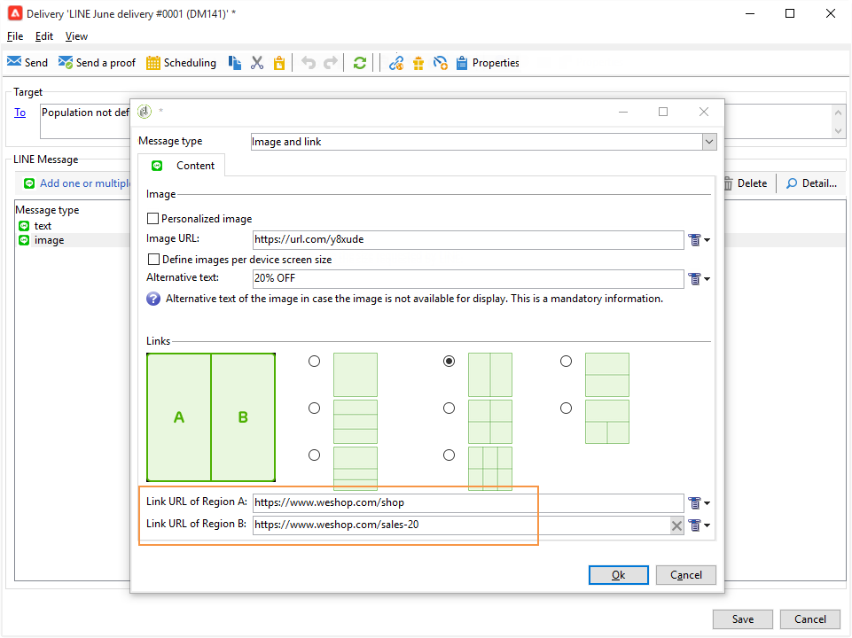

# Criar deliveries LINE{#line-channel}

>[!NOTE]
>
>[!DNL LINE]O só está disponível para instalações de serviços locais ou gerenciados.

[!DNL LINE] O é um aplicativo para mensagens instantâneas, chamadas de voz e vídeo gratuitos, disponível em todos os SOs móveis e no PC.

[!DNL LINE]O também pode ser combinado com o módulo de mensagem transacional para enviar mensagens em tempo real no aplicativo instalado em dispositivos móveis do consumidor. [!DNL LINE] Para obter mais informações, consulte esta [página](../../message-center/using/transactional-messaging-architecture.md#transactional-messaging-and-line).

As etapas para usar o canal [!DNL LINE] são:

1. [Configurar canal LINE](#setting-up-line-channel)
1. [Criar um delivery](#creating-the-delivery)
1. [Configurar o tipo de conteúdo](#defining-the-content)
1. [Monitoramento do delivery (rastreamento, quarentena, relatórios, etc.)](#accessing-reports)

## Configurar canal LINE {#setting-up-line-channel}

Antes de criar uma conta [!DNL LINE] e uma conta externa, primeiro é necessário instalar o pacote LINE em sua instância. Para obter mais informações, consulte a seção [LINE](../../installation/using/installing-campaign-standard-packages.md#line-package) na guia Instalação.

Primeiro, você deve criar uma conta [!DNL LINE] , para que possa vinculá-la ao Adobe Campaign. Em seguida, você pode enviar mensagens [!DNL LINE] para os usuários que adicionaram sua conta [!DNL LINE] em seu aplicativo móvel. As contas externas e a conta [!DNL LINE] só podem ser gerenciadas pelo administrador funcional da plataforma.

Para criar e configurar uma conta [!DNL LINE], consulte a [documentação de desenvolvedores LINE](https://developers.line.me/).

### Criar e configurar o serviço LINE {#configure-line-service}

Para criar seu serviço [!DNL LINE]:

1. Na página inicial do Adobe Campaign Classic, selecione a guia **[!UICONTROL Profiles and Targets]** .

1. No menu à esquerda, selecione **[!UICONTROL Services and Subscriptions]** e clique em **[!UICONTROL Create]**.

   

1. Adicione um **[!UICONTROL Label]** e **[!UICONTROL Internal name]** ao novo serviço.

1. Selecione **[!UICONTROL LINE]** no menu suspenso **[!UICONTROL Type]**.

   

1. Clique em **[!UICONTROL Save]**.

Para obter mais informações sobre assinaturas e serviços, consulte [Gerenciamento de assinaturas](../../delivery/using/managing-subscriptions.md).

### Configurar conta externa LINE {#configure-line-external}

Depois de criar o serviço [!DNL LINE], é necessário configurar a conta externa [!DNL LINE] no Adobe Campaign:

1. Na estrutura de árvore **[!UICONTROL Administration]** > **[!UICONTROL Platform]**, clique na guia **[!UICONTROL External Accounts]**.

1. Selecione a conta externa do **[!UICONTROL LINE V2 routing]** incorporada.

   

1. Clique na guia **[!UICONTROL LINE]** da conta externa para começar a configurar a conta externa. Preencha os seguintes campos:

   

   * **[!UICONTROL Channel Alias]**: O é fornecido por meio da  [!DNL LINE] conta na  **[!UICONTROL Channels]** guia  **[!UICONTROL Technical configuration]** > .
   * **[!UICONTROL Channel ID]**: O é fornecido por meio da  [!DNL LINE] conta na  **[!UICONTROL Channels]** guia  **[!UICONTROL Basic Information panel]** > .
   * **[!UICONTROL Channel secret key]**: O é fornecido por meio da  [!DNL LINE] conta na  **[!UICONTROL Channels]** guia  **[!UICONTROL Basic Information panel]** > .
   * **[!UICONTROL Access token]**[!DNL LINE]: é fornecido por meio da conta no portal do desenvolvedor ou clicando no botão **[!UICONTROL Get access token]**.
   * **[!UICONTROL Access token expiration date]**: permite especificar a data de expiração do token de acesso.
   * **[!UICONTROL LINE subscription service]**: permite especificar os serviços aos quais os usuários serão subscritos.

1. Quando a configuração estiver concluída, clique em **[!UICONTROL Save]**.

1. Em **[!UICONTROL Explorer]**, selecione **[!UICONTROL Administration]** > **[!UICONTROL Production]** > **[!UICONTROL Technical workflows]** > **[!UICONTROL LINE workflows]** para verificar se os workflows **[!UICONTROL LINE V2 access token update (updateLineAccessToken)]** e **[!UICONTROL Delete blocked LINE users (deleteBlockedLineUsers)]** foram iniciados.

O [!DNL LINE] agora está configurado no Adobe Campaign, você pode começar a criar e enviar deliveries LINE aos assinantes.

## Criar delivery LINE {#creating-the-delivery}

>[!NOTE]
>
>Ao enviar um delivery [!DNL LINE] para um novo recipient pela primeira vez, você deve adicionar a mensagem LINE oficial referente aos termos de uso e consentimento no delivery. A mensagem oficial está disponível no [link a seguir](https://terms.line.me/OA_privacy/).

Para criar um delivery [!DNL LINE], é necessário seguir estas etapas:

1. Na guia **[!UICONTROL Campaigns]** selecione **[!UICONTROL Deliveries]** e clique no botão **[!UICONTROL Create]**.

   

1. Selecione **[!UICONTROL LINE V2 delivery]** template do delivery.

   

1. Identifique o delivery com um **[!UICONTROL Label]**, **[!UICONTROL Delivery code]** e **[!UICONTROL Description]**. Para obter mais informações, consulte [esta seção](../../delivery/using/steps-create-and-identify-the-delivery.md#identifying-the-delivery).

1. Clique em **[!UICONTROL Continue]** para criar o delivery de 

1. No editor de delivery, selecione **[!UICONTROL To]** para direcionar os recipients do seu delivery [!DNL LINE]. O direcionamento é realizado em **[!UICONTROL Visitor subscriptions (nms:visitorSub)]**.

   Para obter mais informações, consulte [Identificação das populações-alvo](../../delivery/using/steps-defining-the-target-population.md).

   

1. Clique em **[!UICONTROL Add]** para selecionar seu **[!UICONTROL Delivery target population]**.

   

1. Escolha se deseja direcionar [!DNL LINE] assinantes diretamente ou se deseja direcionar usuários dependendo de sua [!DNL LINE] assinatura e clique em **[!UICONTROL Next]**. Neste exemplo, selecionamos **[!UICONTROL By LINE V2 subscription]**.

1. Selecione **[!UICONTROL Line-V2]** no menu suspenso **[!UICONTROL Folder]** e depois escolha o serviço [!DNL LINE]. Clique em **[!UICONTROL Finish]** e em **[!UICONTROL Ok]** para começar a personalizar o delivery.

   

1. No editor de delivery, clique em **[!UICONTROL Add]** para adicionar uma ou várias mensagens e selecione o **[!UICONTROL Content type]**.

   Para obter mais informações sobre os diferentes **[!UICONTROL Content type]** disponíveis, consulte [Definir o tipo de conteúdo](#defining-the-content).

   

1. Quando o delivery é criado e configurado corretamente, é possível enviá-lo para o target definido anteriormente.

   Para obter mais informações sobre como enviar um delivery, consulte [Enviar mensagens](../../delivery/using/sending-messages.md).

1. Após enviar a mensagem, acesse o relatório para medir a eficácia do delivery.

   Para obter mais informações sobre relatórios [!DNL LINE], consulte [Relatórios de acesso](#accessing-reports).

## Defina o tipo de conteúdo {#defining-the-content}

Para definir o conteúdo de um delivery [!DNL LINE], primeiro é necessário adicionar o tipo de mensagem ao delivery. Cada delivery [!DNL LINE] pode conter até 5 mensagens.

Você pode escolher entre três tipos de mensagem:

* [Mensagem de texto.](#configuring-a-text-message-delivery)
* [Imagem e link.](#configuring-an-image-and-link-delivery)
* [Mensagem de vídeo](#configuring-a-video-message-delivery)

### Configuração de um delivery de mensagem de texto {#configuring-a-text-message-delivery}

>[!NOTE]
>
>A sintaxe `<%@ include option='NmsServer_URL' %>/webApp/APP3?id=<%=escapeUrl(cryptString(visitor.id))%>` permite incluir um link para um aplicativo da Web em uma mensagem LINE.

Um delivery **[!UICONTROL Text message]** [!DNL LINE] é uma mensagem enviada aos recipients no formato de texto.

A configuração desse tipo de mensagem é semelhante à configuração do **[!UICONTROL Text]** em um email. Para obter mais informações, consulte esta [página](../../delivery/using/defining-the-email-content.md#message-content).

### Configuração de uma imagem e um delivery de link {#configuring-an-image-and-link-delivery}

Um delivery **[!UICONTROL Image and link]**[!DNL LINE] é uma mensagem enviada aos recipients no formato de uma imagem que pode conter uma ou várias URLs.

É possível usar:

* a **[!UICONTROL Personalized image]**,

   >[!NOTE]
   >
   >Você pode usar a variável **%SIZE%** para otimizar a exibição da imagem de acordo com o tamanho da tela do dispositivo móvel do recipient.

   

* um **[!UICONTROL Image URL]** por tamanho de tela do dispositivo,

   

   A opção **[!UICONTROL Define images per device screen size]** permite usar resoluções de imagem diferentes para otimizar a visibilidade do delivery em dispositivos móveis. Somente imagens com altura e largura são suportadas.

   As imagens podem ser definidas de acordo com o tamanho da tela:

   * 1040px
   * 700px
   * 460px
   * 300px
   * 240px

   >[!CAUTION]
   >
   >O tamanho 1040x1040 px é obrigatório para cada imagem LINE com link.

   Depois, é preciso adicionar um texto alternativo que será exibido no dispositivo móvel do recipient.

* e **[!UICONTROL Links]**.

   A seção **[!UICONTROL Links]** permite escolher entre diferentes layouts que dividirão a imagem em várias regiões clicáveis. Você pode atribuir cada um deles a um **[!UICONTROL Link URL]** dedicado.

   

### Configurar um delivery de mensagem de vídeo {#configuring-a-video-message-delivery}

Um delivery **[!UICONTROL Video message]** [!DNL LINE] é uma mensagem enviada aos recipients no formato de um vídeo que pode conter um URL.

O campo **[!UICONTROL Preview Image URL]** permite adicionar o URL de uma imagem de visualização com um limite de caracteres de 1000. JPEG e PNG são compatíveis com um limite de tamanho de arquivo de 1 MB.

O campo **[!UICONTROL Video Image URL]** permite adicionar o URL do arquivo de vídeo com um limite de caracteres de 1000. Somente o formato mp4 é compatível com um limite de tamanho de arquivo de 200 MB.

Observe que vídeos largos ou altos podem ser cortados quando reproduzidos em alguns dispositivos.

## Acesso ao relatórios {#accessing-reports}

Após enviar o delivery, você poderá visualizar seus relatórios [!DNL LINE] por meio do menu **[!UICONTROL Campaign Management]** > **[!UICONTROL Deliveries]** no **[!UICONTROL Explorer]**.

>[!NOTE]
>
>Os relatórios de rastreamento indicam a taxa de cliques. [!DNL LINE]O não leva a taxa de abertura em consideração.

Para relatórios de serviço [!DNL LINE], acesse o menu **[!UICONTROL Profiles and Targets]** > **[!UICONTROL Services and Subscriptions]** > **[!UICONTROL LINE-V2]** na guia **[!UICONTROL Explorer]**. Em seguida, clique no ícone **[!UICONTROL Reports]** no serviço [!DNL LINE]

## Exemplo: criar e enviar uma mensagem LINE personalizada {#example--create-and-send-a-personalized-line-message}

Neste exemplo, vamos criar e configurar uma mensagem de texto e uma imagem contendo dados que serão personalizados de acordo com o recipient.

1. Crie o delivery [!DNL LINE] clicando no botão **[!UICONTROL Create]** na guia **[!UICONTROL Campaign]**.

   

1. Selecione o template do **[!UICONTROL LINE V2 delivery]** delivery e dê um nome ao delivery.

   

1. Na janela de configuração do delivery, selecione a população do target.

   Para obter mais informações, consulte [Identificação das populações-alvo](../../delivery/using/steps-defining-the-target-population.md).

   

1. Clique em **[!UICONTROL Add]** para criar a mensagem e selecione o **[!UICONTROL Content type]**.

   Aqui, primeiro devemos criar um **[!UICONTROL Text message]**.

   

1. Coloque o cursor onde deseja inserir o texto personalizado, clique no ícone suspenso e selecione **[!UICONTROL Visitor]** > **[!UICONTROL First name]**.

   

1. Siga o mesmo procedimento para adicionar uma imagem, selecionando **[!UICONTROL Image and links]** no menu suspenso **[!UICONTROL Message type]**.

   Adicione seu **[!UICONTROL Image URL]**.

   

1. Na seção **[!UICONTROL Links]**, selecione o layout que dividirá a imagem em várias regiões clicáveis.

1. Atribua um URL para cada região da imagem.

   

1. Salve o delivery e clique em **[!UICONTROL Send]** para analisar e enviá-lo para o target.

   O delivery é enviado para o target.

   

