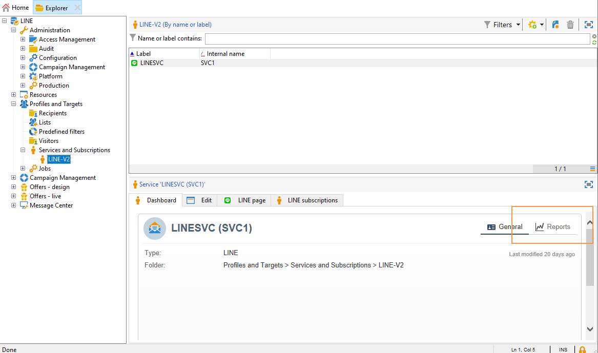

# Canal LINE{#line-channel}

LINE é um aplicativo para mensagens instantâneas, chamadas de voz e vídeo gratuitos, disponível em todos os smartphones (iPhone, Android, Windows Phone, Blackberry, Nokia) e no computador. O Adobe Campaign permite enviar mensagens do LINE.

O LINE só está disponível para instalações de serviços locais ou gerenciados.

O LINE também pode ser combinado com o módulo de mensagem transacional para enviar mensagens em tempo real no aplicativo LINE instalado em dispositivos móveis do consumidor. Para obter mais informações, consulte esta [página](../../message-center/using/transactional-messaging-architecture.md#transactional-messaging-and-line).

As seções abaixo fornecem informações específicas para o canal LINE. Para informações gerais sobre como criar um delivery, consulte [esta seção](../../delivery/using/steps-about-delivery-creation-steps.md).

As etapas para usar o canal LINE são:

1. Criação de um delivery.
1. Configuração do conteúdo da mensagem.
1. Seleção da população do target
1. Envio das mensagens.
1. Monitoramento do delivery (rastreamento, quarentena, relatórios, etc.).

## Configuração do canal LINE {#setting-up-line-channel}

### Criação de uma conta LINE e uma conta externa {#creating-a-line-account-and-an-external-account-}

>[!NOTE]
>
>Antes de criar uma conta LINE e uma conta externa, é necessário primeiro instalar o pacote LINE em sua instância. Para obter mais informações, consulte a seção [LINE](../../installation/using/installing-campaign-standard-packages.md#line-package) na guia Instalação.

É necessário primeiro criar uma conta LINE, para que possa vinculá-la ao Adobe Campaign. Em seguida, é possível enviar mensagens LINE aos usuários que adicionaram sua conta LINE no aplicativo móvel. Contas externas e contas LINE só podem ser gerenciadas pelo administrador funcional da plataforma.

Para criar e configurar uma conta LINE, consulte [https://developers.line.me/](https://developers.line.me/).

Para criar e configurar um serviço LINE, consulte [Gerenciando subscrições](../../delivery/using/managing-subscriptions.md)

Por fim, para criar uma conta externa no Adobe Campaign:

1. Na estrutura da árvore **Administration** > **Platform**, clique na guia **External Accounts**.
1. Em seguida, clique no ícone **New**.

   

1. Preencha os campos **Label** e **Internal Name**.
1. No campo **[!UICONTROL Type]**, selecione Routing, e no campo **Channel**, selecione LINE.
1. Clique em **[!UICONTROL Save]** para criar a conta externa LINE.
1. Em seguida, um campo de personalização **LINE** aparece sob o ícone **General**, preencha os seguintes campos:

   

   * **Channel Alias**: é fornecido através da conta LINE na guia **[!UICONTROL Channels]** > **[!UICONTROL Technical configuration]**.
   * **Channel ID**: é fornecido através da conta LINE na guia **Channels**> **Basic Information panel**.
   * **Channel secret key**: é fornecido por meio da conta LINE na guia **Channels**> **Basic Information panel**.
   * **Access token**: é fornecido por meio da conta LINE no portal do desenvolvedor ou clicando no botão **[!UICONTROL Get access token]**.
   * **Access token expiration date**: permite especificar a data de expiração do token de acesso.
   * **LINE subscription service**: permite especificar os serviços aos quais os usuários serão subscritos.

>[!NOTE]
>
>Deve-se verificar se os workflows **[!UICONTROL LINE access token update (updateLineAccessToken)]** e **[!UICONTROL Delete blocked LINE users (deleteBlockedLineUsers)]** iniciaram. No Explorer, clique em **[!UICONTROL Administration > Production > Technical workflows > LINE workflows]** para verificar o status dos workflows.

## Criação de delivery {#creating-the-delivery}

Para criar um delivery **LINE**, é necessário seguir estas etapas:

>[!NOTE]
>
>Os conceitos globais sobre a criação de delivery são apresentados [nesta seção](../../delivery/using/steps-about-delivery-creation-steps.md).

1. Na guia **[!UICONTROL Campaigns]**, selecione **[!UICONTROL Deliveries]** e clique no botão **[!UICONTROL Create]**.
1. Na janela exibida, selecione o template do delivery **[!UICONTROL LINE V2 delivery]**.

   

1. Identifique o delivery com um rótulo, código e descrição. Para obter mais informações, consulte [esta seção](../../delivery/using/steps-create-and-identify-the-delivery.md#identifying-the-delivery).
1. Clique em **[!UICONTROL Continue]** para criar o delivery.

## Definição do conteúdo {#defining-the-content}

Para definir o conteúdo de um delivery LINE, primeiro, é necessário adicionar o tipo de mensagem ao delivery. Cada delivery LINE pode conter até 5 mensagens.

É possível escolher entre dois tipos de mensagem:

* Mensagem de texto.
* Imagem e link.

### Configuração de um delivery de mensagem de texto {#configuring-a-text-message-delivery}

Um delivery LINE **text message** é uma mensagem enviada aos recipients no formato texto.

A configuração desse tipo de mensagem é semelhante à configuração do **text** em um email. Para obter mais informações, consulte esta [página](../../delivery/using/defining-the-email-content.md#message-content).

### Configuração de uma imagem e um delivery de link {#configuring-an-image-and-link-delivery}

Um delivery LINE **Image and link** é uma mensagem enviada aos recipients no formato de uma imagem que pode conter uma ou várias URLs.

É possível usar:

* uma **imagem personalizada**,

   >[!NOTE]
   >
   >É possível usar a variável **%SIZE%**: esta variável permite otimizar a exibição da imagem de acordo com o tamanho da tela do dispositivo móvel do recipient.

   

* um **URL de imagem**,

   

   As URLs de imagem permitem usar resoluções de imagem diferentes para otimizar a visibilidade do delivery em dispositivos móveis. Somente imagens com altura e largura são suportadas.

   As imagens podem ser definidas de acordo com o tamanho da tela:

   * 1040px
   * 700px
   * 460px
   * 300px
   * 240px
   >[!NOTE]
   >
   >O tamanho 1040x1040 px é obrigatório para cada imagem LINE com link.

   Depois, é preciso adicionar um texto alternativo que será exibido no dispositivo móvel do recipient.

* e **[!UICONTROL Links]**.

   

   A seção **[!UICONTROL Links]** permite escolher entre diferentes layouts que dividirão a imagem em várias regiões clicáveis. Então, é possível atribuir cada um deles a um link dedicado.

>[!NOTE]
>
>A sintaxe &lt;%@ include option=&#39;NmsServer_URL&#39; %>/webApp/APP3?id=&lt;%=escapeUrl(cryptString(visitor.id))%> permite incluir um link para um aplicativo Web em uma mensagem LINE.

### Recomendações {#recommendations}

* Ao enviar um delivery LINE para um novo recipient pela primeira vez, é preciso adicionar a mensagem LINE oficial referente aos termos de uso e consentimento para o fornecimento. A mensagem oficial está disponível no seguinte link: [https://terms.line.me/OA_privacy/](https://terms.line.me/OA_privacy/sp?lang=fr).

## Seleção da população do target {#selecting-the-target-population}

Selecionar recipients de um delivery LINE é semelhante a definir recipients do delivery de email. Para obter mais informações, consulte [Identificação das populações-alvo](../../delivery/using/steps-defining-the-target-population.md).

O direcionamento é realizado em **visitors**.

## Envio de mensagens {#sending-messages}

Quando o delivery é criado e configurado corretamente, é possível enviá-lo para o target definido anteriormente.

O envio de deliveries LINE é semelhante ao envio de um delivery de email. Para obter mais informações sobre o envio de um delivery, consulte [Envio de mensagens](../../delivery/using/sending-messages.md).

## Acesso ao relatórios {#accessing-reports}

É possível exibir relatórios do serviço LINE clicando em **[!UICONTROL Profiles and Targets > Services and Subscriptions > LINE]** no Explorer. Em seguida, clique no ícone **[!UICONTROL Reports]** no serviço LINE.

Para exibir relatórios dos deliveries LINE, clique em **[!UICONTROL Campaign Management > Deliveries]** e selecione o delivery desejado. Os relatórios de rastreamento indicam a taxa de cliques. O LINE não leva a taxa de abertura em consideração.

## Exemplo: criar e enviar uma mensagem LINE personalizada {#example--create-and-send-a-personalized-line-message}

Neste exemplo, vamos criar e configurar uma mensagem de texto e uma imagem contendo dados que serão personalizados de acordo com o recipient.

1. Crie o delivery LINE clicando na guia **[!UICONTROL Create]** e depois no botão **[!UICONTROL Campaign]**.

   

1. Selecione o template do delivery **[!UICONTROL LINE V2 delivery]** e dê um nome ao delivery.

   

1. Na janela de configuração do delivery, selecione a população do target.

   

1. Clique em **[!UICONTROL Add]** para criar a mensagem e selecione o **[!UICONTROL Message type]**.

   Aqui, primeiro devemos criar uma mensagem de texto.

   

1. Coloque o cursor no lugar onde deseja inserir o texto personalizado, clique no ícone suspenso e selecione **[!UICONTROL Visitor > First name]**.

   

1. Siga o mesmo procedimento para adicionar uma imagem, selecionando **[!UICONTROL Image and links]** no menu suspenso **[!UICONTROL Message type]**.

   Adicione o URL da imagem.

   

1. Na seção **[!UICONTROL Links]**, selecione o layout que dividirá a imagem em várias regiões clicáveis.
1. Atribua um URL para cada região da imagem.

   

1. Salve o delivery e clique em **[!UICONTROL Send]** para analisar e enviá-lo para o target.

   O delivery é enviado para o target.

   
