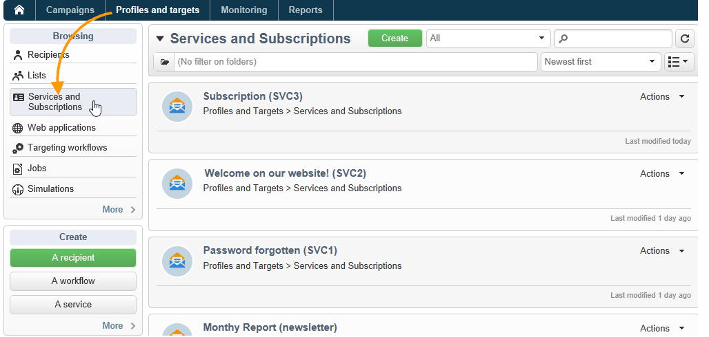
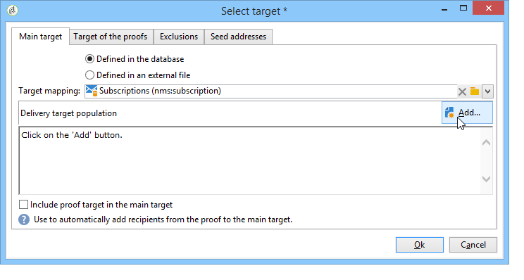
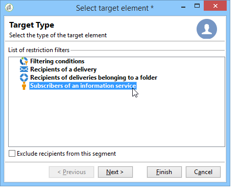

# Gerenciamento de assinaturas{#managing-subscriptions}

## Sobre os serviços de informações {#about-information-services}

Um serviço de informação compreende:

* Registro e subscrições (aceitação),
* Cancelar registro, cancelar subscrições voluntariamente (opt-out) ou cancelamento de subscrições automático (serviço por tempo limitado, por exemplo, como uma oferta de avaliação),
* Mecanismos de confirmação e cancelamento de subscrições (mecanismos simples com confirmação, opt-in duplo etc.),
* Controle de histórico do assinante.

Como um recurso padrão, esses serviços incluem relatórios estatísticos específicos: rastreamento de assinante, nível de fidelidade, tendências de cancelamento de subscrições etc.

Para emails, os links obrigatórios de cancelamento de subscrições são gerados automaticamente e o processo inteiro das opções de aceitação/recusa é totalmente automatizado, com o rastreamento de histórico para garantir total conformidade com as normas em vigor.

Há três modos de serviço de subscrição/unsubscription:

1. manual
1. por importação (somente subscrição),
1. por meio de um formulário da web

>[!NOTE]
>
>Uma amostra para criar um formulário de subscrição com opt-in duplo está detalhada [nesta seção](../../web/using/use-cases--web-forms.md#create-a-subscription--form-with-double-opt-in).

## Criação de um serviço de informação {#creating-an-information-service}

É possível criar e gerenciar subscrições de serviços de informações com mensagens de confirmação associadas ou entregas automáticas aos assinantes.

Para acessar o mapa de serviços de informações, acesse o universo **[!UICONTROL Profiles and Targets]** e clique no link **[!UICONTROL Services and Subscriptions]**.

Para editar um serviço existente, clique em seu respectivo nome. Para criar um serviço, clique no botão **[!UICONTROL Create]** localizado acima da lista.

* Insira o nome do serviço no campo **[!UICONTROL Label]** e selecione o canal de delivery: email, celular, Facebook, Twitter ou aplicativos móveis.

   >[!NOTE]
   >
   >As subscrições do Facebook e do Twitter estão detalhadas [nesta seção](../../social/using/about-social-marketing.md). As subscrições de aplicativos móveis são detalhadas em [Sobre o canal de aplicativos móveis](../../delivery/using/about-mobile-app-channel.md).

* Para um serviço de tipo de email, selecione o **Modo de delivery**. Os modos possíveis são: **[!UICONTROL Newsletter]** ou **[!UICONTROL Viral]**.
* Você pode enviar **mensagens de confirmação** para uma subscrição ou unsubscription. Para fazer isso, selecione os templates que devem ser usados para criar os deliveries correspondentes a partir dos campos **[!UICONTROL Subscription]** e **[!UICONTROL Unsubscription]**. Esses templates devem ser configurados com um target mapping do tipo **[!UICONTROL Subscription]** sem um destino definido. Consulte a seção [Sobre canal de email](../../delivery/using/about-email-channel.md).
* Por padrão, as subscrições são ilimitadas. É possível desmarcar a opção **[!UICONTROL Unlimited]** para definir uma duração de validade do serviço. A duração pode ser especificada em dias (**[!UICONTROL d]**) ou meses (**[!UICONTROL m]** ).

Depois que o serviço é salvo, ele será adicionado à lista Services and Subscriptions: Clique no nome para editá-lo. Várias guias estão disponíveis. A guia **[!UICONTROL Subscriptions]** permite visualizar a lista de assinantes do serviço de informação (guia **[!UICONTROL Active subscriptions]**) ou o histórico de subscrição/cancelar subscrição (guia **[!UICONTROL History]**). Além disso, é possível adicionar e excluir assinantes a partir desta guia. Consulte [Adição e exclusão de assinantes](#adding-and-deleting-subscribers)

O botão **[!UICONTROL Detail...]** permite examinar as propriedades de subscrição do recipient selecionado.

Você pode modificar as propriedades de subscrição de um recipient.

No painel, clique na guia **[!UICONTROL Reports]** para rastrear as subscrições: alterações nos níveis de subscrição, número total de assinantes, etc. É possível arquivar os relatórios e analisar os históricos nesta guia.

## Adição e exclusão de assinantes {#adding-and-deleting-subscribers}

Na guia **[!UICONTROL Subscriptions]** de um serviço de informação, clique em **[!UICONTROL Add]** para adicionar assinantes. Além disso, é possível clicar com o botão direito do mouse na lista de assinantes e selecionar **[!UICONTROL Add]**. Selecione a pasta na qual os perfis das subscrições são armazenados, selecione-os para subscrever-se e clique em **[!UICONTROL OK]** para validar.

Para excluir os assinantes, selecione-os e clique em **[!UICONTROL Delete]**. Além disso, é possível clicar com o botão direito do mouse na lista de assinantes e selecionar **[!UICONTROL Delete]**.

Em ambos os casos, se um template de delivery para cancelamentos de subscrição estiver anexado ao serviço, é possível enviar uma mensagem de confirmação para os usuários relacionados (consulte [Criação de um serviço de informações](#creating-an-information-service)). Um aviso permite validar ou não este delivery:

Consulte [Mecanismos de subscrição e cancelamento de subscrição](#subscription-and-unsubscription-mechanisms)

## Fazendo delivery aos assinantes de um serviço {#delivering-to-the-subscribers-of-a-service}

Para fazer delivery aos assinantes de um serviço de informação, é possível direcionar os assinantes ao serviço de informação relacionado, como no exemplo a seguir:

>[!CAUTION]
>
>O target mapping deve ser **[!UICONTROL Subscriptions]**.

Selecione **[!UICONTROL Subscribers of an information service]** e clique em **[!UICONTROL Next]**.

Selecione o serviço de informação específico e clique em **[!UICONTROL Finish]**.

A guia **[!UICONTROL Preview]** permite visualizar a lista de assinantes do serviço de informação selecionado.

## Mecanismos de subscrição e unsubscription {#subscription-and-unsubscription-mechanisms}

Você pode configurar mecanismos de subscrição e unsubscription para automatizar o gerenciamento de processos e de assinantes.

>[!NOTE]
>
>É possível enviar uma mensagem de confirmação para os assinantes novos.\
>O conteúdo dessa mensagem é definido na configuração do serviço de informação por meio dos campos **[!UICONTROL Subscription]** ou **[!UICONTROL Unsubscription]**.
>
>As mensagens de confirmação são criadas por meio dos templates de delivery especificados nesses campos. Esses target mappings devem ser **[!UICONTROL Subscriptions]**.

### Subscrever um recipient a um serviço {#subscribing-a-recipient-to-a-service}

Para registrar recipients para um serviço de informação, é possível:

* Adicionar manualmente o serviço: para fazer isso, a partir da guia **[!UICONTROL Subscriptions]** do perfil, clique em **[!UICONTROL Add]** e selecione o serviço de informação desejado.

   Para obter mais informações, consulte a seção sobre edição de perfil [nesta seção](../../platform/using/editing-a-profile.md).

* Subscrever automaticamente um conjunto de assinantes a este serviço. A lista de recipients pode vir de uma operação de filtragem, grupo, pasta, importação ou seleção direta usando o mouse. Para inscrever esses recipients, selecione os perfis e clique com o botão direito do mouse. Selecione **[!UICONTROL Actions > Subscribe selection to a service...]**, o serviço desejado e inicie a operação.
* Importar recipients e inscrevê-los automaticamente em um serviço de informação. Para fazer isso, selecione o serviço na última etapa do assistente de importação.

   Para obter mais informações, consulte [esta seção](../../platform/using/importing-data.md#import-wizard).

* Usar um formulário da Web para que os recipients possam subscrever-se a um serviço.

   Para obter mais informações, consulte [esta seção](../../web/using/about-web-applications.md).

* Criação de um workflow de direcionamento e uso de uma caixa **[!UICONTROL Subscription service]**.

   

   Workflows e como usá-los estão detalhados [nesta seção](../../workflow/using/about-workflows.md).

### Cancelamento de subscrição de um recipient a um serviço {#unsubscribing-a-recipient-from-a-service}

#### Cancelamento manual de subscrição {#manual-unsubscribing}

por lei, deliveries de email devem conter um link para cancelamento. Os recipients podem clicar neste link para atualizar seu perfil e ser excluídos do envio dos futuros deliveries.

O link padrão para cancelamento de subscrição é inserido por meio do último botão da barra de ferramentas do editor de conteúdo fornecido no assistente de delivery (consulte [Sobre personalização](../../delivery/using/about-personalization.md)). Quando o recipient clica nesse link, o perfil é adicionado à lista de bloqueios (recusado), significando que este recipient não será mais direcionado para qualquer ação de delivery.

Os recipients podem, no entanto, optar por cancelar a subscrição de um serviço sem cancelar a subscrição de todos os serviços. Para permitir isso, é possível usar um formulário web (consulte [esta seção](../../web/using/adding-fields-to-a-web-form.md#subscription-checkboxes)) ou inserir um link personalizado de cancelamento de subscrição (consulte [Blocos de personalização](../../delivery/using/personalization-blocks.md)).

Também é possível cancelar a subscrição de um recipient manualmente no perfil do recipient. Para fazer isso, clique na guia **[!UICONTROL Subscriptions]** do recipient, selecione o(s) serviço(s) de informações desejado(s) e clique em **[!UICONTROL Delete]**.

Por fim, é possível cancelar a subscrição de um ou mais recipients por meio do serviço de informação relacionado. Para fazer isso, clique na guia **[!UICONTROL Subscriptions]** do serviço, selecione os recipients relacionados e clique em **[!UICONTROL Delete]**.

#### Cancelamento automático de subscrição {#automatic-unsubscription}

Um serviço de informação pode ter uma duração limitada. Os recipients terão a subscrição cancelada automaticamente quando o período de validade expirar. Este período é especificado na guia **[!UICONTROL Edit]** das propriedades do serviço. Ele é expresso em dias.

Você também pode configurar um workflow de cancelamento de subscrições para uma população. Para fazer isso, siga o mesmo procedimento para um workflow de subscrições, mas selecione a opção **[!UICONTROL Unsubscription]**. Consulte [Subscrição de um recipient a um serviço](#subscribing-a-recipient-to-a-service).

### Rastreamento do assinante {#subscriber-tracking}

É possível rastrear as alterações nas subscrições dos serviços de informações por meio do uso do link **[!UICONTROL Reports]** no painel.

