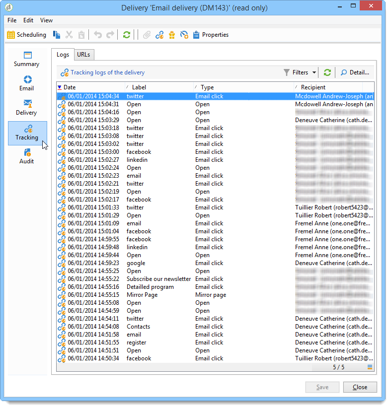
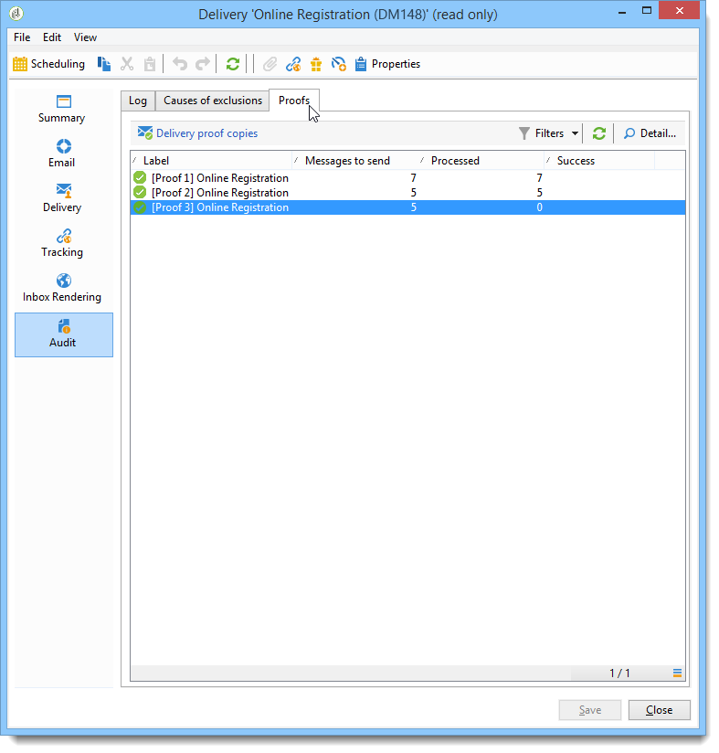

# Monitoramento de uma entrega{#monitoring-a-delivery}

O **painel de delivery** é fundamental para monitorar seus deliveries e eventuais problemas encontrados durante o envio de mensagens.

**Tópicos relacionados**

* [Noções básicas sobre falhas de entrega](../../delivery/using/understanding-delivery-failures.md)
* [Noções básicas sobre gestão de quarentena](../../delivery/using/understanding-quarantine-management.md)
* [Práticas recomendadas para delivery](https://docs.campaign.adobe.com/doc/AC/getting_started/EN/deliveryBestPractices.html)
* [Introdução: Gerenciamento da entrega](https://docs.campaign.adobe.com/doc/AC/getting_started/EN/deliverability.html)

## Painel de delivery {#delivery-dashboard}

Para exibir as informações em um delivery, edite-as, exiba o painel e clique nas guias disponíveis.

O conteúdo da guia não pode mais ser alterado uma vez que o delivery foi enviado.


### Resumo da entrega {#delivery-summary}

The **[!UICONTROL Summary]** tab contains the characteristics of the delivery: delivery status, channel used, information about the sender, subject, information concerning execution. Para obter mais informações, consulte [Número de mensagens enviadas](#number-of-messages-sent).

O **[!UICONTROL reports]** link permite que você veja um conjunto de relatórios referentes à ação de entrega: relatório geral de entrega, relatório detalhado, relatório de entrega, distribuição de mensagens com falha, taxa de abertura, cliques e transações etc. O conteúdo desta guia pode ser configurado de acordo com seus requisitos. Para obter mais informações, consulte [esta seção](../../reporting/using/delivery-reports.md).

### Histórico e logs do delivery {#delivery-logs-and-history}

The **[!UICONTROL Delivery]** tab gives a history of the occurrences in this delivery. Ela contém os logs de entrega, ou seja, a lista de mensagens enviadas e seus status, e as mensagens associadas.

Para um delivery, você pode exibir (por exemplo) apenas os recipients com um delivery com falha ou um endereço em quarentena. Para fazer isso, clique no **[!UICONTROL Filters]** botão e selecione **[!UICONTROL By state]**. Em seguida, selecione o estado na lista suspensa.


Vários status são listados [nesta página](#delivery-statuses).

>[!NOTE]
>
>The **[!UICONTROL Display the mirror page for this message...]** link lets you view the mirror page for the contents of the delivery selected from the list in a new window. A mirror page só está disponível para os deliveries para as quais o conteúdo HTML foi definido. For more on this, refer to [Generating the mirror page](../../delivery/using/sending-messages.md#generating-the-mirror-page).

### Logs de rastreamento {#tracking-logs}

The **[!UICONTROL Tracking]** tab lists the tracking history for this delivery. Esta guia exibe os dados de rastreamento das mensagens enviadas, ou seja, todas as URLs sujeitas ao rastreamento por meio do Adobe Campaign. Os dados de rastreamento são atualizados de hora em hora.

>[!NOTE]
>
>Se o rastreamento não estiver habilitado para um delivery, essa guia não será exibida.

A configuração de rastreamento é realizada no estágio apropriado do assistente do delivery. See [How to configure tracked links](../../delivery/using/how-to-configure-tracked-links.md).

**[!UICONTROL Tracking]** os dados são interpretados nos relatórios de entrega. Consulte [esta seção](../../reporting/using/delivery-reports.md).



### Auditoria de delivery {#delivery-audit-}

The **[!UICONTROL Audit]** tab contains the delivery log and all the messages concerning the proofs. The **[!UICONTROL Refresh]** button lets you update the data. Use the **[!UICONTROL Filters]** button to define a filter on the data.

Ícones especiais permitem identificar erros ou avisos. Consulte [Análise da entrega](../../delivery/using/steps-validating-the-delivery.md#analyzing-the-delivery).

The **[!UICONTROL Proofs]** sub-tab lets you view the list of proofs that have been sent.



You can modify the information displayed in this window (and that of the **[!UICONTROL Delivery]** and **[!UICONTROL Tracking]** tabs) by selecting the columns to be displayed. To do this, click the **[!UICONTROL Configure list]** icon located in the lower right-hand corner. Para obter mais informações sobre a configuração de exibição de listas, consulte [esta seção](../../platform/using/adobe-campaign-workspace.md#configuring-lists).

### Sincronização do painel de delivery {#delivery-dashboard-synchronization}

No painel de delivery, convêm verificar as mensagens processadas e os logs de deliveries para garantir que seu delivery foi enviado com êxito.

Alguns indicadores ou status podem estar incorretos ou não atualizados, isso pode ser resolvido com as seguintes soluções:

* If your delivery status is incorrect, check that all necessary approvals have been done for this delivery or that the **[!UICONTROL operationMgt]** and **[!UICONTROL deliveryMgt]** workflows are running without errors. Isso também pode ser porque o delivery está usando uma afinidade não configurada na instância de envio.
* If your delivery indicators are still at zero and if you are on a mid-sourcing configuration, check the **[!UICONTROL Mid-sourcing (delivery counters)]** technical workflow. Start it if its status is not **[!UICONTROL Started]**. You can then try to recompute the indicators by right-clicking the relevant delivery in the Adobe Campaign explorer and selecting **[!UICONTROL Actions]** > **[!UICONTROL Recompute delivery and tracking indicators]**. Para obter mais informações sobre indicadores de rastreamento, consulte esta [seção](../../reporting/using/delivery-reports.md#tracking-indicators).
* If your delivery counter does not match your delivery, try to recompute the indicators by right-clicking the relevant delivery in the Adobe Campaign explorer and selecting **[!UICONTROL Actions]** > **[!UICONTROL Recompute delivery and tracking indicators]** to resynchronize. Para obter mais informações sobre indicadores de rastreamento, consulte esta [seção](../../reporting/using/delivery-reports.md#tracking-indicators).
* If your delivery counter is not up-to-date for mid-sourcing deployments, check that the **[!UICONTROL Mid-Sourcing (Delivery counters)]** technical workflow is running. Para obter mais informações, consulte esta [página](../../installation/using/mid-sourcing-deployment.md).

Você também pode rastrear seus deliveries com relatórios diferentes através do painel de delivery. Para obter mais informações, consulte esta [seção](../../reporting/using/delivery-reports.md).

## Problemas de desempenho {#performance-issues}

### Lista de verificação {#checklist-}

Se os desempenhos de delivery forem ruins, você poderá verificar:

* **O tamanho da entrega**: Entregas grandes podem levar mais tempo para serem concluídas. Os MTA filho estão configurados para lidar com um tamanho de lote padrão, que funciona para a maioria das instâncias, mas precisam ser verificados quando os deliveries estiverem constantemente lentos.
* **A meta da entrega**: O desempenho de entrega é proibido por erros de rejeição em modo suave, que são manipulados de acordo com a configuração de repetição. Quanto maior o número de erros, mais tentativas são necessárias.
* **A carga** geral da plataforma: Quando várias entregas grandes são enviadas, a plataforma geral pode ser afetada. Você também pode verificar problemas de reputação de IP e capacidade de delivery. Para obter mais informações, consulte o [Guia de práticas recomendadas de capacidade de delivery](https://docs.campaign.adobe.com/doc/AC/getting_started/EN/deliverability.html) do Adobe Campaign e [esta página](../../delivery/using/about-deliverability.md).

A manutenção da plataforma e do banco de dados também pode afetar os desempenhos de envio de delivery. Para obter mais informações, consulte [esta página](../../production/using/database-performances.md).

### Deliveries lentos {#slow-deliveries}

After clicking the **[!UICONTROL Send]** button, your delivery seems to take longer than usual. Isso pode ser causado por elementos diferentes:

* Alguns provedores de email podem ter incluído seus endereços IP na blacklist. Neste caso, verifique seus broadlogs e consulte [este guia de introdução](https://docs.campaign.adobe.com/doc/AC/getting_started/EN/deliverability.html).
* Seu delivery pode ser muito grande para ser processado rapidamente, isso pode ocorrer com alta personalização do JavaScript ou se o seu delivery pesa mais do que 60 kbytes. Consulte as [Práticas recomendadas de delivery](https://docs.campaign.adobe.com/doc/AC/getting_started/EN/deliveryBestPractices.html) do Adobe Campaign para saber mais sobre as diretrizes de conteúdo.
* Pode ter ocorrido limitação dentro do MTA do Adobe Campaign. Isso é causado por:

   * Messages pended (**[!UICONTROL quotas met]** message): quotas declared by the declarative MX rules defined in Campaign have been met. Para obter mais informações sobre esse tipo de mensagem, consulte [esta página](https://helpx.adobe.com/campaign/kb/acc-deliverability-faq.html#FAQ). Para saber mais sobre as regras MX, consulte [esta página](../../delivery/using/technical-recommendations.md#mx-rules).
   * Messages pended (**[!UICONTROL dynamic flow control]** message): Campaign MTA has encountered errors when trying to deliver messages for a given ISP which causes a slowdown to avoid too big of an error density and thus facing potential blacklisting.

* Um problema do sistema pode impedir que os servidores interajam: isso pode desacelerar todo o processo de envio. Verifique os servidores para garantir que não haja problemas de memória ou recursos que possam afetar o Campaign no processo de obter os dados de personalização, por exemplo.

### Práticas recomendadas para desempenho {#best-practices-performance}

* Não mantenha as entregas em estado de falha na instância, pois isso mantém tabelas temporárias e afeta o desempenho.

* Remova as entregas que não são mais necessárias.

* Receptores inativos nos últimos 12 meses a serem removidos do banco de dados para manter a qualidade do endereço.

* Não tente agendar entregas grandes juntas. Há um intervalo de 5 a 10 minutos para espalhar a carga uniformemente sobre o sistema. Coordene o agendamento de entregas com os outros membros da equipe para garantir o melhor desempenho. Quando o servidor de marketing estiver lidando com várias tarefas diferentes ao mesmo tempo, ele poderá retardar o desempenho.

* Mantenha o tamanho dos seus emails o mais baixo possível. O tamanho máximo recomendado de um email é de aproximadamente 35 KB. O tamanho de uma entrega de email gera uma certa quantidade de volume nos servidores de envio.

* Entregas grandes, como entregas para mais de um milhão de destinatários, precisam de espaço nas filas de envio. Isso por si só não é um problema para o servidor, mas quando combinado com dezenas de outras grandes entregas sendo todas enviadas ao mesmo tempo, pode introduzir um atraso no envio.

* A personalização em emails extrai dados do banco de dados para cada destinatário. Se houver muitos elementos de personalização, isso aumentará a quantidade de dados necessários para preparar a entrega.

* Endereços de índice. Para otimizar o desempenho das consultas SQL usadas no aplicativo, um índice pode ser declarado a partir do elemento principal do esquema de dados.

>[!NOTE]
>
>Os ISPs desativariam endereços após um período de inatividade. As mensagens com rejeição são enviadas aos remetentes para informá-los sobre esse novo status.

## Status de delivery {#delivery-statuses}

Ao enviar um delivery, você pode encontrar o seguinte status no seu painel de delivery:

<table> 
 <thead> 
  <tr> 
   <th> Status<br /> </th> 
   <th> Definições e soluções<br /> </th> 
  </tr> 
 </thead> 
 <tbody> 
  <tr> 
   <td> Not applicable<br /> </td> 
   <td> O delivery foi levado em conta pelo servidor (MTA), mas não foi processado.<br /> </td> 
  </tr> 
  <tr> 
   <td> Ignorado<br /> </td> 
   <td> O delivery não foi enviado ao recipient devido a um erro no endereço. Ele foi incluído na blacklist, colocado em quarentena, não fornecido ou duplicado. <br /> </td> 
  </tr> 
  <tr> 
   <td> Sent<br /> </td> 
   <td> O delivery foi enviado corretamente ao provedor de mensagens (mas o recipient não o recebeu necessariamente).<br /> </td> 
  </tr> 
  <tr> 
   <td> Failed<br /> </td> 
   <td> O delivery não conseguiu alcançar o recipient devido a um endereço inválido ou a uma caixa de entrada cheia, por exemplo. Ele também pode ser vinculado a um problema com blocos de personalização, pois esses blocos podem gerar erros quando os schemas não correspondem ao mapeamento do delivery. Consulte Status <a href="#failed-status" target="_blank">com falha</a><br /> </td> 
  </tr> 
  <tr> 
   <td> Taken into account by the service provider<br /> </td> 
   <td> O provedor de serviços SMS recebeu o delivery.<br /> </td> 
  </tr> 
  <tr> 
   <td> Received on mobile<br /> </td> 
   <td> O recipient recebeu o SMS em seu dispositivo móvel.<br /> </td> 
  </tr> 
  <tr> 
   <td> Pending<br /> </td> 
   <td> O delivery está pronto para ser enviado e será processado pelo servidor de delivery (MTA). Consulte Status <a href="#pending-status" target="_blank">pendente</a>.<br /> </td> 
  </tr> 
  <tr> 
   <td> Delivery canceled<br /> </td> 
   <td> O delivery foi cancelado por um operador.<br /> </td> 
  </tr> 
  <tr> 
   <td> Prepared<br /> </td> 
   <td> Status intermediário usado somente para conectores externos como o canal móvel. Ele segue o status "Pendente" e é o conector externo que determinará o status seguinte.<br /> </td> 
  </tr> 
  <tr> 
   <td> Sent to the service provider<br /> </td> 
   <td> O delivery foi enviado para o provedor de serviços SMS, mas ainda não foi recebido.<br /> </td> 
  </tr> 
 </tbody> 
</table>

Para saber como otimizar a capacidade de delivery dos emails do Adobe Campaign, consulte o [Guia de práticas recomendadas de capacidade de delivery](https://docs.campaign.adobe.com/doc/AC/getting_started/EN/deliverability.html) do Adobe Campaign e [esta página](../../delivery/using/about-deliverability.md).

### Status Pending {#pending-status}

Após confirmar o delivery, você pode ver que o status do delivery é **[!UICONTROL Pending]**. Esse status significa que o processo de execução está aguardando a disponibilidade de alguns recursos.

The **[!UICONTROL Pending]** status can first mean that your delivery has been scheduled and is pending until the given date. Para obter mais informações, consulte a seção [Agendamento de delivery](../../delivery/using/steps-sending-the-delivery.md#scheduling-the-delivery-sending).

If your delivery is not being sent and its status remains **[!UICONTROL Pending]**, it can be the result of:

* O MTA (Message Transfert Agent), que executa módulos e processos no servidor de delivery e que gerencia o envio de email, pode não ter sido iniciado ou precisa ser reiniciado. Para verificar isso e iniciar o módulo se necessário, siga as seguintes etapas:

   * Check that your `mta@<instance>` modules are launched on your MTA servers.

   ```
   nlserver pdump
   HH:MM:SS > Application server for Adobe Campaign Classic (X.Y.Z YY.R build nnnn@SHA1) of DD/MM/YYYY
   [...]
   mta@<INSTANCENAME> (9268) - 23.0 Mb
   [...]
   ```

   * Se o MTA não estiver listado, comece com o seguinte comando:

   ```
   nlserver start mta@<INSTANCENAME>
   ```

   >[!NOTE]
   >
   >Replace `<INSTANCENAME>` with the name of your instance (production, development, etc.). O nome da instância é identificado por meio dos arquivos de configuração: `[path of application]nl6/conf/config-<INSTANCENAME>.xml`

* A entrega pode estar usando uma afinidade não configurada no servidor de envio. In this case, check the configuration of the traffic management (IP affinity) and use the **[!UICONTROL Managing affinities with IP addresses]** field to link deliveries to the MTA that manages the affinity. Para obter mais informações sobre afinidades, consulte [esta seção](../../installation/using/configuring-campaign-server.md#personalizing-delivery-parameters).
* Quando a preparação do delivery está pendente, pode haver muitas campanhas sendo executadas, bloqueando a atualização de status do delivery. To solve this, go to **[!UICONTROL Options]** and increase the value of **[!UICONTROL NmsOperation_LimitConcurrency]** (default is 10). Não execute mais campanhas do que o valor atribuído a essa opção específica.

### Falha no status {#failed-status}

If an email delivery&#39;s status is **[!UICONTROL Failed]**, it can be linked to an issue with personalization blocks. Os blocos de personalização em um delivery podem gerar erros quando os schemas não correspondem ao mapeamento do delivery, por exemplo.

Os logs do delivery são fundamentais para saber por que um delivery falhou. Aqui estão possíveis erros que você pode detectar nos logs de delivery:

* Se as mensagens do destinatário estiverem falhando com um erro &quot;Inacessível&quot; informando: **Erro ao compilar script &#39;content htmlContent&#39; linha X: não`[table]`está definido. JavaScript: erro ao avaliar o script &quot;content htmlContent&quot;**, a causa desse problema é quase sempre uma personalização dentro da tentativa do HTML chamar em uma tabela ou campo que não foi definido ou mapeado na construção do target de upstream ou no target mapping do delivery.

   Para corrigir isso, o workflow e o conteúdo do delivery precisam ser revisados para determinar especificamente qual personalização está tentando chamar a tabela em questão e se a tabela pode ou não ser mapeada. A partir daí, ao remover a chamada para esta tabela no HTML ou ao corrigir o mapping para o delivery pode ser o caminho para a resolução.

* No modelo de implantação de mid-sourcing, a seguinte mensagem pode aparecer nos registros de entrega: **Erro durante a chamada do método &#39;AppendDeliveryPart&#39; no servidor de fornecedores intermediários: &#39;Erro de comunicação com o servidor: verifique se este está configurado corretamente. HTTP código 408 &#39;Serviço temporariamente indisponível&#39;**.

   A causa está vinculada aos problemas de desempenho. Significa que a instância de marketing gasta muito tempo criando dados antes de enviá-los ao servidor mid-sourcing.

   Para resolver isso, recomendamos executar um vácuo e reindexação no banco de dados. Para obter mais informações sobre manutenção de banco de dados, consulte [esta seção](../../production/using/recommendations.md).

   Você também deve reiniciar todos os workflows com uma atividade agendada e todos os workflows com o status de falha. Consulte [esta seção](../../workflow/using/scheduler.md).

* Quando uma entrega falha, o seguinte erro pode aparecer nos registros de entrega: **DLV-XXXX A contagem de mensagens preparadas (123) é superior ao número de mensagens a enviar (111). Entre em contato com o suporte.**

   Normalmente, esse erro significa que há um campo ou bloco de personalização no email com mais de um valor para o recipient. Um bloco de personalização está sendo usado e está buscando mais de um registro para um determinado recipient.

   Para resolver isso, verifique os dados de personalização usados e verifique o target para os recipients que têm mais de uma entrada para qualquer um desses campos. You can also use a **[!UICONTROL Deduplication]** activity in the targeting workflow prior to the delivery activity to check there is only one personalization field at a time. Para obter mais informações sobre desduplicação, consulte [esta página](../../workflow/using/deduplication.md).

* Algumas entregas podem falhar com um erro &quot;Inacessível&quot; informando: &quot;Rejeição de email de entrada (regra &#39;Auto_reply&#39; corresponde a essa rejeição). Isso significa que o delivery teve êxito, mas o Adobe Campaign recebeu uma resposta automática do recipient (por exemplo, uma &quot;ausência temporária&quot;) que corresponde às regras de email de entrada &quot;Respostas_automáticas&quot;. O email de resposta automática é ignorado pelo Adobe Campaign e o endereço do recipient não será enviado para a quarentena.

**Tópicos relacionados:**

* [Histórico e logs do delivery](#delivery-logs-and-history)
* [Noções básicas sobre falhas de entrega](../../delivery/using/understanding-delivery-failures.md)
* [Tipos e motivos de falha de delivery](../../delivery/using/understanding-delivery-failures.md#delivery-failure-types-and-reasons)

## Número de mensagens enviadas {#number-of-messages-sent}

You can access deliveries from the delivery list, via the **[!UICONTROL Campaign Management > Deliveries]** node of the tree.

Por padrão, a lista de deliveries contém os nomes e os status dos deliveries criados no nó selecionado. Ele também mostra o número de mensagens a serem enviadas, processadas e enviadas com sucesso.

* The number of **[!UICONTROL Messages to send]** corresponds to the number of recipients targeted after analysis and prior to delivery.
* The number of messages in the **[!UICONTROL success]** column corresponds to the number of messages sent by the server and received by the recipients.
* The number of **[!UICONTROL processed]** messages corresponds to the number of messages received plus the number of messages with errors.

O painel de delivery permite que você rastreie o número de mensagens enviadas.

>[!NOTE]
>
>Para deliveries grandes, convém atualizar esses valores. Para fazer isso, selecione o delivery em questão e clique com o botão direito nele. Selecione **[!UICONTROL Action > Recompute delivery and tracking indicators...]** e use o assistente para atualizar essas informações.

## Deliveries agendados {#scheduled-deliveries-}

Se os deliveries não forem executados em uma data agendada específica, ela poderá estar relacionada a uma diferença entre o fuso horário dos servidores. A instância mid-sourcing e a instância de produção podem estar em fusos horários diferentes.

Como exemplo, se a ocorrência de mid-sourcing estiver no fuso horário Brisbane e na instância de produção estiver no fuso horário de Darwin, os fusos horários estão meia hora de diferença uma da outra e, no log de auditoria, é possível ver claramente que se a entrega está agendada para a produção às 11:56, o mesmo delivery agendado para mid deve ser às 12:26, com uma diferença de meia hora.
