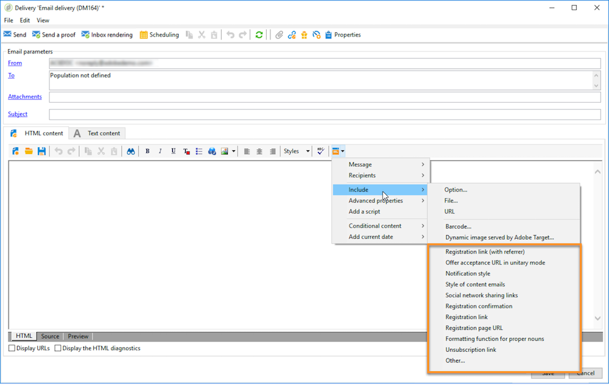
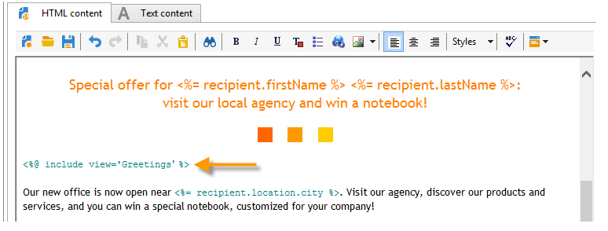
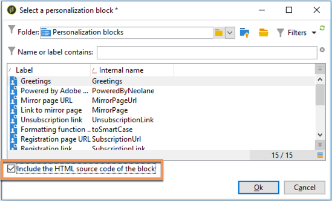
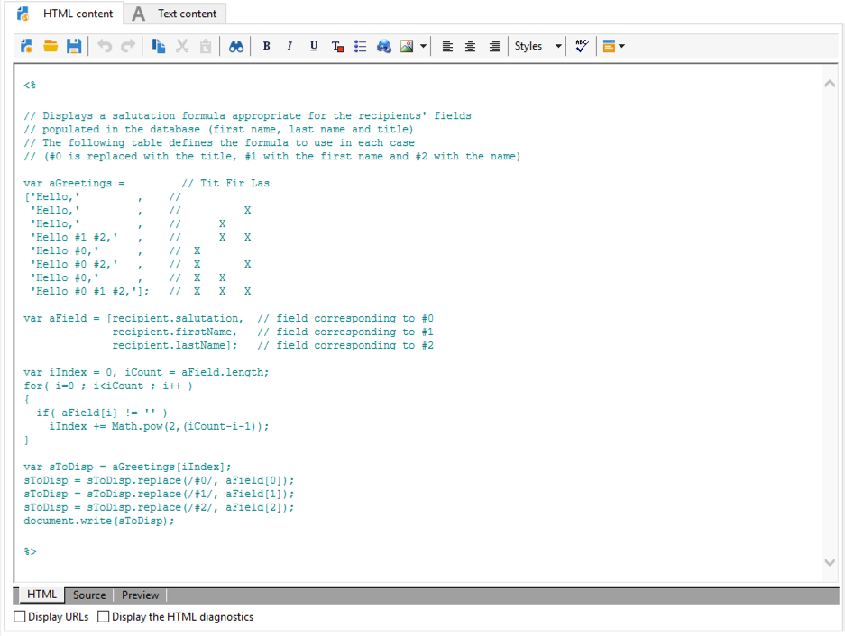

<?xml version="1.0" encoding="UTF-8"?>
<xliff xmlns="urn:oasis:names:tc:xliff:document:1.2" xmlns:okp="okapi-framework:xliff-extensions" xmlns:its="http://www.w3.org/2005/11/its" xmlns:itsxlf="http://www.w3.org/ns/its-xliff/" version="1.2" its:version="2.0">
<file original="help/delivery/using/personalization-blocks.md.mdnouisc" source-language="en-US" target-language="en-XX" datatype="x-text/markdown">
<body>
<trans-unit id="tu69" xml:space="preserve">
<source xml:lang="en-US">https://experienceleague.adobe.com/pt-br/docs/control-panel/using/instances-settings/url-permissions</source>
<target xml:lang="en-XX">https://experienceleague.adobe.com/pt-br/docs/control-panel/using/instances-settings/url-permissions</target>
</trans-unit>
<trans-unit id="tu86" xml:space="preserve">
<source xml:lang="en-US">https://experienceleague.adobe.com/docs/campaign-classic-learn/tutorials/overview.html?lang=pt-BR</source>
<target xml:lang="en-XX">https://experienceleague.adobe.com/docs/campaign-classic-learn/tutorials/overview.html?lang=pt-BR</target>
</trans-unit>
<trans-unit id="tu1" restype="x-YAML_METADATA_HEADER_VALUE" xml:space="preserve">
<source xml:lang="en-US">Personalization blocks</source>
<target xml:lang="en-XX">Blocos de personalização</target>
</trans-unit>
<trans-unit id="tu2" restype="x-YAML_METADATA_HEADER_VALUE" xml:space="preserve">
<source xml:lang="en-US">Learn how to use personalization blocks</source>
<target xml:lang="en-XX">Saiba como usar blocos de personalização</target>
</trans-unit>
<trans-unit id="tu3" xml:space="preserve">
<source xml:lang="en-US">Also applies to v8</source>
<target xml:lang="en-XX">Também se aplica ao v8</target>
</trans-unit>
<trans-unit id="tu4" xml:space="preserve">
<source xml:lang="en-US">Also applies to Campaign v8</source>
<target xml:lang="en-XX">Também se aplica ao Campaign v8</target>
</trans-unit>
<trans-unit id="tu5" xml:space="preserve">
<source xml:lang="en-US">Personalization blocks</source>
<target xml:lang="en-XX">Blocos de personalização</target>
</trans-unit>
<trans-unit id="tu6" xml:space="preserve">
<source xml:lang="en-US">Personalization blocks are dynamic, personalized and contain a specific rendering that you can insert into your deliveries. For example, you can add a logo, a greeting message, or a link to a mirror page. See <ph id="1" ctype="x-LINK">[</ph>Insert personalization blocks<ph id="2" ctype="x-LINK">](#inserting-personalization-blocks)</ph>.</source>
<target xml:lang="en-XX">Os blocos de personalização são dinâmicos, personalizados e contêm uma renderização específica que pode ser inserida em suas entregas. Por exemplo, você pode adicionar um logotipo, uma mensagem de saudação ou um link para uma mirror page. Consulte <ph id="1" ctype="x-LINK">[</ph>Inserir blocos de personalização<ph id="2" ctype="x-LINK">](#inserting-personalization-blocks)</ph>.</target>
</trans-unit>
<trans-unit id="tu7" xml:space="preserve">
<source xml:lang="en-US"><ph id="1" ctype="x-IMAGE"></ph> Discover this feature <ph id="3" ctype="x-LINK">[</ph>in video<ph id="4" ctype="x-LINK">](#personalization-blocks-video)</ph></source>
<target xml:lang="en-XX"><ph id="1" ctype="x-IMAGE"></ph> Descubra este recurso <ph id="3" ctype="x-LINK">[</ph>no vídeo<ph id="4" ctype="x-LINK">](#personalization-blocks-video)</ph></target>
</trans-unit>
<trans-unit id="tu8" xml:space="preserve">
<source xml:lang="en-US">Personalization blocks are accessed via the <ph id="1" ctype="x-STRONG_EMPHASIS">**[!UICONTROL Resources > Campaign Management > Personalization blocks]**</ph> node of the Adobe Campaign explorer. Several blocks are available by default (see <ph id="4" ctype="x-LINK">[</ph>Out-of-the-box personalization blocks<ph id="5" ctype="x-LINK">](#out-of-the-box-personalization-blocks)</ph>).</source>
<target xml:lang="en-XX">Os blocos de personalização são acessados por meio do nó <ph id="1" ctype="x-STRONG_EMPHASIS">**[!UICONTROL Resources > Campaign Management > Personalization blocks]**</ph> do explorer do Adobe Campaign. Vários blocos estão disponíveis por padrão (consulte <ph id="4" ctype="x-LINK">[</ph>Blocos de personalização prontos para uso<ph id="5" ctype="x-LINK">](#out-of-the-box-personalization-blocks)</ph>).</target>
</trans-unit>
<trans-unit id="tu9" xml:space="preserve">
<source xml:lang="en-US">You have the ability to define new blocks that will enable you to optimize your deliveries personalization. For more on this, refer to <ph id="1" ctype="x-LINK">[</ph>Define custom personalization blocks<ph id="2" ctype="x-LINK">](#defining-custom-personalization-blocks)</ph>.</source>
<target xml:lang="en-XX">Você pode definir novos blocos que permitem otimizar a personalização das entregas. Para saber mais, consulte <ph id="1" ctype="x-LINK">[</ph>Definir blocos de personalização customizados<ph id="2" ctype="x-LINK">](#defining-custom-personalization-blocks)</ph>.</target>
</trans-unit>
<trans-unit id="tu10" xml:space="preserve">
<source xml:lang="en-US"><ph id="1" ctype="x-regxph" equiv-text="&lbrack;!NOTE">[!NOTE]</ph></source>
<target xml:lang="en-XX"><ph id="1" ctype="x-regxph" equiv-text="&lbrack;!NOTE">[!NOTE]</ph></target>
</trans-unit>
<trans-unit id="tu11" xml:space="preserve">
<source xml:lang="en-US">Personalization blocks are also available from the <ph id="1" ctype="x-STRONG_EMPHASIS">**[!UICONTROL Digital Content Editor (DCE)]**</ph> . For more on this, refer to <ph id="4" ctype="x-LINK">[</ph>this page<ph id="5" ctype="x-LINK">](../../web/using/editing-content.md#inserting-a-personalization-block)</ph>.</source>
<target xml:lang="en-XX">Os blocos de personalização também estão disponíveis no <ph id="1" ctype="x-STRONG_EMPHASIS">**[!UICONTROL Digital Content Editor (DCE)]**</ph>. Para obter mais informações, consulte <ph id="4" ctype="x-LINK">[</ph>esta página<ph id="5" ctype="x-LINK">](../../web/using/editing-content.md#inserting-a-personalization-block)</ph>.</target>
</trans-unit>
<trans-unit id="tu12" xml:space="preserve">
<source xml:lang="en-US">Insert personalization blocks</source>
<target xml:lang="en-XX">Inserir blocos de personalização</target>
</trans-unit>
<trans-unit id="tu13" xml:space="preserve">
<source xml:lang="en-US">To insert a personalization block in a message, follow the steps below:</source>
<target xml:lang="en-XX">Para inserir um bloco de personalização em uma mensagem, siga as etapas abaixo:</target>
</trans-unit>
<trans-unit id="tu14" xml:space="preserve">
<source xml:lang="en-US">In the content editor of the delivery assistant, click the personalized field icon and select the <ph id="1" ctype="x-STRONG_EMPHASIS">**[!UICONTROL Include]**</ph> menu.</source>
<target xml:lang="en-XX">No editor de conteúdo do assistente de entrega, clique no ícone do campo personalizado e selecione o menu <ph id="1" ctype="x-STRONG_EMPHASIS">**[!UICONTROL Include]**</ph>.</target>
</trans-unit>
<trans-unit id="tu15" xml:space="preserve">
<source xml:lang="en-US">Select a personalization block from the list (the list displays the 10 last used blocks), or click the <ph id="1" ctype="x-STRONG_EMPHASIS">**[!UICONTROL Other...]**</ph> menu to access the full list.</source>
<target xml:lang="en-XX">Selecione um bloco de personalização na lista (a lista exibe os 10 últimos blocos usados) ou clique no menu <ph id="1" ctype="x-STRONG_EMPHASIS">**[!UICONTROL Other...]**</ph> para acessar a lista completa.</target>
</trans-unit>
<trans-unit id="tu16" xml:space="preserve">
<source xml:lang="en-US"><ph id="1" ctype="x-IMAGE"></ph></source>
<target xml:lang="en-XX"><ph id="1" ctype="x-IMAGE"></ph></target>
</trans-unit>
<trans-unit id="tu17" xml:space="preserve">
<source xml:lang="en-US">The <ph id="1" ctype="x-STRONG_EMPHASIS">**[!UICONTROL Other...]**</ph> menu gives access to all the out-of-the-box and custom personalization blocks (see <ph id="4" ctype="x-LINK">[</ph>Out-of-the-box personalization blocks<ph id="5" ctype="x-LINK">](#out-of-the-box-personalization-blocks)</ph> and <ph id="6" ctype="x-LINK">[</ph>Define custom personalization blocks<ph id="7" ctype="x-LINK">](#defining-custom-personalization-blocks)</ph>).</source>
<target xml:lang="en-XX">O menu <ph id="1" ctype="x-STRONG_EMPHASIS">**[!UICONTROL Other...]**</ph> permite o acesso a todos os blocos de personalização prontos para uso e customizados (consulte <ph id="4" ctype="x-LINK">[</ph>Blocos de personalização prontos para uso<ph id="5" ctype="x-LINK">](#out-of-the-box-personalization-blocks)</ph> e <ph id="6" ctype="x-LINK">[</ph>Definir blocos de personalização customizados<ph id="7" ctype="x-LINK">](#defining-custom-personalization-blocks)</ph>).</target>
</trans-unit>
<trans-unit id="tu18" xml:space="preserve">
<source xml:lang="en-US"><ph id="1" ctype="x-IMAGE"></ph></source>
<target xml:lang="en-XX"><ph id="1" ctype="x-IMAGE"></ph></target>
</trans-unit>
<trans-unit id="tu19" xml:space="preserve">
<source xml:lang="en-US">The personalization block is then inserted as a script. It is automatically adapted to the recipient profile when personalization is generated.</source>
<target xml:lang="en-XX">O bloco de personalização é então inserido como um script. Ele é adaptado automaticamente ao perfil do destinatário quando a personalização é gerada.</target>
</trans-unit>
<trans-unit id="tu20" xml:space="preserve">
<source xml:lang="en-US"><ph id="1" ctype="x-IMAGE"></ph></source>
<target xml:lang="en-XX"><ph id="1" ctype="x-IMAGE"></ph></target>
</trans-unit>
<trans-unit id="tu21" xml:space="preserve">
<source xml:lang="en-US">Click the <ph id="1" ctype="x-STRONG_EMPHASIS">**[!UICONTROL Preview]**</ph> tab and select a recipient to view the personalization.</source>
<target xml:lang="en-XX">Clique na guia <ph id="1" ctype="x-STRONG_EMPHASIS">**[!UICONTROL Preview]**</ph> e selecione um destinatário para exibir a personalização.</target>
</trans-unit>
<trans-unit id="tu22" xml:space="preserve">
<source xml:lang="en-US"><ph id="1" ctype="x-IMAGE"></ph></source>
<target xml:lang="en-XX"><ph id="1" ctype="x-IMAGE"></ph></target>
</trans-unit>
<trans-unit id="tu23" xml:space="preserve">
<source xml:lang="en-US">You can include the source code of a personalization block in the delivery content. To do this, select <ph id="1" ctype="x-STRONG_EMPHASIS">**[!UICONTROL Include the HTML source code of the block]**</ph> when selecting it.</source>
<target xml:lang="en-XX">Você pode incluir o código-fonte de um bloco de personalização no conteúdo da entrega. Para fazer isso, selecione <ph id="1" ctype="x-STRONG_EMPHASIS">**[!UICONTROL Include the HTML source code of the block]**</ph> ao selecioná-lo.</target>
</trans-unit>
<trans-unit id="tu24" xml:space="preserve">
<source xml:lang="en-US"><ph id="1" ctype="x-IMAGE"></ph></source>
<target xml:lang="en-XX"><ph id="1" ctype="x-IMAGE"></ph></target>
</trans-unit>
<trans-unit id="tu25" xml:space="preserve">
<source xml:lang="en-US">The HTML source code is inserted in the delivery content. For example, the <ph id="1" ctype="x-STRONG_EMPHASIS">**[!UICONTROL Greetings]**</ph> personalization bloc displays as below:</source>
<target xml:lang="en-XX">O código-fonte HTML é inserido no conteúdo de entrega. Por exemplo, o bloco de personalização <ph id="1" ctype="x-STRONG_EMPHASIS">**[!UICONTROL Greetings]**</ph> é exibido conforme mostrado abaixo:</target>
</trans-unit>
<trans-unit id="tu26" xml:space="preserve">
<source xml:lang="en-US"><ph id="1" ctype="x-IMAGE"></ph></source>
<target xml:lang="en-XX"><ph id="1" ctype="x-IMAGE"></ph></target>
</trans-unit>
<trans-unit id="tu27" xml:space="preserve">
<source xml:lang="en-US">Personalization blocks example</source>
<target xml:lang="en-XX">Exemplo de blocos de personalização</target>
</trans-unit>
<trans-unit id="tu28" xml:space="preserve">
<source xml:lang="en-US">In this example, we create an email in which we use personalization blocks to enable the recipient to view the mirror page, share the newsletter on social networks, and unsubscribe from future deliveries.</source>
<target xml:lang="en-XX">Neste exemplo, criamos um email no qual usamos blocos de personalização para permitir que o destinatário exiba a mirror page, compartilhe o boletim informativo em redes sociais e cancele a assinatura de entregas futuras.</target>
</trans-unit>
<trans-unit id="tu29" xml:space="preserve">
<source xml:lang="en-US">To do this, we need to insert the following personalization blocks:</source>
<target xml:lang="en-XX">Para fazer isso, precisamos inserir os seguintes blocos de personalização:</target>
</trans-unit>
<trans-unit id="tu30" xml:space="preserve">
<source xml:lang="en-US"><ph id="1" ctype="x-STRONG_EMPHASIS">**[!UICONTROL Link to mirror page]**</ph> .</source>
<target xml:lang="en-XX"><ph id="1" ctype="x-STRONG_EMPHASIS">**[!UICONTROL Link to mirror page]**</ph> .</target>
</trans-unit>
<trans-unit id="tu31" xml:space="preserve">
<source xml:lang="en-US"><ph id="1" ctype="x-STRONG_EMPHASIS">**[!UICONTROL Social network sharing links]**</ph> .</source>
<target xml:lang="en-XX"><ph id="1" ctype="x-STRONG_EMPHASIS">**[!UICONTROL Social network sharing links]**</ph> .</target>
</trans-unit>
<trans-unit id="tu32" xml:space="preserve">
<source xml:lang="en-US"><ph id="1" ctype="x-STRONG_EMPHASIS">**[!UICONTROL Unsubscription link]**</ph> .</source>
<target xml:lang="en-XX"><ph id="1" ctype="x-STRONG_EMPHASIS">**[!UICONTROL Unsubscription link]**</ph> .</target>
</trans-unit>
<trans-unit id="tu33" xml:space="preserve">
<source xml:lang="en-US"><ph id="1" ctype="x-regxph" equiv-text="&lbrack;!NOTE">[!NOTE]</ph></source>
<target xml:lang="en-XX"><ph id="1" ctype="x-regxph" equiv-text="&lbrack;!NOTE">[!NOTE]</ph></target>
</trans-unit>
<trans-unit id="tu34" xml:space="preserve">
<source xml:lang="en-US">For more on the mirror page generation, refer to <ph id="1" ctype="x-LINK">[</ph>Generate the mirror page<ph id="2" ctype="x-LINK">](sending-messages.md#generating-the-mirror-page)</ph>.</source>
<target xml:lang="en-XX">Para saber mais sobre a geração da mirror page, consulte <ph id="1" ctype="x-LINK">[</ph>Gerar a mirror page<ph id="2" ctype="x-LINK">](sending-messages.md#generating-the-mirror-page)</ph>.</target>
</trans-unit>
<trans-unit id="tu35" xml:space="preserve">
<source xml:lang="en-US">Create a new delivery or open an existing email type delivery.</source>
<target xml:lang="en-XX">Criar uma nova entrega ou abrir um tipo de entrega de email existente.</target>
</trans-unit>
<trans-unit id="tu36" xml:space="preserve">
<source xml:lang="en-US">In the delivery assistant, click <ph id="1" ctype="x-STRONG_EMPHASIS">**[!UICONTROL Subject]**</ph> to edit the subject of the message and enter a subject.</source>
<target xml:lang="en-XX">No assistente de entrega, clique em <ph id="1" ctype="x-STRONG_EMPHASIS">**[!UICONTROL Subject]**</ph> para inserir e editar o assunto da mensagem.</target>
</trans-unit>
<trans-unit id="tu37" xml:space="preserve">
<source xml:lang="en-US">Insert the personalization blocks in the message body. To do this, click in the message content, click the personalized field icon and select the <ph id="1" ctype="x-STRONG_EMPHASIS">**[!UICONTROL Include]**</ph> menu.</source>
<target xml:lang="en-XX">Insira os blocos de personalização no corpo da mensagem. Para fazer isso, clique no conteúdo da mensagem, clique no ícone de campo personalizado e selecione o menu <ph id="1" ctype="x-STRONG_EMPHASIS">**[!UICONTROL Include]**</ph>.</target>
</trans-unit>
<trans-unit id="tu38" xml:space="preserve">
<source xml:lang="en-US">Select the first block to insert. Renew the procedure to include the two other blocks.</source>
<target xml:lang="en-XX">Selecione o primeiro bloco a ser inserido. Renove o procedimento para incluir os dois outros blocos.</target>
</trans-unit>
<trans-unit id="tu39" xml:space="preserve">
<source xml:lang="en-US"><ph id="1" ctype="x-IMAGE"></ph></source>
<target xml:lang="en-XX"><ph id="1" ctype="x-IMAGE"></ph></target>
</trans-unit>
<trans-unit id="tu40" xml:space="preserve">
<source xml:lang="en-US">Click the <ph id="1" ctype="x-STRONG_EMPHASIS">**[!UICONTROL Preview]**</ph> tab to view the personalization result. You must select a recipient to display that recipient's message.</source>
<target xml:lang="en-XX">Clique na guia <ph id="1" ctype="x-STRONG_EMPHASIS">**[!UICONTROL Preview]**</ph> para exibir o resultado personalizado. Você deve selecionar um destinatário para exibir a mensagem dele.</target>
</trans-unit>
<trans-unit id="tu41" xml:space="preserve">
<source xml:lang="en-US"><ph id="1" ctype="x-IMAGE"></ph></source>
<target xml:lang="en-XX"><ph id="1" ctype="x-IMAGE"></ph></target>
</trans-unit>
<trans-unit id="tu42" xml:space="preserve">
<source xml:lang="en-US">Confirm that the block contents are displayed properly.</source>
<target xml:lang="en-XX">Confirme se o conteúdo do bloco é exibido corretamente.</target>
</trans-unit>
<trans-unit id="tu43" xml:space="preserve">
<source xml:lang="en-US">Out-of-the-box personalization blocks</source>
<target xml:lang="en-XX">Blocos de personalização prontos para uso</target>
</trans-unit>
<trans-unit id="tu44" xml:space="preserve">
<source xml:lang="en-US">A list of personalization blocks is available by default to help you personalize the content of your message.</source>
<target xml:lang="en-XX">Uma lista de blocos de personalização está disponível por padrão para ajudar na personalização do conteúdo da sua mensagem.</target>
</trans-unit>
<trans-unit id="tu45" xml:space="preserve">
<source xml:lang="en-US"><ph id="1" ctype="x-regxph" equiv-text="&lbrack;!NOTE">[!NOTE]</ph></source>
<target xml:lang="en-XX"><ph id="1" ctype="x-regxph" equiv-text="&lbrack;!NOTE">[!NOTE]</ph></target>
</trans-unit>
<trans-unit id="tu46" xml:space="preserve">
<source xml:lang="en-US">The list of personalization blocks depends on the modules and options which have been installed on your instance.</source>
<target xml:lang="en-XX">A lista de blocos de personalização depende dos módulos e das opções que foram instaladas na sua instância.</target>
</trans-unit>
<trans-unit id="tu47" xml:space="preserve">
<source xml:lang="en-US"><ph id="1" ctype="x-IMAGE"></ph></source>
<target xml:lang="en-XX"><ph id="1" ctype="x-IMAGE"></ph></target>
</trans-unit>
<trans-unit id="tu48" xml:space="preserve">
<source xml:lang="en-US"><ph id="1" ctype="x-STRONG_EMPHASIS">**[!UICONTROL Greetings]**</ph> : inserts greetings with the recipient's name. Example: "Hello John Doe,".</source>
<target xml:lang="en-XX"><ph id="1" ctype="x-STRONG_EMPHASIS">**[!UICONTROL Greetings]**</ph>: insere saudações com o nome do destinatário. Exemplo: “Olá, John Doe”.</target>
</trans-unit>
<trans-unit id="tu49" xml:space="preserve">
<source xml:lang="en-US"><ph id="1" ctype="x-STRONG_EMPHASIS">**[!UICONTROL Insert logo]**</ph> : inserts an out-of-the-box logo that has been defined when configuring the instance.</source>
<target xml:lang="en-XX"><ph id="1" ctype="x-STRONG_EMPHASIS">**[!UICONTROL Insert logo]**</ph>: insere um logotipo pronto para uso que foi definido ao configurar a instância.</target>
</trans-unit>
<trans-unit id="tu50" xml:space="preserve">
<source xml:lang="en-US"><ph id="1" ctype="x-STRONG_EMPHASIS">**[!UICONTROL Powered by Adobe Campaign]**</ph> : inserts the "Powered by Adobe Campaign" logo.</source>
<target xml:lang="en-XX"><ph id="1" ctype="x-STRONG_EMPHASIS">**[!UICONTROL Powered by Adobe Campaign]**</ph>: insere o logotipo “Powered by Adobe Campaign”.</target>
</trans-unit>
<trans-unit id="tu51" xml:space="preserve">
<source xml:lang="en-US"><ph id="1" ctype="x-STRONG_EMPHASIS">**[!UICONTROL Mirror page URL]**</ph> : inserts the mirror page URL, enabling Delivery Designers to check the link.</source>
<target xml:lang="en-XX"><ph id="1" ctype="x-STRONG_EMPHASIS">**[!UICONTROL Mirror page URL]**</ph>: insere o URL da mirror page, permitindo que os designers de entrega verifiquem o link.</target>
</trans-unit>
<trans-unit id="tu52" xml:space="preserve">
<source xml:lang="en-US"><ph id="1" ctype="x-regxph" equiv-text="&lbrack;!NOTE">[!NOTE]</ph></source>
<target xml:lang="en-XX"><ph id="1" ctype="x-regxph" equiv-text="&lbrack;!NOTE">[!NOTE]</ph></target>
</trans-unit>
<trans-unit id="tu53" xml:space="preserve">
<source xml:lang="en-US">For more on the mirror page generation, refer to <ph id="1" ctype="x-LINK">[</ph>Generate the mirror page<ph id="2" ctype="x-LINK">](sending-messages.md#generating-the-mirror-page)</ph>.</source>
<target xml:lang="en-XX">Para saber mais sobre a geração da mirror page, consulte <ph id="1" ctype="x-LINK">[</ph>Gerar a mirror page<ph id="2" ctype="x-LINK">](sending-messages.md#generating-the-mirror-page)</ph>.</target>
</trans-unit>
<trans-unit id="tu54" xml:space="preserve">
<source xml:lang="en-US"><ph id="1" ctype="x-STRONG_EMPHASIS">**[!UICONTROL Link to mirror page]**</ph> : inserts a link to the mirror page: "If you are unable to view this message correctly, click here".</source>
<target xml:lang="en-XX"><ph id="1" ctype="x-STRONG_EMPHASIS">**[!UICONTROL Link to mirror page]**</ph>: insere um link para a mirror page (“Se você não conseguir visualizar esta mensagem corretamente, clique aqui”).</target>
</trans-unit>
<trans-unit id="tu55" xml:space="preserve">
<source xml:lang="en-US"><ph id="1" ctype="x-STRONG_EMPHASIS">**[!UICONTROL Unsubscription link]**</ph> : inserts a link enabling to unsubscribe from all deliveries (denylist).</source>
<target xml:lang="en-XX"><ph id="1" ctype="x-STRONG_EMPHASIS">**[!UICONTROL Unsubscription link]**</ph>: insere um link que permite cancelar a inscrição de todas as entregas (lista de bloqueios).</target>
</trans-unit>
<trans-unit id="tu56" xml:space="preserve">
<source xml:lang="en-US"><ph id="1" ctype="x-STRONG_EMPHASIS">**[!UICONTROL Formatting function for proper nouns]**</ph> : generates the <ph id="4" ctype="x-STRONG_EMPHASIS">**[!UICONTROL toSmartCase]**</ph> Javascript function, which changes the first letter of each word to uppercase.</source>
<target xml:lang="en-XX"><ph id="1" ctype="x-STRONG_EMPHASIS">**[!UICONTROL Formatting function for proper nouns]**</ph>: gera a função JavaScript <ph id="4" ctype="x-STRONG_EMPHASIS">**[!UICONTROL toSmartCase]**</ph>, que coloca a primeira letra de cada palavra em maiúscula.</target>
</trans-unit>
<trans-unit id="tu57" xml:space="preserve">
<source xml:lang="en-US"><ph id="1" ctype="x-STRONG_EMPHASIS">**[!UICONTROL Registration page URL]**</ph> : inserts a subscription URL (see <ph id="4" ctype="x-LINK">[</ph>About services and subscriptions<ph id="5" ctype="x-LINK">](about-services-and-subscriptions.md)</ph>).</source>
<target xml:lang="en-XX"><ph id="1" ctype="x-STRONG_EMPHASIS">**[!UICONTROL Registration page URL]**</ph>: insere um URL de subscrição (consulte <ph id="4" ctype="x-LINK">[</ph>Sobre serviços e subscrições<ph id="5" ctype="x-LINK">](about-services-and-subscriptions.md)</ph>).</target>
</trans-unit>
<trans-unit id="tu58" xml:space="preserve">
<source xml:lang="en-US"><ph id="1" ctype="x-STRONG_EMPHASIS">**[!UICONTROL Registration link]**</ph> : inserts a subscription link. that has been defined when configuring the instance.</source>
<target xml:lang="en-XX"><ph id="1" ctype="x-STRONG_EMPHASIS">**[!UICONTROL Registration link]**</ph>: insere um link de subscrição. que foi definido ao configurar a instância.</target>
</trans-unit>
<trans-unit id="tu59" xml:space="preserve">
<source xml:lang="en-US"><ph id="1" ctype="x-STRONG_EMPHASIS">**[!UICONTROL Registration link (with referrer)]**</ph> : inserts a subscription link, enabling to identify the visitor and delivery. The link has been defined when configuring the instance.</source>
<target xml:lang="en-XX"><ph id="1" ctype="x-STRONG_EMPHASIS">**[!UICONTROL Registration link (with referrer)]**</ph> : insere um link de subscrição, permitindo identificar o visitante e a entrega. O link foi definido ao configurar a instância.</target>
</trans-unit>
<trans-unit id="tu60" xml:space="preserve">
<source xml:lang="en-US"><ph id="1" ctype="x-regxph" equiv-text="&lbrack;!NOTE">[!NOTE]</ph></source>
<target xml:lang="en-XX"><ph id="1" ctype="x-regxph" equiv-text="&lbrack;!NOTE">[!NOTE]</ph></target>
</trans-unit>
<trans-unit id="tu61" xml:space="preserve">
<source xml:lang="en-US">This block can be used in deliveries targeting visitors only.</source>
<target xml:lang="en-XX">Este bloco pode ser usado em entregas direcionadas somente para visitantes.</target>
</trans-unit>
<trans-unit id="tu62" xml:space="preserve">
<source xml:lang="en-US"><ph id="1" ctype="x-STRONG_EMPHASIS">**[!UICONTROL Registration confirmation]**</ph> : inserts a link enabling to confirm subscription.</source>
<target xml:lang="en-XX"><ph id="1" ctype="x-STRONG_EMPHASIS">**[!UICONTROL Registration confirmation]**</ph>: insere um link que permite confirmar a subscrição.</target>
</trans-unit>
<trans-unit id="tu63" xml:space="preserve">
<source xml:lang="en-US"><ph id="1" ctype="x-STRONG_EMPHASIS">**[!UICONTROL Social network sharing links]**</ph> : inserts buttons that enable the recipient to share a link to the mirror page content with the email client, Facebook, X (formerly known as Twitter), and LinkedIn (see <ph id="4" ctype="x-LINK">[</ph>Viral marketing: forward to a friend<ph id="5" ctype="x-LINK">](viral-and-social-marketing.md#viral-marketing--forward-to-a-friend)</ph>).</source>
<target xml:lang="en-XX"><ph id="1" ctype="x-STRONG_EMPHASIS">**[!UICONTROL Social network sharing links]**</ph>: insere botões que permitem que o destinatário compartilhe um link para o conteúdo da mirror page com o cliente de email, Facebook, X (anteriormente conhecido como Twitter) e LinkedIn (consulte <ph id="4" ctype="x-LINK">[</ph>Marketing viral: encaminhar para um amigo<ph id="5" ctype="x-LINK">](viral-and-social-marketing.md#viral-marketing--forward-to-a-friend)</ph>).</target>
</trans-unit>
<trans-unit id="tu64" xml:space="preserve">
<source xml:lang="en-US"><ph id="1" ctype="x-STRONG_EMPHASIS">**[!UICONTROL Style of content emails]**</ph> and <ph id="4" ctype="x-STRONG_EMPHASIS">**[!UICONTROL Notification style]**</ph> : generate code that format an email with predefined HTML styles. These blocks must be inserted in the source code of the delivery, in the <ph id="7" ctype="x-STRONG_EMPHASIS">**[!UICONTROL ...]**</ph> section, into <ph id="10" ctype="x-STRONG_EMPHASIS">**`&lt;style>...&lt;/style>`**</ph> tags.</source>
<target xml:lang="en-XX"><ph id="1" ctype="x-STRONG_EMPHASIS">**[!UICONTROL Style of content emails]**</ph> e <ph id="4" ctype="x-STRONG_EMPHASIS">**[!UICONTROL Notification style]**</ph>: geram um código que formata um email com estilos HTML predefinidos. Esses blocos devem ser inseridos no código-fonte da entrega, na seção <ph id="7" ctype="x-STRONG_EMPHASIS">**[!UICONTROL ...]**</ph>, nos tags <ph id="10" ctype="x-STRONG_EMPHASIS">**`&lt;style>...&lt;/style>`**</ph>.</target>
</trans-unit>
<trans-unit id="tu65" xml:space="preserve">
<source xml:lang="en-US"><ph id="1" ctype="x-STRONG_EMPHASIS">**[!UICONTROL Offer acceptance URL in unitary mode]**</ph> : inserts an URL enabling to set an Interaction offer to <ph id="4" ctype="x-STRONG_EMPHASIS">**[!UICONTROL Accepted]**</ph> (see <ph id="7" ctype="x-LINK">[</ph>this section<ph id="8" ctype="x-LINK">](../../interaction/using/offer-analysis-report.md)</ph>).</source>
<target xml:lang="en-XX"><ph id="1" ctype="x-STRONG_EMPHASIS">**[!UICONTROL Offer acceptance URL in unitary mode]**</ph>: insere um URL que permite definir uma oferta de Interação para <ph id="4" ctype="x-STRONG_EMPHASIS">**[!UICONTROL Accepted]**</ph> (consulte <ph id="7" ctype="x-LINK">[</ph>esta seção<ph id="8" ctype="x-LINK">](../../interaction/using/offer-analysis-report.md)</ph>).</target>
</trans-unit>
<trans-unit id="tu66" xml:space="preserve">
<source xml:lang="en-US">Define custom personalization blocks</source>
<target xml:lang="en-XX">Definir blocos de personalização personalizados</target>
</trans-unit>
<trans-unit id="tu67" xml:space="preserve">
<source xml:lang="en-US"><ph id="1" ctype="x-regxph" equiv-text="&lbrack;!IMPORTANT">[!IMPORTANT]</ph></source>
<target xml:lang="en-XX"><ph id="1" ctype="x-regxph" equiv-text="&lbrack;!IMPORTANT">[!IMPORTANT]</ph></target>
</trans-unit>
<trans-unit id="tu68" xml:space="preserve">
<source xml:lang="en-US">Release 7.4.4 (build 9401) includes an update to the external URL allow list. If a custom personalization block references an external URL (for example, an externally-hosted image), make sure that domain is added to your instance's approved allow list so that the resource continues to load without interruption. As a Campaign Administrator, use the Control Panel to add and manage allow-listed URLs. See <ph id="1" ctype="x-LINK">&lbrack;</ph>Add URL permissions<ph id="2" ctype="x-LINK">[#$tu69]{target="_blank"}</ph> for steps.</source>
<target xml:lang="en-XX">A versão 7.4.4 (build 9401) inclui uma atualização da lista de permissões de URL externo. Se um bloco de personalização personalizado referenciar um URL externo (por exemplo, uma imagem hospedada externamente), verifique se o domínio foi adicionado à lista de permissões aprovada da instância para que o recurso continue sendo carregado sem interrupção. Como administrador do Campaign, use o Painel de controle para adicionar e gerenciar URLs incluídos na lista de permissões. Consulte <ph id="1" ctype="x-LINK">&lbrack;</ph>Adicionar permissões de URL<ph id="2" ctype="x-LINK">[#$tu69]{target="_blank"}</ph> para ver as etapas.</target>
</trans-unit>
<trans-unit id="tu70" xml:space="preserve">
<source xml:lang="en-US">You can define new personalization fields to be inserted from the personalized field icon via the <ph id="1" ctype="x-STRONG_EMPHASIS">**[!UICONTROL Include...]**</ph> menu. These fields are defined in personalization blocks.</source>
<target xml:lang="en-XX">Você pode definir novos campos de personalização que serão inseridos no ícone do campo personalizado por meio do menu <ph id="1" ctype="x-STRONG_EMPHASIS">**[!UICONTROL Include...]**</ph>. Esses campos são definidos em blocos de personalização.</target>
</trans-unit>
<trans-unit id="tu71" xml:space="preserve">
<source xml:lang="en-US">To create a personalization block, go to the explorer and apply the following steps:</source>
<target xml:lang="en-XX">Para criar um bloco de personalização, vá para o explorer e siga as seguintes etapas:</target>
</trans-unit>
<trans-unit id="tu72" xml:space="preserve">
<source xml:lang="en-US">Click the <ph id="1" ctype="x-STRONG_EMPHASIS">**[!UICONTROL Resources > Campaign Management > Personalization blocks]**</ph> node.</source>
<target xml:lang="en-XX">Clique no nó <ph id="1" ctype="x-STRONG_EMPHASIS">**[!UICONTROL Resources > Campaign Management > Personalization blocks]**</ph>.</target>
</trans-unit>
<trans-unit id="tu73" xml:space="preserve">
<source xml:lang="en-US">Right-click the list of blocks and select <ph id="1" ctype="x-STRONG_EMPHASIS">**[!UICONTROL New]**</ph> .</source>
<target xml:lang="en-XX">Clique com o botão direito do mouse na lista de blocos e selecione <ph id="1" ctype="x-STRONG_EMPHASIS">**[!UICONTROL New]**</ph>.</target>
</trans-unit>
<trans-unit id="tu74" xml:space="preserve">
<source xml:lang="en-US">Fill in the settings of the personalization block:</source>
<target xml:lang="en-XX">Preencha as configurações do bloco de personalização:</target>
</trans-unit>
<trans-unit id="tu75" xml:space="preserve">
<source xml:lang="en-US"><ph id="1" ctype="x-IMAGE"></ph></source>
<target xml:lang="en-XX"><ph id="1" ctype="x-IMAGE"></ph></target>
</trans-unit>
<trans-unit id="tu76" xml:space="preserve">
<source xml:lang="en-US">Enter the label of the block. This label will be displayed in the personalization field insertion window.</source>
<target xml:lang="en-XX">Insira o rótulo do bloco. Esse rótulo será exibido na janela de inserção do campo de personalização.</target>
</trans-unit>
<trans-unit id="tu77" xml:space="preserve">
<source xml:lang="en-US">Select <ph id="1" ctype="x-STRONG_EMPHASIS">**[!UICONTROL Visible in the customization menus]**</ph> to make this block accessible from the personalization field insertion icon.</source>
<target xml:lang="en-XX">Selecione <ph id="1" ctype="x-STRONG_EMPHASIS">**[!UICONTROL Visible in the customization menus]**</ph> para tornar esse bloco acessível a partir do ícone de inserção do campo de personalização.</target>
</trans-unit>
<trans-unit id="tu78" xml:space="preserve">
<source xml:lang="en-US">If necessary, select <ph id="1" ctype="x-STRONG_EMPHASIS">**[!UICONTROL The content of the personalization block depends upon the format]**</ph> to define two separate blocks for emails in HTML format and those in text format.</source>
<target xml:lang="en-XX">Se necessário, selecione <ph id="1" ctype="x-STRONG_EMPHASIS">**[!UICONTROL The content of the personalization block depends upon the format]**</ph> para definir dois blocos separados para emails em formato HTML e texto.</target>
</trans-unit>
<trans-unit id="tu79" xml:space="preserve">
<source xml:lang="en-US">Two tabs are then displayed in the lower section of this editor (HTML content and Text content) to define the corresponding contents.</source>
<target xml:lang="en-XX">Duas guias são exibidas na seção inferior desse editor (conteúdo HTML e conteúdo de texto) para definir o conteúdo correspondente.</target>
</trans-unit>
<trans-unit id="tu80" xml:space="preserve">
<source xml:lang="en-US"><ph id="1" ctype="x-IMAGE"></ph></source>
<target xml:lang="en-XX"><ph id="1" ctype="x-IMAGE"></ph></target>
</trans-unit>
<trans-unit id="tu81" xml:space="preserve">
<source xml:lang="en-US">Enter the content (in HTML, text, JavaScript, etc.) of the personalization block(s) and click <ph id="1" ctype="x-STRONG_EMPHASIS">**[!UICONTROL Save]**</ph>.</source>
<target xml:lang="en-XX">Insira o conteúdo (em HTML, texto, JavaScript etc.) do(s) bloco(s) de personalização e clique em <ph id="1" ctype="x-STRONG_EMPHASIS">**[!UICONTROL Save]**</ph>.</target>
</trans-unit>
<trans-unit id="tu82" xml:space="preserve">
<source xml:lang="en-US">Tutorial video</source>
<target xml:lang="en-XX">Tutorial em vídeo</target>
</trans-unit>
<trans-unit id="tu83" xml:space="preserve">
<source xml:lang="en-US">Learn how to create dynamic content blocks and how to use them to personalize the content of your email delivery.</source>
<target xml:lang="en-XX">Saiba como criar blocos de conteúdo dinâmico e como usá-los para personalizar o conteúdo da sua entrega de email.</target>
</trans-unit>
<trans-unit id="tu84" xml:space="preserve">
<source xml:lang="en-US"><ph id="1" ctype="x-regxph" equiv-text="&lbrack;!VIDEO">[!VIDEO](https://video.tv.adobe.com/v/24924?quality=12)</ph></source>
<target xml:lang="en-XX"><ph id="1" ctype="x-regxph" equiv-text="&lbrack;!VIDEO">[!VIDEO](https://video.tv.adobe.com/v/24924?quality=12)</ph></target>
</trans-unit>
<trans-unit id="tu85" xml:space="preserve">
<source xml:lang="en-US">Additional Campaign Classic how-to videos are available <ph id="1" ctype="x-LINK">&lbrack;</ph>here<ph id="2" ctype="x-LINK">[#$tu86]</ph>.</source>
<target xml:lang="en-XX">Vídeos extras sobre procedimentos do Campaign Classic estão disponíveis <ph id="1" ctype="x-LINK">&lbrack;</ph>aqui<ph id="2" ctype="x-LINK">[#$tu86]</ph>.</target>
</trans-unit>
</body>
</file>
</xliff>