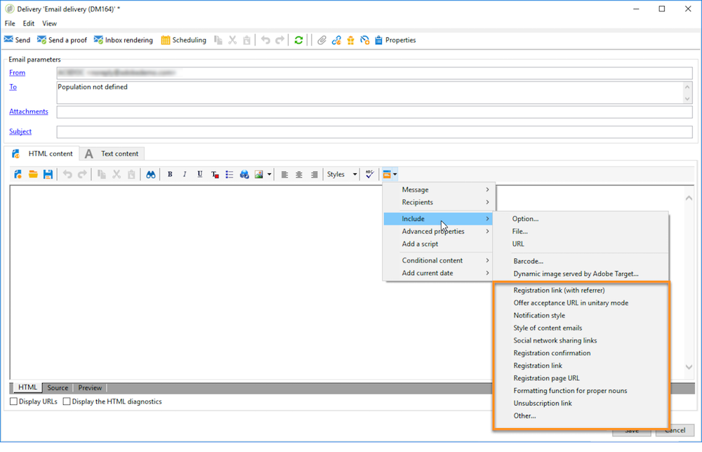
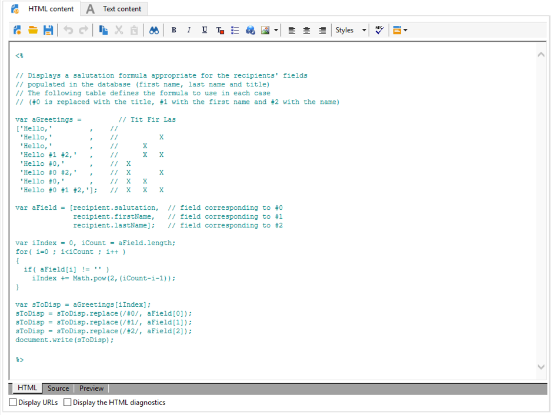

# Blocos de personalização{#personalization-blocks}

Os blocos de personalização são dinâmicos, personalizados e contêm uma renderização específica que pode ser inserida em seus deliveries. Por exemplo, você pode adicionar um logotipo, uma mensagem de saudação ou um link para uma mirror page. Consulte [Inserir blocos](#inserting-personalization-blocks)de personalização.

>[!NOTE]
>
>Personalization blocks are also available from the **[!UICONTROL Digital Content Editor (DCE)]** . Para obter mais informações, consulte [esta página](../../web/using/editing-content.md#inserting-a-personalization-block).

Personalization blocks are accessed via the **[!UICONTROL Resources > Campaign Management > Personalization blocks]** node of the Adobe Campaign explorer. Vários blocos estão disponíveis por padrão (consulte Blocos [](#out-of-the-box-personalization-blocks)de personalização predefinidos).

Você pode definir novos blocos que permitem otimizar a personalização dos deliveries. Para obter mais informações, consulte [Definição de blocos](#defining-custom-personalization-blocks)personalizados de personalização.

## Inserir blocos de personalização {#inserting-personalization-blocks}

Para inserir um bloco de personalização em uma mensagem, siga as etapas abaixo:

1. In the content editor of the delivery wizard, click the personalized field icon and select the **[!UICONTROL Include]** menu.
1. Select a personalization block from the list (the list displays the 10 last used blocks), or click the **[!UICONTROL Other...]** menu to access the full list.

   

1. O **[!UICONTROL Other...]** menu fornece acesso a todos os blocos de personalização predefinidos e personalizados (consulte Blocos [de personalização predefinidos e](#out-of-the-box-personalization-blocks) Definição de blocos [](#defining-custom-personalization-blocks)de personalização personalizados).

   

1. O bloco de personalização é então inserido como um script. Ele é adaptado automaticamente ao perfil do recipient quando a personalização é gerada.

   

1. Click the **[!UICONTROL Preview]** tab and select a recipient to view the personalization.

   

Você pode incluir o código-fonte de um bloco de personalização no conteúdo do delivery. Para fazer isso, selecione **[!UICONTROL Include the HTML source code of the block]** ao selecioná-lo.


O código-fonte HTML é inserido no conteúdo de delivery. For example, the **[!UICONTROL Greetings]** personalization bloc displays as below:



## Exemplo de blocos de personalização {#personalization-blocks-example}

Neste exemplo, criamos um email no qual usamos blocos de personalização para permitir que o recipient exiba a mirror page, compartilhe o boletim informativo em redes sociais e cancele a assinatura de deliveries futuros.

Para fazer isso, precisamos inserir os seguintes blocos de personalização:

* **[!UICONTROL Link to mirror page]** .
* **[!UICONTROL Social network sharing links]** .
* **[!UICONTROL Unsubscription link]** .

>[!NOTE]
>
>Para obter mais informações sobre a geração da página espelhada, consulte [Geração da página](../../delivery/using/sending-messages.md#generating-the-mirror-page)espelhada.

1. Criar um novo delivery ou abrir um tipo de delivery de email existente.
1. In the delivery wizard, click **[!UICONTROL Subject]** to edit the subject of the message and enter a subject.
1. Insira os blocos de personalização no corpo da mensagem. To do this, click in the message content, click the personalized field icon and select the **[!UICONTROL Include]** menu.
1. Selecione o primeiro bloco a ser inserido. Renove o procedimento para incluir os dois outros blocos.

   

1. Click the **[!UICONTROL Preview]** tab to view the personalization result. Você deve selecionar um recipient para exibir a mensagem dele.

   

1. Confirme se o conteúdo do bloco é exibido corretamente.

## Blocos de personalização integrados {#out-of-the-box-personalization-blocks}

Uma lista de blocos de personalização está disponível por padrão para ajudar na personalização do conteúdo da sua mensagem.

>[!NOTE]
>
>A lista de blocos de personalização depende dos módulos e das opções que foram instaladas na sua instância.


* **[!UICONTROL Greetings]** : insere saudações com o nome do destinatário. Exemplo: &quot;Olá, John Doe&quot;.
* **[!UICONTROL Insert logo]** : insere um logotipo predefinido que foi definido ao configurar a instância.
* **[!UICONTROL Powered by Adobe Campaign]** : insere o logotipo &quot;Powered by Adobe Campaign&quot;.
* **[!UICONTROL Mirror page URL]** : insere o URL da página espelhada, permitindo que os designers de entrega verifiquem o link.

   >[!NOTE]
   >
   >Para obter mais informações sobre a geração da página espelhada, consulte [Geração da página](../../delivery/using/sending-messages.md#generating-the-mirror-page)espelhada.

* **[!UICONTROL Link to mirror page]** : insere um link para a página espelhada: &quot;Se você não conseguir visualizar esta mensagem corretamente, clique aqui&quot;.
* **[!UICONTROL Unsubscription link]** : insere um link que permite cancelar a assinatura de todas as entregas (lista negra).
* **[!UICONTROL Formatting function for proper nouns]** : gera a função **[!UICONTROL toSmartCase]** Javascript, que altera a primeira letra de cada palavra para maiúscula. This block must be inserted in the source code of the delivery, into **`<script>...</script>`** tags.

   No exemplo abaixo, a função é usada para substituir o elemento &quot;Meu cabeçalho&quot; por &quot;Meu novo cabeçalho&quot; por letras maiúsculas em cada palavra:

   ```
   <h1 id="sample">My header</h1>
   <script><%@ include view='toSmartCase'%>;
   document.getElementById("sample").innerHTML = toSmartCase("My new header");
   </script>
   ```

   

* **[!UICONTROL Registration page URL]** : insere um URL de assinatura (consulte [Sobre serviços e assinaturas](../../delivery/using/about-services-and-subscriptions.md)).
* **[!UICONTROL Registration link]** : insere um link de assinatura. que foi definido ao configurar a instância.
* **[!UICONTROL Registration link (with referrer)]** : insere um link de assinatura, permitindo identificar o visitante e a entrega. O link foi definido ao configurar a instância.

   >[!NOTE]
   >
   >Este bloco pode ser usado em deliveries somente para visitantes.

* **[!UICONTROL Registration confirmation]** : insere um link que permite a confirmação da assinatura.
* **[!UICONTROL Social network sharing links]** : insere botões que permitem ao destinatário compartilhar um link para o conteúdo da página espelhada com o cliente de email, Facebook, Twitter, Google + e LinkedIn (consulte Marketing [viral: encaminhar para um amigo](../../delivery/using/viral-and-social-marketing.md#viral-marketing--forward-to-a-friend)).
* **[!UICONTROL Style of content emails]** e **[!UICONTROL Notification style]** : gere um código que formate um email com estilos HTML predefinidos. These blocks must be inserted in the source code of the delivery, in the **[!UICONTROL ...]** section, into **`<style>...</style>`** tags.
* **[!UICONTROL Offer acceptance URL in unitary mode]** : insere um URL que permite definir uma oferta de Interação para **[!UICONTROL Accepted]** (consulte [esta seção](../../interaction/using/offer-analysis-report.md)).

## Definição de blocos de personalização personalizados {#defining-custom-personalization-blocks}

You can define new personalization fields to be inserted from the personalized field icon via the **[!UICONTROL Include...]** menu. Esses campos são definidos em blocos de personalização.

Para criar um bloco de personalização, vá para o explorador e siga as seguintes etapas:

1. Clique no **[!UICONTROL Resources > Campaign Management > Personalization blocks]** nó.
1. Right-click the list of blocks and select **[!UICONTROL New]** .
1. Preencha as configurações do bloco de personalização:

   

   * Insira o rótulo do bloco. Esse rótulo será exibido na janela de inserção do campo de personalização.
   * Select **[!UICONTROL Visible in the customization menus]** to make this block accessible from the personalization field insertion icon.
   * If necessary, select **[!UICONTROL The content of the personalization block depends upon the format]** to define two separate blocks for emails in HTML format and those in text format.

      Duas guias são exibidas na seção inferior desse editor (conteúdo HTML e conteúdo de texto) para definir o conteúdo correspondente.

      

   * Enter the content (in HTML, text, JavaScript, etc.) of the personalization block(s) and click **[!UICONTROL Save]** .
