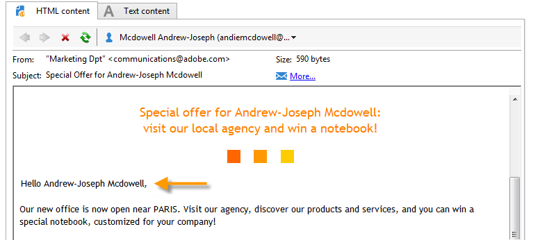

# Blocos de personalização{#personalization-blocks}

Os blocos de personalização são dinâmicos, personalizados e contêm uma renderização específica que pode ser inserida em suas entregas. Por exemplo, você pode adicionar um logotipo, uma mensagem de saudação ou um link para uma mirror page. Consulte [Inserir blocos de personalização](#inserting-personalization-blocks).

 Descubra este recurso [no vídeo](#personalization-blocks-video)

Os blocos de personalização são acessados por meio do nó **[!UICONTROL Resources > Campaign Management > Personalization blocks]** do explorer do Adobe Campaign. Vários blocos estão disponíveis por padrão (consulte [Blocos de personalização prontos para uso](#out-of-the-box-personalization-blocks)).

Você pode definir novos blocos que permitem otimizar a personalização das entregas. Para saber mais, consulte [Definir blocos de personalização customizados](#defining-custom-personalization-blocks).

>[!NOTE]
>
>Os blocos de personalização também estão disponíveis no **[!UICONTROL Digital Content Editor (DCE)]**. Para obter mais informações, consulte [esta página](../../web/using/editing-content.md#inserting-a-personalization-block).

## Inserir blocos de personalização {#inserting-personalization-blocks}

Para inserir um bloco de personalização em uma mensagem, siga as etapas abaixo:

1. No editor de conteúdo do assistente de entrega, clique no ícone do campo personalizado e selecione o menu **[!UICONTROL Include]**.
1. Selecione um bloco de personalização na lista (a lista exibe os 10 últimos blocos usados) ou clique no menu **[!UICONTROL Other...]** para acessar a lista completa.

   

1. O menu **[!UICONTROL Other...]** permite o acesso a todos os blocos de personalização prontos para uso e customizados (consulte [Blocos de personalização prontos para uso](#out-of-the-box-personalization-blocks) e [Definir blocos de personalização customizados](#defining-custom-personalization-blocks)).

   

1. O bloco de personalização é então inserido como um script. Ele é adaptado automaticamente ao perfil do destinatário quando a personalização é gerada.

   

1. Clique na guia **[!UICONTROL Preview]** e selecione um destinatário para exibir a personalização.

   

Você pode incluir o código-fonte de um bloco de personalização no conteúdo da entrega. Para fazer isso, selecione **[!UICONTROL Include the HTML source code of the block]** ao selecioná-lo.

O código-fonte HTML é inserido no conteúdo de entrega. Por exemplo, o bloco de personalização **[!UICONTROL Greetings]** é exibido conforme mostrado abaixo:

## Exemplo de blocos de personalização {#personalization-blocks-example}

Neste exemplo, criamos um email no qual usamos blocos de personalização para permitir que o destinatário exiba a mirror page, compartilhe o boletim informativo em redes sociais e cancele a assinatura de entregas futuras.

Para fazer isso, precisamos inserir os seguintes blocos de personalização:

* **[!UICONTROL Link to mirror page]** .
* **[!UICONTROL Social network sharing links]** .
* **[!UICONTROL Unsubscription link]** .

>[!NOTE]
>
>Para saber mais sobre a geração da mirror page, consulte [Gerar a mirror page](sending-messages.md#generating-the-mirror-page).

1. Criar uma nova entrega ou abrir um tipo de entrega de email existente.
1. No assistente de entrega, clique em **[!UICONTROL Subject]** para inserir e editar o assunto da mensagem.
1. Insira os blocos de personalização no corpo da mensagem. Para fazer isso, clique no conteúdo da mensagem, clique no ícone de campo personalizado e selecione o menu **[!UICONTROL Include]**.
1. Selecione o primeiro bloco a ser inserido. Renove o procedimento para incluir os dois outros blocos.

   

1. Clique na guia **[!UICONTROL Preview]** para exibir o resultado personalizado. Você deve selecionar um destinatário para exibir a mensagem dele.

   

1. Confirme se o conteúdo do bloco é exibido corretamente.

## Blocos de personalização prontos para uso {#out-of-the-box-personalization-blocks}

Uma lista de blocos de personalização está disponível por padrão para ajudar na personalização do conteúdo da sua mensagem.

>[!NOTE]
>
>A lista de blocos de personalização depende dos módulos e das opções que foram instaladas na sua instância.

* **[!UICONTROL Greetings]**: insere saudações com o nome do destinatário. Exemplo: “Olá, John Doe”.
* **[!UICONTROL Insert logo]**: insere um logotipo pronto para uso que foi definido ao configurar a instância.
* **[!UICONTROL Powered by Adobe Campaign]**: insere o logotipo “Powered by Adobe Campaign”.
* **[!UICONTROL Mirror page URL]**: insere o URL da mirror page, permitindo que os designers de entrega verifiquem o link.

  >[!NOTE]
  >
  >Para saber mais sobre a geração da mirror page, consulte [Gerar a mirror page](sending-messages.md#generating-the-mirror-page).

* **[!UICONTROL Link to mirror page]**: insere um link para a mirror page (“Se você não conseguir visualizar esta mensagem corretamente, clique aqui”).
* **[!UICONTROL Unsubscription link]**: insere um link que permite cancelar a inscrição de todas as entregas (lista de bloqueios).
* **[!UICONTROL Formatting function for proper nouns]**: gera a função JavaScript **[!UICONTROL toSmartCase]**, que coloca a primeira letra de cada palavra em maiúscula.
* **[!UICONTROL Registration page URL]**: insere um URL de subscrição (consulte [Sobre serviços e subscrições](about-services-and-subscriptions.md)).
* **[!UICONTROL Registration link]**: insere um link de subscrição. que foi definido ao configurar a instância.
* **[!UICONTROL Registration link (with referrer)]** : insere um link de subscrição, permitindo identificar o visitante e a entrega. O link foi definido ao configurar a instância.

  >[!NOTE]
  >
  >Este bloco pode ser usado em entregas somente para visitantes.

* **[!UICONTROL Registration confirmation]**: insere um link que permite confirmar a subscrição.
* **[!UICONTROL Social network sharing links]**: insere botões que permitem que o destinatário compartilhe um link para o conteúdo da mirror page com o cliente de email, Facebook, X (anteriormente conhecido como Twitter) e LinkedIn (consulte [Marketing viral: encaminhar para um amigo](viral-and-social-marketing.md#viral-marketing--forward-to-a-friend)).
* **[!UICONTROL Style of content emails]** e **[!UICONTROL Notification style]**: geram um código que formata um email com estilos HTML predefinidos. Esses blocos devem ser inseridos no código-fonte da entrega, na seção **[!UICONTROL ...]**, nos tags **``**.
* **[!UICONTROL Offer acceptance URL in unitary mode]**: insere um URL que permite definir uma oferta de Interação para **[!UICONTROL Accepted]** (consulte [esta seção](../../interaction/using/offer-analysis-report.md)).

## Definir blocos de personalização personalizados {#defining-custom-personalization-blocks}

Você pode definir novos campos de personalização que serão inseridos no ícone do campo personalizado por meio do menu **[!UICONTROL Include...]**. Esses campos são definidos em blocos de personalização.

Para criar um bloco de personalização, vá para o explorer e siga as seguintes etapas:

1. Clique no nó **[!UICONTROL Resources > Campaign Management > Personalization blocks]**.
1. Clique com o botão direito do mouse na lista de blocos e selecione **[!UICONTROL New]**.
1. Preencha as configurações do bloco de personalização:

   

   * Insira o rótulo do bloco. Esse rótulo será exibido na janela de inserção do campo de personalização.
   * Selecione **[!UICONTROL Visible in the customization menus]** para tornar esse bloco acessível a partir do ícone de inserção do campo de personalização.
   * Se necessário, selecione **[!UICONTROL The content of the personalization block depends upon the format]** para definir dois blocos separados para emails em formato HTML e texto.

     Duas guias são exibidas na seção inferior desse editor (conteúdo HTML e conteúdo de texto) para definir o conteúdo correspondente.

     

   * Insira o conteúdo (em HTML, texto, JavaScript, etc.) do(s) bloco(s) de personalização e clique em **[!UICONTROL Save]**.

## Tutorial em vídeo {#personalization-blocks-video}

Saiba como criar blocos de conteúdo dinâmico e como usá-los para personalizar o conteúdo da sua entrega de email.

>[!VIDEO](https://video.tv.adobe.com/v/340472?quality=12&captions=por_br)

Vídeos extras sobre procedimentos do Campaign Classic estão disponíveis [aqui](https://experienceleague.adobe.com/docs/campaign-classic-learn/tutorials/overview.html?lang=pt-BR).
