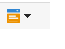
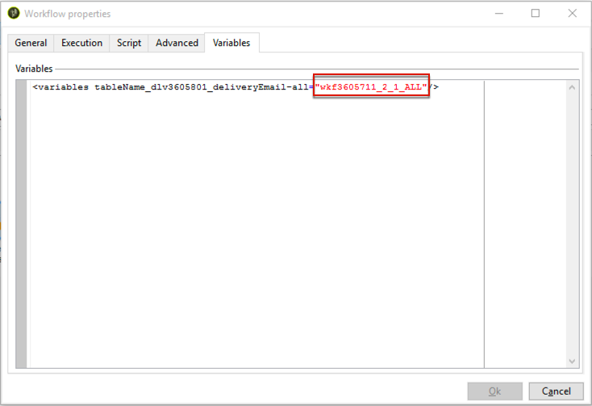
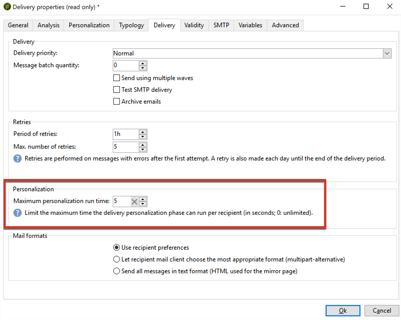

# Campos de personalização{#personalization-fields}

Os campos de personalização são usados para personalização de primeiro nível do conteúdo das mensagens de delivery. Os campos que você insere em um conteúdo principal mostram onde inserir os dados da fonte de dados selecionada.

Por exemplo, o campo de personalização com a sintaxe **&lt;%= recipient.LastName %>** informa ao Adobe Campaign para inserir o nome do recipient no banco de dados (tabela de recipients).

 [Descubra este recurso no vídeo](#personalization-fields-video)

>[!CAUTION]
>
>O conteúdo dos campos de personalização é limitado a 1024 caracteres.

## Fontes de dados {#data-sources}

Os campos de personalização podem vir de dois tipos de fonte de dados, de acordo com o modo de delivery selecionado:

* O banco de dados do Adobe Campaign é a fonte de dados. Este é o caso mais comum, com, por exemplo, &#39;campos de personalização de recipient&#39;. Esses são todos os campos definidos na tabela de recipients, sejam os campos padrão (normalmente: sobrenome, nome, endereço, cidade, data de nascimento, etc.) ou campos definidos pelo usuário.
* Um arquivo externo é a fonte de dados. Esses são todos os campos definidos nas colunas do arquivo apresentados como entrada durante um delivery usando os dados encontrados em um arquivo externo.

>[!NOTE]
>
>Uma tag de personalização do Adobe Campaign sempre tem o seguinte formulário **&lt;%=table.field%>**.

## Inserção de um campo de personalização {#inserting-a-personalization-field}

Para inserir campos de personalização, clique no ícone suspenso que está acessível a partir de qualquer campo de edição de cabeçalho, assunto ou corpo de mensagem.

Após a seleção de uma fonte de dados (campos de recipient ou campo de arquivo), essa inserção assume o formulário de um comando que será interpretado pelo Adobe Campaign e substituído pelo valor do campo para um determinado recipient. A substituição física pode ser exibida na guia **[!UICONTROL Preview]**.

## Exemplo de campos de personalização {#personalization-fields-example}

Ao criar um email, iremos inserir o nome do recipient e depois adicionar a data de criação do perfil no corpo da mensagem. Para fazer isso:

1. Criar um novo delivery ou abrir um tipo de delivery de email existente.
1. No assistente de delivery, clique em **[!UICONTROL Subject]** para editar e inserir o assunto da mensagem.
1. Insira &quot;**[!UICONTROL Special offer for]** &quot; e use o botão na barra de ferramentas para inserir um campo de personalização. Selecione **[!UICONTROL Recipients>Title]**.

   

1. Repita a operação para inserir o nome do recipient. Insira espaços entre todos os campos de personalização.
1. Clique em **[!UICONTROL OK]** para validar.
1. Insira a personalização no corpo da mensagem. Para fazer isso, clique no conteúdo da mensagem e clique no botão de inserção de campo.
1. Selecione **[!UICONTROL Recipient>Other...]**.

   

1. Selecione o campo com as informações que serão exibidas e clique em **[!UICONTROL OK]**.

   

1. Clique na guia **[!UICONTROL Preview]** para exibir o resultado personalizado. Você deve selecionar um recipient para exibir a mensagem dele.

   

   >[!NOTE]
   >
   >Quando um delivery faz parte de um workflow, você pode usar os dados da tabela de workflow temporário. Esses dados são agrupados no menu **[!UICONTROL Target extension]**. Para obter mais informações, consulte [esta seção](../../workflow/using/data-life-cycle.md#target-data).

## Otimização da personalização {#optimizing-personalization}

Você pode otimizar a personalização usando uma opção dedicada: **[!UICONTROL Prepare the personalization data with a workflow]**, disponível na guia **[!UICONTROL Analysis]** das propriedades de delivery. Para saber mais sobre como analisar o delivery, consulte [esta seção](steps-validating-the-delivery.md#analyzing-the-delivery).

Durante a análise de delivery, essa opção cria e executa automaticamente um workflow que armazena todos os dados vinculados ao público-alvo em uma tabela temporária, incluindo dados de tabelas vinculadas na FDA.

Marcar essa opção pode melhorar muito o desempenho da análise de delivery quando muitos dados estão sendo processados, especialmente se os dados de personalização vêm de uma tabela externa por meio do FDA. Para saber mais, consulte [Acesso a um banco de dados externo (FDA)](../../installation/using/about-fda.md).

Por exemplo, se estiver tendo problemas de desempenho com delivery de um grande número de recipients ao usar muitos campos de personalização e/ou blocos de personalização no conteúdo de suas mensagens, essa opção pode acelerar o manuseio de personalização e, portanto, o delivery de suas mensagens.

Para usar essa opção, siga as etapas abaixo:

1. Crie uma campanha. Para obter mais informações, consulte [esta seção](../../campaign/using/setting-up-marketing-campaigns.md#creating-a-campaign).
1. Na guia **[!UICONTROL Targeting and workflows]** da campanha, adicione uma atividade de **Query** ao workflow. Para obter mais informações sobre o uso dessa atividade, consulte [esta seção](../../workflow/using/query.md).
1. Adicione uma atividade **[!UICONTROL Email delivery]** ao workflow e depois a abra. Para obter mais informações sobre o uso dessa atividade, consulte [esta seção](../../workflow/using/delivery.md).
1. Vá até a guia **[!UICONTROL Analysis]** do **[!UICONTROL Delivery properties]** e selecione a opção **[!UICONTROL Prepare the personalization data with a workflow]**.

   

1. Configure o delivery e comece o workflow para iniciar a análise.

Depois que a análise é feita, os dados da personalização são armazenados em uma tabela temporária por meio de um workflow temporário criado em tempo real durante a análise.

Este workflow não está visível na interface do Adobe Campaign. É para ser apenas um meio técnico para armazenar e manipular rapidamente os dados de personalização.

Após a conclusão da análise, vá para as **[!UICONTROL Properties]** do workflow e selecione a guia **[!UICONTROL Variables]**. Você pode ver o nome da tabela temporária que pode ser usada para fazer uma chamada SQL para exibir as IDs que ela contém.

## Tempo limite da fase de personalização {#timing-out-personalization}

Para aumentar a proteção da entrega, é possível definir um período de tempo limite para a fase de personalização.

Na guia **[!UICONTROL Delivery]** de **[!UICONTROL Delivery properties]**, selecione um valor máximo em segundos na opção **[!UICONTROL Maximum personalization run time]**.

Durante a visualização ou envio, se a fase de personalização exceder o tempo máximo definido neste campo, o processo será anulado com uma mensagem de erro e o delivery falhará.

O valor padrão é de 5 segundos.

Se essa opção for definida como 0, não haverá limite de tempo para a fase de personalização.

## Tutorial em vídeo {#personalization-fields-video}

Saiba como adicionar um campo de personalização à linha de assunto e ao conteúdo de um delivery de email.

>[!VIDEO](https://video.tv.adobe.com/v/24925?quality=12)

Vídeos extras sobre procedimentos do Campaign Classic estão disponíveis [aqui](https://experienceleague.adobe.com/docs/campaign-classic-learn/tutorials/overview.html?lang=pt-BR).
