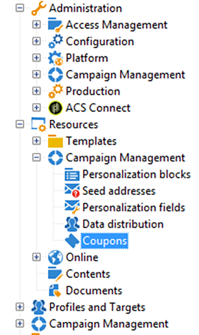

# Cupons personalizados{#personalized-coupons}

A adição de cupons aos seus deliveries pode oferecer aos recipients valor aprimorado para produtos e serviços. Você pode usar o módulo de cupom do Campaign para criar um conjunto de cupons que você planeja adicionar às futuras ofertas de marketing. Quando estiver pronto para criar um delivery, atribua os cupons aplicáveis. Como os cupons são válidos para um período de seleção, um cupom atribuído é vinculado exclusivamente à sua mensagem de delivery. Além disso, o Campaign confirma que há cupons suficientes para o número de mensagens antes do envio do delivery.

>[!NOTE]
>
>A gestão de cupons é um pacote que deve ser instalado. To confirm that you have Coupon management, check **[!UICONTROL Administration > Configuration > Package management > Installed packages.]**
>
>Os dados de cupom podem ser importados e exportados usando formatos CSV e XML. Para obter detalhes sobre a importação e exportação, consulte [esta seção](../../platform/using/generic-imports-and-exports.md).

## Criação de um cupom {#creating-a-coupon}

O módulo de cupom oferece duas opções ao criar cupons:

* **Anônimo**: um cupom genérico para destinatários ou listas de destinatários selecionados.
* **Individual**: um cupom personalizado para destinatários selecionados.

Antes de seguir as etapas abaixo, verifique se você sabe o tipo de cupom que deseja criar.

1. In the Campaign tree, go to **[!UICONTROL Resources > Campaign management > Coupons]**.

   

1. Clique no botão **[!UICONTROL New]**.
1. Insira o nome do cupom no campo **[!UICONTROL Label]**. A unique code has been automatically entered in **[!UICONTROL Coupon code]**. Você pode manter o código ou inserir um novo.

   

1. Choose **[!UICONTROL Start date]** and **[!UICONTROL End date]** to set the period in which the coupon is valid.
1. In **[!UICONTROL Coupon type]**, choose Anonymous or Individual.

   **[!UICONTROL Anonymous coupons]** : Um cupom anônimo é idêntico para todos os recipients. Confirme se Anônimo está selecionado no menu **Tipo de cupom** e clique em **Salvar** para gerar o cupom.

   **[!UICONTROL Individual coupons]** : Um cupom individual pode ser personalizado ainda mais com códigos de cupom adicionais. Por exemplo, um cupom individual é criado para uma venda em uma loja de equipamentos esportivos. No entanto, a lista de recipients é longa e não compartilham a mesma paixão por um único esporte. Você pode adicionar nomes de código para o cupom individual com base em um esporte (por exemplo, futebol, futebol americano, beisebol etc.) e enviar cada código para os recipients aplicáveis.

   1. Ao escolher Indivíduo, Cupons abre como uma nova guia na parte inferior esquerda. Vá para a **[!UICONTROL Coupons]** guia e clique em **[!UICONTROL Add]**.
   1. Insira um código exclusivo para o cupom individual quando solicitado pela janela pop-up.
   1. Clique em **[!UICONTROL Save]** para gerar o cupom.

   Para obter mais detalhes sobre a guia Coupons, consulte [Configuração de cupons individuais](#configuring-individual-coupons).

   >[!NOTE]
   >
   >Os cupons individuais podem ser importados em massa. Para obter detalhes sobre a importação e exportação, consulte [esta seção](../../platform/using/generic-imports-and-exports.md).

### Configuração de cupons individuais {#configuring-individual-coupons}

A guia Cupons está disponível apenas com cupons individuais. Depois que um cupom é associado a um delivery, a guia Cupons fornece os seguintes detalhes:

* **[!UICONTROL Status]** : Disponibilidade do cupom.
* **[!UICONTROL Redeemed on]** : A data de resgate do cupom.
* **[!UICONTROL Channel]** : O canal usado para enviar o cupom.
* **[!UICONTROL Address]** : Os endereços de email dos recipients.

Os valores para **[!UICONTROL status]**, **[!UICONTROL channel]** e **[!UICONTROL address]** são automaticamente concluídos. However, the values for **[!UICONTROL redeemed on]** are not recovered by Campaign. Eles podem ser concluídos ao importar um arquivo com os detalhes de resgate do cupom.

## Inserir um cupom em um delivery de email {#inserting-a-coupon-into-an-email-delivery}

No exemplo abaixo, o delivery é criado a partir da Home page. Para obter instruções detalhadas sobre como criar um delivery, consulte [esta seção](../../delivery/using/about-email-channel.md). Você também pode adicionar um cupom a um delivery em um workflow.

1. Vá até **[!UICONTROL Campaigns]** e escolha **[!UICONTROL Deliveries]**.
1. Clique em **[!UICONTROL Create]**.

   

1. Enter a name in **[!UICONTROL Label]** and click **[!UICONTROL Continue]**.
1. Click **[!UICONTROL To]** to add recipients.
1. Clique em **[!UICONTROL Add]** para escolher os destinatários do delivery Depois de selecionar seus destinatários, clique em **[!UICONTROL Ok]** para retornar para o delivery.

   

1. Insira um assunto e adicione conteúdo à mensagem.

   

1. In the toolbar, click **[!UICONTROL Properties]** and choose the **[!UICONTROL Advanced]** tab.
1. Click the folder icon for **[!UICONTROL Coupon management]**.

   

1. Escolha o cupom e clique em **[!UICONTROL Ok]**. Clique **[!UICONTROL Ok]** novamente.

   

1. Clique na mensagem para escolher onde deseja colocar o cupom.

   

1. Clique no ícone de personalização para fazer a escolha baseada no tipo de cupom:

   * Cupom anônimo: **[!UICONTROL Coupon > Coupon code]**

      

   * Cupom individual: **[!UICONTROL Coupon value > Coupon code]**

      

      O cupom é inserido na mensagem como código em vez do nome que você atribuiu. O código é usado no modelo padrão de dados do Campaign.
   

1. Execute um teste para confirmar o nome atribuído ao cupom. Vá para a **[!UICONTROL Preview]** guia e clique em **[!UICONTROL Test personalization]**. Escolha um recipient para o teste.

   

   Após o teste, o cupom deve aparecer como o nome atribuído em vez do código.

   

1. Na barra de ferramentas, clique em **[!UICONTROL Send]**, no canto superior esquerdo, e escolha como enviar o delivery.

   

1. Clique em **[!UICONTROL Analyze]**. Se o log de análise confirmar que há cupons suficientes para todos os destinatários, clique em **[!UICONTROL Confirm delivery]** para enviar a mensagem.

   

>[!NOTE]
>
>Para obter as instruções sobre como gerenciar os cupons insuficientes de um delivery, consulte [Managing insufficient coupons](#managing-insufficient-coupons)

Para confirmar que o delivery foi bem-sucedido:

1. Vá para **[!UICONTROL Explorer > Resources > Campaign management > Coupons]**.
1. Clique na guia **[!UICONTROL Deliveries]**.

   

   O status é lido como **[!UICONTROL Finished]** para um delivery bem-sucedido.

>[!NOTE]
>
>Por padrão, o módulo de gestão de cupom usa uma tabela **nms:recipient**. Para obter instruções sobre como usar outras tabelas, consulte [Edição de schemas](../../configuration/using/data-schemas.md).

## Gestão de cupons insuficientes {#managing-insufficient-coupons}

A análise do delivery para se o número de cupons for menor que de mensagens. Nesse caso, você pode importar mais cupons ou restringir o número de mensagens. Siga as instruções abaixo se desejar limitar o número de mensagens.

1. Vá para a janela de delivery do email.
1. Clique em **[!UICONTROL To]**.
1. In **[!UICONTROL Select target]**, go to the **[!UICONTROL Exclusions]** tab.

   

1. Na seção de configurações de exclusão, clique em **[!UICONTROL Edit]**.
1. Enter the number of messages you want to send in **[!UICONTROL Limit delivery to...messages]** and click **[!UICONTROL Ok]**. Você pode enviar o delivery.

   

>[!NOTE]
>
>Ao gerenciar um número limitado de cupons, um workflow de delivery permite dividir o delivery com base em seus critérios. É uma boa opção para enviar cupons para um público selecionado sem restringir o target.
