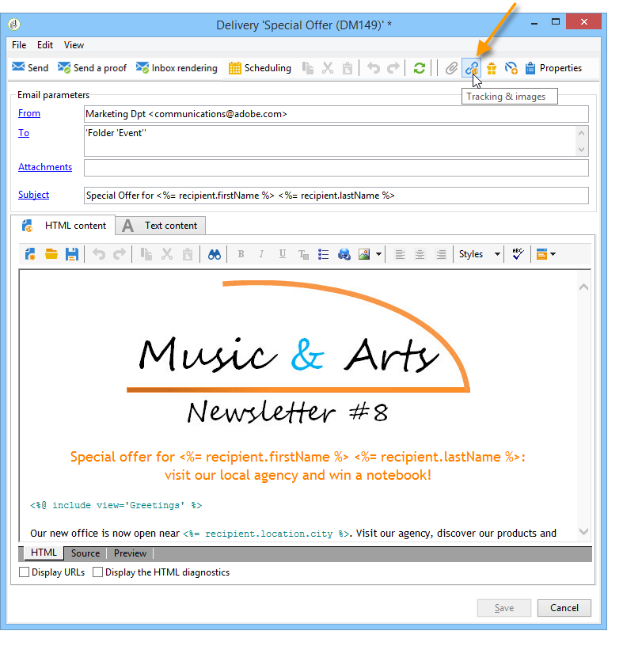

# Configurar opções de rastreamento de URL{#personalizing-url-tracking}

As configurações avançadas de rastreamento de mensagem são acessíveis por meio do ícone **[!UICONTROL Tracking & Images]** na barra de ferramentas do assistente de delivery.

>[!NOTE]
>
>A gestão de imagens em emails também é configurada nessa janela. Consulte [Adicionar imagens](defining-the-email-content.md#adding-images).

É possível configurar as seguintes opções de rastreamento:

* Ativar/desativar rastreamento de URL para todas as mensagens.

   >[!CAUTION]
   >
   >Quando o rastreamento não é ativado em um delivery (ou seja, a opção **[!UICONTROL Activate tracking]** não está selecionada), os relatórios e dados relacionados ao rastreamento não estão disponíveis: os relatórios Opens, Hot click e tracked URLs não exibirão dados, e as guias **[!UICONTROL Tracking logs]** não serão exibidas para esse delivery.

* A opção Ativar/desativar rastreamento para mensagem é aberta.

Os URLs rastreados são listados na janela central em forma de árvore.

É possível ativar ou desativar o rastreamento individualmente para cada URL da mensagem. Para obter mais informações, consulte [esta seção](how-to-configure-tracked-links.md).

A guia **[!UICONTROL Advanced]** permite personalizar as fórmulas de cálculo dos URLs rastreados e de abertura.

>[!CAUTION]
>
>As configurações nesta guia só podem ser modificadas por usuários especialistas.
