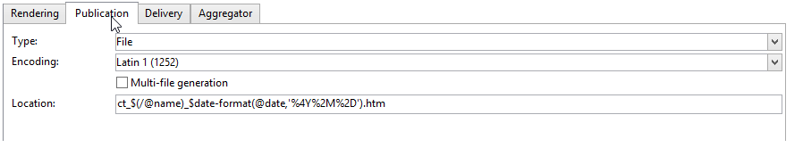

# Modelos de publicação{#publication-templates}

## Sobre os modelos de publicação {#about-publication-templates}

O modelo de publicação referencia os recursos usados no processo de publicação, ou seja:

* o esquema de dados,
* o formulário de entrada,
* os modelos de transformação para cada documento de saída.

## Identificação de um modelo de publicação {#identification-of-a-publication-template}

Um modelo de publicação é identificado por seu nome e namespace.

A chave de identificação de uma folha de estilo é uma string de caracteres composta pelo namespace e pelo nome, separados por dois pontos; por exemplo: **cus:newsletter**.

>[!NOTE]
>
>Na prática, é recomendável usar a mesma chave para o esquema, o formulário e o modelo de publicação.

## Criar e configurar o modelo {#creating-and-configuring-the-template}

Os modelos de publicação são armazenados por padrão no nó **[!UICONTROL Administration > Configuration > Publication templates]**. Para criar um novo modelo, clique no botão **[!UICONTROL New]** acima da lista de templates.

Para configurar o modelo de publicação, preencha o nome do modelo (ou seja, a chave de identificação que consiste no nome e no namespace), seu rótulo, o esquema de dados e o formulário de entrada ao qual ele está vinculado.


>[!NOTE]
>
>O rótulo aparecerá sempre que o conteúdo for criado com base nesse modelo de publicação.

A opção **Verificar o status para validar a geração de conteúdo** força uma verificação do status &quot;Validado&quot; das instâncias de conteúdo para autorizar a geração de arquivo. Para obter mais informações, consulte [Publicação](#publication),

Um modelo de transformação deve ser adicionado para cada documento de saída. É possível criar quantos modelos de transformação forem necessários.

O campo **[!UICONTROL Name of template]** é um rótulo gratuito que descreve o tipo de renderização na saída. Para cada modelo de transformação, as configurações de publicação estão disponíveis nas guias.

### Renderização {#rendering}

Na guia **[!UICONTROL Rendering]**, escolha:

* o tipo de renderização usado para projetar o documento de saída: folha de estilo XSL ou modelo do JavaScript,
* o formato do documento de saída: HTML, Text, XML ou RTF,
* o modelo que contém os dados de construção, isto é, a folha de estilos ou modelo de JavaScript a ser utilizado.

### Publicação {#publication}

Se o tipo selecionado for **[!UICONTROL File]**, a publicação envolve a geração do documento de saída na forma de um arquivo.



As seguintes opções de publicação estão disponíveis:

* O conjunto de caracteres de codificação do arquivo de saída pode ser forçado por meio do campo **[!UICONTROL Encoding]**. O conjunto de caracteres Latin 1 (1252) é usado por padrão.
* A opção **[!UICONTROL Multi-file generation]** ativa um modo de publicação de documento especial. Essa opção consiste em preencher uma tag de particionamento no início de cada página do documento de saída. A geração do conteúdo produzirá um arquivo para cada tag de particionamento preenchida. Esse modo é usado para gerar mini sites a partir de um bloco de conteúdo. Para obter mais informações, consulte [Geração de vários arquivos](#multi-file-generation).
* O campo **[!UICONTROL Location]** contém o nome do arquivo de saída. O nome pode ser composto de variáveis para gerar um nome de arquivo automático.

  Uma variável é preenchida com o seguinte formato: **`$(<xpath>)`**, onde **`<xpath>`** é o caminho de um campo do esquema de dados do modelo de publicação.

  O nome de um arquivo pode consistir em um campo tipo data. Para formatar corretamente esse campo, use a função **$date-format**, usando o caminho do campo e o formato de saída como parâmetros.

  Por padrão, o formato de construção do nome do arquivo usa as variáveis nos campos &quot;@name&quot; e &quot;@date&quot;:

  ```xml
  ct_$(@name)_$date-format(@date,'%4Y%2M%2D').htm
  ```

  O nome do arquivo gerado terá esta aparência: ct_news12_20110901.htm.

  >[!NOTE]
  >
  >Para obter mais informações sobre a geração de conteúdo, consulte [Criar uma instância de conteúdo](using-a-content-template.md#creating-a-content-instance).

### Entrega {#delivery}

Essa guia permite selecionar um cenário para iniciar uma entrega diretamente no conteúdo. O conteúdo do email será preenchido automaticamente com base no formato de saída (HTML ou Texto).


>[!NOTE]
>
>Para obter um exemplo de criação de entrega com base em um conteúdo, consulte [Entrega de uma instância de conteúdo](using-a-content-template.md#delivering-a-content-instance).

### Agregador {#aggregator}

Agregar os dados de um script ou lista de consultas permite enriquecer o documento XML com os dados de conteúdo. O objetivo é complementar determinadas informações referenciadas por links ou para adicionar elementos do banco de dados.

### Geração de vários arquivos {#multi-file-generation}

Para ativar a geração de múltiplos arquivos, selecione a opção **[!UICONTROL Multi-file generation]** no template de publicação. Essa opção permite especificar tags de particionamento na folha de estilos do início de cada página do documento de saída. A geração do conteúdo produzirá um arquivo para cada tag de particionamento encontrada.

A tag de particionamento a ser integrada na folha de estilos é a seguinte:

**`<xsl:comment> #nl:output_replace(<name_of_file>) </xsl:comment>`** onde **`<name_of_file>`** é o nome de arquivo da página que deve ser gerada.

**Exemplo:** geração de vários arquivos usando o esquema “cus:book”.

O princípio é gerar uma página principal listando os capítulos, com a possibilidade de exibir os detalhes do capítulo em uma página externa


A folha de estilo correspondente (“cus:book.xsl”) é a seguinte:

```xml
<?xml version="1.0" encoding="ISO-8859-1" ?>
<xsl:stylesheet xmlns:xsl="http://www.w3.org/1999/XSL/Transform" version="1.0">
  <xsl:output encoding="ISO-8859-1" method="html"/>

  <!-- Style sheet entry point -->
  <xsl:template match="/book">
    <html>
      <body>
        <h1><xsl:value-of select="@name"/></h1>
        <lu>
          <xsl:for-each select="chapter">
            <li><a target="_blank" href="chapter{@id}.htm"><xsl:value-of select="@name"/></a></li>  
          </xsl:for-each>
       </lu>
      </body>
    </html>
   </xsl:template>
</xsl:stylesheet>
```

Uma segunda folha de estilos (“cus:chapter.xsl”) é necessária para gerar os detalhes dos capítulos:

```xml
<?xml version="1.0" encoding="ISO-8859-1" ?>
<xsl:stylesheet xmlns:xsl="http://www.w3.org/1999/XSL/Transform" version="1.0">
  <xsl:output encoding="ISO-8859-1" method="html"/>

  <!-- Detail of a chapter -->
  <xsl:template match="chapter">
    <!-- Cut tag -->   
    <xsl:comment> #nl:output_replace($(path)/chapter<xsl:value-of select="@id"/>.htm)</xsl:comment>
    
    <html>
      <body>
        <h1><xsl:value-of select="@name"/></h1>
        <xsl:value-of select="page" disable-output-escaping="yes"/>
      </body>
    </html>
  </xsl:template>

  <!-- Style sheet entry point -->
  <xsl:template match="/book">
    <xsl:apply-templates/>
   </xsl:template>
</xsl:stylesheet>
```

A tag de particionamento é preenchida no início da página a ser incluída no arquivo para gerar.

```xml
<xsl:comment> #nl:output_replace($(path)/<xsl:value-of select="@id"/>.htm)</xsl:comment>
```

O nome do arquivo é construído com a variável **$(path)** contendo o caminho da publicação e **`<xsl:value-of select="@id" />`**, que corresponde ao identificador do capítulo no documento de entrada.

O modelo de publicação deve ser preenchido com as duas folhas de estilo “cus:book.xsl” e “cus:chapter.xsl”.

A opção **[!UICONTROL Multi-file generation]** deve estar ativa no template de transformação do capítulo:


O campo **[!UICONTROL Location]** não é usado na geração de múltiplos arquivos, mas esse campo deve ser preenchido para evitar um erro ao publicar.
