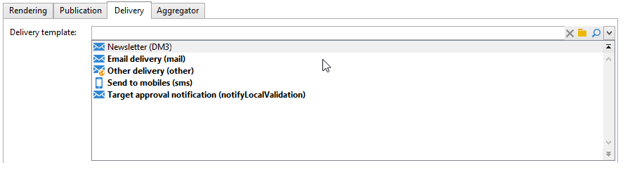

# Templates de publicação{#publication-templates}

## Sobre os templates de publicação {#about-publication-templates}

O template de publicação é o cartão de identidade do conteúdo a ser publicado. Ele referencia os recursos usados no processo de publicação, ou seja:

* o schema de dados,
* o formulário de entrada,
* os modelos de transformação para cada documento de saída.

## Identificação de um template de publicação {#identification-of-a-publication-template}

Um template de publicação é identificado por seu nome e namespace.

The identification key of a stylesheet is a string made up of the namespace and the name separated by a colon; for example: **cus:newsletter**.

>[!NOTE]
>
>Na prática, é recomendável usar a mesma chave para o schema, o formulário e o template de publicação.

## Criação e configuração do template {#creating-and-configuring-the-template}

Publication templates are stored by default in the **[!UICONTROL Administration > Configuration > Publication templates]** node. To create a new template, click the **[!UICONTROL New]** button above the list of templates.

Para configurar o template de publicação, preencha o nome do template (ou seja, a chave de identificação que consiste no nome e no namespace), seu rótulo, o schema de dados e o formulário de entrada ao qual ele está vinculado.


>[!NOTE]
>
>O rótulo aparecerá sempre que o conteúdo for criado com base nesse template de publicação.

A opção **Verificar o status para validar a geração de conteúdo** força uma verificação do status &quot;Validado&quot; das instâncias de conteúdo para autorizar a geração de arquivo. For more on this, refer to [Publication](#publication).

Um modelo de transformação deve ser adicionado para cada documento de saída. É possível criar quantos modelos de transformação forem necessários.

The **[!UICONTROL Name of template]** field is a free label that describes the type of rendering at the output. Para cada modelo de transformação, as configurações de publicação estão disponíveis nas guias.

### Renderização {#rendering}

Na **[!UICONTROL Rendering]** guia, escolha:

* o tipo de renderização usado para projetar o documento de saída: folha de estilo XSL ou modelo JavaScript,
* O formato do documento de saída: HTML, texto, XML ou RTF,
* o template que contém os dados de construção, isto é, a folha de estilos ou template de JavaScript a ser utilizado.

### Publicação {#publication}

Publication involves generating the output document in the form of a file, if the type selected is **[!UICONTROL File]**.


As seguintes opções de publicação estão disponíveis:

* The output file encoding character set can be forced via the **[!UICONTROL Encoding]** field. O conjunto de caracteres Latin 1 (1252) é usado por padrão.
* The **[!UICONTROL Multi-file generation]** option activates a special document publication mode. Essa opção consiste em preencher uma tag de particionamento no início de cada página do documento de saída. A geração do conteúdo produzirá um arquivo para cada tag de particionamento preenchida. Esse modo é usado para gerar mini sites a partir de um bloco de conteúdo. for more on this, refer to [Multi-file generation](#multi-file-generation).
* The **[!UICONTROL Location]** field contains the name of the output file. O nome pode ser composto de variáveis para gerar um nome de arquivo automático.

   Uma variável é preenchida com o seguinte formato: **`$(<xpath>)`, onde `<xpath>` é o caminho de um campo do esquema de dados do modelo de publicação.

   O nome de um arquivo pode consistir em um campo tipo data. Para formatar corretamente esse campo, use a função **$date-format**, usando o caminho do campo e o formato de saída como parâmetros.

   Por padrão, o formato de construção do nome do arquivo usa as variáveis nos campos &quot;@name&quot; e &quot;@date&quot;:

   ```
   ct_$(@name)_$date-format(@date,'%4Y%2M%2D').htm
   ```

   O nome do arquivo gerado terá esta aparência: ct_news12_20110901.htm.

   >[!NOTE]
   >
   >Para obter mais informações sobre a geração de conteúdo, consulte [Criar uma instância](../../delivery/using/using-a-content-template.md#creating-a-content-instance)de conteúdo.

### Delivery {#delivery}

Essa guia permite selecionar um cenário para iniciar um delivery diretamente no conteúdo. O conteúdo do email será preenchido automaticamente com base no formato de saída (HTML ou Texto).



>[!NOTE]
>
>For an example of delivery creation based on a content, refer to [Delivering a content instance](../../delivery/using/using-a-content-template.md#delivering-a-content-instance).

### Agregador {#aggregator}

Agregar os dados de um script ou lista de query permite enriquecer o documento XML com os dados de conteúdo. O objetivo é complementar determinadas informações referenciadas por links ou para adicionar elementos do banco de dados.

### Geração de vários arquivos {#multi-file-generation}

To activate multiple file generation, select the **[!UICONTROL Multi-file generation]** option in the publication model. Essa opção permite especificar tags de particionamento na folha de estilos do início de cada página do documento de saída. A geração do conteúdo produzirá um arquivo para cada tag de particionamento encontrada.

A tag de particionamento a ser integrada na folha de estilos é a seguinte:

**`<xsl:comment> #nl:output_replace(<name_of_file>) </xsl:comment>`** onde **`<name_of_file>`** é o nome de arquivo da página a ser gerada.

**Exemplo:**Geração de vários arquivos usando o esquema &quot;cus:book&quot;.

O princípio é gerar uma página principal listando os capítulos, com a possibilidade de exibir os detalhes do capítulo em uma página externa


A folha de estilos correspondente (&quot;cus:book.xsl&quot;) é como segue:

```
<?xml version="1.0" encoding="ISO-8859-1" ?>
<xsl:stylesheet xmlns:xsl="http://www.w3.org/1999/XSL/Transform" version="1.0">
  <xsl:output encoding="ISO-8859-1" method="html"/>

  <!-- Style sheet entry point -->
  <xsl:template match="/book">
    <html>
      <body>
        <h1><xsl:value-of select="@name"/></h1>
        <lu>
          <xsl:for-each select="chapter">
            <li><a target="_blank" href="chapter{@id}.htm"><xsl:value-of select="@name"/></a></li>  
          </xsl:for-each>
       </lu>
      </body>
    </html>
   </xsl:template>
</xsl:stylesheet>
```

Uma segunda folha de estilos (&quot;cus:chapter.xsl&quot;) é necessária para gerar os detalhes dos capítulos:

```
<?xml version="1.0" encoding="ISO-8859-1" ?>
<xsl:stylesheet xmlns:xsl="http://www.w3.org/1999/XSL/Transform" version="1.0">
  <xsl:output encoding="ISO-8859-1" method="html"/>

  <!-- Detail of a chapter -->
  <xsl:template match="chapter">
    <!-- Cut tag -->   
    <xsl:comment> #nl:output_replace($(path)/chapter<xsl:value-of select="@id"/>.htm)</xsl:comment>
    
    <html>
      <body>
        <h1><xsl:value-of select="@name"/></h1>
        <xsl:value-of select="page" disable-output-escaping="yes"/>
      </body>
    </html>
  </xsl:template>

  <!-- Style sheet entry point -->
  <xsl:template match="/book">
    <xsl:apply-templates/>
   </xsl:template>
</xsl:stylesheet>
```

A tag de particionamento é preenchida no início da página a ser incluída no arquivo para gerar.

```
<xsl:comment> #nl:output_replace($(path)/<xsl:value-of select="@id"/>.htm)</xsl:comment>
```

The filename is constructed with the **$(path)** variable containing the publication path and **`<xsl:value-of select="@id" />`**, which matches the identifier of the chapter in the input document.

O modelo de publicação deve ser preenchido com as duas folhas de estilos &quot;cus:book.xsl&quot; e &quot;cus:chapter.xsl&quot;.

The **[!UICONTROL Multi-file generation]** option must be active on the chapter transformation model:


The **[!UICONTROL Location]** field is not used in the generation of multiple files, but you must still populate this field to avoid an error when publishing.
