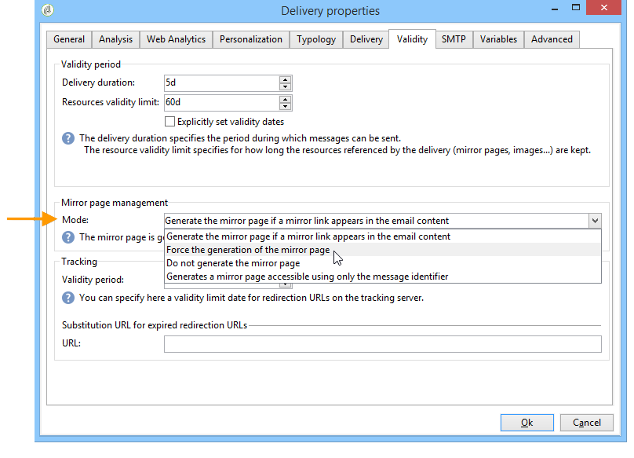
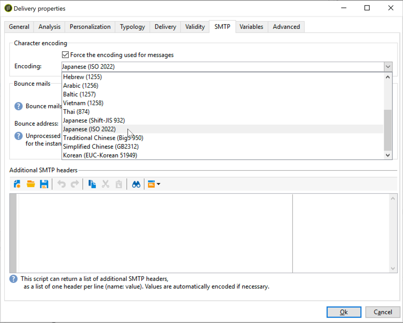

# Envio de emails{#sending-an-email}

Para aprovar sua mensagem e enviá-la aos recipients do delivery que está sendo criado, clique em **[!UICONTROL Send]**.

O processo detalhado da validação e envio de um delivery é apresentado nas seções abaixo:

* [Validando o dleivery](../../delivery/using/steps-validating-the-delivery.md)
* [Enviando o delivery](../../delivery/using/steps-sending-the-delivery.md)

As seções abaixo detalham os parâmetros específicos ao envio de emails.

## Arquivamento de emails {#archiving-emails}

O Adobe Campaign permite que você armazene emails em um sistema externo por meio do CCo simplesmente adicionando um endereço de email do CCo ao seu destino de mensagem. Uma vez ativada a opção, uma cópia exata de todas as mensagens enviadas será mantida para este delivery.

Para obter mais informações sobre a configuração do campo de email CCo, consulte [esta seção](../../installation/using/email-archiving.md).

>[!NOTE]
>
>Este recurso é opcional. Verifique seu contrato de licença e entre em contato com o executivo da sua conta para ativá-lo.

Ao criar um novo delivery ou template do delivery, o CCo não é habilitado por padrão, mesmo que a opção tenha sido adquirida. Você deve habilitá-lo manualmente em cada delivery ou template onde deseja usá-lo.

Para fazer isso, siga as etapas abaixo:

1. Vá para **[!UICONTROL Campaign Management]** > **[!UICONTROL Deliveries]** ou **[!UICONTROL Resources]** > **[!UICONTROL Templates]** > **[!UICONTROL Delivery templates]**.
1. Selecione o delivery de sua escolha ou duplique o template do delivery **de email** integrado e selecione o template duplicado.
1. Clique no botão **Propriedades**.
1. Selecione a guia **[!UICONTROL Delivery]**.
1. Marque a caixa **Arquivar emails** para manter uma cópia de todas as mensagens enviadas para esse delivery ou para cada delivery com base nesse template.

   

   >[!NOTE]
   >
   >Se os emails enviados para o endereço CCo forem abertos e clicados, isso será considerado no **[!UICONTROL Total opens]** e **[!UICONTROL Clicks]** da análise de envio, o que poderá causar alguns erros de cálculo.

## Geração da mirror page {#generating-the-mirror-page}

A mirror page é uma página HTML acessível online através de um navegador da Web. Seu conteúdo é idêntico ao email.

Por padrão, a mirror page é gerada se o link for inserido no conteúdo do email. Para obter mais informações sobre a inserção de blocos de personalização, consulte [Blocos de personalização](../../delivery/using/personalization-blocks.md).

Nas propriedades de delivery, o campo **[!UICONTROL Mode]** da guia **[!UICONTROL Validity]** permite modificar o modo de geração desta página.

>[!CAUTION]
>
>Um conteúdo HTML deve ter sido definido para o delivery da mirror page a ser criada.

Além do modo padrão, as seguintes opções também estão disponíveis:

* **[!UICONTROL Force the generation of the mirror page]**: mesmo se nenhum link para a mirror page for inserido no delivery, ela será criada.
* **[!UICONTROL Do not generate the mirror page]**: nenhuma mirror page é gerada, mesmo se o link estiver presente no delivery.
* **[!UICONTROL Generates a mirror page accessible using only the message identifier]**: essa opção permite acessar o conteúdo da mirror page, com informações de personalização, na janela de log do delivery. Para fazer isso, após o fim do delivery, clique na guia **[!UICONTROL Delivery]** e selecione a linha do recipient cuja mirror page você deseja exibir. Clique no link **[!UICONTROL Display the mirror page for this message...]**.

   

## Gestão de emails de devolução {#managing-bounce-emails}

A guia **[!UICONTROL SMTP]** dos parâmetros de delivery permite configurar a gestão de emails devolvidos.

Por padrão, os emails devolvido são recebidos na caixa de erro padrão da plataforma, mas você pode definir um endereço de erro específico para o delivery.

Você também pode definir um endereço específico nessa tela para investigar os motivos para a devolução dos emails quando não puderem ser qualificados automaticamente pelo aplicativo. Para cada um desses campos, o ícone &#39;adicionar campos personalizados&#39; permite adicionar parâmetros de personalização.

## Codificação de caracteres {#character-encoding}

Na guia **[!UICONTROL SMTP]** dos parâmetros do delivery, a seção **[!UICONTROL Character encoding]** permite definir uma codificação específica.

A codificação padrão é UTF-8. Se alguns dos provedores de email de seus recipients não oferecerem suporte à codificação padrão UTF-8, você pode definir uma codificação específica para exibir corretamente os caracteres especiais aos recipients dos seus emails.

Por exemplo, você deseja enviar um email contendo caracteres japoneses. Para garantir que todos os caracteres sejam exibidos corretamente para seus recipients no Japão, é possível usar uma codificação que ofereça suporte aos caracteres japoneses em vez do padrão UTF-8.

Para fazer isso, selecione a opção **[!UICONTROL Force the encoding used for messages]** na seção **[!UICONTROL Character encoding]** e escolha uma codificação na lista suspensa que é exibida.

## Adição de cabeçalhos SMTP {#adding-smtp-headers}

É possível adicionar cabeçalhos SMTP aos seus deliveries. Para fazer isso, use a seção relevante da guia **[!UICONTROL SMTP]** no delivery.

O script inserido nessa janela deve referenciar um cabeçalho por linha no seguinte formulário: **name:value**.

Os valores são codificados automaticamente se necessário.

>[!CAUTION]
>
>Adicionar um script para inserir cabeçalhos SMTP adicionais é apenas para usuários avançados.
>
>A sintaxe desse script deve estar em conformidade com os requisitos desse tipo de conteúdo: não há espaço não utilizado, nenhuma linha vazia, etc.
