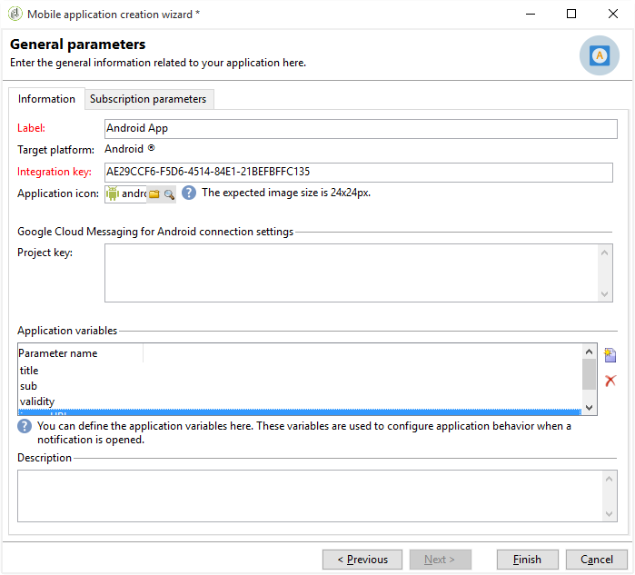
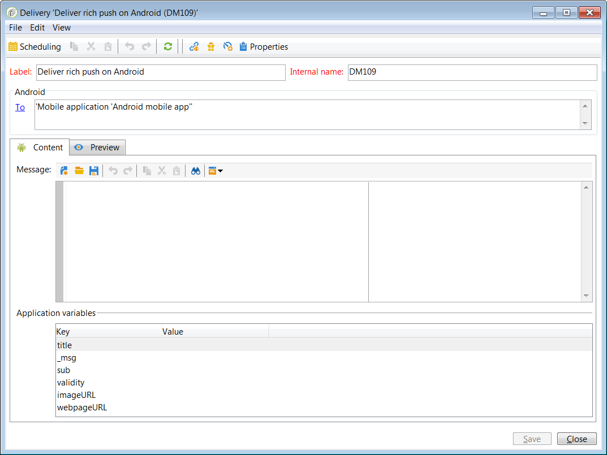

# Configurando o canal de aplicativo móvel{#setting-up-mobile-app-channel}

## Introdução {#introduction}

>[!CAUTION]
>
>A implementação do Mobile App Channel deve ser realizada por usuários especialistas. Se precisar de auxílio, entre em contato com seu executivo de conta da Adobe ou com os parceiros de serviços Professional.

Você pode criar diversas versões do seu aplicativo móvel (iOS, Android): a opção de canal de Aplicativo Móvel permite enviar notificações para terminais onde o aplicativo está instalado.

Para usar as funcionalidades do canal Mobile App no Adobe Campaign, você precisa mudar/adaptar seu aplicativo móvel para integrá-lo à plataforma Adobe Campaign.

Dois SDKs do Campaign Classic estão disponíveis (um para Android e um para iOS) para fácil integração do seu aplicativo móvel com o Adobe Campaign. É necessário um conhecimento técnico profundo de Java e Objective-C. Uma descrição detalhada do SDK de campanha foi encontrada em [Integrar o SDK de campanha ao aplicativo](#integrating-campaign-sdk-into-the-mobile-application)móvel.

>[!NOTE]
>
>As bibliotecas fornecidas pelo Adobe Campaign são desenvolvidas para serem usadas com o Xcode (iOS) e o Android Studio (Android).

## Conectores {#connectors}

### Conectores iOS {#ios-connectors}

Para iOS, dois conectores estão disponíveis:

* O conector binário do iOS envia notificações no servidor binário APNS herdado.
* O conector HTTP/2 do iOS envia notificações para o HTTP/2 APNS.

Para escolher qual conector deseja usar, siga estas etapas:

1. Vá para **[!UICONTROL Administration > Platform > External accounts]**.
1. Selecione a conta externa de roteamento iOS.
1. Na **[!UICONTROL Connector]** guia, preencha o **[!UICONTROL Access URL of the connector]** campo:

   Para iOS binário: https://localhost:8080/nms/jsp/ios.jsp

   Para iOS HTTP2: http://localhost:8080/nms/jsp/iosHTTP2.jsp

   

### Conectores Android {#android-connectors}

Para Android, dois conectores estão disponíveis:

* O conector V1 que permite uma conexão por MTA filho.
* O conector V2 que permite conexões simultâneas com o servidor FCM para melhorar o throughput.

Para escolher qual conector deseja usar, siga estas etapas:

1. Vá para **[!UICONTROL Administration > Platform > External accounts]**.
1. Selecione a conta **[!UICONTROL Android routing]** externa.
1. Na **[!UICONTROL Connector]** guia, preencha o **[!UICONTROL JavaScript used in the connector]** campo:

   Para Android V1: https://localhost:8080/nms/jsp/androidPushConnector.js

   Para Android V2: https://localhost:8080/nms/jsp/androidPushConnectorV2.js

   

1. Para Android V2, um parâmetro adicional está disponível no arquivo de configuração do Adobe Server (serverConf.xml):

   * **maxGCMConnectPerChild**: Limite máximo de solicitações HTTP paralelas ao FCM iniciadas por cada servidor filho (8 por padrão).

## Etapas de configuração {#configuration-steps}

### Criando o aplicativo {#creating-the-application}

Se não tiver um aplicativo móvel (app), o desenvolvedor do aplicativo precisará criá-lo e integrar o SDK. Se o aplicativo móvel existir, o desenvolvedor precisa adaptá-lo integrando o SDK do Adobe Campaign e adicionando as configurações específicas ao serviço. Para obter uma descrição do SDK, consulte [Integrar o SDK de campanha ao aplicativo](#integrating-campaign-sdk-into-the-mobile-application)móvel.

>[!CAUTION]
>
>O aplicativo deve ter sido configurado para ações Push ANTES de qualquer integração ao Adobe Campaign SDK.
>
>If this is not the case, please refer to [this page](https://developer.apple.com/library/archive/documentation/NetworkingInternet/Conceptual/RemoteNotificationsPG/).

### Coletando informações {#collecting-information-}

Para configurar o aplicativo, é preciso coletar as especificações técnicas que definem o conjunto de parâmetros que permitem que o Adobe Campaign e o aplicativo móvel se comuniquem. Esses parâmetros são:

* **a chave de integração**: cada aplicativo tem uma chave exclusiva. Essa chave permite vincular o serviço Adobe Campaign e o aplicativo móvel. Consulte Informações [gerais](#general-information).
* **as variáveis**: defina o comportamento do aplicativo quando você ativar a notificação. Consulte Informações [gerais](#general-information).
* **as configurações de subscrição**: por padrão, o Adobe Campaign recupera o campo **@userKey** que permite reconciliar dispositivos móveis com os recipients no banco de dados. Se quiser coletar dados adicionais (como uma chave de reconciliação complexa), defina configurações de subscrição. Consulte as configurações [](#subscription-settings)de assinatura.
* **os sons** (somente iOS): se o som selecionado não for um som do sistema, o arquivo de som deve estar incorporado ao aplicativo móvel. Consulte os sons [do](#application-sounds)aplicativo.
* **o URL do servidor de marketing e o servidor de rastreamento**: o administrador do Adobe Campaign deve fornecer ao desenvolvedor do aplicativo os URLs do servidor de marketing e os URLs do servidor de rastreamento. Para obter mais informações, consulte: [Integração do SDK de campanha ao aplicativo](#integrating-campaign-sdk-into-the-mobile-application)móvel.

### Criando o serviço {#creating-the-service}

O administrador do Adobe Campaign precisa criar e configurar um serviço vinculado ao aplicativo móvel. Para obter mais informações, consulte [Configuração do aplicativo móvel no Adobe Campaign](#configuring-the-mobile-application-in-adobe-campaign).

### Testando o aplicativo {#testing-the-application}

No iOS, você precisa criar um aplicativo que use o modo sandbox para testes e aprovações. Em seguida, no mesmo serviço Adobe Campaign, crie um novo aplicativo de tipo de produção e insira o certificado relevante. Para obter mais informações, consulte a documentação no serviço de notificações da Apple.

No Android, só é necessário criar um aplicativo. Teste a subscrição completa e o processo de coleta de delivery no seu aplicativo antes de torná-lo público.

## Caminho dos dados {#data-path}

Os schemas a seguir detalham as etapas que permitem que um aplicativo móvel troque dados com o Adobe Campaign. Esse processo envolve três entidades:

* o aplicativo móvel
* o serviço de notificação: APNS (Serviço de notificação por push da Apple) para Apple e FCM (Firebase Cloud Messaging) para Android
* Adobe Campaign

As três principais etapas do processo de notificação são: registro do aplicativo no Adobe Campaign (coleção de assinaturas), deliveries e rastreamento.

### Etapa 1: Coleção de assinatura {#step-1--subscription-collection}

O aplicativo móvel é baixado pelo usuário da App Store ou do Google Play. Este aplicativo contém as configurações de conexão (certificado do iOS e chave do projeto para Android) e a chave de integração. Na primeira vez que o aplicativo é aberto, (dependendo da configuração), o usuário pode ser solicitado a inserir informações de registro (@userKey: email ou número de conta por exemplo). Ao mesmo tempo, o aplication solicita ao serviço de notificações para coletar um ID de notificação (ID de envio). Todas essas informações (configurações de conexão, chave de integração, identificador de notificação, userKey) são enviadas ao Adobe Campaign.


### Etapa 2: Entrega {#step-2--delivery}

Os profissionais de marketing miram os assinantes de aplicativos. O processo de delivery envia as configurações de conexão para o serviço de notificação (certificado iOS e chave do projeto para Android), a ID de notificação (ID de envio) e o conteúdo da notificação. O serviço de notificação envia notificações para os terminais de destino.

Estas informações estão disponíveis no Adobe Campaign:

* Somente Android: número de dispositivos que exibem a notificação (impressões)
* Android e iOS: número de cliques na notificação


O servidor do Adobe Campaign deve ser capaz de entrar em contato com o servidor APNS nas seguintes portas:

* 2195 (envio) e 2186 (serviço de feedback) para conector binário do iOS
* 443 para conector HTTP/2 do iOS

Para verificar se funciona corretamente, use os seguintes comandos:

* Para testes:

   ```
   telnet gateway.sandbox.push.apple.com
   ```

* Na produção:

   ```
   telnet gateway.push.apple.com
   ```

Se um conector binário do iOS for usado, o MTA e o servidor Web deverão ser capazes de contatar o APNS na porta 2195 (enviando), o servidor de workflow deve ser capaz de contatar o APNS na porta 2196 (serviço de feedback).

Se um conector HTTP/2 do iOS for usado, o MTA, o servidor Web e o workflow devem ser capazes de contatar o APNS na porta 443.

## Integração do SDK do Campaign no aplicativo móvel {#integrating-campaign-sdk-into-the-mobile-application}

SDKs do Campaign para iOS e Android são um dos componentes do módulo do canal do aplicativo móvel.

>[!NOTE]
>
>Para obter o SDK do Campaign (antes conhecido como Neolane SDK), contate o Atendimento ao Cliente da Adobe

O objetivo do SDK é facilitar a integração de um aplicativo móvel na plataforma Adobe Campaign.

Para saber mais sobre as diferentes versões do Android e do iOS compatíveis, consulte a [Matriz de compatibilidade](https://helpx.adobe.com/campaign/kb/compatibility-matrix.html#MobileSDK) .

### Carregamento do SDK do Campaign {#loading-campaign-sdk}

* **No Android**: o arquivo **neolane_sdk-release.aar** deve estar vinculado ao projeto.

   A permissão a seguir concede acesso ao servidor do Adobe Campaign:

   ```
   Neolane.getInstance().setIntegrationKey("your Adobe mobile app integration key");
   Neolane.getInstance().setMarketingHost("https://yourMarketingHost:yourMarketingPort/");
   Neolane.getInstance().setTrackingHost("https://yourTrackingHost:yourTrackingPort/");
   ```

   A permissão a seguir permite recuperar a ID exclusiva de um telefone:

   ```
   <uses-permission android:name="android.permission.READ_PHONE_STATE" /> 
   ```

   A partir da versão 1.0.24 do SDK, essa permissão é usada somente para versões anteriores a Android 6.0.

   A partir da versão 1.0.26 do SDK, essa permissão não é mais usada.

* **No iOS**: os arquivos **libNeolaneSDK.a** e **Neolane_SDK.h** devem estar vinculados ao projeto. A partir da versão 1.0.24 do SDK, a opção **ENABLE_BITCODE** é ativada.

   >[!NOTE]
   >
   >Para a versão 1.0.25 do SDK, as quatro
								arquiteturas estão disponíveis no
									arquivo **Neolane_SDK.h**.

### Configuração de integração declarativa {#declaring-integration-settings}

Para integrar o SDK do Campaign no aplicativo móvel, o administrador funcional deve fornecer as seguintes informações ao desenvolvedor:

* **Uma chave de integração**: para permitir que a plataforma Adobe Campaign identifique o aplicativo móvel.

   >[!NOTE]
   >
   >This integration key is entered in the Adobe Campaign console, in the **[!UICONTROL Information]** tab of service dedicated to the mobile application. Consulte Informações [gerais](#general-information).

* **Um URL de rastreamento**: que corresponde ao endereço do servidor de rastreamento do Adobe Campaign.
* **Um URL de marketing**: para ativar a coleta de assinaturas.

* **No Android**:

   ```
   Neolane.getInstance().setIntegrationKey("your Adobe mobile app integration key");
   Neolane.getInstance().setMarketingHost("https://yourMarketingHost:yourMarketingPort/");
   Neolane.getInstance().setTrackingHost("https://yourTrackingHost:yourTrackingPort/"); 
   ```

* **No iOS**:

   ```
   Neolane_SDK *nl = [Neolane_SDK getInstance];
   [nl setMarketingHost:strMktHost];
   [nl setTrackingHost:strTckHost];
   [nl setIntegrationKey:strIntegrationKey];
   ```

### Função de registro {#registration-function}

A função de registro permite:

* enviar o ID de notificação ou o ID de envio (deviceToken para iOS e registrationID para Android) para o Adobe Campaign.
* recuperar a chave de conciliação ou o userKey (email ou número de conta, por exemplo)

* **No Android**:

   ```
   void registerInNeolane(String registrationId, String userKey, Context context)
   {
    try{
     Neolane.getInstance().registerDevice(registrationToken, userKey, null, context);
    } catch (NeolaneException e){
     //...
    } catch (IOException e){
     //...
    }
   }
   ```

   Se usa FCM (Firebase Cloud Messaging), recomendamos usar a função **registerDevice** ao chamar a função **onTokenRefresh** para notificar o Adobe Campaign de alteração no token do dispositivo móvel do usuário.

   ```
   public class NeoTripFirebaseInstanceIDService extends FirebaseInstanceIdService {
     @Override
     public void onTokenRefresh() {
       String registrationToken = FirebaseInstanceId.getInstance().getToken();
       NeolaneAsyncRunner neolaneAs = new NeolaneAsyncRunner(Neolane.getInstance());
       ...
       ...
       // Neolane Registration
       neolaneAs.registerDevice(registrationToken, userKey, additionnalParam, this, new NeolaneAsyncRunner.RequestListener() {
       public void onComplete(String e, Object state) { ... }
       public void onNeolaneException(NeolaneException e, Object state) { ... }
       public void onIOException(IOException e, Object state) { ... }
       });
       ...
       ...
     }
   }
   ```

* **No iOS**:

   ```
   // Callback called on successful registration to the APNS
   - (void)application:(UIApplication*)application didRegisterForRemoteNotificationsWithDeviceToken:(NSData*)deviceToken
   {
       // Pass the token to Adobe Campaign
       Neolane_SDK *nl = [Neolane_SDK getInstance];
       [nl registerDevice:tokenString:self.userKey:dic];
   }
   ```

### Função de rastreamento {#tracking-function}

* **No Android**:

   As funções de rastreamento permitem rastrear ativações de notificação (aberturas) e exibições de notificação (captura de tela).

   Para acompanhar a exibição de notificação (realizada ao chamar a função **notifyReceive** do SDK), siga a implementação abaixo. Note that if you use FCM (Firebase Cloud Messaging), we advise you to use the **notifyReceive** function when the **onMessageReceived** function is called by the Android system.

   ```
   package com.android.YourApplication;
   
   import android.content.Context;
   import android.content.SharedPreferences;
   import android.os.Bundle;
   import android.util.Log;
   
   import com.google.firebase.messaging.FirebaseMessagingService;
   import com.google.firebase.messaging.RemoteMessage;
   
   import java.util.Iterator;
   import java.util.Map;
   import java.util.Map.Entry;
   
   public class YourApplicationFirebaseMessagingService extends FirebaseMessagingService {
     private static final String TAG = "MyFirebaseMsgService";
   
     @Override
     public void onMessageReceived(RemoteMessage message) {
       Log.d(TAG, "Receive message from: " + message.getFrom());
       Map<String,String> payloadData = message.getData();
       final Bundle extras = new Bundle();
       final Iterator<Entry<String, String>> iter = payloadData.entrySet().iterator();
       while(iter.hasNext())
       {
         final Entry<String, String>  entry =iter.next();
         extras.putString(entry.getKey(), entry.getValue());
       }
   
       SharedPreferences settings = this.getSharedPreferences(YourApplicationActivity.APPLICATION_PREF_NAME, Context.MODE_PRIVATE);
       String mesg = payloadData.get("_msg");
       String title = payloadData.get("title");
       String url = payloadData.get("url");
       String messageId = payloadData.get("_mId");
       String deliveryId = payloadData.get("_dId");
       YourApplicationActivity.handleNotification(this, mesg, title, url, messageId, deliveryId, extras);
     }
   }
   ```

   ```
   public static void handleNotification(Context context, String message, String title, String url, String messageId, String deliveryId, Bundle extras){
       if( message == null ) message = "No Content";
       if( title == null )   title = "No title";
       if( url == null )     url = "https://www.tripadvisor.fr";
       int iconId = R.drawable.notif_neotrip;
   
       // notify Neolane that a notification just arrived
       NeolaneAsyncRunner nas = new NeolaneAsyncRunner(Neolane.getInstance());
       nas.notifyReceive(Integer.valueOf(messageId), deliveryId, new NeolaneAsyncRunner.RequestListener() {
         public void onNeolaneException(NeolaneException arg0, Object arg1) {}
         public void onIOException(IOException arg0, Object arg1) {}
         public void onComplete(String arg0, Object arg1){}
       });
       if (yourApplication.isActivityVisible())
       {
         Log.i("INFO", "The application has the focus" );
         ...
       }
       else
       {
         // notification creation :
         NotificationManager notificationManager = (NotificationManager) context.getSystemService(Context.NOTIFICATION_SERVICE);
         Notification notification;
   
         // Activity to start :
         Intent notifIntent = new Intent(context.getApplicationContext(), NotificationActivity.class);
         notifIntent.putExtra("notificationText", message);
         notifIntent.putExtra(NotificationActivity.NOTIFICATION_URL_KEYNAME, url);
         notifIntent.putExtra("_dId", deliveryId);
         notifIntent.putExtra("_mId", messageId);
         notifIntent.addFlags(Intent.FLAG_ACTIVITY_NEW_TASK);
         PendingIntent contentIntent = PendingIntent.getActivity(context, 1, notifIntent, PendingIntent.FLAG_UPDATE_CURRENT);
   
         notification = new Notification.Builder(context)
                 .setContentTitle(title)
                 .setContentText(message)
                 .setSmallIcon(iconId)
                 .setContentIntent(contentIntent)
                 .build();
   
         // launch the notification :
         notification.flags |= Notification.FLAG_AUTO_CANCEL;
         notificationManager.notify(Integer.valueOf(messageId), notification);
       }
   }
   ```

   Aqui está um exemplo de implementação para rastreamento de uma abertura de notificação (executada ao chamar a função **notifyOpening** do SDK). A classe **NotificationActivity** corresponde à classe usada para criar o objeto **notifIntent** no exemplo anterior.

   ```
   public class NotificationActivity extends Activity {
    public static final String NOTIFICATION_URL_KEYNAME = "NotificationUrl";
    .....
    public void onCreate(Bundle savedBundle) {
     super.onCreate(savedBundle);
     setContentView(R.layout.notification_viewer);  
     .....  
     Bundle extra = getIntent().getExtras();  
     .....  
     //get the messageId and the deliveryId to do the tracking  
     String deliveryId = extra.getString("_dId");
     String messageId = extra.getString("_mId");
     if (deliveryId != null && messageId != null) {
      NeolaneAsyncRunner neolaneAs = new NeolaneAsyncRunner(Neolane.getInstance());
      neolaneAs.notifyOpening(Integer.valueOf(messageId), deliveryId, new NeolaneAsyncRunner.RequestListener() {
       public void onNeolaneException(NeolaneException arg0, Object arg1) {}
       public void onIOException(IOException arg0, Object arg1) {}
       public void onComplete(String arg0, Object arg1) {}
       });
     }
    }
   }
   ```

* **No iOS**:

   A função de rastreamento permite rastrear quando as notificações são ativadas (abertas).

   ```
   (void)application:(UIApplication *)application didReceiveRemoteNotification:(NSDictionary *)launchOptions
   fetchCompletionHandler:(void (^)(UIBackgroundFetchResult))completionHandler
   {
   if( launchOptions ) { // Retrieve notification parameters here ... // Track application opening Neolane_SDK
   *nl = [Neolane_SDK getInstance]; [nl track:launchOptions:NL_TRACK_CLICK]; } 
   ...  
   completionHandler(UIBackgroundFetchResultNoData);
   }
   ```

   >[!NOTE]
   >
   >A partir da versão 7.0, quando a função **application:didReceiveRemoteNotification:fetchCompletionHandler** é implementada, o sistema operacional só chama essa função. Logo, a função **application:didReceiveRemoteNotification** não é chamada.

### Rastreamento de notificação silenciosa {#silent-notification-tracking}

O iOS permite enviar notificações silenciosas, uma notificação ou dados que são enviados diretamente para um aplicativo móvel sem exibi-los. O Adobe Campaign permite rastreá-las.

Para rastrear a notificação silenciosa, siga o exemplo abaixo:

```
// AppDelegate.m
...
...
#import "AppDelegate.h"
#import "Neolane_SDK.h"
...
...
// Callback called when the application is already launched (whether the application is running foreground or background)
- (void)application:(UIApplication *)application didReceiveRemoteNotification:(NSDictionary *)launchOptions fetchCompletionHandler:(void (^)(UIBackgroundFetchResult))completionHandler
{
 NSLog(@"IN didReceiveRemoteNotification:fetchCompletionHandler");
 if (launchOptions) NSLog(@"IN launchOptions: %@", [launchOptions description]);
 NSLog(@"Application state: %ld", (long)application.applicationState);

 // Silent Notification (specific case, can use NL_TRACK_RECEIVE as the user doesn't have click/open the notification)
 if ([launchOptions[@"aps"][@"content-available"] intValue] == 1 )
       {
  NSLog(@"Silent Push Notification");
  ...  
  ...
  //Call receive tracking
        Neolane_SDK *nl = [Neolane_SDK getInstance];
  [nl track:launchOptions:NL_TRACK_RECEIVE];

  completionHandler(UIBackgroundFetchResultNoData); //Do not show notification
  return;
 }  
 ...
 ...
        completionHandler(UIBackgroundFetchResultNoData);
}
```

### delegado RegisterDeviceStatus {#registerdevicestatus-delegate}

>[!NOTE]
>
>Observe que isso é exclusivo do iOS.

No iOS, o protocolo delegado permite obter o resultado da chamada **registerDevice** e pode ser usado para saber se ocorreu um erro durante o registro.

O protótipo **registerDeviceStatus** é:

```
- (void) registerDeviceStatus: (ACCRegisterDeviceStatus) status:(NSString *) errorReason;
```

**Status** permite saber se um registro foi bem-sucedido ou se ocorreu um erro.

**ErrorReason** fornece mais informações sobre os erros que ocorreram. Para obter mais informações sobre erros disponíveis e suas descrições, consulte a tabela abaixo.

<table> 
 <thead>
  <tr>
   <th> Status<br /> </th>
   <th> Descrição<br /> </th>
   <th> ErrorReason<br /> </th>
  </tr>
 </thead>
 <tbody>
  <tr>
   <td> ACCRegisterDeviceStatusSuccess <br /> </td>
   <td> Registration Succeeded<br /> </td>
   <td> EMPTY<br /> </td>
  </tr>
  <tr> 
   <td> ACCRegisterDeviceStatusFailureMarketingServerHostnameEmpty <br /> </td>
   <td> O nome de host do servidor de marketing ACC está vazio ou não está definido.<br /> </td>
   <td> EMPTY<br /> </td>
  </tr>
  <tr> 
   <td> ACCRegisterDeviceStatusFailureIntegrationKeyEmpty <br /> </td>
   <td> A chave de integração está vazia ou não está definida.<br /> </td>
   <td> EMPTY<br /> </td>
  </tr>
  <tr> 
   <td> ACCRegisterDeviceStatusFailureConnectionIssue<br /> </td>
   <td> Problema de conexão com o ACC<br /> </td>
   <td> Mais informações (na linguagem atual do SO)<br /> </td>
  </tr>
  <tr> 
   <td> ACCRegisterDeviceStatusFailureUnknownUUID<br /> </td>
   <td> O UUID fornecido (chave de integração) é desconhecido.<br /> </td>
   <td> EMPTY<br /> </td>
  </tr>
  <tr> 
   <td> ACCRegisterDeviceStatusFailureUnexpectedError<br /> </td>
   <td> Erro inesperado retornado ao servidor ACC.<br /> </td>
   <td> A mensagem de erro retornou para o ACC.<br /> </td>
  </tr>
 </tbody>
</table>

A definição do protocolo **Neolane_SDKDelegate** e do delegado **registerDeviceStatus** e a seguinte:

```
//  Neolane_SDK.h
//  Neolane SDK
..
.. 
// Register Device Status Enum
typedef NS_ENUM(NSUInteger, ACCRegisterDeviceStatus) {
 ACCRegisterDeviceStatusSuccess,                               // Resistration Succeed
 ACCRegisterDeviceStatusFailureMarketingServerHostnameEmpty,   // The ACC marketing server hostname is Empty or not set
 ACCRegisterDeviceStatusFailureIntegrationKeyEmpty,            // The integration key is empty or not set
 ACCRegisterDeviceStatusFailureConnectionIssue,                // Connection issue with ACC, more information in errorReason
 ACCRegisterDeviceStatusFailureUnknownUUID,                    // The provided UUID (integration key) is unknown
 ACCRegisterDeviceStatusFailureUnexpectedError                 // Unexpected error returned by ACC server, more information in errorReason
};
// define the protocol for the registerDeviceStatus delegate
@protocol Neolane_SDKDelegate <NSObject>
@optional
- (void) registerDeviceStatus: (ACCRegisterDeviceStatus) status :(NSString *) errorReason;
@end
@interface Neolane_SDK: NSObject {
} 
...
...
// registerDeviceStatus delegate
@property (nonatomic, weak) id <Neolane_SDKDelegate> delegate;
...
...
@end
```

Para implementar o delegado **registerDeviceStatus**, siga estas etapas:

1. Implemente o **setDelegate** durante a inicialização do SDK.

   ```
   // AppDelegate.m
   ...
   ... 
   - (BOOL)application:(UIApplication *)application didFinishLaunchingWithOptions:(NSDictionary *)launchOptions
   {
   ...
   ...
    // Get the stored settings
   
    NSUserDefaults *defaults = [NSUserDefaults standardUserDefaults];
    NSString *strMktHost = [defaults objectForKey:@"mktHost"];
    NSString *strTckHost = [defaults objectForKey:@"tckHost"];
    NSString *strIntegrationKey = [defaults objectForKey:@"integrationKey"];
    userKey = [defaults objectForKey:@"userKey"];
   
    // Configure Neolane SDK on first launch
    Neolane_SDK *nl = [Neolane_SDK getInstance];
    [nl setMarketingHost:strMktHost];
    [nl setTrackingHost:strTckHost];
    [nl setIntegrationKey:strIntegrationKey];
    [nl setDelegate:self];    // HERE
   ...
   ...
   }
   ```

1. Adicione o protocolo na **@interface** de sua classe.

   ```
   //  AppDelegate.h
   
   #import <UIKit/UIKit.h>
   #import <CoreLocation/CoreLocation.h>
   #import "Neolane_SDK.h"
   
   @class LandingPageViewController;
   
   @interface AppDelegate : UIResponder <UIApplicationDelegate, CLLocationManagerDelegate, Neolane_SDKDelegate> {
       CLLocationManager *locationManager;
       NSString *userKey;
       NSString *mktServerUrl;
       NSString *tckServerUrl;
       NSString *homeURL;
       NSString *strLandingPageUrl;
       NSTimer *timer;
   }
   ```

1. Implemente o delegado no **AppDelegate**.

   ```
   //  AppDelegate.m
   
   #import "AppDelegate.h"
   #import "Neolane_SDK.h"
   #import "LandingPageViewController.h"
   #import "RootViewController.h"
   ...
   ...
   - (void) registerDeviceStatus: (ACCRegisterDeviceStatus) status :(NSString *) errorReason
   {
       NSLog(@"registerStatus: %lu",status);
   
       if ( errorReason != nil )
           NSLog(@"errorReason: %@",errorReason);
   
       if( status == ACCRegisterDeviceStatusSuccess )
       {
           // Registration successful
           ...
           ...
       }
       else { // An error occurred
           NSString *message;
           switch ( status ){
               case ACCRegisterDeviceStatusFailureUnknownUUID:
                   message = @"Unkown IntegrationKey (UUID)";
                   break;
               case ACCRegisterDeviceStatusFailureMarketingServerHostnameEmpty:
                   message = @"Marketing URL not set or Empty";
                   break;
               case ACCRegisterDeviceStatusFailureIntegrationKeyEmpty:
                   message = @"Integration Key not set or empty";
                   break;
               case ACCRegisterDeviceStatusFailureConnectionIssue:
                   message = [NSString stringWithFormat:@"%@ %@",@"Connection issue:",errorReason];
                   break;
               case ACCRegisterDeviceStatusFailureUnexpectedError:
               default:
                   message = [NSString stringWithFormat:@"%@ %@",@"Unexpected Error",errorReason];
                   break;
           }
    ...
    ...
       }
   }
   @end
   ```

### Variáveis {#variables}

As variáveis permitem definir o comportamento do aplicativo móvel após receber uma notificação. These variables must be defined in the mobile application code and in the Adobe Campaign console, in the **[!UICONTROL Variables]** tab in the dedicated mobile application service (see [General information](#general-information)). Veja um exemplo de um código que permite que um aplicativo móvel colete quaisquer variáveis adicionadas em uma notificação. No nosso exemplo, estamos usando a variável &quot;VAR&quot;.

* **No Android**:

   ```
   public void onReceive(Context context, Intent intent) {
        ...
       String event = intent.getStringExtra("VAR");
        ...
   }
   ```

* **No iOS**:

   ```
   - (BOOL)application:(UIApplication *)application didFinishLaunchingWithOptions:(NSDictionary *)launchOptions
   {
       ....
       if( launchOptions )
       {
           // When application is not already launched, the notification data if any are stored in the key 'UIApplicationLaunchOptionsRemoteNotificationKey'
           NSDictionary *localLaunchOptions = [launchOptions objectForKey:@"UIApplicationLaunchOptionsRemoteNotificationKey"];
           if( localLaunchOptions )
           {
            ...
            [localLaunchOptions objectForKey:@"VAR"];
           ...
           }
      }
   }
   
   // Callback called when the application is already launched (whether the application is running foreground or background)
   - (void)application:(UIApplication *)application didReceiveRemoteNotification:(NSDictionary *)launchOptions
   {
       if( launchOptions )
       {
        ...
           [launchOptions objectForKey:@"VAR"];
       }
   }
   ```

>[!CAUTION]
>
>A Adobe recomenda escolher nomes de variáveis curtos, pois o tamanho da notificação é limitado a 4kB para iOS e Android.

## Configuração do aplicativo móvel no Adobe Campaign {#configuring-the-mobile-application-in-adobe-campaign}

Encontre abaixo a amostra da configuração baseada em uma empresa que vende online pacotes de viagens. Seu aplicativo móvel (Neotrips) está disponível para seus clientes em duas versões: Neotrips para Android e Neotrips para iOS. Para configurar o aplicativo móvel no Adobe Campaign, é necessário:

1. Create a **[!UICONTROL Mobile application]** type [information service](#creating-the-service-and-collecting-subscriptions) for the Neotrips mobile application.
1. Adicione as versões iOS e Android do aplicativo a este serviço.


>[!NOTE]
>
>Go to the **[!UICONTROL Subscriptions]** tab of the service to view the list of subscribers to the service, i.e. all people who have installed the application on their mobile and agreed to receive notifications.

### Criação do serviço e coleta de subscrições {#creating-the-service-and-collecting-subscriptions}

1. Vá para o **[!UICONTROL Profiles and Targets > Services and subscriptions]** nó e clique em **[!UICONTROL New]**.

   

1. Defina um **[!UICONTROL Label]** e um **[!UICONTROL Internal name]**.
1. Vá para o **[!UICONTROL Type]** campo e selecione **[!UICONTROL Mobile application]**.

   >[!NOTE]
   >
   >The default **[!UICONTROL Subscriber applications (nms:appSubscriptionRcp)]** target mapping is linked to the recipients table. If you want to use a different target mapping, you need to create a new target mapping and enter it in the **[!UICONTROL Target mapping]** field of the service. Para obter mais informações sobre como criar o target mapping, consulte o [Guia de configuração](../../configuration/using/about-custom-recipient-table.md).

1. Then click the **[!UICONTROL Add]** button to define the various versions of your mobile application (iOS, Android).

   

Veja abaixo uma apresentação detalhada das etapas de configuração para cada versão.

>[!NOTE]
>
>Quando criar um aplicativo iOS, o assistente solicita configurar a versão de desenvolvimento (sandbox) e a versão de produção do aplicativo. Após criado, as duas versões do aplicativo são adicionadas.

### Informações gerais {#general-information}


1. Comece inserindo o **[!UICONTROL Label]**.
1. Make sure the same **[!UICONTROL Integration key]** is defined in Adobe Campaign and in the application code (via the SDK). Para obter mais informações, consulte: [Integração do SDK de campanha ao aplicativo](#integrating-campaign-sdk-into-the-mobile-application)móvel. Essa chave de integração, específica para cada aplicativo, permite vincular o aplicativo móvel à plataforma do Adobe Campaign.
1. Se o aplicativo manipula um ícone de aplicativo (canto superior esquerdo da notificação), é possível adicioná-lo aqui para que a visualização corresponda mais ao estilo da entrega. To add an image in the content (rich notification), refer to the [Rich notifications](#rich-notifications) section.

   >[!CAUTION]
   >
   >A resolução de imagem esperada é 48x48 pixels para iOS.

1. Para Android, insira as configurações de conexão do aplicativo: insira a chave do projeto fornecida pelo desenvolvedor do aplicativo móvel.
1. Em seguida, insira as variáveis do aplicativo.

   

   As variáveis permitem definir o comportamento do aplicativo após o recebimento de uma notificação: por exemplo, é possível configurar uma tela específica do aplicativo para ser exibida quando o usuário ativar a notificação. Essas variáveis devem ser definidas no código do aplicativo móvel. Click the **[!UICONTROL Add]** button to add them to Adobe Campaign.

   O assistente de entrega permite definir os valores dessas variáveis. Consulte [Criação de notificações](../../delivery/using/creating-notifications.md).

### Configurações de subscrição {#subscription-settings}

>[!NOTE]
>
>Esta guia só precisa de configuração se desejar coletar dados adicionais.


Por padrão, o Adobe Campaign salva uma chave no campo **[!UICONTROL User identifier]** (@userKey) da **[!UICONTROL Subscriber applications (nms:appSubscriptionRcp)]** tabela. Essa chave permite vincular uma subscrição a um recipient. Para coletar dados adicionais (como uma chave de reconciliação complexa), é necessário aplicar a seguinte configuração:

1. Create an extension of the **[!UICONTROL Subscriber applications (nms:appsubscriptionRcp)]** schema and define the new fields.
1. Defina o mapeamento na **[!UICONTROL Subscription parameters]** guia.

   >[!CAUTION]
   >
   >Make sure the configuration names in the **[!UICONTROL Subscription parameters]** tab are the same as those in the mobile application code. Consulte a seção [Integração do SDK de campanha à seção do aplicativo](#integrating-campaign-sdk-into-the-mobile-application) móvel.

### Sons do aplicativo {#application-sounds}

>[!NOTE]
>
>Esta guia só está disponível para versões iOS dos aplicativos.


Se o aplicativo iOS tiver sons incorporados, use esta guia para adicioná-los. É possível usar o assistente de entrega para selecionar um dos sons a serem reproduzidos quando a notificação for recebida. Para obter mais informações, consulte [Enviar notificações no iOS](../../delivery/using/creating-notifications.md#sending-notifications-on-ios).

>[!NOTE]
>
>Os sons do sistema também podem ser definidos nessa tela.

In the **[!UICONTROL Application setting]** screen, the **[!UICONTROL Internal name]** field must contain the name of the file embedded in the application or the name of the system sound. The value entered in the **[!UICONTROL Label]** field will appear in the **[!UICONTROL Play a sound]** drop-down list of the delivery wizard.

### Certificado {#certificate}

>[!NOTE]
>
>Esta guia só está disponível para versões iOS dos aplicativos.

Nesta tela, insira as configurações de conexão do aplicativo.


Click the **[!UICONTROL Enter the certificate...]** link then select the authentication certificate and enter the password that was provided by the mobile application developer.

>[!NOTE]
>
>Certifique-se de não usar o mesmo certificado para a versão de desenvolvimento (sandbox) e a versão de produção do aplicativo.

## Notificações ricas {#rich-notifications}

Uma notificação rica permite incluir outros tipos de mídia em suas notificações, como imagens, vídeos etc.

### Android {#android}

Adobe Campaign allows you to define application variables in addition to content (see [Sending notifications on Android](../../delivery/using/creating-notifications.md#sending-notifications-on-android)). Estas variáveis podem ser utilizadas para fornecer informações como o URL da imagem para o aplicativo móvel. O aplicativo móvel pode então gerar uma notificação personalizada.

Primeiro, é necessário criar um aplicativo móvel no Adobe Campaign e definir as variáveis de aplicativo para esse aplicativo.

1. Vá até **[!UICONTROL Profiles and Targets]** > **[!UICONTROL Services and Subscriptions]**.
1. Click **[!UICONTROL New]** to create a service.
1. Na **[!UICONTROL Edit]** guia, selecione **[!UICONTROL Mobile application]** como o e **[!UICONTROL Type]** (nms:appSubscriptionRcp) como o **[!UICONTROL Subscriber application]** **[!UICONTROL Target mapping]**.
1. No **[!UICONTROL List of mobile applications that use the service]**, adicione um novo aplicativo e selecione **[!UICONTROL Create an Android application]**.
1. Clique em **[!UICONTROL Next]**.
1. In the **[!UICONTROL Information]** tab of the creation wizard, enter a label.
1. In the **[!UICONTROL Application variables]** field, add the parameters that you want to use for sending a rich push:

   * título
   * sub
   * validade
   * imageURL
   * webpageURL

1. Click **[!UICONTROL Finish]** and save the service.

   

Em seguida, é necessário criar um novo modelo de entrega e vinculá-lo ao aplicativo móvel criado.

1. Vá até **[!UICONTROL Resources]** > **[!UICONTROL Templates]** > **[!UICONTROL Delivery templates]**.
1. Duplique o **[!UICONTROL Deliver on Android]** modelo.
1. Change the label and click **[!UICONTROL Continue]**.
1. Click the **[!UICONTROL To]** link to target the application&#39;s subscribers.
1. Mude **[!UICONTROL Target mapping]** para **[!UICONTROL Subscriber applications (nms:appSubscriptionRcp)]**.

   

1. Clique em **[!UICONTROL Add]**, selecione **[!UICONTROL Subscribers of an Android mobile application]** e clique em **[!UICONTROL Next]**.
1. Insira um rótulo, selecione o serviço criado e o aplicativo móvel criado neste serviço.

   

1. Clique em **[!UICONTROL Finish]**.

Os parâmetros criados no aplicativo móvel são exibidos no campo **Variáveis do aplicativo**.



Finalmente, crie uma nova entrega do Android e adicione os valores desejados para os parâmetros definidos no aplicativo móvel.

1. Vá até **[!UICONTROL Campaign management]** > **[!UICONTROL Deliveries]**.
1. Clique em **[!UICONTROL New]**.
1. Select the delivery template that you just created and click **[!UICONTROL Continue]**.
1. In the **[!UICONTROL Application variables]** field, add the values of your choice for the different parameters.

   

1. Click **[!UICONTROL Save]** and send your delivery.

A imagem e a página da web devem ser exibidas na notificação por push quando recebida nos dispositivos Android móveis dos subscritos.

### iOS {#ios}

Com o iOS 10 ou superior, é possível gerar notificações ricas. O Adobe Campaign pode enviar notificações usando variáveis que permitirão ao dispositivo exibir uma notificação rica.

>[!NOTE]
>
>Se desejar usar notificações ricas, é necessário usar o conector HTTP/2 do iOS. Refer to the [Connectors](#connectors) section.

No Adobe Campaign, os seguintes parâmetros devem ser enviados para o aplicativo móvel:

* Check the **[!UICONTROL Mutable content]** box in the edit notification window. Isso permitirá que o aplicativo móvel baixe conteúdo de mídia.
* The **[!UICONTROL Category]** field must be set. O valor deve corresponder a uma das extensões de conteúdo do aplicativo móvel (parâmetro **UNNotificationExtensionCategory**).
* Nas variáveis do aplicativo, adicione o URL do arquivo de mídia que o aplicativo móvel deve baixar e exibir.

   

Para implementar notificações avançadas no aplicativo móvel, você precisa adicionar as seguintes extensões ao seu projeto:

* Extensão de Serviço de Notificação
* Extensão de Conteúdo de Notificação (uma ou mais, de acordo com sua implementação)

**Extensão de Serviço de Notificação**

A mídia deve ser baixada no nível da extensão de serviço de notificação.

```
#import "NotificationService.h"

@interface NotificationService ()

@property (nonatomic, strong) void (^contentHandler)(UNNotificationContent *contentToDeliver);
@property (nonatomic, strong) UNMutableNotificationContent *bestAttemptContent;

@end

@implementation NotificationService

- (void)didReceiveNotificationRequest:(UNNotificationRequest *)request withContentHandler:(void (^)(UNNotificationContent * _Nonnull))contentHandler {
    NSDictionary *userInfo = nil;
    NSString *url = nil;

    self.contentHandler = contentHandler;
    self.bestAttemptContent = [request.content mutableCopy];

    userInfo = request.content.userInfo;
    if ( userInfo != nil )
    {
        url = userInfo[@"mediaUrl"];  // Get the url of the media to download (Adobe Campaign additional variable)
    }
    ...
    // Perform the download to local storage
```

**Extensão de Conteúdo de Notificação**

Nesse nível, você precisa:

* Associe sua extensão de conteúdo à categoria enviada pelo Adobe Campaign:

   Se quer que seu aplicativo móvel exiba uma imagem, é possível definir o valor da categoria como &quot;imagem&quot; no Adobe Campaign e no aplicativo móvel, criar uma extensão de notificação com o parâmetro **UNNotificationExtensionCategory** definido como &quot;imagem&quot;. Quando a notificação por push é recebida no dispositivo, a extensão é chamada de acordo com o valor da categoria definida.

* Definir o seu layout de notificação

   É necessário definir um layout com os widgets relevantes. Para uma imagem, o widget é denominado **UIImageView**.

* Exibir sua mídia

   É necessário adicionar o código para alimentar os dados de mídia no widget. Veja um exemplo de código para uma imagem:

   ```
   #import "NotificationViewController.h"
   #import <UserNotifications/UserNotifications.h>
   #import <UserNotificationsUI/UserNotificationsUI.h>
   
   @interface NotificationViewController () <UNNotificationContentExtension>
   
   @property (strong, nonatomic) IBOutlet UIImageView *imageView;
   @property (strong, nonatomic) IBOutlet UILabel *notifContent;
   @property (strong, nonatomic) IBOutlet UILabel *label;
   
   @end
   
   @implementation NotificationViewController
   
   - (void)viewDidLoad {
       [super viewDidLoad];
       // Do any required interface initialization here.
   }
   
   - (void)didReceiveNotification:(UNNotification *)notification {
       self.label.text = notification.request.content.title;
       self.notifContent.text = notification.request.content.body;
       UNNotificationAttachment *attachment = [notification.request.content.attachments objectAtIndex:0];
       if ([attachment.URL startAccessingSecurityScopedResource])
       {
         NSData * imageData = [[NSData alloc] initWithContentsOfURL:attachment.URL];
         self.imageView.image =[UIImage imageWithData: imageData];
         [attachment.URL stopAccessingSecurityScopedResource];
       }
   }
   @end
   ```
