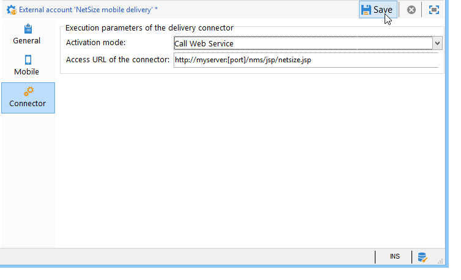

# Canal SMS{#sms-channel}

O Adobe Campaign permite que você realize deliveries em massa personalizados de mensagens SMS. Os perfis de recipients devem conter pelo menos um número de telefone celular.

>[!NOTE]
>
>O Adobe Campaign também permite enviar notificações nos terminais móveis, através da opção **Adobe Campaign Mobile App Channel (NMAC)**.
> 
>Para obter mais informações, consulte a seção [Sobre canais](../../delivery/using/about-mobile-app-channel.md) de aplicativos móveis.

As seções abaixo fornecem informações específicas ao canal SMS. For global information on how to create a delivery, refer to [this section](../../delivery/using/steps-about-delivery-creation-steps.md).

## Configuração do canal SMS {#setting-up-sms-channel}

Para enviar para um celular, você precisa:

1. Uma conta externa especificando um conector e tipo de mensagem.

   Os conectores disponíveis são: NetSize, SMPP genérico (SMPP versão 3.4 com suporte para modo binário), Sybase365 (SAP SMS 365), CLX Communications, Tele2, O2 e SMPP genérico estendido.

1. Um template do delivery no qual essa conta externa é referenciada.

### Ativação de uma conta externa {#activating-an-external-account}

The list of external accounts can be found in the **[!UICONTROL Platform]** > **[!UICONTROL External accounts]** node of the Adobe Campaign explorer tree.

* For example, go to the default account called **[!UICONTROL NetSize mobile delivery]**.
* Na **[!UICONTROL General]** guia, marque a **[!UICONTROL Enabled]** caixa.

   

* Verifique se a **[!UICONTROL Mobile]** opção está selecionada para o **[!UICONTROL Channel]** campo.
* Na **[!UICONTROL Mobile]** guia, selecione um conector na lista suspensa: NetSize, SMPP genérico, Sybase365 (SAP SMS 365), CLX Communications, Tele2, O2 ou SMPP genérico estendido. Para obter mais informações sobre o conector SMPP genérico estendido, consulte a seção [Criação de uma conta](#creating-an-smpp-external-account) externa SMPP.

   

* Configure o conector de acordo com as informações oferecidas pelo fornecedor. No exemplo abaixo, o operador é NetSize.

   

* Na **[!UICONTROL Connector]** guia, deixe o modo de **[!UICONTROL Call Web Service]** ativação selecionado por padrão.

   

* If the **[!UICONTROL Connector]** tab is displayed, specify the access URL for the connector. The address must end in **netsize.jsp** if your provider is NetSize. For all other connectors, the URL address ends in **smpp34.jsp**.

### Criação de conta externa SMPP {#creating-an-smpp-external-account}

Se quiser usar o protocolo SMPP, você também poderá criar uma nova conta externa.

Para obter mais informações sobre o protocolo e as configurações SMS, consulte esta [nota técnica](https://helpx.adobe.com/campaign/kb/sms-connector-protocol-and-settings.html).

Para fazer isso, siga as etapas abaixo:

1. No nó **[!UICONTROL Platform]** > **[!UICONTROL External accounts]** da árvore, clique no **[!UICONTROL New]** ícone.
1. Defina o tipo de conta como **Roteamento**, o canal como **Celular (SMS)** e o modo de delivery como **Delivery em massa**.

   

1. Marque a **[!UICONTROL Enabled]** caixa.
1. Na **[!UICONTROL Mobile]** guia, selecione **[!UICONTROL Extended generic SMPP]** na lista **[!UICONTROL Connector]** suspensa.

   

   The **[!UICONTROL Enable verbose SMPP traces in the log file]** option allows you to dump all SMPP traffic in log files. Essa opção deve ser habilitada para solucionar problemas no conector e comparar com o tráfego visto pelo provedor.

1. Contact your SMS service provider who will explain to you how to complete the different external account fields from the **[!UICONTROL Connection settings]** tab.

   Then, contact your provider, depending on the one chosen, who will give you the value to enter into the **[!UICONTROL SMSC implementation name]** field.

   Você pode definir o número de conexões para o provedor por MTA secundário. Por padrão, é definido como 1.

1. Por padrão, o número de caracteres em um SMS atende aos padrões GSM.

   As mensagens SMS usando a codificação GSM são limitadas a 160 caracteres ou a 153 caracteres por SMS para mensagens enviadas em várias partes.

   >[!NOTE]
   >
   >Alguns caracteres contam como dois (chaves, colchetes, o símbolo do euro, etc.).
   >
   >A lista de caracteres GSM disponíveis é apresentada abaixo.

   Você pode autorizar transliteração de caracteres marcando a caixa correspondente.

   

   Para obter mais informações, consulte [esta seção](#about-character-transliteration).

1. In the **[!UICONTROL Throughput and delays]** tab, you can specify the maximum throughput of outbound messages (&quot;MT&quot;, Mobile Terminated) in MT per second. Se inserir &quot;0&quot; no campo correspondente, a taxa de transferência será ilimitada.

   Os valores de todos os campos correspondentes às durações precisam ser preenchidos em segundos.

1. In the **[!UICONTROL Mapping of encodings]** tab, you can define encodings.

   Para obter mais informações, consulte [esta seção](#about-text-encodings).

1. Na **[!UICONTROL SMSC specificities]** guia, a **[!UICONTROL Send full phone number]** opção é desativada por padrão. Não ative se quiser respeitar o protocolo SMPP e transferir apenas dígitos ao servidor do provedor SMS (SMSC).

   Contudo, tendo em conta que determinados provedores exigem o uso do prefixo &quot;+&quot;, recomenda-se verificar com seu provedor e, se necessário, eles irão sugerir que seja habilitada.

   The **[!UICONTROL Enable TLS over SMPP]** checkbox allows you to encrypt SMPP traffic. Para
                            obter mais informações, consulte essa [nota técnica](https://helpx.adobe.com/campaign/kb/sms-connector-protocol-and-settings.html).

1. If you are configuring an **[!UICONTROL Extended generic SMPP]** connector, you can set up automatic replies.

   Para obter mais informações, consulte [esta seção](#automatic-reply).

### Sobre a transliteração de caracteres {#about-character-transliteration}

Character transliteration can be set up in a SMPP mobile delivery external account, under the **[!UICONTROL Mobile]** tab.

A transliteração consiste em substituir um caractere de um SMS por outro quando esse caractere não é considerado pelo padrão GSM.

* If transliteration is **[!UICONTROL authorized]**, each character that is not taken into account is replaced by a GSM character when the message is sent. Por exemplo, a letra &quot;ë&quot; é substituída por &quot;e&quot;. Portanto, a mensagem é ligeiramente alterada, mas o limite de caracteres permanecerá o mesmo.
* When transliteration is **[!UICONTROL not authorized]**, each message that contains characters that are not taken into account is sent in binary format (Unicode): all of the characters are therefore sent as they are. No entanto, as mensagens SMS usando Unicode são limitadas a 70 caracteres (ou 67 caracteres por SMS para mensagens enviadas em várias partes). Se o número máximo de caracteres for excedido, várias mensagens serão enviadas, o que pode ocasionar custos adicionais.

>[!CAUTION]
>
>Inserir campos de personalização no conteúdo de sua mensagem SMS pode apresentar caracteres que não são considerados pela codificação GSM.

Por padrão, a transliteração de caractere é desabilitada. Se você quiser que todos os caracteres em suas mensagens SMS sejam mantidos como estão, não altere nomes próprios, por exemplo, recomendamos que você não habilite essa opção.

No entanto, se as mensagens SMS contiverem muitos caracteres que geram mensagens Unicode, você poderá optar por habilitar essa opção para limitar os custos de envio de mensagens.

A tabela a seguir apresenta os caracteres considerados pelo padrão GSM. Todos os caracteres inseridos no corpo da mensagem, além daqueles mencionados abaixo, convertem toda a mensagem em formato binário (Unicode) e assim a limita a 70 caracteres.

**Caracteres básicos**

<table> 
 <tbody> 
  <tr> 
   <td> @ </td> 
   <td>  </td> 
   <td> SP </td> 
   <td> 0 </td> 
   <td> ¡ </td> 
   <td> P </td> 
   <td> ¿ </td> 
   <td> p </td> 
  </tr> 
  <tr> 
   <td> £ </td> 
   <td> _ </td> 
   <td> ! </td> 
   <td> 1 </td> 
   <td> A </td> 
   <td> Q </td> 
   <td> a </td> 
   <td> q </td> 
  </tr> 
  <tr> 
   <td> $ </td> 
   <td>  </td> 
   <td> " </td> 
   <td> 2 </td> 
   <td> B </td> 
   <td> R </td> 
   <td> b </td> 
   <td> r </td> 
  </tr> 
  <tr> 
   <td> ¥ </td> 
   <td>  </td> 
   <td> # </td> 
   <td> 3 </td> 
   <td> C </td> 
   <td> S </td> 
   <td> c </td> 
   <td> s </td> 
  </tr> 
  <tr> 
   <td> è </td> 
   <td>  </td> 
   <td> ¤ </td> 
   <td> 4 </td> 
   <td> D </td> 
   <td> T </td> 
   <td> d </td> 
   <td> t </td> 
  </tr> 
  <tr> 
   <td> é </td> 
   <td>  </td> 
   <td> % </td> 
   <td> 5 </td> 
   <td> E </td> 
   <td> U </td> 
   <td> e </td> 
   <td> u </td> 
  </tr> 
  <tr> 
   <td> ù </td> 
   <td>  </td> 
   <td> &amp; </td> 
   <td> 6 </td> 
   <td> F </td> 
   <td> V </td> 
   <td> f </td> 
   <td> v </td> 
  </tr> 
  <tr> 
   <td> ì </td> 
   <td>  </td> 
   <td> ' </td> 
   <td> 7 </td> 
   <td> G </td> 
   <td> W </td> 
   <td> g </td> 
   <td> w </td> 
  </tr> 
  <tr> 
   <td> ò </td> 
   <td>  </td> 
   <td> ( </td> 
   <td> 8 </td> 
   <td> H </td> 
   <td> X </td> 
   <td> h </td> 
   <td> x </td> 
  </tr> 
  <tr> 
   <td> Ç </td> 
   <td>  </td> 
   <td> ) </td> 
   <td> 9 </td> 
   <td> I </td> 
   <td> Y </td> 
   <td> i </td> 
   <td> y </td> 
  </tr> 
  <tr> 
   <td> LF </td> 
   <td>  </td> 
   <td> * </td> 
   <td> : </td> 
   <td> J </td> 
   <td> Z </td> 
   <td> j </td> 
   <td> z </td> 
  </tr> 
  <tr> 
   <td> Ø </td> 
   <td> ESC </td> 
   <td> + </td> 
   <td> ; </td> 
   <td> K </td> 
   <td> Ä </td> 
   <td> k </td> 
   <td> ä </td> 
  </tr> 
  <tr> 
   <td> ø </td> 
   <td> Æ </td> 
   <td> , </td> 
   <td> &lt; </td> 
   <td> L </td> 
   <td> Ö </td> 
   <td> l </td> 
   <td> ö </td> 
  </tr> 
  <tr> 
   <td> CR </td> 
   <td> æ </td> 
   <td> - </td> 
   <td> = </td> 
   <td> M </td> 
   <td> Ñ </td> 
   <td> m </td> 
   <td> ñ </td> 
  </tr> 
  <tr> 
   <td> Å </td> 
   <td> ß </td> 
   <td> . </td> 
   <td> &gt; </td> 
   <td> N </td> 
   <td> Ü </td> 
   <td> n </td> 
   <td> ü </td> 
  </tr> 
  <tr> 
   <td> å </td> 
   <td> É </td> 
   <td> / </td> 
   <td> ? </td> 
   <td> O </td> 
   <td> § </td> 
   <td> o </td> 
   <td> à </td> 
  </tr> 
 </tbody> 
</table>

SP: Espaço

ESC: Escape

LF: Feed de linha

CR: Retorno de carro

**Caracteres avançados (contados duas vezes)**

^ { } `[ ~ ]` | €

### Sobre codificações de texto {#about-text-encodings}

Ao enviar uma mensagem SMS, o Adobe Campaign pode usar uma ou várias codificações de texto. Cada codificação tem seu próprio conjunto específico de caracteres e determina o número de caracteres que cabem em uma mensagem SMS.

When configuring a new SMPP mobile delivery external account, you can define the **[!UICONTROL Mapping of encodings]** in the **[!UICONTROL Mobile]** tab: the **[!UICONTROL data_coding]** field allows Adobe Campaign to communicate which encoding is used to the SMSC.

>[!NOTE]
>
>O mapping entre o valor **data_coding** e a codificação realmente usada é padronizado. No entanto, certos SMSC têm seu próprio mapping específico: neste caso, o administrador do **Adobe Campaign** precisa declarar esse mapping. Consulte seu provedor para saber mais.

Você pode declarar **data_codings** e forçar a codificação se necessário: para fazer isso, especifique uma única codificação na tabela.

* Quando nenhum mapping de codificações é definido, o conector assume um comportamento genérico:

   * Ele tentará usar a codificação GSM para a qual atribui o valor **data_coding = 0**.
   * Se a codificação GSM falhar, ele usará a codificação **UCS2** para a qual atribui o valor **data_coding = 8**.

* When you define the encodings that you would like to use as well as the linked **[!UICONTROL data_coding]** field values, Adobe Campaign will try to use the first encoding in the list, then the following, if the first encoding proves impossible.

>[!CAUTION]
>
>A ordem da declaração é importante: é recomendável colocar a lista em ordem crescente **de custo** para favorecer as codificações que permitem usar o máximo possível de caracteres em cada mensagem SMS.
>
>Apenas declare as codificações que deseja usar. Se algumas das codificações fornecidas pelo SMSC não corresponderem à sua finalidade de uso, não as declare na lista.

### Resposta automática {#automatic-reply}

Ao configurar um conector SMPP genérico estendido, você pode configurar respostas automáticas.

When a subscriber replies to an SMS message which was sent to them via Adobe Campaign and their message contains a keyword such as &quot;STOP&quot;, you can configure messages which are automatically sent back to them in the **[!UICONTROL Automatic reply sent to the MO]** section.

>[!NOTE]
>
>As palavras-chave não diferenciam maiúsculas de minúsculas.

Para cada palavra-chave, especifique um código curto, que é um número usado normalmente para enviar deliveries e servirá como nome de remetente, e então insira a mensagem que será enviada ao assinante.

You can also link an action to your automatic response: **[!UICONTROL Send to quarantine]** or **[!UICONTROL Remove from quarantine]**. Por exemplo, se um recipient enviar a palavra-chave &quot;PARAR&quot;, ele receberá automaticamente uma confirmação de unsubscription e será enviado à quarentena.


If you link the **[!UICONTROL Remove from quarantine]** action to an automatic response, the recipients sending the corresponding keyword are automatically removed from quarantine.

Os destinatários estão listados na tabela **[!UICONTROL Non deliverables and addresses]** disponível no menu **[!UICONTROL Administration]** > **[!UICONTROL Campaign Management]** > **[!UICONTROL Non deliverables Management]** .

* To send the same reply no matter what the short code, leave the **[!UICONTROL Short code]** column empty.
* To send the same reply no matter what the keyword, leave the **[!UICONTROL Keyword]** column empty.
* To carry out an action without sending a response, leave the **[!UICONTROL Response]** column empty. Por exemplo, isso permite remover da quarentena um usuário que responde com uma mensagem diferente de &quot;PARAR&quot;.

Se você tiver várias contas externas usando o conector SMPP genérico estendido com a mesma conta de provedor, o seguinte problema pode ocorrer: ao enviar uma resposta para um código curto, ela pode ser recebida em qualquer uma das conexões de sua conta externa. Consequentemente, a resposta automática que é enviada não poderia ser a mensagem esperada.
Para evitar isso, aplique uma das seguintes soluções, dependendo do provedor que você estiver usando:
* Crie uma conta de provedor para cada conta externa.
* Use o **[!UICONTROL System type]** campo da guia **[!UICONTROL Mobile]** > **[!UICONTROL Connection settings]** para distinguir cada código curto. Pergunte ao seu provedor um valor diferente para cada conta.

   

As etapas para configurar uma conta externa usando o conector SMPP genérico estendido estão detalhadas na seção [Criação de uma conta](../../delivery/using/sms-channel.md#creating-an-smpp-external-account) externa SMPP.

### Alteração do template do delivery {#changing-the-delivery-template}

O Adobe Campaign oferece um template do delivery para celulares. Este modelo está disponível no **[!UICONTROL Resources > Templates > Delivery templates]** nó. For more on this, refer to the [About templates](../../delivery/using/about-templates.md) section.

Para delivery via canal SMS, você deve criar um template no qual o conector de canal é referenciado.

Para manter o template do delivery nativo, recomendamos que você o duplique e depois configure.

No exemplo abaixo, criamos um template para fazer o delivery de mensagens através da conta NetSize habilitada anteriormente. Para fazer isso:

1. Vá para o **[!UICONTROL Delivery templates]** nó.
1. Clique com o botão direito do mouse no **[!UICONTROL Send to mobiles]** modelo e selecione **[!UICONTROL Duplicate]**.

   

1. Altere o rótulo do template.

   

1. Clique em **[!UICONTROL Properties]**.
1. In the **[!UICONTROL General]** tab, select a routing mode that corresponds to an external account that you configured, for example **[!UICONTROL NetSize mobile delivery]**.

   

1. Clique em **[!UICONTROL Save]** para criar o modelo.

   

Agora você tem uma conta externa e um template do delivery que possibilita o delivery via SMS.

## Criação de delivery de SMS {#creating-a-sms-delivery}

### Seleção do canal de delivery {#selecting-the-delivery-channel}

Para criar um novo delivery de SMS, siga as etapas abaixo:

>[!NOTE]
>
>Os conceitos globais sobre a criação de delivery são apresentados [nesta seção](../../delivery/using/steps-about-delivery-creation-steps.md).

1. Crie um novo delivery, por exemplo, no painel do Delivery.
1. Selecione o modelo de entrega **[!UICONTROL Send to mobiles (NetSize)]** criado anteriormente. For more on this, refer to the [Changing the delivery template](#changing-the-delivery-template) section.

   

1. Identifique o delivery com um rótulo, código e descrição. Para obter mais informações, consulte [esta seção](../../delivery/using/steps-create-and-identify-the-delivery.md#identifying-the-delivery).
1. Click **[!UICONTROL Continue]** to confirm this information and display the message configuration window.

## Definição do conteúdo do SMS {#defining-the-sms-content}

Para criar o conteúdo do SMS, siga as etapas abaixo:

1. Enter the content of the message in the **[!UICONTROL Text content]** section of the wizard. Os botões da barra de ferramentas permitem importar, salvar ou pesquisar conteúdo. O último botão é usado para inserir campos de personalização.

   

   The use of personalization fields is presented in the [About personalization](../../delivery/using/about-personalization.md) section.

1. Click **[!UICONTROL Preview]** at the bottom of the page to view the rendering of the message with its personalization. To launch the preview, select a recipient using the **[!UICONTROL Test personalization]** button in the toolbar. Você pode selecionar um recipient nos targets definidos ou escolher outro recipient.

   

   Você pode aprovar a mensagem SMS. Você também pode exibir o conteúdo do SMS na tela do celular que aparece à direita do editor de conteúdo. Clique na tela e use o mouse para rolar pelo conteúdo.

   

1. Click the **[!UICONTROL Data loaded]** link to view the information concerning the recipient.

   

   >[!NOTE]
   >
   >As mensagens SMS são limitadas a um comprimento de 160 caracteres, se a página de código Latin-1 (ISO-8859-1) for usada. Se a mensagem for gravada em Unicode, não deverá exceder 70 caracteres. Alguns caracteres especiais podem afetar o comprimento da mensagem. For more information on message length, refer to the [About character transliteration](#about-character-transliteration) section.
   >
   >Quando campos de personalização ou campos de conteúdo condicional estão presentes, o tamanho da mensagem varia de um recipient para outro. O comprimento da mensagem deve ser avaliado quando a personalização for realizada.
   >
   >Quando você inicia a análise, o comprimento das mensagens é verificado e um aviso é exibido no caso de excedente.

1. Se você usar o conector NetSize ou um conector SMPP, é possível personalizar o nome do remetente do delivery. For more on this, refer to the [Advanced parameters](#advanced-parameters) section.

## Seleção da população do target {#selecting-the-target-population}

O processo detalhado ao selecionar a população do target de um delivery é apresentado [nesta seção](../../delivery/using/steps-defining-the-target-population.md).

For more on the use of personalization fields, refer to [About personalization](../../delivery/using/about-personalization.md).

For more on the inclusion of a seed list, refer to [About seed addresses](../../delivery/using/about-seed-addresses.md).

## Envio de mensagens SMS {#sending-sms-messages}

To approve your message and send it to the recipients of the delivery being created, click **[!UICONTROL Send]**.

O processo detalhado da validação e envio de um delivery é apresentado nas seções abaixo:

* [Validando o dleivery](../../delivery/using/steps-validating-the-delivery.md)
* [Enviando o delivery](../../delivery/using/steps-sending-the-delivery.md)

### Parâmetros avançados {#advanced-parameters}

The **[!UICONTROL Properties]** button gives access to the advanced delivery parameter. The parameters specific to SMS deliveries are in the **[!UICONTROL SMS parameters]** section of the **[!UICONTROL Delivery]** tab.

As seguintes opções estão disponíveis:

* **Endereço do remetente** (somente para conectores NetSize e conectores SMPP): permite personalizar o nome do remetente do delivery usando uma cadeia de caracteres alfanuméricos limitada a onze caracteres. O campo não deve ser criado exclusivamente com figuras. Você pode definir uma condição para exibir, por exemplo, nomes diferentes de acordo com o código de área do recipient:

   ```
   <% if( String(recipient.mobilePhone).indexOf("+1") == 0){ %>NeoShopUS<%} else %>
   ```

   >[!CAUTION]
   >
   >Verifique a lei em seu país em relação à edição dos nomes dos remetentes. Você também deve verificar se sua operadora oferece essa funcionalidade.

* **Modo de transmissão**: transmissão de mensagem por SMS.
* **Prioridade**: nível de importância atribuída a uma mensagem. **[!UICONTROL Normal]** é selecionada por padrão. Ask your service provider about the cost of SMS sent with **[!UICONTROL High]** priority.
* **Tipo de aplicativo**: escolha o aplicativo que deseja atribuir ao seu delivery de SMS. The **[!UICONTROL Direct Marketing]** option is selected by default and is the most common one used.

**Parâmetros específicos do conector NetSize**


* **Use vários SMS para uma única mensagem**: isso permite enviar uma mensagem com mais de 160 caracteres por meio de várias mensagens SMS.

**Parâmetros específicos de um conector SMPP**


* **Número máximo de SMS por mensagem**: essa opção permite que você defina o número de SMS para usar ao enviar uma mensagem. Se o número for definido como 0, você poderá usar um SMS para enviar sua mensagem. Se o número de SMS estiver definido como 1 ou 2, por exemplo, e a mensagem exceder esse limite, ele não será enviado.

## Monitoramento e rastreamento de deliveries de SMS {#monitoring-and-tracking-sms-deliveries}

Após enviar as mensagens, você pode monitorar e rastrear seus deliveries. Para obter mais informações, consulte essas seções.

* [Monitoramento de uma entrega](../../delivery/using/monitoring-a-delivery.md)
* [Noções básicas sobre falhas de entrega](../../delivery/using/understanding-delivery-failures.md)
* [Sobre o rastreamento de mensagens](../../delivery/using/about-message-tracking.md)

## Processamento de mensagens de entrada {#processing-inbound-messages}

O módulo de **sms nlserver** consulta o roteador SMS em intervalos regulares. Isso permite que o Adobe Campaign rastreie o progresso dos deliveries e gerencie os relatórios de status e as solicitações de unsubscription de recipients.

* **Relatórios de status**: exibe logs do delivery para verificar o status das mensagens.

   >[!NOTE]
   >
   >Cada SMS enviado é vinculado a uma conta externa em sua chave primária. Deste modo:
   >
   > * Os relatórios de status de uma conta externa de SMS excluída não são processados corretamente.
   > * Uma conta SMS só pode ser vinculada a uma única conta externa para garantir que os relatórios de status sejam atribuídos à conta correta


* **Unsubscription**: recipients que desejam parar de receber deliveries de SMS podem retornar uma mensagem contendo a palavra PARAR. Se o seu provedor permitir sob os termos do contrato, você poderá recuperar mensagens por meio da atividade de workflow de **SMS de entrada** e criar um query para habilitar a opção **Não entrar em contato com este recipient** para os recipients relacionados.

   Consulte a guia [Workflows](../../workflow/using/executing-a-workflow.md#architecture) .

## Schema InSMS {#insms-schema}

O schema InSMS contém informações relevantes para o SMS de entrada. Uma descrição desses campos está disponível por meio do atributo desc.

* **mensagem**: conteúdo do SMS recebido.
* **origem**: número do celular na origem da mensagem.
* **providerId**: identificador da mensagem retornada pelo SMSC (centro de mensagens).
* **criada**: a data da mensagem de entrada foi inserida no Adobe Campaign.
* **extAccount**: Conta externa do Adobe Campaign.

   >[!CAUTION]
   >
   >Os campos a seguir são específicos para NetSize.
   >
   >Se o operador em uso não for NetSize, esses campos serão considerados vazios.

* **alias**: alias da mensagem de entrada.
* **separator**: separador entre o alias e o corpo da mensagem.
* **messageDate**: data da mensagem fornecida pelo operador.
* **receivalDate**: data da mensagem do operador recebida por SMSC (centro de mensagem).
* **deliveryDate**: mensagem de data enviada por SMSC (centro de mensagens).
* **largeAccount**: código de conta do cliente vinculado ao SMS de entrada.
* **countryCode**: código do país do operador.
* **operatorCode**: código de rede do operador.
* **linkedSmsId**: Identificador do Adobe Campaign (BroadlogId) vinculado ao SMS enviado, onde este SMS é a resposta.

## Gerenciamento de respostas automáticas (Regulamentação norte-americana) {#managing-automatic-replies--american-regulation-}

Quando os assinantes respondem a uma mensagem SMS enviada via Adobe Campaign e usam uma palavra-chave como PARAR, AJUDA ou SIM, é necessário, no mercado dos EUA, configurar mensagens que são automaticamente retornadas.

Por exemplo, se os recipients enviam a palavra-chave PARAR, eles recebem automaticamente uma mensagem de confirmação informando que a assinatura foi cancelada.

O nome do remetente desse tipo de mensagem é um código curto geralmente usado para enviar deliveries.

>[!CAUTION]
>
>O procedimento detalhado a seguir é válido apenas para conectores SMPP, exceto para o conector SMPP genérico estendido. Para obter mais informações, consulte a seção [Criação de uma conta](#creating-an-smpp-external-account) externa SMPP.
>
>Faz parte do processo de certificação realizado pelos operadores norte-americanos para campanhas de marketing nos EUA. Essas respostas às mensagens SMS de assinantes que contêm a palavra-chave devem ser enviadas de volta a eles imediatamente após receber uma mensagem deles.

1. Crie este tipo de arquivo XML:

   ```
   <autoreply>
     <shortcode name="12345">
       <reply keyword="STOP" text="You will not receive SMS anymore" />
       <reply keyword="HELP" text="Powered by Adobe Campaign" />
     </shortcode>
     <shortcode name="43115">
       <reply keyword="STOP" text="Vous ne recevrez plus de SMS" />
       <reply keyword="HELP" text="Service rendu par Adobe Campaign" />
     </shortcode>
     <shortcode name="*">
       <reply keyword="ADOBE" text="This text is replied when you send ADOBE to any short code" />
     </shortcode>
   </autoreply>
   ```

1. For the **name** attribute of the **`<shortcode>`** tag, specify the short code that will be displayed in the place of the message sender name.

   In each **`<reply>`** tag, enter the **keyword** attribute with a keyword and the **text** attribute with the message that you would like to send for this keyword.

   >[!NOTE]
   >
   >Cada palavra-chave deve ser escrita em letras maiúsculas.

   Se desejar enviar a mesma mensagem para várias palavras-chave, duplique a linha correspondente.

   Por exemplo:

   ```
   <reply keyword="STOP" text="You will not receive SMS anymore" />
   <reply keyword="QUIT" text="You will not receive SMS anymore" />
   ```

1. Depois de concluído, salve este arquivo com o nome **smsAutoReply.xml**.

   Observe que o nome do arquivo diferencia maiúsculas de minúsculas no Linux.

1. Copie esse arquivo no diretório **conf** no Adobe Campaign, no mesmo lugar que o servidor Web.

>[!CAUTION]
>
>Esses tipos de mensagens automáticas não mantêm um histórico. Portanto, não aparecem no [delivery dashboard](../../delivery/using/monitoring-a-delivery.md#delivery-dashboard).
>
>Essas mensagens não são consideradas parte das [regras de pressão comercial](../../campaign/using/pressure-rules.md).
