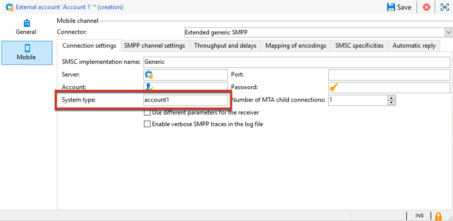
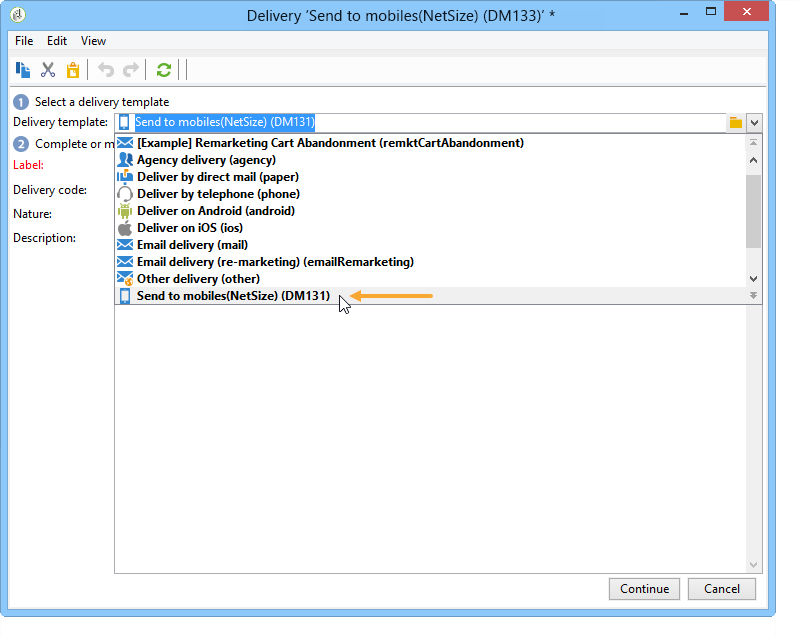
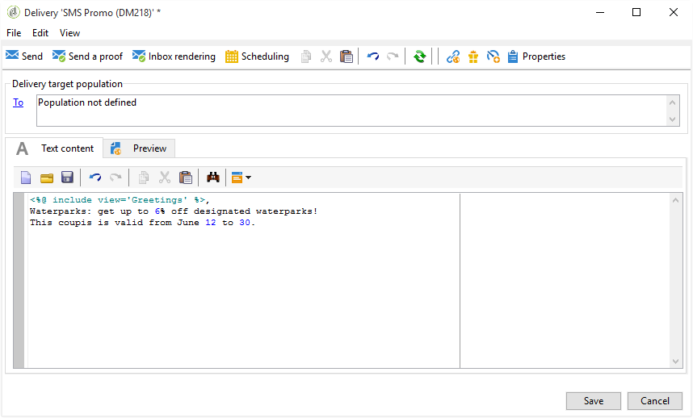

# Canal SMS{#sms-channel}

O Adobe Campaign permite que você realize deliveries em massa personalizados de mensagens SMS. Os perfis de recipients devem conter pelo menos um número de telefone celular.

>[!NOTE]
>
>O Adobe Campaign também permite enviar notificações nos terminais móveis, através da opção **Adobe Campaign Mobile App Channel (NMAC)**.
> 
>Para obter mais informações, consulte a seção [Sobre o canal de aplicativos para dispositivos móveis](../../delivery/using/about-mobile-app-channel.md).

As seções abaixo fornecem informações específicas do canal SMS. Para informações gerais sobre como criar um delivery, consulte [esta seção](../../delivery/using/steps-about-delivery-creation-steps.md).

## Configuração do canal SMS {#setting-up-sms-channel}

Para enviar para um celular, você precisa:

1. Uma conta externa especificando um conector e tipo de mensagem.

   Observe que os seguintes conectores serão descontinuados a partir da versão 20.2: NetSize, Generic SMPP (SMPP versão 3.4 com suporte para modo binário), Sybase365 (SAP SMS 365), CLX Communications, Tele2, O2 e iOS. Embora os recursos obsoletos ainda estejam disponíveis, eles não serão aprimorados e nem terão suporte. Para obter mais informações, consulte esta [página](https://helpx.adobe.com/br/campaign/kb/deprecated-and-removed-features.html).

1. Um template do delivery no qual essa conta externa é referenciada.

### Criação de conta externa SMPP {#creating-an-smpp-external-account}

Para enviar um SMS para um telefone celular, primeiro é necessário criar a conta externa SMPP.
Para obter mais informações sobre o protocolo e as configurações SMS, consulte esta [nota técnica](https://helpx.adobe.com/br/campaign/kb/sms-connector-protocol-and-settings.html).

Para fazer isso, siga as etapas abaixo:

1. No nó **[!UICONTROL Platform]** > **[!UICONTROL External accounts]** da árvore, clique no ícone **[!UICONTROL New]**.
1. Defina o tipo de conta como **Roteamento**, o canal como **Celular (SMS)** e o modo de delivery como **Delivery em massa**.

   

1. Marque a caixa **[!UICONTROL Enabled]**.
1. Na guia **[!UICONTROL Mobile]**, selecione **[!UICONTROL Extended generic SMPP]** na lista suspensa **[!UICONTROL Connector]**.

   

   >[!CAUTION]
   >
   > Os conectores herdados serão descontinuados e não terão suporte a partir da versão 20.2. Recomendamos o uso do conector **[!UICONTROL Extended generic SMPP]**. Para obter mais informações sobre como migrar para o conector recomendado, consulte esta [página](https://helpx.adobe.com/br/campaign/kb/sms-connector.html).

1. A opção **[!UICONTROL Enable verbose SMPP traces in the log file]** permite que você descarte todo o tráfego SMPP em arquivos de log. Essa opção deve ser habilitada para solucionar problemas no conector e comparar com o tráfego visto pelo provedor.

1. Entre em contato com seu provedor de serviços SMS que explicará como preencher os diferentes campos de conta externa da guia **[!UICONTROL Connection settings]**.

   Em seguida, entre em contato com seu provedor, dependendo do escolhido, que fornecerá o valor a ser inserido no campo **[!UICONTROL SMSC implementation name]**.

   Você pode definir o número de conexões para o provedor por MTA secundário. Por padrão, é definido como 1.

1. Por padrão, o número de caracteres em um SMS atende aos padrões GSM.

   As mensagens SMS usando a codificação GSM são limitadas a 160 caracteres ou a 153 caracteres por SMS para mensagens enviadas em várias partes.

   >[!NOTE]
   >
   >Alguns caracteres contam como dois (chaves, colchetes, o símbolo do euro, etc.).
   >
   >A lista de caracteres GSM disponíveis é apresentada abaixo.

   Você pode autorizar transliteração de caracteres marcando a caixa correspondente.

   

   Para obter mais informações, consulte [esta seção](#about-character-transliteration).

1. Na guia **[!UICONTROL Throughput and delays]**, você pode especificar a taxa de transferência máxima de mensagens de saída (&quot;MT&quot;, Mobile Terminated) em MT por segundo. Se inserir &quot;0&quot; no campo correspondente, a taxa de transferência será ilimitada.

   Os valores de todos os campos correspondentes às durações precisam ser preenchidos em segundos.

1. Na guia **[!UICONTROL Mapping of encodings]**, você pode definir codificações.

   Para obter mais informações, consulte [esta seção](#about-text-encodings).

1. Na guia **[!UICONTROL SMSC specificities]**, a opção **[!UICONTROL Send full phone number]** é desabilitada por padrão. Não ative se quiser respeitar o protocolo SMPP e transferir apenas dígitos ao servidor do provedor SMS (SMSC).

   Contudo, tendo em conta que determinados provedores exigem o uso do prefixo &quot;+&quot;, recomenda-se verificar com seu provedor e, se necessário, eles irão sugerir que seja habilitada.

   A caixa de seleção **[!UICONTROL Enable TLS over SMPP]** permite criptografar o tráfego SMPP. Para obter mais informações, consulte essa [nota técnica](https://helpx.adobe.com/br/campaign/kb/sms-connector-protocol-and-settings.html).

1. Ao configurar um conector **[!UICONTROL Extended generic SMPP]**, você pode definir respostas automáticas.

   Para obter mais informações, consulte [esta seção](#automatic-reply).

### Sobre a transliteração de caracteres {#about-character-transliteration}

A transliteração de caracteres pode ser configurada em uma conta externa de delivery de dispositivos móveis SMPP, na guia **[!UICONTROL Mobile]**.

A transliteração consiste em substituir um caractere de um SMS por outro quando esse caractere não é considerado pelo padrão GSM.

* Se a transliteração for **[!UICONTROL authorized]**, cada caractere que não for levado em consideração será substituído por um caractere GSM quando a mensagem for enviada. Por exemplo, a letra &quot;ë&quot; é substituída por &quot;e&quot;. Portanto, a mensagem é ligeiramente alterada, mas o limite de caracteres permanecerá o mesmo.
* Quando a transliteração é **[!UICONTROL not authorized]**, cada mensagem que contém caracteres que não são levados em consideração é enviada em formato binário (Unicode): todos os caracteres são enviados como estão. No entanto, as mensagens SMS usando Unicode são limitadas a 70 caracteres (ou 67 caracteres por SMS para mensagens enviadas em várias partes). Se o número máximo de caracteres for excedido, várias mensagens serão enviadas, o que pode ocasionar custos adicionais.

>[!IMPORTANT]
>
>Inserir campos de personalização no conteúdo de sua mensagem SMS pode apresentar caracteres que não são considerados pela codificação GSM.

Por padrão, a transliteração de caractere é desabilitada. Se você quiser que todos os caracteres em suas mensagens SMS sejam mantidos como estão, não altere nomes próprios, por exemplo, recomendamos que você não habilite essa opção.

No entanto, se as mensagens SMS contiverem muitos caracteres que geram mensagens Unicode, você poderá optar por habilitar essa opção para limitar os custos de envio de mensagens.

A tabela a seguir apresenta os caracteres considerados pelo padrão GSM. Todos os caracteres inseridos no corpo da mensagem, além daqueles mencionados abaixo, convertem toda a mensagem em formato binário (Unicode) e assim a limita a 70 caracteres.

**Caracteres básicos**

<table> 
 <tbody> 
  <tr> 
   <td> @ </td> 
   <td>  </td> 
   <td> SP </td> 
   <td> 0 </td> 
   <td> ¡ </td> 
   <td> P </td> 
   <td> ¿ </td> 
   <td> p </td> 
  </tr> 
  <tr> 
   <td> £ </td> 
   <td> _ </td> 
   <td> ! </td> 
   <td> 1 </td> 
   <td> A </td> 
   <td> Q </td> 
   <td> a </td> 
   <td> q </td> 
  </tr> 
  <tr> 
   <td> $ </td> 
   <td>  </td> 
   <td> " </td> 
   <td> 2 </td> 
   <td> B </td> 
   <td> R </td> 
   <td> b </td> 
   <td> r </td> 
  </tr> 
  <tr> 
   <td> ¥ </td> 
   <td>  </td> 
   <td> # </td> 
   <td> 3 </td> 
   <td> C </td> 
   <td> S </td> 
   <td> c </td> 
   <td> s </td> 
  </tr> 
  <tr> 
   <td> è </td> 
   <td>  </td> 
   <td> ¤ </td> 
   <td> 4 </td> 
   <td> D </td> 
   <td> T </td> 
   <td> d </td> 
   <td> t </td> 
  </tr> 
  <tr> 
   <td> é </td> 
   <td>  </td> 
   <td> % </td> 
   <td> 5 </td> 
   <td> E </td> 
   <td> U </td> 
   <td> e </td> 
   <td> u </td> 
  </tr> 
  <tr> 
   <td> ù </td> 
   <td>  </td> 
   <td> &amp; </td> 
   <td> 6 </td> 
   <td> F </td> 
   <td> V </td> 
   <td> f </td> 
   <td> v </td> 
  </tr> 
  <tr> 
   <td> ì </td> 
   <td>  </td> 
   <td> ' </td> 
   <td> 7 </td> 
   <td> G </td> 
   <td> W </td> 
   <td> g </td> 
   <td> w </td> 
  </tr> 
  <tr> 
   <td> ò </td> 
   <td>  </td> 
   <td> ( </td> 
   <td> 8 </td> 
   <td> H </td> 
   <td> X </td> 
   <td> h </td> 
   <td> x </td> 
  </tr> 
  <tr> 
   <td> Ç </td> 
   <td>  </td> 
   <td> ) </td> 
   <td> 9 </td> 
   <td> I </td> 
   <td> Y </td> 
   <td> i </td> 
   <td> y </td> 
  </tr> 
  <tr> 
   <td> LF </td> 
   <td>  </td> 
   <td> * </td> 
   <td> : </td> 
   <td> J </td> 
   <td> Z </td> 
   <td> j </td> 
   <td> z </td> 
  </tr> 
  <tr> 
   <td> Ø </td> 
   <td> ESC </td> 
   <td> + </td> 
   <td> ; </td> 
   <td> K </td> 
   <td> Ä </td> 
   <td> k </td> 
   <td> ä </td> 
  </tr> 
  <tr> 
   <td> ø </td> 
   <td> Æ </td> 
   <td> , </td> 
   <td> &lt; </td> 
   <td> L </td> 
   <td> Ö </td> 
   <td> l </td> 
   <td> ö </td> 
  </tr> 
  <tr> 
   <td> CR </td> 
   <td> æ </td> 
   <td> - </td> 
   <td> = </td> 
   <td> M </td> 
   <td> Ñ </td> 
   <td> m </td> 
   <td> ñ </td> 
  </tr> 
  <tr> 
   <td> Å </td> 
   <td> ß </td> 
   <td> . </td> 
   <td> &gt; </td> 
   <td> N </td> 
   <td> Ü </td> 
   <td> n </td> 
   <td> ü </td> 
  </tr> 
  <tr> 
   <td> å </td> 
   <td> É </td> 
   <td> / </td> 
   <td> ? </td> 
   <td> O </td> 
   <td> § </td> 
   <td> o </td> 
   <td> à </td> 
  </tr> 
 </tbody> 
</table>

SP: espaço

ESC: escape

LF: alimentação de linha

CR: retorno

**Caracteres avançados (contados duas vezes)**

^ { } `[ ~ ]` | €

### Sobre codificações de texto {#about-text-encodings}

Ao enviar uma mensagem SMS, o Adobe Campaign pode usar uma ou várias codificações de texto. Cada codificação tem seu próprio conjunto específico de caracteres e determina o número de caracteres que cabem em uma mensagem SMS.

Ao configurar uma nova conta externa de delivery de dispositivo móvel SMPP, você pode definir o **[!UICONTROL Mapping of encodings]** na guia **[!UICONTROL Mobile]**: o campo **[!UICONTROL data_coding]** permite que o Adobe Campaign comunique qual codificação é usada para o SMSC.

>[!NOTE]
>
>O mapping entre o valor **data_coding** e a codificação realmente usada é padronizado. No entanto, certos SMSC têm seu próprio mapping específico: neste caso, o administrador do **Adobe Campaign** precisa declarar esse mapping. Consulte seu provedor para saber mais.

Você pode declarar **data_codings** e forçar a codificação se necessário: para fazer isso, especifique uma única codificação na tabela.

* Quando nenhum mapping de codificações é definido, o conector assume um comportamento genérico:

   * Ele tentará usar a codificação GSM para a qual atribui o valor **data_coding = 0**.
   * Se a codificação GSM falhar, ele usará a codificação **UCS2** para a qual atribui o valor **data_coding = 8**.

* Ao definir as codificações que gostaria de usar e os valores de campo vinculados do tipo **[!UICONTROL data_coding]**, o Adobe Campaign tentará usar a primeira codificação na lista e depois a seguinte, se a primeira for impossível.

>[!IMPORTANT]
>
>A ordem da declaração é importante: é recomendável colocar a lista em ordem crescente **de custo** para favorecer as codificações que permitem usar o máximo possível de caracteres em cada mensagem SMS.
>
>Apenas declare as codificações que deseja usar. Se algumas das codificações fornecidas pelo SMSC não corresponderem à sua finalidade de uso, não as declare na lista.

### Resposta automática {#automatic-reply}

Ao configurar um conector SMPP genérico estendido, você pode configurar respostas automáticas.

Quando um assinante responde a uma mensagem SMS, enviada a ele por meio do Adobe Campaign contendo uma palavra-chave como &quot;PARAR&quot;, você pode configurar as mensagens que são automaticamente enviadas de volta na seção **[!UICONTROL Automatic reply sent to the MO]**.

>[!NOTE]
>
>As palavras-chave não diferenciam maiúsculas de minúsculas.

Para cada palavra-chave, especifique um código curto, que é um número usado normalmente para enviar deliveries e servirá como nome de remetente, e então insira a mensagem que será enviada ao assinante.

Você também pode vincular uma ação à sua resposta automática: **[!UICONTROL Send to quarantine]** ou **[!UICONTROL Remove from quarantine]**. Por exemplo, se um recipient enviar a palavra-chave &quot;PARAR&quot;, ele receberá automaticamente uma confirmação de unsubscription e será enviado à quarentena.


Se você vincular a ação **[!UICONTROL Remove from quarantine]** a uma resposta automática, os recipients que enviam a palavra-chave correspondente serão automaticamente removidos da quarentena.

Os recipients estão listados na tabela **[!UICONTROL Non deliverables and addresses]** disponível no menu **[!UICONTROL Administration]** > **[!UICONTROL Campaign Management]** > **[!UICONTROL Non deliverables Management]**.

* Para enviar a mesma resposta independentemente do código curto, deixe a coluna **[!UICONTROL Short code]** vazia.
* Para enviar a mesma resposta independentemente da palavra-chave, deixe a coluna **[!UICONTROL Keyword]** vazia.
* Para realizar uma ação sem enviar uma resposta, deixe a coluna **[!UICONTROL Response]** vazia. Por exemplo, isso permite remover da quarentena um usuário que responde com uma mensagem diferente de &quot;PARAR&quot;.

Se você tiver múltiplas contas externas usando o conector Extended generic SMPP com a mesma conta de provedor, o seguinte problema pode ocorrer: ao enviar uma resposta para um código curto, ela pode ser recebida em qualquer uma das conexões de sua conta externa. Consequentemente, a resposta automática que é enviada pode não ser a mensagem esperada.
Para evitar isso, aplique uma das seguintes soluções, dependendo do provedor que você estiver usando:

* Crie uma conta de provedor para cada conta externa.
* Use o campo **[!UICONTROL System type]** da guia **[!UICONTROL Mobile]** > **[!UICONTROL Connection settings]** para distinguir cada código curto. Solicite ao seu provedor um valor diferente para cada conta.

   

As etapas para configurar uma conta externa usando o conector Extended generic SMPP estão detalhadas na seção [Criação de uma conta externa SMPP](../../delivery/using/sms-channel.md#creating-an-smpp-external-account).

### Alteração do template do delivery {#changing-the-delivery-template}

O Adobe Campaign oferece um template do delivery para celulares. Esse template está disponível no nó **[!UICONTROL Resources > Templates > Delivery templates]**. Para obter mais informações, consulte a seção [Sobre templates](../../delivery/using/about-templates.md)

Para delivery via canal SMS, você deve criar um template no qual o conector de canal é referenciado.

Para manter o template do delivery nativo, recomendamos que você o duplique e depois configure.

No exemplo abaixo, criamos um template para fazer o delivery de mensagens pela conta SMPP habilitada anteriormente. Para fazer isso:

1. Vá para o nó **[!UICONTROL Delivery templates]**
1. Clique com o botão direito do mouse no modelo **[!UICONTROL Send to mobiles]** e selecione **[!UICONTROL Duplicate]**.

   

1. Altere o rótulo do template, por exemplo **Enviado para dispositivos móveis (SMPP)**.

   

1. Clique em **[!UICONTROL Properties]**.
1. Na guia **[!UICONTROL General]**, selecione um modo de roteamento que corresponda à conta externa criada nas etapas anteriores.

   

1. Clique em **[!UICONTROL Save]** para criar o template.

   

Agora você tem uma conta externa e um template do delivery que possibilita o delivery via SMS.

## Criação de delivery de SMS {#creating-a-sms-delivery}

### Seleção do canal de delivery {#selecting-the-delivery-channel}

Para criar um novo delivery de SMS, siga as etapas abaixo:

>[!NOTE]
>
>Os conceitos globais sobre a criação de delivery são apresentados [nesta seção](../../delivery/using/steps-about-delivery-creation-steps.md).

1. Crie um novo delivery, por exemplo, no painel do Delivery.
1. Selecione o template do delivery **Sent to mobiles (SMPP)** que você criou anteriormente. Para obter mais informações, consulte a seção [Alteração do template do delivery](#changing-the-delivery-template).

   

1. Identifique o delivery com um rótulo, código e descrição. Para obter mais informações, consulte [esta seção](../../delivery/using/steps-create-and-identify-the-delivery.md#identifying-the-delivery).
1. Clique em **[!UICONTROL Continue]** para confirmar essas informações e exibir a janela de configuração de mensagem.

## Definição do conteúdo do SMS {#defining-the-sms-content}

Para criar o conteúdo do SMS, siga as etapas abaixo:

1. Insira o conteúdo da mensagem na seção **[!UICONTROL Text content]** do assistente. Os botões da barra de ferramentas permitem importar, salvar ou pesquisar conteúdo. O último botão é usado para inserir campos de personalização.

   

   O uso de campos de personalização é apresentado na seção [Sobre a personalização](../../delivery/using/about-personalization.md).

1. Clique em **[!UICONTROL Preview]** na parte inferior da página para exibir a renderização da mensagem com sua personalização. Para iniciar a visualização, selecione um recipient usando o botão **[!UICONTROL Test personalization]** na barra de ferramentas. Você pode selecionar um recipient nos targets definidos ou escolher outro recipient.

   

   Você pode aprovar a mensagem SMS. Você também pode exibir o conteúdo do SMS na tela do celular que aparece à direita do editor de conteúdo. Clique na tela e use o mouse para rolar pelo conteúdo.

   

1. Clique no link **[!UICONTROL Data loaded]** para exibir as informações referentes ao recipient.

   

   >[!NOTE]
   >
   >As mensagens SMS são limitadas a um comprimento de 160 caracteres, se a página de código Latin-1 (ISO-8859-1) for usada. Se a mensagem for gravada em Unicode, não deverá exceder 70 caracteres. Alguns caracteres especiais podem afetar o comprimento da mensagem. Para obter mais informações sobre comprimento de mensagem, consulte a seção [About character transliteration](#about-character-transliteration).
   >
   >Quando campos de personalização ou campos de conteúdo condicional estão presentes, o tamanho da mensagem varia de um recipient para outro. O comprimento da mensagem deve ser avaliado quando a personalização for realizada.
   >
   >Quando você inicia a análise, o comprimento das mensagens é verificado e um aviso é exibido no caso de excedente.

1. Se você usar o conector NetSize ou um conector SMPP, é possível personalizar o nome do remetente do delivery. Para obter mais informações, consulte a seção [Advanced parameters](#advanced-parameters).

## Seleção da população do target {#selecting-the-target-population}

O processo detalhado ao selecionar a população do target de um delivery é apresentado [nesta seção](../../delivery/using/steps-defining-the-target-population.md).

Para obter mais informações sobre o uso de campos de personalização, consulte [Sobre a personalização](../../delivery/using/about-personalization.md).

Para obter mais informações sobre a inclusão de uma lista de propagação, consulte [Sobre seed addresses](../../delivery/using/about-seed-addresses.md).

## Envio de mensagens SMS {#sending-sms-messages}

Para aprovar sua mensagem e enviá-la aos recipients do delivery que está sendo criado, clique em **[!UICONTROL Send]**.

O processo detalhado da validação e envio de um delivery é apresentado nas seções abaixo:

* [Validando o dleivery](../../delivery/using/steps-validating-the-delivery.md)
* [Enviando o delivery](../../delivery/using/steps-sending-the-delivery.md)

### Parâmetros avançados {#advanced-parameters}

O botão **[!UICONTROL Properties]** dá acesso ao parâmetro de delivery avançado. Os parâmetros específicos para deliveries de SMS estão na seção **[!UICONTROL SMS parameters]** da guia **[!UICONTROL Delivery]**.

As seguintes opções estão disponíveis:

* **Endereço do remetente**: permite personalizar o nome do remetente do delivery usando uma cadeia de caracteres alfanuméricos limitada a onze caracteres. O campo não deve ser criado exclusivamente com figuras. Você pode definir uma condição para exibir, por exemplo, nomes diferentes de acordo com o código de área do recipient:

   ```
   <% if( String(recipient.mobilePhone).indexOf("+1") == 0){ %>NeoShopUS<%} else %>
   ```

   >[!IMPORTANT]
   >
   >Verifique a lei em seu país em relação à edição dos nomes dos remetentes. Você também deve verificar se sua operadora oferece essa funcionalidade.

* **Modo de transmissão**: transmissão de mensagem por SMS.
* **Prioridade**: nível de importância atribuída a uma mensagem. A prioridade **[!UICONTROL Normal]** é selecionada por padrão. Pergunte ao seu provedor de serviços sobre o custo do SMS enviado com prioridade **[!UICONTROL High]**.
* **Tipo de aplicativo**: escolha o aplicativo que deseja atribuir ao delivery de SMS. A opção **[!UICONTROL Direct Marketing]** é selecionada por padrão e é a mais usada.

**Parâmetros específicos do conector NetSize**


* **Use vários SMS para uma única mensagem**: isso permite enviar uma mensagem com mais de 160 caracteres por meio de várias mensagens SMS.

**Parâmetros específicos de um conector SMPP**


* **Número máximo de SMS por mensagem**: essa opção permite que você defina o número de SMS para usar ao enviar uma mensagem. Se o número for definido como 0, você poderá usar um SMS para enviar sua mensagem. Se o número de SMS estiver definido como 1 ou 2, por exemplo, e a mensagem exceder esse limite, ele não será enviado.

## Monitoramento e rastreamento de deliveries de SMS {#monitoring-and-tracking-sms-deliveries}

Após enviar as mensagens, você pode monitorar e rastrear seus deliveries. Para obter mais informações, consulte essas seções.

* [Monitoramento de uma entrega](../../delivery/using/monitoring-a-delivery.md)
* [Noções básicas sobre falhas de entrega](../../delivery/using/understanding-delivery-failures.md)
* [Sobre o rastreamento de mensagens](../../delivery/using/about-message-tracking.md)

## Processamento de mensagens de entrada {#processing-inbound-messages}

O módulo de **sms nlserver** consulta o roteador SMS em intervalos regulares. Isso permite que o Adobe Campaign rastreie o progresso dos deliveries e gerencie os relatórios de status e as solicitações de unsubscription de recipients.

* **Relatórios de status**: exibe logs do delivery para verificar o status das mensagens.

   >[!NOTE]
   >
   >Cada SMS enviado é vinculado a uma conta externa em sua chave primária. Deste modo:
   >
   > * Os relatórios de status de uma conta externa de SMS excluída não são processados corretamente.
   > * Uma conta SMS só pode ser vinculada a uma única conta externa para garantir que os relatórios de status sejam atribuídos à conta correta


* **Unsubscription**: recipients que desejam parar de receber deliveries de SMS podem retornar uma mensagem contendo a palavra PARAR. Se o seu provedor permitir sob os termos do contrato, você poderá recuperar mensagens por meio da atividade de workflow de **SMS de entrada** e criar um query para habilitar a opção **Não entrar em contato com este recipient** para os recipients relacionados.

   Consulte a guia [Workflows](../../workflow/using/architecture.md) .

## Schema InSMS {#insms-schema}

O schema InSMS contém informações relevantes para o SMS de entrada. Uma descrição desses campos está disponível por meio do atributo desc.

* **mensagem**: conteúdo do SMS recebido.
* **origem**: número do celular na origem da mensagem.
* **providerId**: identificador da mensagem retornada pelo SMSC (centro de mensagens).
* **criada**: a data da mensagem de entrada foi inserida no Adobe Campaign.
* **extAccount**: conta externa do Adobe Campaign.

   >[!IMPORTANT]
   >
   >Os campos a seguir são específicos para NetSize.
   >
   >Se o operador em uso não for NetSize, esses campos serão considerados vazios.

* **alias**: alias da mensagem de entrada.
* **separator**: separador entre o alias e o corpo da mensagem.
* **messageDate**: data da mensagem fornecida pelo operador.
* **receivalDate**: data da mensagem do operador recebida por SMSC (centro de mensagem).
* **deliveryDate**: mensagem de data enviada por SMSC (centro de mensagens).
* **largeAccount**: código de conta do cliente vinculado ao SMS de entrada.
* **countryCode**: código do país do operador.
* **operatorCode**: código de rede do operador.
* **linkedSmsId**: identificador do Adobe Campaign (broadlogId) vinculado ao SMS de saída, em que este SMS é a resposta.

## Gerenciamento de respostas automáticas (Regulamentação norte-americana) {#managing-automatic-replies--american-regulation-}

Quando os assinantes respondem a uma mensagem SMS enviada via Adobe Campaign e usam uma palavra-chave como PARAR, AJUDA ou SIM, é necessário, no mercado dos EUA, configurar mensagens que são automaticamente retornadas.

Por exemplo, se os recipients enviam a palavra-chave PARAR, eles recebem automaticamente uma mensagem de confirmação informando que a assinatura foi cancelada.

O nome do remetente desse tipo de mensagem é um código curto geralmente usado para enviar deliveries.

>[!IMPORTANT]
>
>O procedimento detalhado a seguir é válido apenas para conectores SMPP, exceto para o conector SMPP genérico estendido. Para obter mais informações, consulte a seção [Creating an SMPP external account](#creating-an-smpp-external-account).
>
>Faz parte do processo de certificação realizado pelos operadores norte-americanos para campanhas de marketing nos EUA. Essas respostas às mensagens SMS de assinantes que contêm a palavra-chave devem ser enviadas de volta a eles imediatamente após receber uma mensagem deles.

1. Crie este tipo de arquivo XML:

   ```
   <autoreply>
     <shortcode name="12345">
       <reply keyword="STOP" text="You will not receive SMS anymore" />
       <reply keyword="HELP" text="Powered by Adobe Campaign" />
     </shortcode>
     <shortcode name="43115">
       <reply keyword="STOP" text="Vous ne recevrez plus de SMS" />
       <reply keyword="HELP" text="Service rendu par Adobe Campaign" />
     </shortcode>
     <shortcode name="*">
       <reply keyword="ADOBE" text="This text is replied when you send ADOBE to any short code" />
     </shortcode>
   </autoreply>
   ```

1. Para o atributo **name** da tag **`<shortcode>`**, especifique o código curto que será exibido no lugar do nome do remetente da mensagem.

   Em cada tag **`<reply>`**, insira o atributo **keyword** com uma palavra-chave e o atributo **text** com a mensagem que gostaria de enviar para essa palavra-chave.

   >[!NOTE]
   >
   >Cada palavra-chave deve ser escrita em letras maiúsculas.

   Se desejar enviar a mesma mensagem para várias palavras-chave, duplique a linha correspondente.

   Por exemplo:

   ```
   <reply keyword="STOP" text="You will not receive SMS anymore" />
   <reply keyword="QUIT" text="You will not receive SMS anymore" />
   ```

1. Depois de concluído, salve este arquivo com o nome **smsAutoReply.xml**.

   Observe que o nome do arquivo diferencia maiúsculas de minúsculas no Linux.

1. Copie esse arquivo no diretório **conf** no Adobe Campaign, no mesmo lugar que o servidor Web.

>[!IMPORTANT]
>
>Esses tipos de mensagens automáticas não mantêm um histórico. Portanto, não aparecem no [delivery dashboard](../../delivery/using/monitoring-a-delivery.md#delivery-dashboard).
>
>Essas mensagens não são consideradas parte das [regras de pressão comercial](../../campaign/using/pressure-rules.md).
