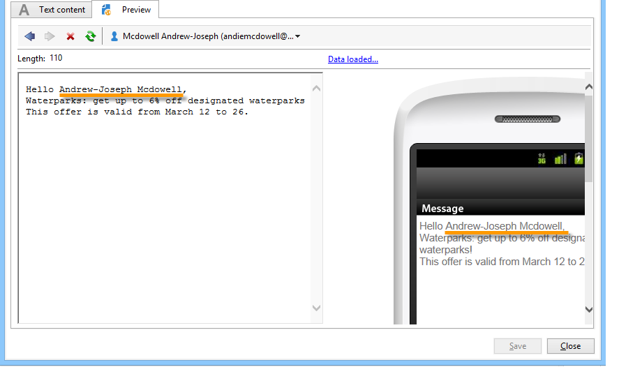

# Criar uma entrega de SMS {#creating-a-sms-delivery}

## Selecionar o canal de entrega {#selecting-the-delivery-channel}

Para criar uma nova entrega de SMS, siga as etapas abaixo:

>[!NOTE]
>
>Os conceitos globais sobre a criação de entregas são apresentados na [documentação do Campaign v8](https://experienceleague.adobe.com/docs/campaign/campaign-v8/send/create-message.html?lang=pt-BR){target="_blank"}.

1. Crie uma nova entrega, por exemplo, no painel Entrega.
1. Selecione o modelo da entrega **Sent to mobiles (SMPP)** que você criou anteriormente. Para obter mais informações, consulte a seção [Alterar o modelo da entrega](sms-set-up.md#changing-the-delivery-template).

   

1. Identifique a entrega com um rótulo, código e descrição. Para obter mais informações, consulte esta seção na [documentação do Campaign v8](https://experienceleague.adobe.com/docs/campaign/campaign-v8/send/create-message.html?lang=pt-BR#create-the-delivery){target="_blank"}.
1. Clique em **[!UICONTROL Continue]** para confirmar essas informações e exibir a janela de configuração de mensagem.

## Definir o conteúdo do SMS {#defining-the-sms-content}

Para criar o conteúdo do SMS, siga as etapas abaixo:

1. Insira o conteúdo da mensagem na seção **[!UICONTROL Text content]** do assistente. Os botões da barra de ferramentas permitem importar, salvar ou pesquisar conteúdo. O último botão é usado para inserir campos de personalização.

   

   O uso de campos de personalização é apresentado na seção [Sobre a personalização](about-personalization.md).

1. Clique em **[!UICONTROL Preview]** na parte inferior da página para exibir a renderização da mensagem com sua personalização. Para iniciar a visualização, selecione um destinatário usando o botão **[!UICONTROL Test personalization]** na barra de ferramentas. Você pode selecionar um destinatário nos targets definidos ou escolher outro destinatário.

   

   Você pode aprovar a mensagem SMS. Você também pode exibir o conteúdo do SMS na tela do celular que aparece à direita do editor de conteúdo. Clique na tela e use o mouse para rolar pelo conteúdo.

   

1. Clique no link **[!UICONTROL Data loaded]** para exibir as informações referentes ao destinatário.

   

   >[!NOTE]
   >
   >As mensagens SMS são limitadas a um comprimento de 160 caracteres, se a página de código Latin-1 (ISO-8859-1) for usada. Se a mensagem for gravada em Unicode, não deverá exceder 70 caracteres. Alguns caracteres especiais podem afetar o comprimento da mensagem. Para obter mais informações sobre tamanho da mensagem, consulte a seção [Transliteração de caracteres SMS](#about-character-transliteration).
   >
   >Quando campos de personalização ou campos de conteúdo condicional estão presentes, o tamanho da mensagem varia de um destinatário para outro. O comprimento da mensagem deve ser avaliado quando a personalização for realizada.
   >
   >Quando você inicia a análise, o comprimento das mensagens é verificado e um aviso é exibido no caso de excedente.

1. Se você usar o conector NetSize ou um conector SMPP, é possível personalizar o nome do remetente da entrega. Para obter mais informações, consulte a seção [Advanced parameters](#advanced-parameters).

## Selecionar a população de destino {#selecting-the-target-population}

O processo detalhado ao selecionar a população do target de uma entrega é apresentado [nesta seção](steps-defining-the-target-population.md).

Para obter mais informações sobre o uso de campos de personalização, consulte [esta seção](about-personalization.md).

Para obter mais informações sobre a inclusão de uma lista de propagação, consulte [esta página](about-seed-addresses.md).
