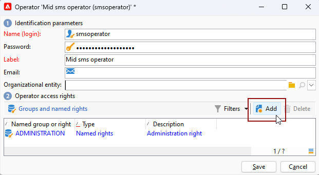

# Configurar canal de SMS em uma infraestrutura de mid-sourcing {#setting-up-sms-channel}

Para enviar para um telefone celular com servidores intermediários, é necessário:

1. Um Operador SMS criado no Mid-server usado para a conta externa de SMS criada no servidor Marketing.

1. Uma conta externa no servidor de marketing, especificando o canal e o modo de delivery.

1. Uma conta externa no Mid-server, detalhando o conector e o tipo de mensagem.

1. Um template do delivery que faz referência à conta externa para simplificar o processo de envio.

>[!NOTE]
>
> Para entregas de SMS, a tipologia deve estar usando uma afinidade de SMS específica criada em **um** container dedicado do servidor de aplicativos. [Saiba mais](../../installation/using/configure-delivery-settings.md#managing-outbound-smtp-traffic-with-affinities)

## Criar o operador de SMS no servidor intermediário {#create-sms-operator}

Para iniciar o processo de configuração, você deve criar um Operador SMS no Mid-server especificamente para a conta externa do.

>[!IMPORTANT]
>
>Cada conector SMS requer um Operador SMS exclusivo.

1. No **[!UICONTROL Administration]** > **[!UICONTROL Access management]** > **[!UICONTROL Operators node]** da árvore, clique no botão **[!UICONTROL New]** ícone.

   

1. Especifique o nome do usuário **[!UICONTROL Identification parameters]**, incluindo logon, senha e nome. O logon e a senha são necessários para que o operador faça logon no Adobe Campaign com segurança.

   Observe que **[!UICONTROL Name (login)]** deve ser usado posteriormente para nomear a conta externa SMPP no servidor intermediário.

   

1. Selecione as permissões concedidas ao operador na seção Operator access rights.

   Para alocar direitos ao operador, clique no link **[!UICONTROL Add]** localizado acima da lista de direitos. Em seguida, selecione um **[!UICONTROL Operator group]** ou **[!UICONTROL Named rights]** na lista de grupos disponíveis.

   

1. Clique em **[!UICONTROL Save]** para finalizar a criação do operador. O perfil agora está incluído na lista de operadores existentes.

## Criar uma conta externa de SMS no servidor de marketing {#create-accound-mkt}

Para enviar um SMS para um telefone celular com Mid-servers, primeiro é necessário criar a conta externa de SMS no servidor de marketing.

1. No nó **[!UICONTROL Platform]** > **[!UICONTROL External accounts]** da árvore, clique no ícone **[!UICONTROL New]**.

   

1. Digite seu **[!UICONTROL Label]** e **[!UICONTROL Internal name]**. Observe que o Internal name deve ser usado posteriormente para nomear a conta externa SMPP no servidor intermediário.

1. Definir o tipo de conta como **[!UICONTROL Routing]**, o canal como **[!UICONTROL Mobile (SMS)]** e o modo de delivery como **[!UICONTROL Mid-sourcing]**.

   

1. No **[!UICONTROL Mid-Sourcing]** especifique os parâmetros de conexão do servidor mid-sourcing.

   Insira os detalhes do [conector SMS criado anteriormente](#create-sms-operator) no **[!UICONTROL Account]** e **[!UICONTROL Password]** campos.

   

1. Confirme sua configuração clicando em **[!UICONTROL Test the connection]**.

1. Clique em **[!UICONTROL Save]**.

## Criar uma conta externa SMPP no Mid-server {#creating-smpp-mid}

>[!IMPORTANT]
>
>Usar a mesma conta e senha para várias contas externas de SMS pode resultar em conflitos e sobreposição entre as contas. Consulte a [Página de solução de problemas de SMS](troubleshooting-sms.md#external-account-conflict).

Depois de configurar com êxito a conta externa do SMS no servidor de marketing, o próximo passo é estabelecer a conta externa SMPP no servidor intermediário.

Para obter mais informações sobre o protocolo e as configurações de SMS, consulte esta [página](sms-protocol.md).

Para fazer isso, siga as etapas abaixo:

1. No nó **[!UICONTROL Platform]** > **[!UICONTROL External accounts]** da árvore, clique no ícone **[!UICONTROL New]**.

1. Digite seu **[!UICONTROL Label]** e **[!UICONTROL Internal name]**.

   >[!WARNING]
   >
   >Ao atribuir um **[!UICONTROL Internal name]**, siga a convenção de nomenclatura especificada:
   >  `SMS Operator Name_Internal Name of the Marketing SMS external account`

   

1. Defina o tipo de conta como **Roteamento**, o canal como **Celular (SMS)** e o modo de entrega como **Entrega em massa**.

   

1. Marque a caixa **[!UICONTROL Enabled]**.

1. Na guia **[!UICONTROL Mobile]**, selecione **[!UICONTROL Extended generic SMPP]** na lista suspensa **[!UICONTROL Connector]**.

   

1. A opção **[!UICONTROL Enable verbose SMPP traces in the log file]** permite que você descarte todo o tráfego SMPP em arquivos de log. Essa opção só deve ser habilitada para solucionar problemas no conector e comparar com o tráfego visto pelo provedor.

1. Entre em contato com seu provedor de serviços SMS que explicará como preencher os diferentes campos de conta externa da guia **[!UICONTROL Connection settings]**.

   Em seguida, entre em contato com seu provedor, dependendo do escolhido, que fornecerá o valor a ser inserido no campo **[!UICONTROL SMSC implementation name]**.

   Você pode definir o número de conexões para o provedor por MTA secundário. Por padrão, é definido como 1.

1. Por padrão, o número de caracteres em um SMS atende aos padrões GSM.

   As mensagens SMS usando a codificação GSM são limitadas a 160 caracteres ou a 153 caracteres por SMS para mensagens enviadas em várias partes.

   >[!NOTE]
   >
   >Alguns caracteres contam como dois (chaves, colchetes, o símbolo do euro, etc.).
   >
   >A lista de caracteres GSM disponíveis é apresentada em [nesta seção](sms-set-up.md#about-character-transliteration).

   Você também pode autorizar a transliteração de caracteres marcando a caixa correspondente.

   

1. Na guia **[!UICONTROL Throughput and delays]**, você pode especificar a taxa de transferência máxima de mensagens de saída (&quot;MT&quot;, Mobile Terminated) em MT por segundo. Se inserir &quot;0&quot; no campo correspondente, a taxa de transferência será ilimitada.

   Os valores de todos os campos correspondentes às durações precisam ser preenchidos em segundos.

1. Na guia **[!UICONTROL Mapping of encodings]**, você pode definir codificações.

   Para obter mais informações, consulte [esta seção](sms-set-up.md#about-text-encodings).

1. Na guia **[!UICONTROL SMSC specificities]**, a opção **[!UICONTROL Send full phone number]** é desabilitada por padrão. Não ative se quiser respeitar o protocolo SMPP e transferir apenas dígitos ao servidor do provedor SMS (SMSC).

   Contudo, tendo em conta que determinados provedores exigem o uso do prefixo &quot;+&quot;, recomenda-se verificar com seu provedor e, se necessário, eles irão sugerir que seja habilitada.

   A caixa de seleção **[!UICONTROL Enable TLS over SMPP]** permite criptografar o tráfego SMPP. Para obter mais informações, consulte esta [página](sms-protocol.md).

1. Ao configurar um conector **[!UICONTROL Extended generic SMPP]**, você pode definir respostas automáticas.

   Para obter mais informações, consulte [esta seção](sms-set-up.md#automatic-reply).

## Alterar o modelo de entrega {#changing-the-delivery-template}

O Adobe Campaign oferece um template de delivery móvel localizado no **[!UICONTROL Resources > Templates > Delivery templates]** nó. Para obter mais informações, consulte a seção [Sobre templates](about-templates.md)

Para enviar mensagens por meio do canal SMS, você deve criar um template que inclua uma referência ao conector de canal.

Para manter o template do delivery nativo, recomendamos que você o duplique e depois o configure.

No exemplo abaixo, geramos um template para facilitar o delivery de mensagens por meio da conta SMPP criada anteriormente. Para fazer isso:

1. No **[!UICONTROL Resources]** > **[!UICONTROL Templates]** > **[!UICONTROL Delivery templates]** da árvore, clique com o botão direito do mouse no **[!UICONTROL Send to mobiles]** e selecione **[!UICONTROL Duplicate]**.

   

1. Altere o rótulo do template, por exemplo **Enviado para dispositivos móveis (SMPP)**.

   

1. Clique em **[!UICONTROL Properties]**.

1. No **[!UICONTROL General]** selecione um modo de roteamento que corresponda à conta externa criada na seção [Criar uma conta externa de SMS no servidor de marketing](#create-accound-mkt).

   

1. Clique em **[!UICONTROL Save]** para criar o template.

   

Agora você tem uma conta externa e um template da entrega que possibilita a entrega via SMS.

## Tópicos relacionados {#related-topics}

* [Transliteração de caracteres de SMS](sms-set-up.md#about-character-transliteration)
* [Codificações de texto](sms-set-up.md#about-text-encodings)
* [Resposta automática](sms-set-up.md#automatic-reply)

