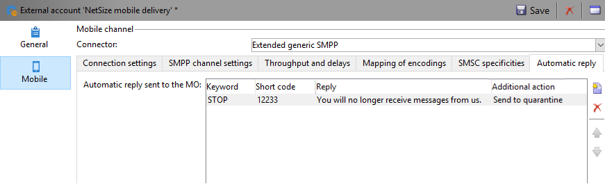

# Configurar canal de SMS {#setting-up-sms-channel}

Para enviar para um celular, você precisa:

1. Uma conta externa especificando um conector e tipo de mensagem.

   Observe que os conectores herdados agora estão obsoletos. Embora os recursos obsoletos ainda estejam disponíveis, eles não serão aprimorados nem terão suporte. Saiba mais [nesta página](../../rn/using/deprecated-features.md).

1. Um template do delivery no qual essa conta externa é referenciada.

>[!NOTE]
>
> Para envio de SMS, a tipologia deve estar usando uma afinidade de SMS específica criada em **um** container dedicado do servidor de aplicativos. [Saiba mais](../../installation/using/configure-delivery-settings.md#managing-outbound-smtp-traffic-with-affinities)

## Criar uma conta externa SMPP {#creating-an-smpp-external-account}

Para enviar um SMS a um telefone celular, primeiro é necessário criar a conta externa SMPP.
Para obter mais informações sobre o protocolo e as configurações de SMS, consulte esta [página](sms-protocol.md).

Para fazer isso, siga as etapas abaixo:

1. No nó **[!UICONTROL Platform]** > **[!UICONTROL External accounts]** da árvore, clique no ícone **[!UICONTROL New]**.
1. Defina o tipo de conta como **Roteamento**, o canal como **Celular (SMS)** e o modo de delivery como **Delivery em massa**.

   

1. Marque a caixa **[!UICONTROL Enabled]**.
1. Na guia **[!UICONTROL Mobile]**, selecione **[!UICONTROL Extended generic SMPP]** na lista suspensa **[!UICONTROL Connector]**.

   

   >[!CAUTION]
   >
   > Os conectores herdados serão descontinuados e não terão suporte a partir da versão 20.2. Recomendamos o uso do conector **[!UICONTROL Extended generic SMPP]**. Para obter mais informações sobre como migrar para o conector recomendado, consulte esta [página](unsupported-connector-migration.md).

1. A opção **[!UICONTROL Enable verbose SMPP traces in the log file]** permite que você descarte todo o tráfego SMPP em arquivos de log. Essa opção deve ser habilitada para solucionar problemas no conector e comparar com o tráfego visto pelo provedor.

1. Entre em contato com seu provedor de serviços SMS que explicará como preencher os diferentes campos de conta externa da guia **[!UICONTROL Connection settings]**.

   Em seguida, entre em contato com seu provedor, dependendo do escolhido, que fornecerá o valor a ser inserido no campo **[!UICONTROL SMSC implementation name]**.

   Você pode definir o número de conexões para o provedor por MTA secundário. Por padrão, é definido como 1.

1. Por padrão, o número de caracteres em um SMS atende aos padrões GSM.

   As mensagens SMS usando a codificação GSM são limitadas a 160 caracteres ou a 153 caracteres por SMS para mensagens enviadas em várias partes.

   >[!NOTE]
   >
   >Alguns caracteres contam como dois (chaves, colchetes, o símbolo do euro, etc.).
   >
   >A lista de caracteres GSM disponíveis é apresentada abaixo.

   Você pode autorizar transliteração de caracteres marcando a caixa correspondente.

   

   Para obter mais informações, consulte [esta seção](#about-character-transliteration).

1. Na guia **[!UICONTROL Throughput and delays]**, você pode especificar a taxa de transferência máxima de mensagens de saída (&quot;MT&quot;, Mobile Terminated) em MT por segundo. Se inserir &quot;0&quot; no campo correspondente, a taxa de transferência será ilimitada.

   Os valores de todos os campos correspondentes às durações precisam ser preenchidos em segundos.

1. Na guia **[!UICONTROL Mapping of encodings]**, você pode definir codificações.

   Para obter mais informações, consulte [esta seção](#about-text-encodings).

1. Na guia **[!UICONTROL SMSC specificities]**, a opção **[!UICONTROL Send full phone number]** é desabilitada por padrão. Não ative se quiser respeitar o protocolo SMPP e transferir apenas dígitos ao servidor do provedor SMS (SMSC).

   Contudo, tendo em conta que determinados provedores exigem o uso do prefixo &quot;+&quot;, recomenda-se verificar com seu provedor e, se necessário, eles irão sugerir que seja habilitada.

   A caixa de seleção **[!UICONTROL Enable TLS over SMPP]** permite criptografar o tráfego SMPP. Para obter mais informações, consulte esta [página](sms-protocol.md).

1. Ao configurar um conector **[!UICONTROL Extended generic SMPP]**, você pode definir respostas automáticas.

   Para obter mais informações, consulte [esta seção](#automatic-reply).

## Transliteração de caracteres de SMS {#about-character-transliteration}

A transliteração de caracteres pode ser configurada em uma conta externa de delivery de dispositivos móveis SMPP, na guia **[!UICONTROL Mobile]**.

A transliteração consiste em substituir um caractere de um SMS por outro quando esse caractere não é considerado pelo padrão GSM.

* Se a transliteração for **[!UICONTROL authorized]**, cada caractere que não for levado em consideração será substituído por um caractere GSM quando a mensagem for enviada. Por exemplo, a letra &quot;ë&quot; é substituída por &quot;e&quot;. Portanto, a mensagem é ligeiramente alterada, mas o limite de caracteres permanecerá o mesmo.
* Quando a transliteração é **[!UICONTROL not authorized]**, cada mensagem que contém caracteres que não são levados em consideração é enviada em formato binário (Unicode): todos os caracteres são enviados como estão. No entanto, as mensagens SMS usando Unicode são limitadas a 70 caracteres (ou 67 caracteres por SMS para mensagens enviadas em várias partes). Se o número máximo de caracteres for excedido, várias mensagens serão enviadas, o que pode ocasionar custos adicionais.

>[!IMPORTANT]
>
>Inserir campos de personalização no conteúdo de sua mensagem SMS pode apresentar caracteres que não são considerados pela codificação GSM.

Por padrão, a transliteração de caractere é desabilitada. Se você quiser que todos os caracteres em suas mensagens SMS sejam mantidos como estão, não altere nomes próprios, por exemplo, recomendamos que você não habilite essa opção.

No entanto, se as mensagens SMS contiverem muitos caracteres que geram mensagens Unicode, você poderá optar por habilitar essa opção para limitar os custos de envio de mensagens.

A tabela a seguir apresenta os caracteres considerados pelo padrão GSM. Todos os caracteres inseridos no corpo da mensagem, além daqueles mencionados abaixo, convertem toda a mensagem em formato binário (Unicode) e assim a limita a 70 caracteres.

**Caracteres básicos**

<table> 
 <tbody> 
  <tr> 
   <td> @ </td> 
   <td>  </td> 
   <td> SP </td> 
   <td> 0 </td> 
   <td> ¡ </td> 
   <td> P </td> 
   <td> ¿ </td> 
   <td> p </td> 
  </tr> 
  <tr> 
   <td> £ </td> 
   <td> _ </td> 
   <td> ! </td> 
   <td> 1 </td> 
   <td> A </td> 
   <td> Q </td> 
   <td> a </td> 
   <td> q </td> 
  </tr> 
  <tr> 
   <td> $ </td> 
   <td>  </td> 
   <td> " </td> 
   <td> 2 </td> 
   <td> B </td> 
   <td> R </td> 
   <td> b </td> 
   <td> r </td> 
  </tr> 
  <tr> 
   <td> ¥ </td> 
   <td>  </td> 
   <td> # </td> 
   <td> 3 </td> 
   <td> C </td> 
   <td> S </td> 
   <td> c </td> 
   <td> s </td> 
  </tr> 
  <tr> 
   <td> è </td> 
   <td>  </td> 
   <td> ¤ </td> 
   <td> 4 </td> 
   <td> D </td> 
   <td> T </td> 
   <td> d </td> 
   <td> t </td> 
  </tr> 
  <tr> 
   <td> é </td> 
   <td>  </td> 
   <td> % </td> 
   <td> 5 </td> 
   <td> E </td> 
   <td> U </td> 
   <td> e </td> 
   <td> u </td> 
  </tr> 
  <tr> 
   <td> ù </td> 
   <td>  </td> 
   <td> &amp; </td> 
   <td> 6 </td> 
   <td> F </td> 
   <td> V </td> 
   <td> f </td> 
   <td> v </td> 
  </tr> 
  <tr> 
   <td> ì </td> 
   <td>  </td> 
   <td> ' </td> 
   <td> 7 </td> 
   <td> G </td> 
   <td> W </td> 
   <td> g </td> 
   <td> w </td> 
  </tr> 
  <tr> 
   <td> ò </td> 
   <td>  </td> 
   <td> ( </td> 
   <td> 8 </td> 
   <td> H </td> 
   <td> X </td> 
   <td> h </td> 
   <td> x </td> 
  </tr> 
  <tr> 
   <td> Ç </td> 
   <td>  </td> 
   <td> ) </td> 
   <td> 9 </td> 
   <td> I </td> 
   <td> Y </td> 
   <td> i </td> 
   <td> y </td> 
  </tr> 
  <tr> 
   <td> LF </td> 
   <td>  </td> 
   <td> * </td> 
   <td> : </td> 
   <td> J </td> 
   <td> Z </td> 
   <td> j </td> 
   <td> z </td> 
  </tr> 
  <tr> 
   <td> Ø </td> 
   <td> ESC </td> 
   <td> + </td> 
   <td> ; </td> 
   <td> K </td> 
   <td> Ä </td> 
   <td> k </td> 
   <td> ä </td> 
  </tr> 
  <tr> 
   <td> ø </td> 
   <td> Æ </td> 
   <td> , </td> 
   <td> &lt; </td> 
   <td> L </td> 
   <td> Ö </td> 
   <td> l </td> 
   <td> ö </td> 
  </tr> 
  <tr> 
   <td> CR </td> 
   <td> æ </td> 
   <td> - </td> 
   <td> = </td> 
   <td> M </td> 
   <td> Ñ </td> 
   <td> m </td> 
   <td> ñ </td> 
  </tr> 
  <tr> 
   <td> Å </td> 
   <td> ß </td> 
   <td> . </td> 
   <td> &gt; </td> 
   <td> N </td> 
   <td> Ü </td> 
   <td> n </td> 
   <td> ü </td> 
  </tr> 
  <tr> 
   <td> å </td> 
   <td> É </td> 
   <td> / </td> 
   <td> ? </td> 
   <td> O </td> 
   <td> § </td> 
   <td> o </td> 
   <td> à </td> 
  </tr> 
 </tbody> 
</table>

SP: espaço

ESC: escape

LF: alimentação de linha

CR: retorno

**Caracteres avançados (contados duas vezes)**

^ { } `[ ~ ]` | €

## Codificações de texto {#about-text-encodings}

Ao enviar uma mensagem SMS, o Adobe Campaign pode usar uma ou várias codificações de texto. Cada codificação tem seu próprio conjunto específico de caracteres e determina o número de caracteres que cabem em uma mensagem SMS.

Ao configurar uma nova conta externa de delivery de dispositivo móvel SMPP, você pode definir o **[!UICONTROL Mapping of encodings]** na guia **[!UICONTROL Mobile]**: o campo **[!UICONTROL data_coding]** permite que o Adobe Campaign comunique qual codificação é usada para o SMSC.

>[!NOTE]
>
>O mapping entre o valor **data_coding** e a codificação realmente usada é padronizado. No entanto, certos SMSC têm seu próprio mapping específico: neste caso, o administrador do **Adobe Campaign** precisa declarar esse mapping. Consulte seu provedor para saber mais.

Você pode declarar **data_codings** e forçar a codificação se necessário: para fazer isso, especifique uma única codificação na tabela.

* Quando nenhum mapping de codificações é definido, o conector assume um comportamento genérico:

   * Ele tentará usar a codificação GSM para a qual atribui o valor **data_coding = 0**.
   * Se a codificação GSM falhar, ele usará a codificação **UCS2** para a qual atribui o valor **data_coding = 8**.

* Ao definir as codificações que gostaria de usar e os valores de campo vinculados do tipo **[!UICONTROL data_coding]**, o Adobe Campaign tentará usar a primeira codificação na lista e depois a seguinte, se a primeira for impossível.

>[!IMPORTANT]
>
>A ordem da declaração é importante: é recomendável colocar a lista em ordem crescente **de custo** para favorecer as codificações que permitem usar o máximo possível de caracteres em cada mensagem SMS.
>
>Apenas declare as codificações que deseja usar. Se algumas das codificações fornecidas pelo SMSC não corresponderem à sua finalidade de uso, não as declare na lista.

## Resposta automática {#automatic-reply}

Ao configurar um conector SMPP genérico estendido, você pode configurar respostas automáticas.

Quando um assinante responde a uma mensagem SMS, enviada a ele por meio do Adobe Campaign contendo uma palavra-chave como &quot;PARAR&quot;, você pode configurar as mensagens que são automaticamente enviadas de volta na seção **[!UICONTROL Automatic reply sent to the MO]**.

>[!NOTE]
>
>As palavras-chave não diferenciam maiúsculas de minúsculas.

Para cada palavra-chave, especifique um código curto, que é um número usado normalmente para enviar deliveries e servirá como nome de remetente, e então insira a mensagem que será enviada ao assinante.

Você também pode vincular uma ação à sua resposta automática: **[!UICONTROL Send to quarantine]** ou **[!UICONTROL Remove from quarantine]**. Por exemplo, se um recipient enviar a palavra-chave &quot;PARAR&quot;, ele receberá automaticamente uma confirmação de unsubscription e será enviado à quarentena.

Se você vincular a ação **[!UICONTROL Remove from quarantine]** a uma resposta automática, os recipients que enviam a palavra-chave correspondente serão automaticamente removidos da quarentena.

Os recipients estão listados na tabela **[!UICONTROL Non deliverables and addresses]** disponível no menu **[!UICONTROL Administration]** > **[!UICONTROL Campaign Management]** > **[!UICONTROL Non deliverables Management]**.

* Para enviar a mesma resposta independentemente do código curto, deixe a coluna **[!UICONTROL Short code]** vazia.
* Para enviar a mesma resposta independentemente da palavra-chave, deixe a coluna **[!UICONTROL Keyword]** vazia.
* Para realizar uma ação sem enviar uma resposta, deixe a coluna **[!UICONTROL Response]** vazia. Por exemplo, isso permite remover da quarentena um usuário que responde com uma mensagem diferente de &quot;PARAR&quot;.

Se você tiver múltiplas contas externas usando o conector Extended generic SMPP com a mesma conta de provedor, o seguinte problema pode ocorrer: ao enviar uma resposta para um código curto, ela pode ser recebida em qualquer uma das conexões de sua conta externa. Consequentemente, a resposta automática que é enviada pode não ser a mensagem esperada.
Para evitar isso, aplique uma das seguintes soluções, dependendo do provedor que você estiver usando:

* Crie uma conta de provedor para cada conta externa.
* Use o campo **[!UICONTROL System type]** da guia **[!UICONTROL Mobile]** > **[!UICONTROL Connection settings]** para distinguir cada código curto. Solicite ao seu provedor um valor diferente para cada conta.

   

As etapas para configurar uma conta externa usando o conector SMPP genérico estendido estão detalhadas na seção [Criar uma conta externa SMPP](#creating-an-smpp-external-account).

## Alterar o modelo de entrega {#changing-the-delivery-template}

O Adobe Campaign oferece um template do delivery para celulares. Esse template está disponível no nó **[!UICONTROL Resources > Templates > Delivery templates]**. Para obter mais informações, consulte a seção [Sobre templates](about-templates.md)

Para delivery via canal SMS, você deve criar um template no qual o conector de canal é referenciado.

Para manter o template do delivery nativo, recomendamos que você o duplique e depois configure.

No exemplo abaixo, criamos um template para fazer o delivery de mensagens pela conta SMPP habilitada anteriormente. Para fazer isso:

1. Vá para o nó **[!UICONTROL Delivery templates]**
1. Clique com o botão direito do mouse no modelo **[!UICONTROL Send to mobiles]** e selecione **[!UICONTROL Duplicate]**.

   

1. Altere o rótulo do template, por exemplo **Enviado para dispositivos móveis (SMPP)**.

   

1. Clique em **[!UICONTROL Properties]**.
1. Na guia **[!UICONTROL General]**, selecione um modo de roteamento que corresponda à conta externa criada nas etapas anteriores.

   

1. Clique em **[!UICONTROL Save]** para criar o template.

   

Agora você tem uma conta externa e um template do delivery que possibilita o delivery via SMS.
