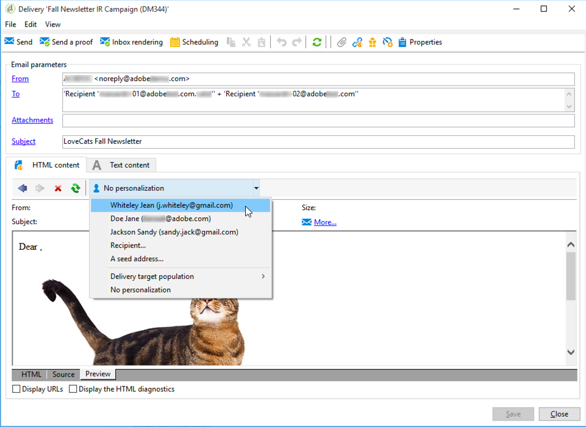
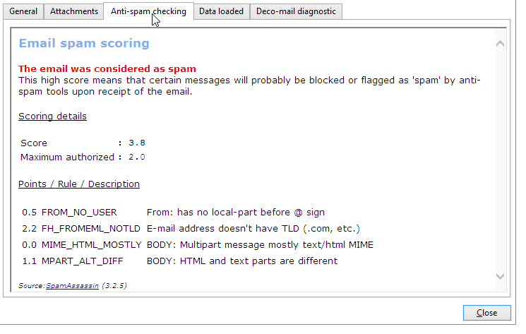

# SpamAssassin{#spamassassin}

O Adobe Campaign pode ser configurado para trabalhar com o [SpamAssassin](https://spamassassin.apache.org), um serviço de terceiros usado para filtragem de spam por email. Isso permite que você marque emails para determinar se uma mensagem corre o risco de ser considerada spam pelas ferramentas anti-spam usadas no recebimento.

O SpamAssassin aproveita uma variedade de técnicas de detecção de spam, incluindo:

* Detecção de spam com base em DNS e soma de verificação difusa
* Filtragem Bayesiana
* Programas externos
* Listas de bloqueios
* Bancos de dados online

>[!NOTE]
>
>O SpamAssassin deve ser instalado e configurado no servidor de aplicativos do Adobe Campaign. Para obter mais informações, consulte [esta seção](../../installation/using/configuring-spamassassin.md).
>
>As regras que determinam se um elemento é spam ou não são gerenciadas por meio do SpamAssassin e podem ser editadas por um administrador com privilégios.

## Usar o SpamAssassin no Campaign {#using-spamassassin}

Após criar sua entrega de email e definir seu conteúdo, siga as etapas abaixo para avaliar os riscos.

Para obter mais informações sobre criar e configurar uma entrega, consulte [esta página](about-email-channel.md).

1. Acesse a guia **[!UICONTROL Preview]**.
1. Selecione um destinatário para pré-visualizar sua entrega.

   

   >[!NOTE]
   >
   >Se você não selecionar um destinatário, a verificação anti-spam não poderá ser executada.

1. Uma mensagem de aviso dará o resultado do teste. Se um alto nível de risco for detectado, a seguinte mensagem de aviso será exibida:

   

1. Clique no link **[!UICONTROL More...]** próximo ao aviso.
1. Selecione a guia **[!UICONTROL Anti-spam checking]**.
1. Acesse a seção **[!UICONTROL Points / Rule / Description]** para exibir os motivos para esse risco.

   

>[!NOTE]
>
>Sempre que você clicar no **[!UICONTROL Anti-spam checking]**, o serviço SpamAssassin será acionado e a mensagem será analisada novamente para detecção anti-spam. Altere o conteúdo antes de executar a análise anti-spam novamente.
