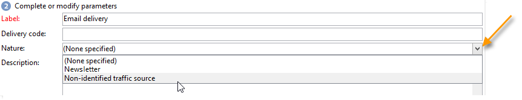

# Criar e identificar o delivery {#create-and-identify-the-delivery}

## Criar o delivery {#creating-the-delivery}

Você poderá criar um delivery usando a visão geral ou o menu **[!UICONTROL Create > Delivery]**.

Para criar um delivery, clique em **[!UICONTROL Create]** acima da lista de deliveries. Ao criar um novo delivery, você deverá indicar o canal de delivery usado. Para fazer isso, selecione o template de delivery apropriado na lista suspensa no campo **[!UICONTROL Delivery template]**.

Um modelo padrão é fornecido para cada canal que você instalou: mala direta, email, fax, telefone, canal móvel (SMS), Facebook, Twitter etc.

>[!NOTE]
>
>Os canais oferecidos na lista dependem do contrato de licença.

Você poderá criar novos modelos de delivery para pré-configurar parâmetros específicos de acordo com suas necessidades. Para obter mais informações, consulte [esta seção](about-templates.md).

## Identificar o delivery {#identifying-the-delivery}

Você precisa concluir os parâmetros para identificar o delivery. Para fazer isso:

1. Insira um nome para o delivery no campo **[!UICONTROL Label]**.

   Um código de delivery também poderá ser atribuído. O nome do delivery e seu código aparecerão na lista de deliveries, mas não poderão ser vistos pelos recipients.

1. Adicione uma descrição no campo **[!UICONTROL Description]**.
1. Selecione a natureza do delivery no campo relevante. Essas informações são úteis para o rastreamento do delivery: você poderá filtrar com base nesse critério na lista de delivery ou criar consultas usando esse critério de seleção.

   

1. Clique em **[!UICONTROL Continue]** para confirmar essas informações e exibir a janela de configuração de mensagem.

O conteúdo do delivery está pronto para ser configurado. A definição do conteúdo do delivery é específica para cada canal. Para obter mais informações, consulte a seção dedicada:

* [Definir o conteúdo do email](defining-the-email-content.md)
* [Definir o conteúdo do SMS](sms-create.md#defining-the-sms-content)
* [Definir o conteúdo da correspondência direta](defining-the-direct-mail-content.md)
* [Notificações por push](about-mobile-app-channel.md)
