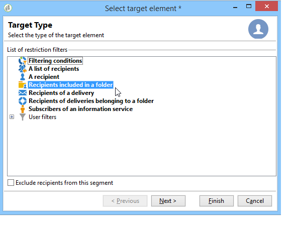
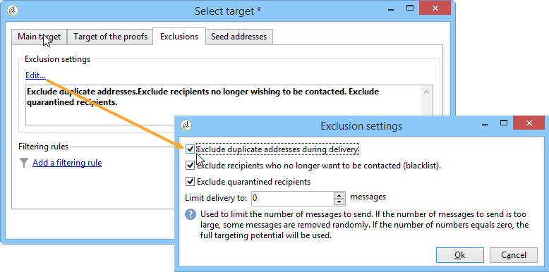

# Definir a população alvo {#defining-the-target-population}

Para cada delivery, você poderá definir vários tipos de populações do target.

* **Audiência principal**: perfis que receberão mensagens. [Saiba mais](steps-defining-the-target-population.md#selecting-the-main-target)
* **Prova**: recipients de mensagens de prova, envolvidos no ciclo de validação. [Saiba mais](steps-defining-the-target-population.md#defining-a-specific-proof-target)
* **Seed addresses**: recipients que estão fora do target do delivery, mas receberão o delivery (somente no contexto de uma campanha de marketing). [Saiba mais](about-seed-addresses.md)
* **Grupos de controle**: população que não receberá o delivery, usado para rastrear o comportamento e o impacto da campanha (somente no contexto de uma campanha de marketing). [Saiba mais](../../campaign/using/marketing-campaign-target.md#defining-a-control-group).

## Selecionar os principais recipients do delivery {#selecting-the-main-target}

Na maioria dos casos, o público-alvo principal é extraído do banco de dados do Adobe Campaign (modo padrão). No entanto, os recipients também podem ser armazenados em um arquivo externo. Saiba mais [nesta seção](steps-defining-the-target-population.md#selecting-external-recipients).

Para selecionar os recipients do delivery, siga as etapas abaixo:

1. No editor de delivery, selecione **[!UICONTROL To]**.
1. Se os recipients estiverem armazenados no banco de dados, selecione a primeira opção.

   

1. Selecione o target mapping na lista suspensa **[!UICONTROL Target mapping]**. O target mapping padrão do Adobe Campaign é **[!UICONTROL Recipients]**, com base no schema **nms:recipient**.

   Outros target mappings estão disponíveis e alguns podem ser relacionados à sua configuração específica. Para obter mais informações sobre target mappings, consulte [Selecionar um target mapping](selecting-a-target-mapping.md).

1. Clique no botão **[!UICONTROL Add]** para definir os filtros de restrição.

   Em seguida, é possível selecionar o tipo de filtragem a ser aplicado:

   

   Você poderá selecionar recipients usando os tipos de metas definidos no banco de dados. Para usar um tipo de target, selecione-o e clique em **[!UICONTROL Next]**. Para cada target, você poderá exibir os recipients relacionados ao clicar na guia **[!UICONTROL Preview]**. Para certos tipos de target, o botão **[!UICONTROL Refine target]** permite combinar vários critérios de definição do target.

   Os seguintes tipos de target são oferecidos por padrão:

   * **[!UICONTROL Filtering conditions]**: esta opção permite que você defina uma consulta e exiba o resultado. O método para definir queries é apresentado [nesta seção](../../platform/using/creating-filters.md#creating-an-advanced-filter).
   * **[!UICONTROL Subscribers of an information service]**: esta opção permite que você selecione um boletim informativo ao qual os recipients devem ser inscritos para receberem o delivery que está sendo criado.

      

   * **[!UICONTROL Recipients of a delivery]**: essa opção permite definir os recipients de um delivery existente como um critério de direcionamento. Você deverá selecionar o delivery na lista:

      

   * **[!UICONTROL Delivery recipients belonging to a folder]**: essa opção permite selecionar uma pasta de delivery e apontar os recipients dos deliveries nessa pasta.

      

      Você poderá filtrar o comportamento dos recipients ao selecionar na lista suspensa:

      

      >[!NOTE]
      >
      >A opção **[!UICONTROL Include sub-folders]** também permite direcionar os deliveries contidos nas pastas localizadas na estrutura de árvore abaixo do nó selecionado.

   * **[!UICONTROL Recipients included in a folder]**: essa opção permite que você direcione aos perfis contidos em uma pasta específica da árvore.
   * **[!UICONTROL A recipient]**: essa opção permite selecionar um recipient específico dos perfis no banco de dados.
   * **[!UICONTROL A list of recipients]**: essa opção permite direcionar a uma lista de recipients. As listas são apresentadas [nesta seção](../../platform/using/creating-and-managing-lists.md).
   * **[!UICONTROL User filters]**: essa opção permite que você acesse os filtros pré-configurados para usá-los como critérios de filtragem para perfis no banco de dados. Os filtros pré-configurados são apresentados [nesta seção](../../platform/using/creating-filters.md#saving-a-filter).
   * A opção **[!UICONTROL Exclude recipients corresponding to this segment]** permite apontar os recipients que não atendem aos critérios de target definidos. Para usar essa opção, selecione a caixa apropriada e, em seguida, aplique o direcionamento, conforme definido anteriormente, para excluir os perfis resultantes.

      

1. Insira um nome para esse direcionamento no campo **[!UICONTROL Label]**. Por padrão, o rótulo será o do primeiro critério de direcionamento. Para uma combinação, é melhor usar um nome explícito.
1. Clique em **[!UICONTROL Finish]** para validar o direcionamento configurado.

   Os critérios de definição do target definidos são resumidos na seção central da guia de configuração do target principal. Clique em um critério para exibir seu conteúdo (configuração e visualização). Para excluir um critério, clique na cruz localizada depois de seu rótulo.

   

### Selecionar recipients externos {#selecting-external-recipients}

Você poderá iniciar um delivery nos recipients que não estão salvos no banco de dados, mas armazenados em um arquivo externo. Por exemplo, enviaremos aqui um delivery para os recipients importados de um arquivo de texto.

Para fazer isso:

1. Clique no link **[!UICONTROL To]** para selecionar os recipients do seu delivery.
1. Selecione a opção **[!UICONTROL Defined in an external file]**.

   

1. Por padrão, os recipients são importados do banco de dados. Você deverá selecionar o **[!UICONTROL Target mapping]**. Para obter mais informações sobre target mappings, consulte [Selecionar um target mapping](selecting-a-target-mapping.md)

   Você também pode escolher **[!UICONTROL Do not import the recipients into the database]**.

1. Ao importar os recipients, clique no link **[!UICONTROL File format definition...]** para selecionar e configurar o arquivo externo.

   Para obter mais informações sobre importação de dados, consulte [esta seção](../../platform/using/executing-import-jobs.md#step-2---source-file-selection).

1. Clique em **[!UICONTROL Finish]** e configure seu delivery como um delivery padrão.

>[!CAUTION]
>
>Ao definir o conteúdo da mensagem para entrega de email, não inclua o link para a mirror page; ele não poderá ser gerado nesse modo de entrega.

### Definir configurações de exclusão {#define-exclusion-settings}

Os erros de endereço e as classificações de qualidade são fornecidos pelo provedor de serviços (IAP). Essas informações são atualizadas automaticamente no perfil do recipient após as ações de delivery e com arquivos retornados por provedores de serviços. Ele pode ser exibido no perfil somente como leitura.

Você poderá optar por excluir endereços que atingiram um determinado número de erros consecutivos ou cuja classificação de qualidade está abaixo de um limite especificado nessa janela. Você também poderá escolher se autoriza ou não endereços não qualificados para os quais nenhum dado foi retornado.

>[!NOTE]
>
>Se dois recipients tiverem o mesmo nome, sobrenome, código postal e cidade em uma delivery direto de mala direta, ocorrerá um erro de duplicação. A duplicata não será levada em consideração.

A guia **[!UICONTROL Exclusions]** é usada para limitar o número de mensagens.

>[!NOTE]
>
>Os parâmetros padrão são recomendados, mas você poderá adaptar as configurações dependendo das suas necessidades. No entanto, essas opções só devem ser alteradas por um usuário expert para evitar qualquer erro ou mau uso.

Clique no link **[!UICONTROL Edit...]** para modificar a configuração padrão.

As seguintes opções estão disponíveis:

* **[!UICONTROL Exclude duplicate addresses during delivery]**. Essa opção está ativa por padrão: permite eliminar endereços de email duplicados durante o delivery. A estratégia aplicada pode variar de acordo com a forma como o Adobe Campaign é usado e o tipo de dados no banco de dados.

   O valor padrão da opção poderá ser configurado para cada template de delivery.

   Por exemplo:

   * Delivery de um boletim informativo ou delivery eletrônica de documentos. Nenhuma exclusão de duplicatas, em alguns casos, se os dados não tiverem duplicatas nativas. Um casal que faça assinatura usando o mesmo endereço de email poderá esperar receber duas mensagens de email personalizadas específicas: uma endereçada para cada indivíduo por nome. Nesse caso, essa opção poderá ser desmarcada.
   * Delivery de uma campanha de marketing: a exclusão duplicata é essencial para evitar o envio de muitas mensagens para o mesmo recipient. Nesse caso, essa opção poderá ser selecionada.

      Se você desmarcar esta opção, poderá acessar uma opção adicional: **[!UICONTROL Keep duplicate records (same identifier)]**. Ela permite autorizar vários deliveries a recipients que atendem a vários critérios de definição do target.

      

* **[!UICONTROL Exclude recipients who no longer want to be contacted]**, ou seja, recipients cujos endereços de email estão na lista de bloqueios (“opt out”). Essa opção deve permanecer selecionada para observar a ética profissional de marketing digital e as leis que regem o comércio eletrônico.
* **[!UICONTROL Exclude quarantined recipients]**. Essa opção permite excluir do target qualquer perfil que não responda. É altamente recomendável manter essa opção selecionada.

   >[!NOTE]
   >
   >Para obter mais informações sobre o gerenciamento de quarentena, consulte [Entender o gerenciamento de quarentena](understanding-quarantine-management.md).

* **[!UICONTROL Limit delivery]** para um determinado número de mensagens. Essa opção permite que você insira o número máximo de mensagens a serem enviadas. Se o conteúdo do target exceder o número de mensagens indicadas, uma seleção aleatória será aplicada ao target.

### Reduzir o tamanho da população alvo {#reducing-the-size-of-the-target-population}

É possível reduzir o tamanho da população do target. Para fazer isso, especifique o número de recipients a serem exportados no campo **[!UICONTROL Requested quantity]**.

## Selecionar os recipients das mensagens de prova {#selecting-the-proof-target}

A prova é uma mensagem especial que permite testar um delivery antes de enviá-lo para o target principal. Os recipients de prova são responsáveis pela aprovação do formulário e do conteúdo da mensagem.

 [Descubra este recurso no vídeo](#seeds-and-proofs-video)

Para selecionar o target das provas, siga as etapas abaixo:

1. Clique no link **[!UICONTROL To]**.
1. Clique na guia **[!UICONTROL Target of the proofs]**.
1. Clique no campo **[!UICONTROL Targeting mode]** para escolher o método a ser aplicado: **[!UICONTROL Definition of a specific proof target]** , **[!UICONTROL Substitution of the address]** , **[!UICONTROL Seed addresses]** ou **[!UICONTROL Specific target and seed addresses]**.

>[!NOTE]
>
>Normalmente, o target da prova poderá ser adicionado ao target principal. Para fazer isso, selecione a opção apropriada na seção inferior da guia **[!UICONTROL Main target]**.

## Definir público alvo específico da prova {#defining-a-specific-proof-target}

Ao selecionar o target da prova, a opção **[!UICONTROL Definition of a specific proof target]** permite selecionar os recipients da prova nos perfis do banco de dados.

Selecione essa opção para escolher os recipients usando o botão **[!UICONTROL Add]**, como no caso de definição do target principal. Consulte [Selecionar público alvo principal](steps-defining-the-target-population.md#selecting-the-main-target).

Para saber mais sobre o envio de prova, consulte [esta seção](steps-validating-the-delivery.md#sending-a-proof).

### Usar substituição de endereço na prova {#using-address-substitution-in-proof}

Em vez de selecionar recipients dedicados no banco de dados, você poderá usar a opção **[!UICONTROL Substitution of the address]**.

Essa opção permite usar os perfis de recipient do delivery e substituir seus endereços de email por um ou mais endereços que receberão a prova.

Quando essa opção é selecionada, os endereços de prova são preenchidos por meio de um editor especial que permite configurar as substituições.

A configuração é executada da seguinte maneira:

1. Clique no ícone **[!UICONTROL Add]** para definir uma substituição.
1. Digite o endereço do recipient a ser usado ou selecione-o na lista.
1. Selecione o perfil a ser usado na prova: salve o valor **[!UICONTROL Random]** na coluna **[!UICONTROL Profile to use]** para usar os dados de qualquer perfil do target na prova.

   

1. Clique no ícone **[!UICONTROL Detail]** para selecionar um perfil no target principal, como no exemplo a seguir:

   

   É possível definir quantos endereços de substituição forem necessários.

## Usar seed addresses como prova {#using-seed-addresses-as-proof}

Você poderá usar **[!UICONTROL Seed addresses]** como target das provas: essa opção permite usar ou importar uma lista de seed addresses existente.

>[!NOTE]
>
>Os seed addresses são apresentados em [Sobre seed addresses](about-seed-addresses.md).

Você poderá combinar a definição de um target de prova específico e o uso de seed addresses usando a opção **[!UICONTROL Specific target and Seed addresses]**. As configurações relacionadas serão então definidas em duas sub-guias separadas.

Consulte também:

* [Selecionar o público alvo da prova](#selecting-the-proof-target)
* [Sobre seed addresses](about-seed-addresses.md)
* [Caso de uso: selecionar seed addresses de acordo com critérios](use-case--selecting-seed-addresses-on-criteria.md)

## Tutorial em vídeo {#seeds-and-proofs-video}

Este vídeo mostra como adicionar seeds e provas a um email existente e o procedimento para o seu envio.

>[!VIDEO](https://video.tv.adobe.com/v/25606?quality=12)

Vídeos extras sobre procedimentos do Campaign Classic estão disponíveis [aqui](https://experienceleague.adobe.com/docs/campaign-classic-learn/tutorials/overview.html?lang=pt-BR).
