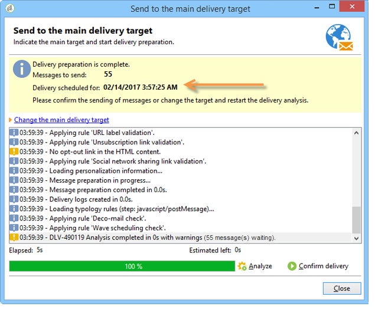

# Configuração e envio da entrega {#configuring-and-sending-the-delivery}

>[!NOTE]
>
>Somente o proprietário do delivery pode iniciar um delivery. In order for another operator (or operator group) to be able to start a delivery, you have to add them as reviewers in the **[!UICONTROL Delivery start:]** field.
>
>Consulte [esta página](../../campaign/using/marketing-campaign-approval.md#selecting-reviewers) para obter mais informações.

## Parâmetros adicionais de entrega {#delivery-additiona-parameters}

Before sending the delivery, you can define the sending parameters in the delivery properties, via the **[!UICONTROL Delivery]** tab.

* **[!UICONTROL Delivery priority]**: Essa opção permite influenciar a ordem de envio dos deliveries, declarando o nível de prioridade (normal, alto ou baixo). Isso permite priorizar a ordem de determinados deliveries urgentes em relação aos outros.

* **[!UICONTROL Message batch quantity]**: Essa opção permite definir o número de mensagens agrupadas no mesmo pacote de distribuição XML. Se o parâmetro estiver definido como 0, as mensagens serão automaticamente agrupadas. The package size is defined by the calculation `<delivery size>/1024`, with a minimum of 8 and a maximum of 256 messages by package.

   >[!CAUTION]
   >
   >Quando o delivery é duplicado, o parâmetro é redefinido.

* **[!UICONTROL Send using multiple waves]**: Para obter mais informações, consulte [Enviar usando várias ondas](#sending-using-multiple-waves).

* **[!UICONTROL Test SMTP delivery]**: Essa opção permite testar o envio de um delivery via SMTP. O delivery é processado para conexão com o servidor SMTP, mas não é enviado.

   >[!NOTE]
   >
   >A utilização dessa opção não é recomendada ao instalar usando o mid-sourcing para acionar a mta.
   >
   >Para obter mais informações sobre configurar o servidor SMTP, consulte [esta seção](../../installation/using/configuring-campaign-server.md#personalizing-delivery-parameters).

* **[!UICONTROL Archive emails]**: Essa opção permite armazenar emails em um sistema externo por meio do CCO simplesmente adicionando um endereço de email de CCO ao target da sua mensagem. For more on this, refer to [Archiving emails](../../delivery/using/sending-messages.md#archiving-emails).

Depois que a entrega estiver configurada e pronta para ser enviada, certifique-se de executar a análise Entrega. Depois de concluído, clique em **[!UICONTROL Confirm delivery]** para iniciar a entrega de mensagens.

You can then close the delivery wizard and track the execution of the delivery from the **[!UICONTROL Delivery]** tab, accessible via the detail of this delivery or via the list of deliveries.

Após enviar as mensagens, você pode monitorar e rastrear seus deliveries. Para obter mais informações, consulte essas seções.

* [Monitoramento de uma entrega](../../delivery/using/monitoring-a-delivery.md)
* [Noções básicas sobre falhas de entrega](../../delivery/using/understanding-delivery-failures.md)
* [Sobre o rastreamento de mensagens](../../delivery/using/about-message-tracking.md)

## Agendando o envio do delivery {#scheduling-the-delivery-sending}

É possível adiar o envio de mensagens para agendar a entrega ou gerenciar a pressão de vendas e evitar o excesso de solicitações sobre uma população.

1. Clique no **[!UICONTROL Send]** botão e selecione a **[!UICONTROL Postpone delivery]** opção.

1. Specify a start date in the **[!UICONTROL Contact date]** field.

1. Você pode iniciar a análise de entrega e confirmar o envio da entrega. No entanto, o envio da entrega não será iniciado até a data indicada no **[!UICONTROL Contact date]** campo.

>[!CAUTION]
>
>Depois de iniciar a análise, a data de contato que você definiu será corrigida. Se você modificar essa data, será necessário reiniciar a análise para que suas modificações sejam levadas em conta.

Na lista de entrega, a entrega aparecerá com **[!UICONTROL Pending]** status.

Scheduling can also be configured upstream via the **[!UICONTROL Scheduling]** button of the delivery.

Isso permite adiar o delivery para uma data posterior ou salvar o delivery no calendário provisional.

* The **[!UICONTROL Schedule delivery (no automatic execution)]** option lets you schedule a provisional analysis of the delivery.

   When this configuration is saved, the delivery changes to **[!UICONTROL Targeting pending]** status. A análise será iniciada na data especificada.

* A **[!UICONTROL Schedule delivery (automatic execution on planned date)]** opção permite especificar a data de entrega.

   Clique em **[!UICONTROL Send]** , selecione **[!UICONTROL Postpone delivery]** e inicie a análise e confirme a entrega. Quando a análise estiver concluída, o target do delivery estará pronto e as mensagens serão automaticamente enviadas na data especificada.

Datas e horas são expressas no fuso horário do operador atual. The **[!UICONTROL Time zone]** drop-down list located below the contact date input field lets you automatically convert the entered date and time into the selected time zone.

Por exemplo, se você agendar que um delivery seja executado automaticamente às 8h tempo de Londres, a hora será convertida automaticamente para o fuso horário selecionado:

## Enviar usando várias ondas {#sending-using-multiple-waves}

Para balancear a carga, você pode dividir deliveries em vários lotes. Configure o número de lotes e sua proporção com relação ao delivery inteiro.

>[!NOTE]
>
>Você só poderá definir o tamanho e o atraso entre duas ondas consecutivas. Os critérios de seleção de recipient para cada onda não podem ser configurados.

1. Open the delivery properties window and click the **[!UICONTROL Delivery]** tab.
1. Selecione a **[!UICONTROL Send using multiple waves]** opção e clique no **[!UICONTROL Define waves...]** link.

   

1. Para configurar ondas, você pode:

   * Definir o tamanho de cada onda. For example, if you enter **[!UICONTROL 30%]** in the corresponding field, each wave will represent 30% of the messages included in the delivery, except the last one, which will represent 10% of the messages.

      In the **[!UICONTROL Period]** field, specify the delay between the start of two consecutive waves. For example, if you enter **[!UICONTROL 2d]**, the first wave will start immediately, the second wave will start in two days, the third wave in four days, and so on.

      

   * Defina um calendário para enviar cada onda.

      In the **[!UICONTROL Start]** column, specify the delay between the start of two consecutive waves. In the **[!UICONTROL Size]** column, enter a fixed number or a percentage.

      No exemplo abaixo, a primeira onda representa 25% do número total de mensagens incluídas no delivery e iniciará imediatamente. As próximas duas ondas completam o delivery e são definidas para começar em intervalos de seis horas.

      
   A specific typology rule, **[!UICONTROL Wave scheduling check]**, ensures that the last wave is planned before the delivery validity limit. As tipologias de campanha e suas regras, configuradas na **[!UICONTROL Typology]** guia das propriedades de entrega, são apresentadas no processo de [validação com tipologias](../../delivery/using/steps-validating-the-delivery.md#validation-process-with-typologies).

   >[!CAUTION]
   >
   >Make sure the last waves do not exceed the delivery deadline, which is defined in the **[!UICONTROL Validity]** tab. Caso contrário, algumas mensagens podem não ser enviadas.
   >
   >Você também deverá permitir tempo suficiente para novas tentativas ao configurar as últimas ondas. Consulte [esta seção](../../delivery/using/steps-sending-the-delivery.md#configuring-retries).

1. Para monitorar seus envios, vá para os logs de delivery. Consulte [esta página](../../delivery/using/monitoring-a-delivery.md#delivery-logs-and-history).

   You can see the deliveries that were already sent in the processed waves (**[!UICONTROL Sent]** status) and the deliveries to be sent in the remaining waves (**[!UICONTROL Pending]** status).

Os dois exemplos abaixo são os casos de uso mais comuns para usar várias ondas.

* **Durante o processo de aumento**

   Quando os emails são enviados usando uma nova plataforma, os provedores de serviços de Internet (ISPs) suspeitam de endereços IP que não são reconhecidos. Se grandes volumes de emails forem enviados repentinamente, os ISPs freqüentemente os marcam como spam.

   Para evitar ser marcado como spam, você poderá aumentar progressivamente o volume enviado usando ondas. Isso deve garantir o desenvolvimento suave da fase de inicialização e permitir que você reduza a taxa geral de endereços inválidos.

   Para fazer isso, use a **[!UICONTROL Schedule waves according to a calendar]** opção. Por exemplo, defina a primeira onda para 10%, a segunda para 15% e assim por diante.

   

* **Campanhas envolvendo uma central de atendimento**

   Ao gerenciar uma campanha de fidelidade por telefone, sua organização tem uma capacidade limitada para processar o número de chamadas para contatar os assinantes.

   Usando ondas, você poderá restringir o número de mensagens a 20 por dia, que é a capacidade diária de processamento de uma central de atendimento.

   Para fazer isso, selecione a **[!UICONTROL Schedule multiple waves of the same size]** opção. Enter **[!UICONTROL 20]** as the wave&#39;s size and **[!UICONTROL 1d]** in the **[!UICONTROL Period]** field.

   

## Configurando novas tentativas {#configuring-retries}

As mensagens temporariamente não entregues devido a um erro **Suave** ou **Ignorado** estão sujeitas a uma repetição automática. Os tipos de falha de delivery são apresentados nesta [seção](../../delivery/using/understanding-delivery-failures.md#delivery-failure-types-and-reasons).

The central section of the **[!UICONTROL Delivery]** tab for delivery parameters indicates how many retries should be performed the day after the delivery and the minimum delay between retries.

Por padrão, cinco tentativas são agendadas para o primeiro dia do delivery com um intervalo mínimo de uma hora distribuída pelas 24 horas do dia. One retry per day is programmed after that and until the delivery deadline, which is defined in the **[!UICONTROL Validity]** tab (see [Defining validity period](../../delivery/using/steps-sending-the-delivery.md#defining-validity-period)).

>[!NOTE]
>
>Para instalações hospedadas ou híbridas, se você tiver atualizado para o MTA aprimorado, as configurações de nova tentativa na entrega não serão mais usadas pelo Campaign. As tentativas de rejeição em modo suave e o tempo entre elas são determinados pelo MTA aprimorado com base no tipo e na gravidade das respostas de rejeição provenientes do domínio de email da mensagem.
>
>Todos os impactos são detalhados no documento MTA [aprimorado do](https://helpx.adobe.com/campaign/kb/campaign-enhanced-mta.html) Adobe Campaign.

## Definindo período de validade {#defining-validity-period}

Quando o delivery for iniciado, as mensagens (e todas as tentativas) poderão ser enviadas até o prazo de delivery. This is indicated in the delivery properties, via the **[!UICONTROL Validity]** tab.

* The **[!UICONTROL Delivery duration]** field lets you enter the limit for global delivery retries. Isso significa que o Adobe Campaign envia as mensagens começando na data de início e, em seguida, para mensagens que retornam somente um erro, tentativas regulares e configuráveis são executadas até que o limite de validade seja atingido.

   Você também poderá optar por especificar datas. Para fazer isso, selecione **[!UICONTROL Explicitly set validity dates]**. Nesse caso, as datas de delivery e limite de validade também permitem especificar o tempo. O tempo atual é usado por padrão, mas você poderá modificar isso diretamente no campo de entrada.

* **Limite de validade dos recursos**:O **[!UICONTROL Validity limit]** campo é usado para recursos carregados, principalmente para a página espelhada e imagens. Os recursos desta página são válidos por um tempo limitado (para economizar espaço em disco).

   Os valores nesse campo podem ser expressos nas unidades listadas [nesta seção](../../platform/using/adobe-campaign-workspace.md#default-units).

>[!NOTE]
>
>Para instalações hospedadas ou híbridas, se você tiver atualizado para o MTA aprimorado, a configuração nas entregas do Campaign será usada somente se definida para **[!UICONTROL Delivery duration]** 3,5 **** dias ou menos. Se você definir um valor superior a 3,5 dias, ele não será considerado.
>
>Todos os impactos são detalhados no documento MTA [aprimorado do](https://helpx.adobe.com/campaign/kb/campaign-enhanced-mta.html) Adobe Campaign.
