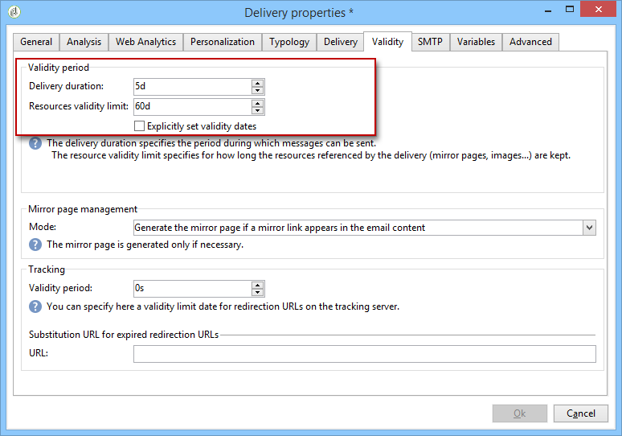

# Configurar e enviar o delivery {#configuring-and-sending-the-delivery}

>[!NOTE]
>
>Somente o proprietário da entrega pode iniciar uma entrega. Para que outro operador (ou grupo de operadores) possa iniciar um delivery, é necessário adicioná-los como revisores no campo **[!UICONTROL Delivery start:]**. Para obter mais informações, consulte [esta seção](../../campaign/using/marketing-campaign-approval.md#selecting-reviewers).

## Parâmetros adicionais de entrega {#delivery-additiona-parameters}

Antes de enviar o delivery, você poderá definir os parâmetros de envio nas propriedades de delivery, por meio da guia **[!UICONTROL Delivery]** Delivery.

* **[!UICONTROL Delivery priority]**: essa opção permite influenciar a ordem de envio dos deliveries, declarando o nível de prioridade (normal, alto ou baixo). Isso permite priorizar a ordem de determinados deliveries urgentes em relação aos outros.

* **[!UICONTROL Message batch quantity]**: essa opção permite definir o número de mensagens agrupadas no mesmo pacote do delivery XML. Se o parâmetro for definido como 0, as mensagens serão automaticamente agrupadas. O tamanho do pacote é definido pelo cálculo `<delivery size>/1024`, com no mínimo 8 e no máximo 256 mensagens por pacote.

   >[!IMPORTANT]
   >
   >Quando o delivery é duplicado, o parâmetro é redefinido.

* **[!UICONTROL Send using multiple waves]**: para obter mais informações, consulte [Enviar usando várias ondas](#sending-using-multiple-waves).

* **[!UICONTROL Test SMTP delivery]**: essa opção permite testar o envio de um delivery via SMTP. O delivery é processado para conexão com o servidor SMTP, mas não é enviado.

   >[!NOTE]
   >
   >A utilização dessa opção não é recomendada ao instalar usando o mid-sourcing para não chamar mta. Para obter mais informações sobre como configurar o servidor SMTP, consulte [esta seção](../../installation/using/configure-delivery-settings.md).

* **[!UICONTROL Email BCC]**: essa opção permite armazenar emails em um sistema externo por meio do CCO simplesmente adicionando um endereço de email de CCO ao target da sua mensagem. Para obter mais informações, consulte [esta seção](sending-messages.md#archiving-emails).

## Confirmar o delivery {#confirming-delivery}

Depois que o delivery estiver configurado e pronto para ser enviado, certifique-se de executar a análise do delivery.

Para fazer isso, clique em **[!UICONTROL Send]**, selecione a ação desejada e clique em **[!UICONTROL Analyze]**. Para obter mais informações, consulte [Iniciar a análise](steps-validating-the-delivery.md#analyzing-the-delivery).

Depois de concluído, clique em **[!UICONTROL Confirm delivery]** para iniciar a entrega de mensagens.

Você poderá fechar o assistente do delivery e controlar a execução do delivery a partir da guia **[!UICONTROL Delivery]**, acessível por meio do detalhe deste delivery ou pela lista de deliveries.

Após enviar as mensagens, você pode monitorar e rastrear seus deliveries. Para obter mais informações, consulte essas seções.

* [Monitorar um delivery](about-delivery-monitoring.md)
* [Entender as falhas de delivery](understanding-delivery-failures.md)
* [Sobre o rastreamento de mensagens](about-message-tracking.md)

## Agendar o envio do delivery {#scheduling-the-delivery-sending}

É possível adiar a entrega de mensagens para agendar a entrega ou gerenciar as regras de pressão e evitar o excesso de solicitações em relação a uma população.

1. Clique no botão **[!UICONTROL Send]** e selecione a opção **[!UICONTROL Postpone delivery]**.

1. Especifique uma data de início no campo **[!UICONTROL Contact date]**.

1. Você pode iniciar a análise do delivery e confirmar o envio do delivery. No entanto, o envio do delivery não será iniciado até a data indicada no campo **[!UICONTROL Contact date]**.

>[!IMPORTANT]
>
>Depois de iniciar a análise, a data de contato que você definiu será corrigida. Se você modificar essa data, será necessário reiniciar a análise para que suas modificações sejam levadas em conta.

Na lista do delivery, a entrega será exibida com o status **[!UICONTROL Pending]**.

O agendamento pode ser configurado de forma ascendente através do botão **[!UICONTROL Scheduling]** do delivery.

Isso permite adiar o delivery para uma data posterior ou salvar o delivery no calendário provisional.

* A opção **[!UICONTROL Schedule delivery (no automatic execution)]** permite agendar uma análise provisional do delivery.

   Quando essa configuração é salva, o delivery muda para o status **[!UICONTROL Targeting pending]**. A análise será iniciada na data especificada.

* A opção **[!UICONTROL Schedule delivery (automatic execution on planned date)]** permite especificar a data do delivery.

   Clique em **[!UICONTROL Send]** e selecione **[!UICONTROL Postpone delivery]**, depois inicie a análise e confirme o delivery. Quando a análise estiver concluída, o target do delivery estará pronto e as mensagens serão automaticamente enviadas na data especificada.

Datas e horas são expressas no fuso horário do operador atual. A lista suspensa **[!UICONTROL Time zone]** localizada abaixo do campo de entrada de data do contato permite converter automaticamente a data e a hora inseridas para o fuso horário selecionado.

Por exemplo, se você agendar uma entrega para que ela seja executada automaticamente às 8h, horário de Londres, a hora será convertida automaticamente para o fuso horário selecionado:

## Enviar usando várias ondas {#sending-using-multiple-waves}

Para balancear a carga, você pode dividir deliveries em vários lotes. Configure o número de lotes e sua proporção com relação ao delivery inteiro.

>[!NOTE]
>
>Você só poderá definir o tamanho e o atraso entre duas ondas consecutivas. Os critérios de seleção de recipient para cada onda não podem ser configurados.

1. Abra a janela de propriedades do e clique na guia **[!UICONTROL Delivery]** Delivery.
1. Selecione a opção **[!UICONTROL Send using multiple waves]** e clique no link **[!UICONTROL Define waves...]**.

   

1. Para configurar ondas, você pode:

   * Definir o tamanho de cada onda. Por exemplo, se você inserir **[!UICONTROL 30%]** no campo correspondente, cada onda representará 30% das mensagens incluídas no delivery, exceto a última, que representará 10% das mensagens.

      No campo **[!UICONTROL Period]**, especifique o atraso entre o início de duas ondas consecutivas. Por exemplo, se você inserir **[!UICONTROL 2d]**, a primeira onda começará imediatamente, a segunda onda começará em dois dias, a terceira onda em quatro dias e assim por diante.

      

   * Defina um calendário para enviar cada onda.

      Na coluna **[!UICONTROL Start]**, especifique o atraso entre o início de duas ondas consecutivas. Na coluna **[!UICONTROL Size]**, insira um número fixo ou uma porcentagem.

      No exemplo abaixo, a primeira onda representa 25% do número total de mensagens incluídas no delivery e iniciará imediatamente. As próximas duas ondas completam o delivery e são definidas para começar em intervalos de seis horas.

      
   Uma regra de tipologia específica, **[!UICONTROL Wave scheduling check]**, garante que a última onda seja planejada antes do limite da validade do delivery. As tipologias de campanha e suas regras, configuradas na guia **[!UICONTROL Typology]** das propriedades de delivery, são apresentadas em [Processo de validação com tipologias](steps-validating-the-delivery.md#validation-process-with-typologies).

   >[!IMPORTANT]
   >
   >Certifique-se de que as últimas ondas não excedam o prazo do delivery, que é definido na guia **[!UICONTROL Validity]**. Caso contrário, algumas mensagens podem não ser enviadas.
   >
   >Você também deverá permitir tempo suficiente para novas tentativas ao configurar as últimas ondas. Consulte [esta seção](steps-sending-the-delivery.md#configuring-retries).

1. Para monitorar seus envios, vá para os logs de delivery. Consulte [esta página](delivery-dashboard.md#delivery-logs-and-history).

   Você pode ver os deliveries que já foram enviados nas ondas processadas (status **[!UICONTROL Sent]**) e os deliveries a serem enviados nas ondas restantes (status **[!UICONTROL Pending]**).

Os dois exemplos abaixo são os casos de uso mais comuns para usar várias ondas.

* **Durante o processo de aumento**

   Quando os emails são enviados usando uma nova plataforma, os provedores de serviços de Internet (ISPs) suspeitam de endereços IP que não são reconhecidos. Se grandes volumes de emails forem enviados repentinamente, os ISPs freqüentemente os marcam como spam.

   Para evitar ser marcado como spam, você poderá aumentar progressivamente o volume enviado usando ondas. Isso deve garantir o desenvolvimento suave da fase de inicialização e permitir que você reduza a taxa geral de endereços inválidos.

   Para fazer isso, use a opção **[!UICONTROL Schedule waves according to a calendar]**. Por exemplo, defina a primeira onda para 10%, a segunda para 15% e assim por diante.

   

* **Campanhas envolvendo uma central de atendimento**

   Ao gerenciar uma campanha de fidelidade por telefone, sua organização tem uma capacidade limitada para processar o número de chamadas para contatar os assinantes.

   Usando ondas, você poderá restringir o número de mensagens a 20 por dia, que é a capacidade diária de processamento de uma central de atendimento.

   Para fazer isso, selecione a opção **[!UICONTROL Schedule multiple waves of the same size]**. Insira **[!UICONTROL 20]** como o tamanho da onda e **[!UICONTROL 1d]** no campo **[!UICONTROL Period]**.

   

## Configurar novas tentativas {#configuring-retries}

As mensagens temporariamente não entregues devido a um erro **Suave** ou **Ignorado** estão sujeitas a uma repetição automática. Os tipos de falha de delivery são apresentados nesta [seção](understanding-delivery-failures.md#delivery-failure-types-and-reasons).

>[!IMPORTANT]
>
>Para instalações hospedadas ou híbridas, se você tiver atualizado para o [MTA aprimorado](sending-with-enhanced-mta.md), as configurações de nova tentativa no delivery não serão mais usadas pelo Campaign. As tentativas de rejeição temporária e o tempo entre elas são determinados pelo MTA aprimorado com base no tipo e na gravidade das respostas de rejeição provenientes do domínio de email da mensagem.

Para instalações no local e instalações hospedadas/híbridas usando o MTA herdado do Campaign, a seção central da guia **[!UICONTROL Delivery]** para parâmetros de delivery indica quantas tentativas devem ser executadas no dia seguinte ao delivery e o atraso mínimo entre as tentativas.

Por padrão, cinco tentativas são agendadas para o primeiro dia do delivery, com um intervalo mínimo de uma hora distribuído pelas 24 horas do dia. Uma nova tentativa por dia é programada depois disso e até o prazo do delivery, que é definido na guia **[!UICONTROL Validity]**. Consulte [Definir o período de validade](#defining-validity-period).

## Definir o período de validade {#defining-validity-period}

Quando a entrega for iniciada, as mensagens (e todas as tentativas) poderão ser enviadas até o prazo da entrega. Isso é indicado nas propriedades de delivery, por meio da guia **[!UICONTROL Validity]**.

* O campo **[!UICONTROL Delivery duration]** permite inserir o limite de novas tentativas de delivery globais. Isso significa que o Adobe Campaign envia as mensagens começando na data de início e, em seguida, para mensagens que retornam somente um erro, tentativas regulares e configuráveis são executadas até que o limite de validade seja atingido.

   Você também poderá optar por especificar datas. Para fazer isso, selecione **[!UICONTROL Explicitly set validity dates]**. Nesse caso, as datas de delivery e limite de validade também permitem especificar o tempo. O tempo atual é usado por padrão, mas você poderá modificar isso diretamente no campo de entrada.

   >[!IMPORTANT]
   >
   >Para instalações hospedadas ou híbridas, se você tiver atualizado para o [MTA aprimorado](sending-with-enhanced-mta.md), a configuração **[!UICONTROL Delivery duration]** nos deliveries de email do Campaign será usada somente se definida como **3,5 dias ou menos.**. Se você definir um valor superior a 3,5 dias, ele não será levado em consideração.

* **Limite da validade de recursos**: o campo **[!UICONTROL Validity limit]** é usado para recursos carregados, principalmente para a mirror page e imagens. Os recursos desta página são válidos por um tempo limitado (para economizar espaço em disco).

   Os valores nesse campo podem ser expressos nas unidades listadas [nesta seção](../../platform/using/adobe-campaign-workspace.md#default-units).
